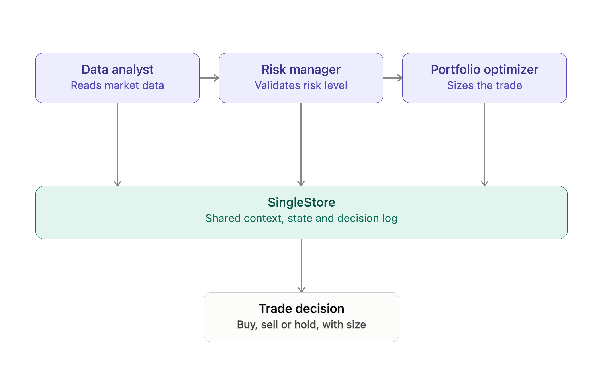

# Chapter 23: Agentic Patterns with SingleStore

## Introduction

The rapid evolution of large language models has moved application design beyond traditional request/response patterns toward systems composed of autonomous, goal-driven agents. These agentic systems observe, analyze, coordinate and act on data with increasing levels of autonomy. While frameworks such as LangChain, LlamaIndex and MCP simplify the orchestration layer, the data layer remains the backbone of any agentic architecture. Agents need reliable access to operational data, historical context, fast analytical queries and a unified record of decisions and outcomes.

This chapter explores practical agentic patterns built on top of SingleStore, with a focus on how a high-performance, multi-model database simplifies memory, coordination and decision logging for multi-agent systems. To illustrate these patterns, we'll walk through a simple, but fully working example: a multi-agent trading system implemented using a **Chain of Responsibility** pipeline. Each agent performs a specialized role - data analysis, risk validation, execution planning - and hands enriched context to the next. The agents interact entirely through SingleStore, which acts as:

- The real-time feature store for market and sentiment signals.

- The agent memory layer for storing past decisions, positions and risk history.

- The coordination mechanism for sharing state across agents.

- The execution log that records all recommendations, confidence scores and trade actions.

The example demonstrates several reusable patterns:

- **Sequential Agent Pipeline:** Agents receive a shared context, add analysis and forward the enriched context to the next agent. This creates deterministic, auditable workflows.

- **Database-Native Memory and State:** Agents read/write from tables such as `tick`, `stock_sentiment`, `portfolio` and `agent_decisions` to ground their reasoning in real data.

- **LLM-Driven Decision Making:** Each agent uses LLMs to generate structured decisions with confidence scores and reasoning, enabling downstream agents to validate or override the recommendation.

- **Risk-Aware Coordination:** The Risk Manager agent reviews prior activity, decision history and recent trades - an example of agents using SingleStore as a temporal context engine.

- **Action Execution as a Database Operation:** Trades are executed by writing into the portfolio table, closing the loop between perception, reasoning and action.

By the end of the chapter, we'll understand how to design agentic systems that are grounded in high-quality data, operate with traceability and can scale from proof-of-concept to production. More importantly, the architectural techniques shown here apply broadly: financial trading, fraud detection, customer support assistants, IoT orchestration and any domain where multi-agent collaboration requires a shared, low-latency data plane.

## Create the Database

In the SingleStore Portal, we'll use the **SQL Editor** to create a new database. Call this `multi_agent_trading_db`, as follows:

```sql
CREATE DATABASE IF NOT EXISTS multi_agent_trading_db;
```

## Fill out the Notebook

Let's now create a new Python notebook. We'll call it **multi_agent_trading**. We'll connect the notebook to the `multi_agent_trading_db` database.

First, we'll setup some global variables:

```python
LLM_MODEL = ...
TEMPERATURE = 0.0
MAX_TOKENS = 300
SEED = 42
```

Next, we'll initialize the OpenAI client:

```python
os.environ["OPENAI_API_KEY"] = get_secret("OPENAI_API_KEY")
openai_client = OpenAI()
```

Now we'll define the data models:

```python
# Data Models

@dataclass
class AgentDecision:
    """Structured decision output from each agent."""
    agent_id: str
    recommendation: str
    confidence: float
    reasoning: str
    metadata: Dict = field(default_factory = dict)

@dataclass
class TradingContext:
    """Shared context passed through the agent chain."""
    symbol: str
    price_data: str = ""
    sentiment_data: str = ""
    position_data: str = ""
    recent_decisions: str = ""
    portfolio_data: str = ""
    agent_decisions: List[AgentDecision] = field(default_factory = list)
```

These data models define the structured communication layer for the agentic system. `AgentDecision` captures each agent's recommendation, confidence and reasoning, while `TradingContext` provides a shared, progressively enriched state that flows through the entire agent chain.

Now, we'll define the Data Access Layer:

```python
def query_db(sql: str, params: dict = None) -> List[Dict]:
    """Execute query and return results."""
    with db_connection.connect() as conn:
        if params is None:
            params = {}
        result = conn.execute(text(sql), params)
        return [dict(row._mapping) for row in result]

def execute_db(sql: str, params: dict = None):
    """Execute insert/update statement."""
    with db_connection.connect() as conn:
        if params is None:
            params = {}
        conn.execute(text(sql), params)
        conn.commit()

def get_recent_ticks(symbol: str, hours: int = 24) -> str:
    """Fetch recent price data."""
    ticks = query_db(
        """SELECT close, high, low, volume
           FROM tick
           WHERE symbol = :symbol AND ts >= DATE_SUB(NOW(), INTERVAL :hours HOUR)
           ORDER BY ts DESC LIMIT 100""",
        {"symbol": symbol, "hours": hours}
    )
    if not ticks:
        return f"No data for {symbol}"

    avg_vol = sum(t["volume"] for t in ticks) // len(ticks)
    high = max(t["high"] for t in ticks)
    low = min(t["low"] for t in ticks)
    current = ticks[0]["close"]
    oldest = ticks[-1]["close"]
    pct_change = (current - oldest) / oldest * 100

    return f"Price: ${current:.2f} | {hours}h Change: {pct_change:+.1f}% | {hours}h High: ${high:.2f} | Low: ${low:.2f} | Avg Vol: {avg_vol:,}"

def get_recent_sentiment(symbol: str, days: int = 7) -> str:
    """Fetch sentiment analysis."""
    sentiments = query_db(
        """SELECT headline, compound
           FROM stock_sentiment
           WHERE symbol = :symbol AND ts >= DATE_SUB(NOW(), INTERVAL :days DAY)
           ORDER BY ts DESC LIMIT 20""",
        {"symbol": symbol, "days": days}
    )
    if not sentiments:
        return f"No sentiment data for {symbol}"

    avg_compound = sum(s["compound"] for s in sentiments) / len(sentiments)
    pos_count = sum(1 for s in sentiments if s["compound"] > 0.05)
    neg_count = sum(1 for s in sentiments if s["compound"] < -0.05)

    return f"Sentiment Score: {avg_compound:.2f} | Positive: {pos_count} | Negative: {neg_count}"

def get_portfolio_position(symbol: str) -> str:
    """Get current holdings."""
    pos = query_db(
        "SELECT shares_held, purchase_price FROM portfolio WHERE symbol = :symbol",
        {"symbol": symbol}
    )
    if not pos:
        return f"No position in {symbol}"

    return f"Holding: {pos[0]['shares_held']} shares @ ${pos[0]['purchase_price']:.2f}"

def get_recent_decisions(symbol: str, hours: int = 24) -> str:
    """Fetch recent agent decisions."""
    decisions = query_db(
        """SELECT agent_id, action, confidence
           FROM agent_decisions
           WHERE symbol = :symbol AND decision_timestamp >= DATE_SUB(NOW(), INTERVAL :hours HOUR)
           ORDER BY decision_timestamp DESC LIMIT 5""",
        {"symbol": symbol, "hours": hours}
    )
    if not decisions:
        return f"No recent decisions for {symbol}"

    return " | ".join(f"{d['agent_id']}: {d['action']} ({d['confidence']*100:.0f}%)" for d in decisions)

def get_all_positions() -> str:
    """Get full portfolio."""
    positions = query_db(
        "SELECT symbol, shares_held, purchase_price FROM portfolio ORDER BY symbol"
    )
    if not positions:
        return "Portfolio is empty"

    return " | ".join(f"{p['symbol']}: {p['shares_held']} @ ${p['purchase_price']:.2f}" for p in positions)

def log_decision(decision: AgentDecision, symbol: str):
    """Log agent decision to database."""
    execute_db(
        """INSERT INTO agent_decisions
           (agent_id, decision_timestamp, symbol, action, confidence, reasoning, data_sources)
           VALUES (:agent_id, NOW(), :symbol, :action, :confidence, :reasoning, :data_sources)""",
        {
            "agent_id": decision.agent_id,
            "symbol": symbol,
            "action": decision.recommendation,
            "confidence": decision.confidence,
            "reasoning": decision.reasoning,
            "data_sources": "market_data"
        }
    )

def execute_trade(symbol: str, action: str, shares: int):
    """Execute a trade."""
    if action == "BUY":
        price = query_db(
            "SELECT close FROM tick WHERE symbol = :symbol ORDER BY ts DESC LIMIT 1",
            {"symbol": symbol}
        )
        purchase_price = price[0]["close"] if price else 100.0

        existing = query_db(
            "SELECT shares_held FROM portfolio WHERE symbol = :symbol",
            {"symbol": symbol}
        )

        if existing:
            execute_db(
                "UPDATE portfolio SET shares_held = shares_held + :shares WHERE symbol = :symbol",
                {"shares": shares, "symbol": symbol}
            )
        else:
            execute_db(
                """INSERT INTO portfolio (symbol, shares_held, purchase_date, purchase_price)
                   VALUES (:symbol, :shares, CURDATE(), :price)""",
                {"symbol": symbol, "shares": shares, "price": purchase_price}
            )
        print(f"*** TRADE EXECUTED: BUY {shares} shares of {symbol} @ ${purchase_price:.2f}")
    elif action == "SELL":
        position = query_db(
            "SELECT shares_held FROM portfolio WHERE symbol = :symbol",
            {"symbol": symbol}
        )

        if not position:
            print(f"!!! TRADE FAILED: No position in {symbol} to sell")
            return

        current_shares = position[0]['shares_held']
        if current_shares < shares:
            print(f"!!! TRADE FAILED: Cannot sell {shares} shares, only have {current_shares}")
            return

        execute_db(
            "UPDATE portfolio SET shares_held = shares_held - :shares WHERE symbol = :symbol",
            {"shares": shares, "symbol": symbol}
        )
        print(f"*** TRADE EXECUTED: SELL {shares} shares of {symbol}")
```

This Data Access Layer encapsulates all interactions with SingleStore, providing a clean API for querying market data, retrieving sentiment and portfolio information, logging agent decisions and executing trades. By centralizing database operations, it ensures that each agent operates over consistent, well-structured and up-to-date data.

Next, we'll implement a **Chain of Responsibility** pattern in which each trading agent performs three responsibilities - loading data, generating a decision and logging its output - before passing control to the next agent in the sequence. The pattern creates a clean, deterministic execution pipeline, ensuring that every agent contributes independent analysis while sharing a common context and persistence layer.

```python
# Chain of Responsibility Pattern

class TradingAgent(ABC):
    """Abstract base class for agents in the chain."""

    def __init__(self, agent_id: str, next_agent: Optional["TradingAgent"] = None):
        self.agent_id = agent_id
        self.next_agent = next_agent

    def set_next(self, agent: "TradingAgent") -> "TradingAgent":
        """Set the next agent in the chain."""
        self.next_agent = agent
        return agent

    def process(self, context: TradingContext) -> TradingContext:
        """Process the request and pass to next agent."""
        context = self.load_data(context)

        decision = self.make_decision(context)
        context.agent_decisions.append(decision)

        log_decision(decision, context.symbol)

        self.display_decision(decision)

        if self.next_agent:
            return self.next_agent.process(context)
        return context

    @abstractmethod
    def load_data(self, context: TradingContext) -> TradingContext:
        """Load necessary data for this agent."""
        pass

    @abstractmethod
    def make_decision(self, context: TradingContext) -> AgentDecision:
        """Make a decision based on context."""
        pass

    def display_decision(self, decision: AgentDecision):
        """Display the agent's decision."""
        print(f"\n{'-' * 60}")
        print(f"[AGENT] {self.agent_id.upper()}")
        print(f"{'-' * 60}")
        print(f"Recommendation: {decision.recommendation}")
        print(f"Confidence: {decision.confidence * 100:.0f}%")
        print(f"Reasoning: {decision.reasoning}")
        if decision.metadata:
            print(f"Metadata: {decision.metadata}")

    def call_llm(self, messages: List[Dict], temp: float = None) -> str:
        """Call OpenAI API."""
        if temp is None:
            temp = TEMPERATURE
        response = openai_client.chat.completions.create(
            model = LLM_MODEL,
            messages = messages,
            temperature = temp,
            max_tokens = MAX_TOKENS
        )
        return response.choices[0].message.content
```

The **Chain of Responsibility** pattern provides a perfect architectural fit for agentic systems operating over shared, database-backed state. In this design, each agent becomes a self-contained analytical unit responsible for loading the data it needs, applying domain-specific or LLM-driven reasoning and persisting its outputs before delegating control to the next agent in the sequence, as shown in Figure 23-1. This creates a deterministic, auditable flow in which the shared `TradingContext` is progressively enriched as it moves through the chain. For data engineering and AI workflows built on a database system, the pattern ensures that every agent works from a consistent, real-time source of truth while maintaining strict separation of concerns which makes the system easy to extend, validate and monitor.



*Figure 23-1. Chain of Responsibility.*

We'll now provide concrete implementations of the agents:

```python
class DataAnalystAgent(TradingAgent):
    """Stage 1: Analyzes market data and sentiment."""

    def load_data(self, context: TradingContext) -> TradingContext:
        context.price_data = get_recent_ticks(context.symbol)
        context.sentiment_data = get_recent_sentiment(context.symbol)
        context.position_data = get_portfolio_position(context.symbol)
        return context

    def make_decision(self, context: TradingContext) -> AgentDecision:
        prompt = f"""You are a Data Analyst. Analyze this market data for {context.symbol}.

Price Data: {context.price_data}
Sentiment: {context.sentiment_data}
Current Position: {context.position_data}

Provide a trading recommendation (BUY, SELL, or HOLD) based on technical and sentiment analysis.

Respond ONLY with valid JSON in this exact format:
{{"recommendation": "BUY", "confidence": 0.75, "reasoning": "Strong positive sentiment with price momentum"}}"""

        response = self.call_llm([{"role": "user", "content": prompt}])

        try:
            cleaned = response.strip()
            if cleaned.startswith("```"):
                cleaned = cleaned.split("```")[1]
                if cleaned.startswith("json"):
                    cleaned = cleaned[4:]
            cleaned = cleaned.strip()

            data = json.loads(cleaned)
            return AgentDecision(
                agent_id = self.agent_id,
                recommendation = data["recommendation"],
                confidence = float(data["confidence"]),
                reasoning = data["reasoning"],
                metadata = {"approved": True, "fallback": False}
            )
        except (json.JSONDecodeError, KeyError) as e:
            print(f"!!! Parse error: {e}. Using fallback.")
            return AgentDecision(
                agent_id = self.agent_id,
                recommendation = "HOLD",
                confidence = 0.5,
                reasoning = "Unable to parse LLM response",
                metadata = {"fallback": True, "error": str(e)}
            )

class RiskManagerAgent(TradingAgent):
    """Stage 2: Reviews and validates recommendations."""

    def load_data(self, context: TradingContext) -> TradingContext:
        context.recent_decisions = get_recent_decisions(context.symbol)
        return context

    def make_decision(self, context: TradingContext) -> AgentDecision:
        analyst_decision = context.agent_decisions[-1]

        prompt = f"""You are a Risk Manager. Review this trading recommendation for {context.symbol}.

Analyst Recommendation: {analyst_decision.recommendation}
Analyst Confidence: {analyst_decision.confidence * 100:.0f}%
Analyst Reasoning: {analyst_decision.reasoning}

Recent Trading Activity: {context.recent_decisions}

Assess risk factors:
- Is confidence level adequate (>60%)?
- Are we trading too frequently?
- Is the recommendation reasonable given recent activity?

Approve, modify, or reject the recommendation.

Respond ONLY with valid JSON in this exact format:
{{"recommendation": "BUY", "confidence": 0.80, "reasoning": "Approved with high confidence", "approved": true}}"""

        response = self.call_llm([{"role": "user", "content": prompt}])

        try:
            cleaned = response.strip()
            if cleaned.startswith("```"):
                cleaned = cleaned.split("```")[1]
                if cleaned.startswith("json"):
                    cleaned = cleaned[4:]
            cleaned = cleaned.strip()

            data = json.loads(cleaned)
            return AgentDecision(
                agent_id = self.agent_id,
                recommendation = data["recommendation"],
                confidence = float(data["confidence"]),
                reasoning = data["reasoning"],
                metadata = {
                    "approved": data.get("approved", True),
                    "fallback": False
                }
            )
        except (json.JSONDecodeError, KeyError) as e:
            print(f"!!! Parse error: {e}. Defaulting to HOLD.")
            return AgentDecision(
                agent_id = self.agent_id,
                recommendation = "HOLD",
                confidence = 0.5,
                reasoning = "Risk assessment failed - defaulting to HOLD",
                metadata = {"approved": False, "fallback": True, "error": str(e)}
            )

class PortfolioOptimizerAgent(TradingAgent):
    """Stage 3: Optimizes for portfolio balance and diversification."""

    def load_data(self, context: TradingContext) -> TradingContext:
        context.portfolio_data = get_all_positions()
        return context

    def make_decision(self, context: TradingContext) -> AgentDecision:
        risk_decision = context.agent_decisions[-1]

        prompt = f"""You are a Portfolio Optimizer. Finalize this trade decision for {context.symbol}.

Risk-Approved Recommendation: {risk_decision.recommendation}
Risk Manager Confidence: {risk_decision.confidence * 100:.0f}%
Risk Manager Notes: {risk_decision.reasoning}

Full Portfolio: {context.portfolio_data}

Consider:
- Does this improve diversification?
- What is the optimal trade size (10-100 shares)?
- Should we proceed with this trade?

Provide final recommendation and trade size.

Respond ONLY with valid JSON in this exact format:
{{"recommendation": "BUY", "confidence": 0.85, "reasoning": "Improves diversification", "trade_size": 25}}"""

        response = self.call_llm([{"role": "user", "content": prompt}])

        try:
            cleaned = response.strip()
            if cleaned.startswith("```"):
                cleaned = cleaned.split("```")[1]
                if cleaned.startswith("json"):
                    cleaned = cleaned[4:]
            cleaned = cleaned.strip()

            data = json.loads(cleaned)
            return AgentDecision(
                agent_id = self.agent_id,
                recommendation = data["recommendation"],
                confidence = float(data["confidence"]),
                reasoning = data["reasoning"],
                metadata = {
                    "trade_size": data.get("trade_size", 10),
                    "approved": True,
                    "fallback": False
                }
            )
        except (json.JSONDecodeError, KeyError) as e:
            print(f"!!! Parse error: {e}. Defaulting to HOLD.")
            return AgentDecision(
                agent_id = self.agent_id,
                recommendation = "HOLD",
                confidence = 0.5,
                reasoning = "Optimization failed - defaulting to HOLD",
                metadata = {
                    "trade_size": 0,
                    "approved": False,
                    "fallback": True,
                    "error": str(e)
                }
            )
```

These concrete agent classes implement a three-stage decision pipeline, with each agent applying its own analytics before passing control downstream.

The `DataAnalystAgent` performs the initial technical and sentiment review, using recent price history, sentiment metrics and portfolio exposure to generate a structured LLM-driven recommendation.

The `RiskManagerAgent` then evaluates that proposal against recent trading activity and confidence thresholds, acting as a governance checkpoint that can approve, adjust or reject the recommendation based on risk constraints.

Finally, the `PortfolioOptimizerAgent` incorporates full-portfolio context to determine whether the trade improves diversification and to calculate an appropriate position size.

Together, these agents demonstrate a layered decision architecture where each stage enriches the shared context, applies its own reasoning logic and contributes to a final, auditable trading action.

Next, we'll provide the orchestration and execution:

```python
def run_trading_pipeline(symbol: str, execute: bool = False) -> TradingContext:
    """Run the complete multi-agent trading pipeline."""

    print(f"\n{'=' * 60}")
    print(f"[SYSTEM] MULTI-AGENT TRADING SYSTEM: {symbol}")
    print(f"{'=' * 60}")

    analyst = DataAnalystAgent("data_analyst")
    risk_mgr = RiskManagerAgent("risk_manager")
    optimizer = PortfolioOptimizerAgent("portfolio_optimizer")

    analyst.set_next(risk_mgr).set_next(optimizer)

    context = TradingContext(symbol = symbol)

    context = analyst.process(context)

    final_decision = context.agent_decisions[-1]

    print(f"\n{'=' * 60}")
    print(f"[FINAL] DECISION")
    print(f"{'=' * 60}")
    print(f"Action: {final_decision.recommendation}")
    print(f"Trade Size: {final_decision.metadata.get('trade_size', 0)} shares")
    print(f"Confidence: {final_decision.confidence * 100:.0f}%")
    print(f"Approved: {final_decision.metadata.get('approved', False)}")
    print(f"Fallback: {final_decision.metadata.get('fallback', False)}")

    if execute and final_decision.recommendation in ["BUY", "SELL"]:
        trade_size = final_decision.metadata.get("trade_size", 10)
        execute_trade(symbol, final_decision.recommendation, trade_size)
    elif not execute:
        print("\n[INFO] Run with execute = True to execute trades")

    return context
```

The orchestration layer organizes the individual agents into a complete end-to-end decision pipeline and coordinates execution.

The `run_trading_pipeline` function constructs the **Chain of Responsibility**, linking the Data Analyst, Risk Manager and Portfolio Optimizer and then initializes a `TradingContext` that flows through all stages. As each agent processes the context, decisions are accumulated, logged and surfaced for inspection.

After the final agent completes its optimization step, the system presents the consolidated recommendation and, if execution is enabled, automatically triggers a trade through the database-backed execution module. This orchestration function demonstrates how a modular agent stack can be composed into a deterministic, auditable workflow that delivers fully automated or semi-automated trading actions backed by real-time data stored in a database system.

We're now ready to run the code so, first, we'll create a database connection:

```python
from sqlalchemy import *

db_connection = create_engine(connection_url)
```

Next, we'll create our database tables:

```python
def setup_database_schema():
    '''Create all required tables for the trading system.'''

    print("Dropping existing tables...")
    execute_db("DROP TABLE IF EXISTS agent_decisions")
    execute_db("DROP TABLE IF EXISTS portfolio")
    execute_db("DROP TABLE IF EXISTS stock_sentiment")
    execute_db("DROP TABLE IF EXISTS tick")
    print("Existing tables dropped")

    execute_db('''
        CREATE TABLE IF NOT EXISTS tick (
            symbol VARCHAR(10),
            ts     DATETIME SERIES TIMESTAMP,
            open   NUMERIC(18, 2),
            high   NUMERIC(18, 2),
            low    NUMERIC(18, 2),
            close  NUMERIC(18, 2),
            volume INT,
            PRIMARY KEY (symbol, ts)
        )
    ''')

    execute_db('''
        CREATE TABLE IF NOT EXISTS stock_sentiment (
            headline  VARCHAR(250),
            compound  FLOAT,
            positive  FLOAT,
            negative  FLOAT,
            neutral   FLOAT,
            url       TEXT,
            publisher VARCHAR(30),
            ts        DATETIME,
            symbol    VARCHAR(10),
            PRIMARY KEY (symbol, ts, headline(100))
        )
    ''')

    execute_db('''
        CREATE TABLE IF NOT EXISTS portfolio (
            symbol         VARCHAR(10) PRIMARY KEY,
            shares_held    INT DEFAULT 0,
            purchase_date  DATE,
            purchase_price NUMERIC(18, 2)
        )
    ''')

    execute_db('''
        CREATE TABLE IF NOT EXISTS agent_decisions (
            agent_id           VARCHAR(50),
            decision_timestamp DATETIME,
            symbol             VARCHAR(10),
            action             VARCHAR(10),
            confidence         DECIMAL(5, 4),
            reasoning          TEXT,
            data_sources       VARCHAR(100),
            PRIMARY KEY (symbol, decision_timestamp, agent_id)
        )
    ''')
    
    print("Database schema created successfully!")

setup_database_schema()
```

The `setup_database_schema` function drops any existing objects to provide a clean baseline and then creates four purpose-built tables: `tick` for time-series market data, `stock_sentiment` for aggregated sentiment signals, `portfolio` for current holdings and `agent_decisions` for a complete audit trail of all agent outputs.

Example output:

```text
Dropping existing tables...
Existing tables dropped
Database schema created successfully!
```

Next, we'll load some sample data for testing:

```python
def load_sample_data():
    '''Load sample data with a distinct story per symbol, so agents see real signal instead of noise.

    BBRQ-FX: clean breakout - steady uptrend, building volume, strongly positive sentiment
    BJBY-FX: selloff with a late contrarian rumor - downtrend, panic volume, one bullish outlier headline
    YWMG-FX: choppy/range-bound - deliberately balanced price and sentiment, plus a late volatility spike
    '''

    random.seed(SEED)

    now = datetime.now()
    symbols = ["BBRQ-FX", "BJBY-FX", "YWMG-FX"]
    base_prices = {"BBRQ-FX": 180.0, "BJBY-FX": 140.0, "YWMG-FX": 380.0}

    print("Loading sample tick data...")
    for symbol in symbols:
        base = base_prices[symbol]
        for i in range(100):
            ts = now - timedelta(hours = 48 - i * 0.5)
            progress = i / 99

            if symbol == "BBRQ-FX":
                drift = progress * 30
                price = base + drift + random.uniform(-1.5, 1.5)
                volume = int(1_500_000 + progress * 4_000_000 + random.randint(-200000, 200000))
                if i >= 95:
                    volume = int(volume * 1.8)

            elif symbol == "BJBY-FX":
                drift = -progress * 35
                price = base + drift + random.uniform(-1.5, 1.5)
                volume = int(1_500_000 + progress * 3_000_000 + random.randint(-200000, 200000))
                if 80 <= i < 85:
                    volume = int(volume * 2.2)
                if i >= 96:
                    price += 6

            else:
                cycle = 8 * random.uniform(0.8, 1.2) * ((i % 20) / 20 - 0.5)
                price = base + cycle + random.uniform(-3, 3)
                volume = int(2_000_000 + random.randint(-300000, 300000))
                if i >= 97:
                    price += random.choice([-9, 9])
                    volume = int(volume * 2)

            execute_db(
                '''INSERT INTO tick (symbol, ts, open, high, low, close, volume)
                   VALUES (:symbol, :ts, :open, :high, :low, :close, :volume)''',
                {
                    "symbol": symbol,
                    "ts": ts,
                    "open": price,
                    "high": price + 2,
                    "low": price - 2,
                    "close": price + random.uniform(-1, 1),
                    "volume": volume
                }
            )

    print("Loading sample sentiment data...")

    headline_bank = {
        "positive": [
            "Company reports record quarterly earnings",
            "Analyst upgrades stock on strong growth outlook",
            "New product launch exceeds expectations",
            "Institutional investors increase holdings"
        ],
        "negative": [
            "Regulatory investigation raises concerns",
            "Guidance cut spooks investors",
            "Analyst downgrades on weak demand",
            "Executive departure unsettles markets"
        ],
        "neutral": [
            "Market volatility continues amid mixed signals",
            "Trading volume in line with recent average",
            "Sector performance diverges across peers"
        ],
        "rumor": [
            "Unconfirmed report suggests takeover interest"
        ]
    }

    ywmg_buckets = ["positive"] * 7 + ["negative"] * 7 + ["neutral"] * 6
    random.shuffle(ywmg_buckets)

    for symbol in symbols:
        for i in range(20):
            ts = now - timedelta(days = random.randint(0, 7), seconds = i * 10)

            if symbol == "BBRQ-FX":
                is_positive = random.random() < 0.9
                headline = random.choice(headline_bank["positive"] if is_positive else headline_bank["neutral"])
                compound = random.uniform(0.6, 0.9) if is_positive else random.uniform(-0.05, 0.05)

            elif symbol == "BJBY-FX":
                if i == 0:
                    headline = headline_bank["rumor"][0]
                    compound = random.uniform(0.5, 0.7)
                else:
                    is_negative = random.random() < 0.9
                    headline = random.choice(headline_bank["negative"] if is_negative else headline_bank["neutral"])
                    compound = random.uniform(-0.9, -0.6) if is_negative else random.uniform(-0.05, 0.05)

            else:
                bucket = ywmg_buckets[i]
                headline = random.choice(headline_bank[bucket])
                compound = {
                    "positive": random.uniform(0.3, 0.5),
                    "negative": random.uniform(-0.5, -0.3),
                    "neutral": random.uniform(-0.05, 0.05)
                }[bucket]

            execute_db(
                '''INSERT INTO stock_sentiment (symbol, ts, headline, compound, publisher)
                   VALUES (:symbol, :ts, :headline, :compound, :publisher)''',
                {
                    "symbol": symbol,
                    "ts": ts,
                    "headline": headline,
                    "compound": compound,
                    "publisher": "sample_data"
                }
            )

    print("Sample data loaded successfully!")

load_sample_data()
```

To make the multi-agent trading system easy to explore and demonstrate, the sample data generator creates three fictitious tickers, each telling a distinct market story rather than random noise:

- `BBRQ-FX` is built as a clean breakout: price climbs steadily over the trading window, trading volume builds alongside it and news sentiment is overwhelmingly positive.

- `BJBY-FX` tells the opposite story: a steady decline accompanied by a burst of heavy volume, with news sentiment turning sharply negative - except for one late, unconfirmed rumor of takeover interest, which gives the system a genuine piece of conflicting evidence to weigh.

- `YWMG-FX` is deliberately balanced: price moves sideways within a range and the mix of positive, negative and neutral headlines is kept even, so there's no dominant signal in either direction.

Each agent in the chain draws on two pieces of market context: a price summary that includes the percentage change over the trading window alongside the current price, high, low and volume, and a sentiment summary that reports an average sentiment score together with a count of positive and negative headlines. Framing the price movement as a percentage change, rather than raw numbers alone, gives the language model a clear, unambiguous signal to reason over - a market that moved eight percent in a day reads very differently to a model than three numbers it has to compare itself.

Example output:

```text
Loading sample tick data...
Loading sample sentiment data...
Sample data loaded successfully!
```

## Example Queries

Let's test the complete multi-agent trading pipeline in analysis-only mode.

```python
context = run_trading_pipeline("BBRQ-FX", execute = False)
```

The system processes real-time signals through all agents without placing an actual trade. This allows us to inspect the full decision chain, verify agent behavior and validate the final recommendation in a safe, non-executing environment.

Example output:

```text
============================================================
[SYSTEM] MULTI-AGENT TRADING SYSTEM: BBRQ-FX
============================================================

------------------------------------------------------------
[AGENT] DATA_ANALYST
------------------------------------------------------------
Recommendation: BUY
Confidence: 75%
Reasoning: Strong positive sentiment with price momentum
Metadata: {'approved': True, 'fallback': False}

------------------------------------------------------------
[AGENT] RISK_MANAGER
------------------------------------------------------------
Recommendation: BUY
Confidence: 75%
Reasoning: Approved based on strong positive sentiment and adequate confidence level
Metadata: {'approved': True, 'fallback': False}

------------------------------------------------------------
[AGENT] PORTFOLIO_OPTIMIZER
------------------------------------------------------------
Recommendation: BUY
Confidence: 85%
Reasoning: Improves diversification
Metadata: {'trade_size': 25, 'approved': True, 'fallback': False}

============================================================
[FINAL] DECISION
============================================================
Action: BUY
Trade Size: 25 shares
Confidence: 85%
Approved: True
Fallback: False

[INFO] Run with execute = True to execute trades
```

When ready, we can submit a live trade:

```python
context = run_trading_pipeline("BBRQ-FX", execute = True)
```

The system not only evaluates the trading signal through all agent stages but also submits a live trade based on the final approved recommendation. After the Data Analyst, Risk Manager and Portfolio Optimizer complete their sequential assessments, the pipeline issues a buy, sell or hold order with the optimized trade size. This mode demonstrates the full end-to-end workflow, including automated execution.

Example output:

```text
============================================================
[SYSTEM] MULTI-AGENT TRADING SYSTEM: BBRQ-FX
============================================================

------------------------------------------------------------
[AGENT] DATA_ANALYST
------------------------------------------------------------
Recommendation: BUY
Confidence: 75%
Reasoning: Strong positive sentiment with price momentum
Metadata: {'approved': True, 'fallback': False}

------------------------------------------------------------
[AGENT] RISK_MANAGER
------------------------------------------------------------
Recommendation: BUY
Confidence: 75%
Reasoning: Approved based on strong positive sentiment and adequate confidence level
Metadata: {'approved': True, 'fallback': False}

------------------------------------------------------------
[AGENT] PORTFOLIO_OPTIMIZER
------------------------------------------------------------
Recommendation: BUY
Confidence: 85%
Reasoning: Improves diversification
Metadata: {'trade_size': 25, 'approved': True, 'fallback': False}

============================================================
[FINAL] DECISION
============================================================
Action: BUY
Trade Size: 25 shares
Confidence: 85%
Approved: True
Fallback: False
*** TRADE EXECUTED: BUY 25 shares of BBRQ-FX @ $210.71
```

Let's view the decision history:

```python
def view_decision_history(symbol: str, limit: int = 10):
    decisions = query_db(
        '''SELECT agent_id, decision_timestamp, action, confidence, reasoning
           FROM agent_decisions
           WHERE symbol = :symbol
           ORDER BY decision_timestamp DESC
           LIMIT :limit''',
        {"symbol": symbol, "limit": limit}
    )

    print(f"\n[HISTORY] Decision History for {symbol}")
    print("=" * 80)
    for d in decisions:
        print(f"{d['decision_timestamp']} | {d['agent_id']:20} | {d['action']:6} | {d['confidence']*100:5.0f}%")
        print(f"  -> {d['reasoning']}\n")

view_decision_history("BBRQ-FX")
```

The `view_decision_history` utility provides an auditable record of all agent decisions for a given symbol. It queries the `agent_decisions` table and displays a reverse-chronological list of actions, confidence scores and associated reasoning. This function illustrates how a database system acts as the persistent memory layer for the agentic system, enabling post-hoc review, debugging, compliance checks and performance analysis across the full decision chain.

Example output:

```text
[HISTORY] Decision History for BBRQ-FX
================================================================================
2026-07-05 13:31:16 | portfolio_optimizer  | BUY    |    85%
  -> Improves diversification

2026-07-05 13:31:15 | risk_manager         | BUY    |    75%
  -> Approved based on strong positive sentiment and adequate confidence level

2026-07-05 13:31:14 | data_analyst         | BUY    |    75%
  -> Strong positive sentiment with price momentum

2026-07-05 13:31:13 | portfolio_optimizer  | BUY    |    85%
  -> Improves diversification

2026-07-05 13:31:12 | risk_manager         | BUY    |    75%
  -> Approved based on strong positive sentiment and adequate confidence level

2026-07-05 13:31:11 | data_analyst         | BUY    |    75%
  -> Strong positive sentiment with price momentum
```

Finally, we'll compare multiple stocks:

```python
symbols = ["BBRQ-FX", "BJBY-FX", "YWMG-FX"]
results = {}

for symbol in symbols:
    print(f"\n\n{'#' * 60}")
    print(f"Analyzing {symbol}")
    print(f"{'#' * 60}")
    results[symbol] = run_trading_pipeline(symbol, execute = False)

print("\n\n[SUMMARY]")
print("=" * 60)
for symbol, ctx in results.items():
    final = ctx.agent_decisions[-1]
    print(f"{symbol:6} | {final.recommendation:4} | {final.confidence*100:5.0f}% | {final.metadata.get('trade_size', 0):3} shares")
```

This batch-processing loop runs the full multi-agent trading pipeline across multiple symbols and aggregates the results. Each stock is evaluated independently through the analyst, risk and portfolio-optimization stages, with all decisions stored in the database system. After processing, the script prints a consolidated summary showing the final recommendation, confidence level and suggested trade size for each asset. This demonstrates how the agentic architecture scales seamlessly across a portfolio and how a database system enables fast, repeatable multi-symbol analysis.

Example output:

```text
############################################################
Analyzing BBRQ-FX
############################################################

============================================================
[SYSTEM] MULTI-AGENT TRADING SYSTEM: BBRQ-FX
============================================================

------------------------------------------------------------
[AGENT] DATA_ANALYST
------------------------------------------------------------
Recommendation: HOLD
Confidence: 80%
Reasoning: Current price is near the 24h high with strong positive sentiment, but recent volatility suggests caution.
Metadata: {'approved': True, 'fallback': False}

------------------------------------------------------------
[AGENT] RISK_MANAGER
------------------------------------------------------------
Recommendation: BUY
Confidence: 80%
Reasoning: Approved with high confidence due to strong positive sentiment and recent trading activity supporting a buy recommendation.
Metadata: {'approved': True, 'fallback': False}

------------------------------------------------------------
[AGENT] PORTFOLIO_OPTIMIZER
------------------------------------------------------------
Recommendation: BUY
Confidence: 85%
Reasoning: Improves diversification
Metadata: {'trade_size': 25, 'approved': True, 'fallback': False}

============================================================
[FINAL] DECISION
============================================================
Action: BUY
Trade Size: 25 shares
Confidence: 85%
Approved: True
Fallback: False

[INFO] Run with execute = True to execute trades


############################################################
Analyzing BJBY-FX
############################################################

============================================================
[SYSTEM] MULTI-AGENT TRADING SYSTEM: BJBY-FX
============================================================

------------------------------------------------------------
[AGENT] DATA_ANALYST
------------------------------------------------------------
Recommendation: SELL
Confidence: 85%
Reasoning: Significant negative sentiment and a sharp price decline indicate a bearish trend.
Metadata: {'approved': True, 'fallback': False}

------------------------------------------------------------
[AGENT] RISK_MANAGER
------------------------------------------------------------
Recommendation: SELL
Confidence: 85%
Reasoning: Approved due to significant negative sentiment and a bearish trend
Metadata: {'approved': True, 'fallback': False}

------------------------------------------------------------
[AGENT] PORTFOLIO_OPTIMIZER
------------------------------------------------------------
Recommendation: SELL
Confidence: 85%
Reasoning: Significant negative sentiment and bearish trend
Metadata: {'trade_size': 25, 'approved': True, 'fallback': False}

============================================================
[FINAL] DECISION
============================================================
Action: SELL
Trade Size: 25 shares
Confidence: 85%
Approved: True
Fallback: False

[INFO] Run with execute = True to execute trades


############################################################
Analyzing YWMG-FX
############################################################

============================================================
[SYSTEM] MULTI-AGENT TRADING SYSTEM: YWMG-FX
============================================================

------------------------------------------------------------
[AGENT] DATA_ANALYST
------------------------------------------------------------
Recommendation: HOLD
Confidence: 65%
Reasoning: Negative sentiment and recent price decline suggest caution; wait for clearer signals.
Metadata: {'approved': True, 'fallback': False}

------------------------------------------------------------
[AGENT] RISK_MANAGER
------------------------------------------------------------
Recommendation: HOLD
Confidence: 65%
Reasoning: Recommendation is reasonable given recent negative sentiment and price decline; caution is warranted.
Metadata: {'approved': True, 'fallback': False}

------------------------------------------------------------
[AGENT] PORTFOLIO_OPTIMIZER
------------------------------------------------------------
Recommendation: HOLD
Confidence: 65%
Reasoning: Caution is warranted due to recent negative sentiment and price decline
Metadata: {'trade_size': 0, 'approved': True, 'fallback': False}

============================================================
[FINAL] DECISION
============================================================
Action: HOLD
Trade Size: 0 shares
Confidence: 65%
Approved: True
Fallback: False

[INFO] Run with execute = True to execute trades


[SUMMARY]
============================================================
BBRQ-FX | BUY  |    85% |  25 shares
BJBY-FX | SELL |    85% |  25 shares
YWMG-FX | HOLD |    65% |   0 shares
```

## Summary

Because the three tickers carry genuinely different signal strength, the pipeline produces a genuinely different outcome for each one.

A clear uptrend paired with strongly positive sentiment leads to a confident buy recommendation, a clear downtrend paired with strongly negative sentiment leads to a confident sell, and a balanced, directionless market leads the system to hold, with lower confidence, since there is no strong case in either direction.

This variation is also what lets the **Chain of Responsibility** pattern demonstrate its value, because each agent evaluates the same evidence independently, so a later agent can reach a different conclusion than the one before it - a Risk Manager, for instance, may be more willing to act decisively on strong sentiment than a Data Analyst.

That disagreement and the trail of reasoning behind it, is what makes a multi-agent pipeline more interesting to study than a single model call, since each stage adds its own perspective and the final decision reflects all of them.

In the example application, we examined how agents use SingleStore to fetch market signals, sentiment indicators, portfolio positions and historical decisions, turning the database into a high-performance feature store. We also saw how agents write recommendations, confidence scores and rationales back into `agent_decisions`, creating a full audit log suitable for compliance, debugging or model improvement. This grounding in real data is essential for agentic systems, especially as large language models grow more powerful but still require structured context to operate safely in domains like finance.

The chapter also highlighted patterns central to practical agent design, such as structured outputs, deterministic pipelines, downstream validation through a Risk Manager and safe trade execution through database updates. None of these patterns are specific to trading - they apply just as well to supply chain agents, security agents, customer support routing, scientific workflows and any scenario where an agentic system must reason over dynamic data.

With this final chapter, the book completes its arc. Starting with multi-model data and moving through streaming, machine learning and AI, we close by showing how these capabilities converge to support next-generation autonomous systems.
