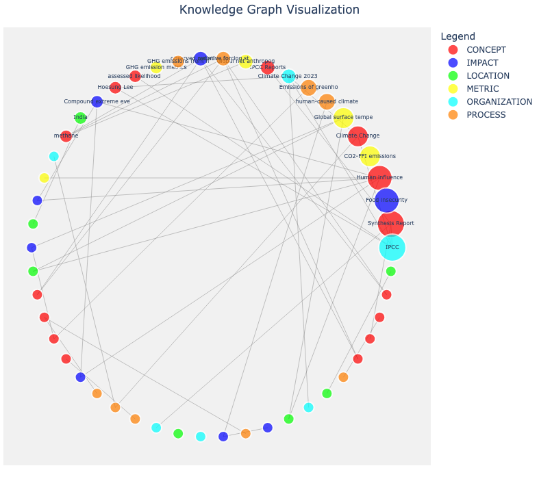
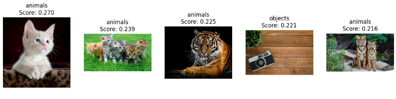
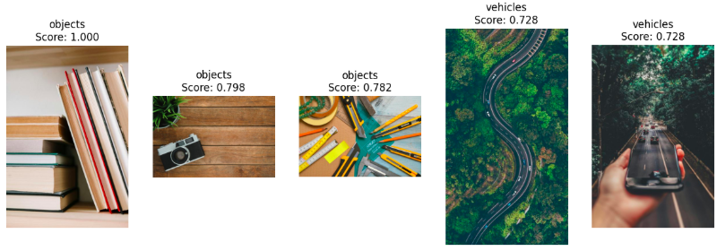
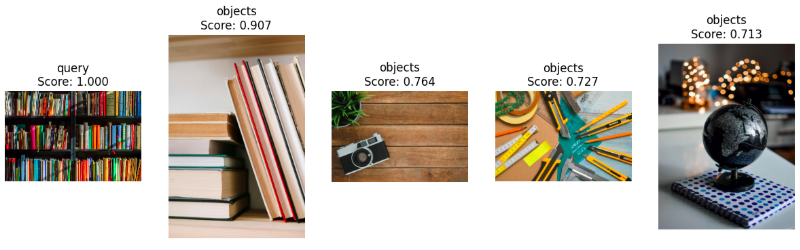

# Chapter 20: Multimodal RAG - Working with Text, Images and Audio

## Introduction

Modern applications often rely on different modalities of data. Documents, images and audio all carry valuable information, yet each requires a different approach for retrieval and understanding. This chapter explores how multimodal RAG systems can unify these formats into a single workflow, enabling us to search long PDFs, retrieve images using natural language and build voice-driven data assistants that respond to spoken questions. While the user experience across these examples differs, the underlying pattern is the same: extract meaningful representations, store them efficiently as vectors and combine fast similarity search with model-based reasoning.

Whether it's navigating dense scientific reports, comparing images in a catalog or querying a database hands-free, multimodal RAG extends the reach of traditional text-based systems. By layering embeddings, vector search and lightweight orchestration, we turn different forms of unstructured data into a coherent, queryable knowledge space. This chapter shows how these techniques come together in practical, end-to-end workflows powered by SingleStore.

## Create the Database and Tables

In the SingleStore Portal, we'll use the **SQL Editor** to create a new database. Call this `multimodal_db`, as follows:

```sql
CREATE DATABASE IF NOT EXISTS multimodal_db;
```

We'll also create a table, as follows:

```sql
USE multimodal_db;

DROP TABLE IF EXISTS pdf_docs;

DROP TABLE IF EXISTS clip_images;
CREATE TABLE IF NOT EXISTS clip_images (
    id INT AUTO_INCREMENT PRIMARY KEY,
    category VARCHAR(50),
    image_path VARCHAR(255),
    embedding VECTOR(512)
);
```

We'll use this `multimodal_db` database for the PDF question-answering system and the image search system with CLIP. For the building a voice-controlled data assistant, we'll reuse the `stockticker_db` database we previously created.

## Building a RAG PDF Question-Answering System

### Introduction

In this section, we'll explore how to build a question-answering system over a PDF document using SingleStore's vector capabilities. This is one of the most common real-world applications of retrieval augmented generation, enabling us to extract insights from lengthy documents without reading them cover-to-cover.

Our approach uses the IPCC AR6 Climate Report as our example document. This is a multi-page PDF document with tens of thousands of characters of dense scientific content. Rather than expecting users to manually search through dozens of pages, we'll build a system that can understand questions in natural language and retrieve the most relevant information to construct accurate answers.

The journey from raw PDF to an intelligent Q&A system involves several interconnected steps. We'll start by loading and cleaning the PDF content, ensuring that text is properly formatted and whitespace is normalized. Once we have clean text, we face a fundamental challenge: the document is too large to process all at once and different questions require information from different sections. This is where chunking comes in. Using LangChain, we'll break the document into overlapping pieces that preserve context while keeping each chunk small enough to process efficiently.

With our chunks ready, we'll transform them into vector embeddings using a sentence transformer, creating multi-dimensional numerical representations that captures semantic meaning. These vectors are stored in SingleStore with native vector indexing, enabling fast similarity searches using `DOT_PRODUCT` distance. But vector similarity alone isn't always enough for the best results, so we'll add a cross-encoder reranking step that uses a more sophisticated model to refine our initial retrieval. Finally, we'll pass the most relevant chunks to a large language model, which synthesizes the information into natural, human-readable answers.

This foundation applies to any PDF-based knowledge base, whether we're building internal documentation search, legal document analysis or research paper exploration systems.

### Fill out the Notebook

Let's now create a new Python notebook. We'll call it **pdf_qa**. We'll connect the notebook to the `multimodal_db` database.

First, we’ll set our models and retrieve our OpenAI API Key from the secrets vault. We'll need the OpenAI API Key for generating vector embeddings. We'll access the OpenAI API Key using `get_secret`:

```python
LLM_MODEL = ...
EMBEDDING_MODEL = ...
RERANKER = ...

os.environ["OPENAI_API_KEY"] = get_secret("OPENAI_API_KEY")
```

Next, we'll create a helper function to normalize white space in text. When we extract text from PDFs, we often get messy formatting, such as multiple spaces between words, random line breaks in the middle of sentences, tabs and other whitespace from the original document layout. This function cleans all that up so we have words that are separated by single spaces.

```python
def clean_text(text):
    return re.sub(r"\s+", " ", text).strip()
```

This preprocessing step significantly improves downstream performance because later processing steps will work better with normalized text.

Now, we'll load our PDF document of interest and apply the helper function to obtain a clean, structured format:

```python
file_url = ...

loader = PyPDFLoader(file_url)

docs = loader.load()

docs = [
    Document(page_content = clean_text(d.page_content), metadata = d.metadata)
    for d in docs
]
```

Let's check the document:

```python
print(f"You have {len(docs)} pages in your document.")
print(f"There are {sum(len(doc.page_content) for doc in docs)} characters in your document.")
```

Example output:

```python
You have 42 pages in your document.
There are 146794 characters in your document.
```

Next, we'll take our cleaned PDF pages and break them into smaller, overlapping chunks that are easier to work with:

```python
text_splitter = RecursiveCharacterTextSplitter(
    chunk_size = 1000,
    chunk_overlap = 100,
    separators = ["\n\n", ".", "!", "?", ";", ",", " "]
)

texts = text_splitter.split_documents(docs)

print (f"You have {len(texts)} pages.")
```

The `RecursiveCharacterTextSplitter` is smart about how it divides text. It tries to split at natural boundaries rather than cutting sentences in half. First it looks for paragraph breaks, then periods, then exclamation marks and question marks and so on down to commas and spaces. It only moves to smaller separators if it can't make a chunk of the right size using the larger, more natural breaks.

Each chunk aims to be around 1000 characters long, which is roughly a few paragraphs. The 100-character overlap means that the end of one chunk slightly overlaps with the beginning of the next chunk. This overlap is crucial because it ensures that if important information spans across what would have been a chunk boundary, we don't lose context. A sentence that gets cut between two chunks will appear in full in at least one of them.

Example output:

```text
You have 181 pages.
```

The result is that our original pages have become smaller chunks. These chunks are the right size for generating embeddings and for passing to our language model later. They're small enough to be focused and relevant, but large enough to contain meaningful context.

Next, we'll set our OpenAI model:

```python
llm = ChatOpenAI(
    model = LLM_MODEL,
    temperature = 0
)
```

Now, we'll set up two AI models that will work together to find relevant information. The embeddings model converts our text chunks into multi-dimensional numerical vectors that capture their semantic meaning, while the reranker is a sophisticated model that will later refine our search results by doing a deeper comparison between questions and retrieved chunks.

```python
embeddings = HuggingFaceEmbeddings(
    model_name = EMBEDDING_MODEL
)

dimensions = len(embeddings.embed_query("test"))

reranker = CrossEncoder(RERANKER)
```

Now we are ready to work with SingleStore. First, we'll create a connection:

```python
from sqlalchemy import *

db_connection = create_engine(connection_url)
```

and then drop the pdf docs table if it already exists, so we start with a clean state:

```python
with db_connection.begin() as conn:
    conn.execute(text("DROP TABLE IF EXISTS pdf_docs;"))
```

Now we're ready to use the SingleStore LangChain integration to store the document data:

```python
vector_store = SingleStoreVectorStore(
    embeddings,
    table_name = "pdf_docs",
    distance_strategy = "DOT_PRODUCT",
    use_vector_index = True,
    vector_size = dimensions
)

vector_store.add_documents(texts);
```

We'll quickly check what was stored by retrieving the data from the database into a Pandas DataFrame:

```python
df = pd.read_sql(
    """
    SELECT LEFT(content, 30) AS content, LEFT(vector :> JSON, 30) AS vector
    FROM pdf_docs
    LIMIT 5;
    """,
    db_connection
)
```

and then check the DataFrame:

```python
df.head()
```

Example output:

```text
                          content                          vector
0  Summary for Policymakers IPCC,  [-0.0499601401,0.0395473056,0.
1  . In panel (b), the unit is th  [-0.0100800302,-0.0109694507,0
2  . (high confidence) {3.3.3, 4.  [0.00129656564,0.0445485115,0.
3  . 5 °C Low emissions System tr  [0.0708026811,0.0139502343,0.0
4  18 Summary for Policymakers Su  [0.00355993141,-0.0325920954,0
```

Now we'll prepare our prompt template so that we can start asking some questions using the stored data:

```python
prompt = PromptTemplate(
    input_variables = ["text", "question"],
    template = (
        "Answer the question based only on the following excerpts:\n"
        "Question: {question}\n"
        "Excerpts:\n{text}\n\n"
        "Provide a short, clear answer (2–3 sentences)."
    )
)
```

Next, we'll write a function to orchestrate the entire question-answering process. It will first search the vector store for chunks similar to our question, then use the reranker to score and reorder those results for better accuracy. After filtering out any low-quality chunks that are too short or lack meaningful content, it will combine the best chunks into a single context, format them into a prompt with our question and send everything to the language model to generate a natural answer. If the API call fails for any reason, it gracefully falls back to returning the first retrieved chunk directly.

```python
def answer_question(question, vector_store, max_chunk_chars = 600, k = 2):
    """
    Fast and relevant OpenAI-powered version.
    """
    results = vector_store.similarity_search(question, k = min(k, len(texts)))

    if not results:
        return "No relevant information found."

    scored = [(r, reranker.predict([(question, r.page_content)])[0]) for r in results]
    results = [r for r, _ in sorted(scored, key = lambda x: x[1], reverse = True)]

    filtered = []
    for r in results:
        chunk = re.sub(r'\s+', ' ', r.page_content).strip()
        if len(chunk) < 50 or not re.search(r'[a-zA-Z]{5,}', chunk):
            continue
        filtered.append(chunk)

    if not filtered:
        return "No meaningful content found in retrieved sections."

    merged = "\n\n---\n\n".join(c[:max_chunk_chars] for c in filtered[:k])

    final_prompt = prompt.format(question = question, text = merged)
    try:
        response = llm.invoke(final_prompt)
        return response.content.strip()
    except Exception as e:
        print(f"OpenAI fallback: {e}")
        return filtered[0][:300]
```

Now we're ready to ask questions of the stored data.

### Example Queries

First, a fairly broad question:

```python
print(answer_question(
    "What are the main observed impacts of climate change on ecosystems and humans?",
    vector_store
    )
)
```

Example output:

```text
The main observed impacts of climate change on ecosystems and humans include widespread and substantial losses and damages to terrestrial, freshwater, and ocean ecosystems, with high confidence in attribution to human-caused climate change. These impacts threaten biodiversity, livelihoods, health, and well-being, and are expected to intensify and become increasingly irreversible without urgent mitigation and adaptation.
```

Next, something more specific:

```python
print(answer_question(
    "What does the report say about limiting global warming to 1.5°C or 2°C?",
    vector_store
    )
)
```

Example output:

```text
The report states that limiting global warming to 1.5°C with no or limited overshoot is possible with immediate and deep global greenhouse gas emissions reductions this decade, but warming is still likely to exceed 1.5°C during the 21st century. Limiting warming to 2°C is more achievable (>67% likelihood) with immediate action, though current nationally determined contributions (NDCs) and policies make it harder to stay below these limits.
```

Next, a question on greenhouse gas emissions:

```python
print(answer_question(
    "Which strategies are recommended to reduce greenhouse gas emissions?",
    vector_store
    )
)
```

Example output:

```text
Recommended strategies to reduce greenhouse gas emissions include implementing international environmental and sectoral agreements and initiatives that stimulate low GHG emissions investments. Achieving net zero CO2 or GHG emissions by mid-century is essential to limit global warming to 1.5°C or 2°C, requiring substantial emission reductions across sectors.
```

Now, a question about vulnerable communities:

```python
print(answer_question(
    "What adaptation measures are suggested for communities vulnerable to climate change?",
    vector_store
    )
)
```

Example output:

```text
Adaptation measures for vulnerable communities include integrating climate adaptation into social protection programs such as cash transfers and public works, and implementing equity-focused, inclusive, and rights-based approaches. Effective options also involve community-based adaptation, agricultural improvements like cultivar enhancements, water management, soil conservation, and landscape diversification.
```

Finally, a question on guidance to policymakers:

```python
print(answer_question(
    "What guidance does the report give to policymakers regarding climate action?",
    vector_store
    )
)
```

Example output:

```text
The report advises policymakers to urgently implement ambitious and immediate climate actions to limit global warming, emphasizing the integration of mitigation and adaptation strategies. It highlights the need for coordinated efforts across sectors and scales to reduce greenhouse gas emissions and enhance resilience to climate impacts.
```

### Summary

This example showed a production-ready RAG system that successfully navigated the complexities of a scientific climate report to answer nuanced questions. The answers weren't simply copied from the document - they were synthesized from multiple chunks to provide coherent, contextual responses.

## Building a Graph RAG PDF Question-Answering System

### Introduction

In an earlier chapter, we used GraphFrames with SingleStore. Let's utilize this integration and capability to build a Graph RAG system using the same PDF file above.

We'll implement a full Graph RAG pipeline using LLM-based knowledge graph extraction, relational storage with vector embeddings and distributed graph traversal via GraphFrames. Semantic integrity is enforced at the application layer, which is standard practice for LLM-generated knowledge graphs. GraphFrames provides scalable, explainable multi-hop retrieval, making it a strong backend for large Graph RAG workloads.

### Fill out the Notebook

Let's now create a new Python notebook. We'll call it **pdf_graph_qa**. We'll connect the notebook to the `multimodal_db` database.

First, we'll set our random seed value:

```python
SEED = 42

random.seed(SEED)
np.random.seed(SEED)
```

First, we’ll set our models and retrieve our OpenAI API Key from the secrets vault. We'll need the OpenAI API Key for generating vector embeddings. We'll access the OpenAI API Key using `get_secret`:

```python
LLM_MODEL = ...
EMBEDDING_MODEL = ...

os.environ["OPENAI_API_KEY"] = get_secret("OPENAI_API_KEY")
```

Next, we'll provide the details of the JAR files we need and create the SparkSession, as follows:

```python
os.environ.pop("CONTAINER_ID", None)

jar_packages = [
    "com.singlestore:singlestore-spark-connector_2...",
    "com.singlestore:singlestore-jdbc-client...",
    "org.apache.commons:commons-dbcp2...",
    "org.apache.commons:commons-pool2...",
    "io.spray:spray-json_2...",
    "io.graphframes:graphframes-spark4_2..."
]

spark = (
    SparkSession.builder
    .appName("Graph RAG")
    .master("local[*]")
    .config("spark.jars.packages", ",".join(jar_packages))
    .getOrCreate()
)

spark.sparkContext.setLogLevel("ERROR")
```

This is similar to the code we've previously used, but we've added GraphFrames.

Now we'll connect to the database:

```python
from sqlalchemy import *

db_connection = create_engine(connection_url)
url = db_connection.url
```

and configure the variables we need for Spark to correctly connect to SingleStore:

```python
password = get_secret("password")
database = url.database
host = url.host
port = url.port
cluster = host + ":" + str(port)
```

We'll configure Spark, as follows:

```python
spark.conf.set("spark.datasource.singlestore.ddlEndpoint", cluster)
spark.conf.set("spark.datasource.singlestore.user", "admin")
spark.conf.set("spark.datasource.singlestore.password", password)
spark.conf.set("spark.datasource.singlestore.disablePushdown", "false")
```

Next, we'll set the LLM for entity extraction and answer generation:

```python
llm = ChatOpenAI(
    model = LLM_MODEL,
    temperature = 0,
    seed = SEED
)
```

We'll use the same embedding model we used earlier:

```python
embeddings = HuggingFaceEmbeddings(
    model_name = EMBEDDING_MODEL,
    model_kwargs = {"device": "cpu"},
    encode_kwargs = {"normalize_embeddings": True}
)

dimensions = len(embeddings.embed_query("test"))
```

Next, we'll create the graph schema:

```python
with db_connection.begin() as conn:
    conn.execute(text("DROP TABLE IF EXISTS relationships;"))
    conn.execute(text("DROP TABLE IF EXISTS entities;"))

    conn.execute(text(f"""
        CREATE TABLE entities (
            entity_id BIGINT PRIMARY KEY AUTO_INCREMENT,
            entity_name VARCHAR(500),
            entity_type VARCHAR(100),
            description TEXT,
            source_pages JSON,
            embedding VECTOR({dimensions}) NOT NULL,
            KEY unique_entity (entity_name(255)),
            KEY (entity_type)
        );
    """))

    conn.execute(text("""
        CREATE TABLE relationships (
            relationship_id BIGINT PRIMARY KEY AUTO_INCREMENT,
            source_entity_id BIGINT,
            target_entity_id BIGINT,
            relationship_type VARCHAR(100),
            description TEXT,
            source_page INT,
            KEY (source_entity_id),
            KEY (target_entity_id),
            KEY (relationship_type),
            KEY idx_rel_dedup (source_entity_id, target_entity_id, relationship_type)
        );
    """))

print("Graph schema created successfully.")
```

In this schema, graph integrity is enforced at the application layer rather than the database layer. The most effective pattern is to store entities and relationships in two simple tables, each backed by targeted secondary indexes. The primary key on `entity_id` ensures stable node identity, while the index on `entity_name` enables fast deduplication and lookups. Indexes on `source_entity_id` and `target_entity_id` in the relationships table are essential for efficient graph traversal, since they avoid full table scans during neighborhood expansion. Additional indexes on `entity_type`, `relationship_type` and the composite (`source_entity_id`, `target_entity_id`, `relationship_type`) support relationship filtering, prevent duplicate edges and ensure predictable ingestion performance. Although minimal, this schema provides all the structural guarantees needed for Graph RAG while remaining fully aligned with SingleStore's current SQL and vector capabilities.

We'll now load and process a document.

Next, we'll define our helper function form earlier to normalize white space in text. This function cleans the content so we have words that are separated by single spaces.

```python
def clean_text(text):
    return re.sub(r"\s+", " ", text).strip()
```

Now, we'll load our PDF document of interest and apply the helper function to obtain a clean, structured format:

```python
file_url = ...

loader = PyPDFLoader(file_url)

docs = loader.load()

docs = [
    Document(page_content = clean_text(d.page_content), metadata = d.metadata)
    for d in docs
]
```

Let's check the document:

```python
print(f"You have {len(docs)} pages in your document.")
print(f"There are {sum(len(doc.page_content) for doc in docs)} characters in your document.")
```

Example output:

```python
You have 42 pages in your document.
There are 146794 characters in your document.
```

Next, we'll take our cleaned PDF pages and break them into overlapping chunks that are easier to work with:

```python
text_splitter = RecursiveCharacterTextSplitter(
    chunk_size = 2000,
    chunk_overlap = 200,
    separators = ["\n\n", ".", "!", "?", ";", ",", " "]
)

texts = text_splitter.split_documents(docs)

print(f"Split into {len(texts)} chunks.")
```

Example output:

```text
Split into 97 chunks.
```

Next, we'll write a function that processes a set of document chunks and uses an LLM to extract structured knowledge in the form of entities and relationships. For each chunk (up to `max_docs`), it sends a prompt asking the model to return well-formed JSON containing entities and their relationships. It then parses the JSON, validates its structure, attaches the source page number and accumulates the results. Any chunk that fails to produce valid JSON is recorded in a list of failed extractions. At the end, the function returns two lists - one of extracted entities and one of extracted relationships - along with warnings about any chunks the LLM could not process.

```python
def extract_entities_and_relationships(docs, llm, max_docs = 20):
    """
    Extract entities and relationships from document chunks using LLM
    """
    entities = []
    relationships = []
    failed_chunks = []

    print(f"Processing {min(max_docs, len(docs))} chunks...")

    for i, doc in enumerate(docs[:max_docs]):
        if i % 5 == 0:
            print(f"  Processing chunk {i}/{min(max_docs, len(docs))}")

        page_num = doc.metadata.get('page', 0)

        extraction_prompt = f"""Extract key entities and their relationships from this text about climate change.

Text: {doc.page_content[:2000]}

Return ONLY valid JSON in this exact format (no other text):
{{
  "entities": [
    {{"name": "Entity Name", "type": "CONCEPT|PROCESS|METRIC|LOCATION|ORGANIZATION|IMPACT", "description": "brief description"}}
  ],
  "relationships": [
    {{"source": "Entity1", "target": "Entity2", "type": "causes|affects|measures|increases|decreases|threatens", "description": "brief description"}}
  ]
}}"""

        try:
            response = llm.invoke(extraction_prompt)
            content = response.content.strip()

            if "```json" in content:
                content = content.split("```json")[1].split("```")[0]
            elif "```" in content:
                content = content.split("```")[1].split("```")[0]

            data = json.loads(content)

            if not isinstance(data.get("entities"), list):
                raise ValueError("Invalid JSON structure: 'entities' must be a list")
            if not isinstance(data.get("relationships"), list):
                raise ValueError("Invalid JSON structure: 'relationships' must be a list")

            for entity in data.get("entities", []):
                if not isinstance(entity, dict):
                    raise ValueError("Invalid entity structure: entity must be a dict")
                if "name" not in entity or not entity["name"]:
                    raise ValueError("Invalid entity structure: missing or empty 'name' field")

            for entity in data.get("entities", []):
                entity["source_page"] = page_num
                entities.append(entity)

            for rel in data.get("relationships", []):
                rel["source_page"] = page_num
                relationships.append(rel)

        except Exception as e:
            failed_chunks.append((page_num, str(e)))
            print(f"  Error on chunk {i} (page {page_num}): {str(e)[:100]}")
            continue

    print(f"\nExtracted {len(entities)} entities and {len(relationships)} relationships")

    if failed_chunks:
        print(f"\nWarning: Failed to extract from {len(failed_chunks)} chunks:")
        for page, error in failed_chunks[:5]:
            print(f"  Page {page}: {error[:100]}")
        if len(failed_chunks) > 5:
            print(f"  ... and {len(failed_chunks) - 5} more")

    return entities, relationships
```

Next, we'll extract the entities and relationships. We'll start with 15 chunks to test.

```python
entities, relationships = extract_entities_and_relationships(texts, llm, max_docs = 15)

print("\nSample entities:")
for entity in entities[:5]:
    print(f"  - {entity['name']} ({entity['type']}): {entity['description'][:60]}...")

print("\nSample relationships:")
for rel in relationships[:5]:
    print(f"  - {rel['source']} --[{rel['type']}]--> {rel['target']}")
```

Example output:

```text
Processing 15 chunks...
  Processing chunk 0/15
  Processing chunk 5/15
  Processing chunk 10/15

Extracted 315 entities and 159 relationships

Sample entities:
  - Intergovernmental Panel on Climate Change (ORGANIZATION): An international body for assessing the science related to c...
  - Climate Change (CONCEPT): Long-term alteration of temperature and typical weather patt...
  - CLIMATE CHANGE 2023 Synthesis Report Summary for Policymakers (PROCESS): A comprehensive report summarizing the latest scientific fin...
  - Climate Change 2023 Synthesis Report Summary for Policymakers (ORGANIZATION): Summary report synthesizing findings on climate change for p...
  - Hoesung Lee (CONCEPT): Chair of the Core Writing Team for the report...

Sample relationships:
  - Intergovernmental Panel on Climate Change --[produces]--> CLIMATE CHANGE 2023 Synthesis Report Summary for Policymakers
  - CLIMATE CHANGE 2023 Synthesis Report Summary for Policymakers --[describes]--> Climate Change
  - IPCC --[produces]--> Climate Change 2023 Synthesis Report Summary for Policymakers
  - Climate Change 2023 Synthesis Report Summary for Policymakers --[references]--> Working Groups I, II and III
  - Hoesung Lee --[leads]--> Climate Change 2023 Synthesis Report Summary for Policymakers
```

This operation takes a few minutes because we are making sequential LLM calls.

Next, we'll define a helper function to store the knowledge graph in SingleStore:

```python
def store_graph_data(entities, relationships, embeddings, db_connection):
    """
    Store entities and relationships in SingleStore with deduplication.
    Uses Python-side deduplication.
    """
    entity_map = {}

    print("Validating entities...")
    valid_entities = []
    skipped_invalid = 0
    for entity in entities:
        if not entity.get("name") or not entity.get("name").strip():
            skipped_invalid += 1
            continue
        valid_entities.append(entity)

    if skipped_invalid > 0:
        print(f"  Skipped {skipped_invalid} entities with empty names")

    entities = valid_entities

    print("Preparing entity embeddings...")
    embedding_texts = [f"{e['name']}: {e.get('description', '')}" for e in entities]

    try:
        embedding_vecs = embeddings.embed_documents(embedding_texts)
        print(f"  Generated {len(embedding_vecs)} embeddings in batch")
    except Exception as e:
        print(f"  Batch embedding failed ({e}), generating sequentially...")
        embedding_vecs = [embeddings.embed_query(text) for text in embedding_texts]

    print("Storing entities...")

    with db_connection.begin() as conn:
        for i, (entity, embedding_vec) in enumerate(zip(entities, embedding_vecs)):
            if i % 20 == 0:
                print(f"  Processed {i}/{len(entities)} entities")

            current_name = entity["name"]
            current_page = int(entity["source_page"])
            new_desc = entity.get("description", "")

            result = conn.execute(text(
                "SELECT entity_id, description, source_pages FROM entities WHERE entity_name = :name"
            ), {"name": current_name}).fetchone()

            if result:
                entity_id, old_desc, source_pages_json = result
                entity_map[current_name] = entity_id

                page_list = []
                if source_pages_json:
                    try:
                        page_list = json.loads(source_pages_json)
                    except Exception:
                        page_list = []

                if current_page not in page_list:
                    page_list.append(current_page)

                if new_desc and new_desc not in old_desc:
                    updated_desc = f"{old_desc} | {new_desc}"
                else:
                    updated_desc = old_desc

                updated_source_pages_json = json.dumps(page_list)

                conn.execute(text("""
                    UPDATE entities
                    SET description = :updated_desc,
                        source_pages = :updated_pages_json,
                        embedding = :emb
                    WHERE entity_id = :id
                """), {
                    "updated_desc": updated_desc,
                    "updated_pages_json": updated_source_pages_json,
                    "emb": str(embedding_vec),
                    "id": entity_id
                })

            else:
                initial_source_pages = json.dumps([current_page])

                conn.execute(text("""
                    INSERT INTO entities (entity_name, entity_type, description, source_pages, embedding)
                    VALUES (:name, :type, :desc, :pages_json, :emb)
                """), {
                    "name": current_name,
                    "type": entity["type"],
                    "desc": new_desc,
                    "pages_json": initial_source_pages,
                    "emb": str(embedding_vec)
                })

                entity_id = conn.execute(text("SELECT LAST_INSERT_ID()")).scalar()
                entity_map[current_name] = entity_id

        print(f"Stored/updated {len(entities)} entities")

        result = conn.execute(text("SELECT entity_id, entity_name FROM entities"))
        entity_map.update({row[1]: row[0] for row in result})
        print(f"Mapped {len(entity_map)} unique entities")

        print(f"Storing relationships with deduplication...")
        stored_rels = 0
        skipped_duplicate_rels = 0
        skipped_missing_entities = 0

        for rel in relationships:
            source_id = entity_map.get(rel["source"])
            target_id = entity_map.get(rel["target"])
            rel_type = rel["type"]
            current_page = rel["source_page"]

            if source_id and target_id:
                result = conn.execute(text("""
                    SELECT relationship_id FROM relationships
                    WHERE source_entity_id = :src
                      AND target_entity_id = :dst
                      AND relationship_type = :type
                """), {
                    "src": source_id,
                    "dst": target_id,
                    "type": rel_type
                }).fetchone()

                if result:
                    skipped_duplicate_rels += 1
                else:
                    conn.execute(text("""
                        INSERT INTO relationships
                        (source_entity_id, target_entity_id, relationship_type, description, source_page)
                        VALUES (:src, :dst, :type, :desc, :page)
                    """), {
                        "src": source_id,
                        "dst": target_id,
                        "type": rel_type,
                        "desc": rel.get("description", ""),
                        "page": current_page
                    })
                    stored_rels += 1
            else:
                skipped_missing_entities += 1

        print(f"Stored {stored_rels} new relationships")
        if skipped_duplicate_rels > 0:
            print(f"Skipped {skipped_duplicate_rels} duplicate relationships")
        if skipped_missing_entities > 0:
            print(f"Skipped {skipped_missing_entities} relationships (entities not found)")

    return entity_map
```

This function ingests the extracted entities and relationships into SingleStore while enforcing deduplication and provenance tracking. It first validates the entity records and generates text embeddings for each one. For every entity, it checks whether the entity already exists in the database and either updates the existing record - merging descriptions, appending source pages and refreshing the embedding - or inserts a new row. After building a complete in-memory map from entity names to IDs, it processes the relationships: each relationship is inserted only if both endpoint entities exist and no identical relationship already appears in the table. The result is a clean, deduplicated and fully indexed knowledge graph stored in SingleStore, along with a mapping of canonical entity identifiers used for subsequent graph traversal.

Let's store the knowledge graph using the helper function:

```python
entity_map = store_graph_data(entities, relationships, embeddings, db_connection)

with db_connection.begin() as conn:
    entity_count = conn.execute(text("SELECT COUNT(*) FROM entities")).scalar()
    rel_count = conn.execute(text("SELECT COUNT(*) FROM relationships")).scalar()

print(f"\nDatabase contains {entity_count} unique entities and {rel_count} relationships")
```

Example output:

```text
Validating entities...
Preparing entity embeddings...
  Generated 315 embeddings in batch
Storing entities...
  Processed 0/315 entities
  Processed 20/315 entities
  Processed 40/315 entities
  Processed 60/315 entities
  Processed 80/315 entities
  Processed 100/315 entities
  Processed 120/315 entities
  Processed 140/315 entities
  Processed 160/315 entities
  Processed 180/315 entities
  Processed 200/315 entities
  Processed 220/315 entities
  Processed 240/315 entities
  Processed 260/315 entities
  Processed 280/315 entities
  Processed 300/315 entities
Stored/updated 315 entities
Mapped 283 unique entities
Storing relationships with deduplication...
Stored 147 new relationships
Skipped 1 duplicate relationships
Skipped 11 relationships (entities not found)

Database contains 283 unique entities and 147 relationships
```

Now we're ready to load the knowledge graph into SingleStore, so we'll define a helper function first:

```python
def load_knowledge_graph():
    """
    Load entities and relationships from SingleStore into GraphFrames
    """
    vertices = spark.read \
        .format("singlestore") \
        .load(f"{database}.entities") \
        .selectExpr(
            "entity_id as id",
            "entity_name as name",
            "entity_type as type",
            "description"
        )
    
    edges = spark.read \
        .format("singlestore") \
        .load(f"{database}.relationships") \
        .selectExpr(
            "source_entity_id as src",
            "target_entity_id as dst",
            "relationship_type as relationship",
            "description"
        )
    
    g = GraphFrame(vertices, edges)
    return g
```

and we'll load the graph and output some data:

```python
knowledge_graph = load_knowledge_graph()

print(f"\nGraph loaded:")
print(f"  Vertices: {knowledge_graph.vertices.count()}")
print(f"  Edges: {knowledge_graph.edges.count()}")

print("\nSample vertices:")
knowledge_graph.vertices.show(5, truncate = True)

print("\nSample edges:")
knowledge_graph.edges.show(5, truncate = True)
```

Example output:

```text
Graph loaded:
                                                                                
  Vertices: 283
  Edges: 147

Sample vertices:
+----------------+--------------------+------------+--------------------+
|              id|                name|        type|         description|
+----------------+--------------------+------------+--------------------+
|1125899906842721|       Gerrit Hansen|     CONCEPT|Climate expert fr...|
|1125899906842828|Global surface te...|      METRIC|Measure of Earth'...|
|1125899906842879|          cryosphere|     CONCEPT|Frozen water part...|
|1125899906842728|          Debora Ley|     CONCEPT|Climate expert fr...|
|1125899906842695|World Meteorologi...|ORGANIZATION|An intergovernmen...|
+----------------+--------------------+------------+--------------------+
only showing top 5 rows

Sample edges:
+----------------+----------------+------------+--------------------+
|             src|             dst|relationship|         description|
+----------------+----------------+------------+--------------------+
|1125899906842845|1125899906842849|   increases|Increased GHG emi...|
|1125899906842835|1125899906842828|     affects|Natural drivers c...|
|1125899906842858|1125899906842856|    measures|GWP100 is used as...|
|1125899906842884|1125899906842891|   increases|Human influence h...|
|1125899906842678|1125899906842628|    produces|IPCC produces the...|
+----------------+----------------+------------+--------------------+
only showing top 5 rows
```

Next, we'll write a helper function that implements the full Graph RAG query cycle:

```python
def graph_rag_answer(question, db_connection, graph, embeddings, llm, k = 5, max_relationships = 100):
    """
    Answer questions using Graph RAG approach with bidirectional traversal
    """
    print(f"Question: {question}\n")

    print("Step 1: Finding relevant entities...")
    query_embedding = embeddings.embed_query(question)

    with db_connection.begin() as conn:
        results = conn.execute(text("""
            SELECT entity_id, entity_name, entity_type, description
            FROM entities
            ORDER BY DOT_PRODUCT(embedding, :emb) DESC
            LIMIT :k
        """), {"emb": str(query_embedding), "k": k}).fetchall()

    if not results:
        return "No relevant entities found."

    seed_entity_ids = [r[0] for r in results]
    seed_entities_info = [(r[1], r[2], r[3]) for r in results]

    print(f"  Found {len(seed_entity_ids)} seed entities")
    for name, etype, _ in seed_entities_info:
        print(f"    - {name} ({etype})")

    print("\nStep 2: Traversing knowledge graph (bidirectional)...")

    id_list = ",".join(map(str, seed_entity_ids))

    outgoing = graph.find("(a)-[e]->(b)") \
        .filter(f"a.id IN ({id_list})") \
        .select(
            F.col("a.name").alias("source_name"),
            F.col("e.relationship").alias("rel_type"),
            F.col("b.name").alias("target_name"),
            F.col("b.description").alias("target_desc")
        ) \
        .limit(max_relationships // 2)

    incoming = graph.find("(a)-[e]->(b)") \
        .filter(f"b.id IN ({id_list})") \
        .select(
            F.col("a.name").alias("source_name"),
            F.col("e.relationship").alias("rel_type"),
            F.col("b.name").alias("target_name"),
            F.col("b.description").alias("target_desc")
        ) \
        .limit(max_relationships // 2)

    try:
        relationships = outgoing.union(incoming).distinct().collect()
    except Exception as e:
        print(f"  Warning: Graph traversal error: {e}")
        relationships = []

    print(f"  Found {len(relationships)} relationships")

    print("\nStep 3: Building context from knowledge graph...")
    context = "# Relevant Entities:\n"
    for name, etype, desc in seed_entities_info:
        context += f"- {name} ({etype}): {desc}\n"

    if not relationships:
        context += "\n# Knowledge Graph Relationships:\n"
        context += "No direct relationships found in the knowledge graph.\n"
        print("  Warning: No relationships found")
    else:
        context += "\n# Knowledge Graph Relationships:\n"
        for row in relationships[:30]:  # Limit to avoid token limits
            context += f"- {row.source_name} --[{row.rel_type}]--> {row.target_name}\n"
            if row.target_desc and row.target_desc.strip():
                context += f"  ({row.target_desc[:100]}...)\n"

    print("\nStep 4: Generating answer...\n")
    final_prompt = f"""Answer the question using the knowledge graph context below.

Knowledge Graph Context:
{context}

Question: {question}

Provide a clear, concise answer (2-3 sentences) based on the entities and relationships shown above."""
    
    try:
        response = llm.invoke(final_prompt)
        return response.content.strip()
    except Exception as e:
        return f"Error generating answer: {e}"
```

The function begins by embedding the user's question and performing a vector search against the entity table to identify the most semantically relevant seed entities. Using their IDs, it performs a bidirectional neighborhood expansion with GraphFrames, gathering incoming and outgoing relationships to build a focused subgraph around the query. It then constructs a structured text context containing the seed entities and their connected relationships. Finally, it provides this context to an LLM, which synthesizes a short, grounded answer. The result is a concise natural-language response supported by both embeddings and graph structure.

### Example Queries

First, climate change impacts:

```python
answer1 = graph_rag_answer(
    "What are the main impacts of climate change on ecosystems?",
    db_connection,
    knowledge_graph,
    embeddings,
    llm,
    k = 5
)
print(f"Answer: {answer1}\n")
```

Example output:

```text
Question: What are the main impacts of climate change on ecosystems?

Step 1: Finding relevant entities...
  Found 5 seed entities
    - biosphere (CONCEPT)
    - Africa (LOCATION)
    - Climate Change and Land (2019) (ORGANIZATION)
    - losses and damages to nature and people (IMPACT)
    - ocean (CONCEPT)

Step 2: Traversing knowledge graph (bidirectional)...
  Found 6 relationships

Step 3: Building context from knowledge graph...

Step 4: Generating answer...

Answer: The main impacts of climate change on ecosystems include losses and damages to nature and people, driven by weather and climate extremes. Human-caused climate change affects the biosphere, encompassing all ecosystems, as well as the ocean, leading to negative consequences for vulnerable communities and natural environments.
```

Next, temperature limits:

```python
answer2 = graph_rag_answer(
    "What does the report say about limiting global warming to 1.5°C?",
    db_connection,
    knowledge_graph,
    embeddings,
    llm,
    k = 5
)
print(f"Answer: {answer2}\n")
```

Example output:

```text
Question: What does the report say about limiting global warming to 1.5°C?

Step 1: Finding relevant entities...
  Found 5 seed entities
    - SR1.5 (CONCEPT)
    - Special Reports (ORGANIZATION)
    - Global Warming of 1.5°C (METRIC)
    - Global warming (IMPACT)
    - CLIMATE CHANGE 2023 Synthesis Report Summary for Policymakers (PROCESS)

Step 2: Traversing knowledge graph (bidirectional)...
  Found 7 relationships

Step 3: Building context from knowledge graph...

Step 4: Generating answer...

Answer: The IPCC Special Report on Global Warming of 1.5°C (SR1.5), included in the IPCC Reports and part of the Special Reports, addresses the impacts and pathways related to limiting global warming to 1.5°C above pre-industrial levels. It highlights the importance of reducing greenhouse gas emissions to prevent further increases in global surface temperature and mitigate climate change effects.
```

Third, mitigation strategies:

```python
answer3 = graph_rag_answer(
    "Which strategies are recommended to reduce greenhouse gas emissions?",
    db_connection,
    knowledge_graph,
    embeddings,
    llm,
    k = 5
)
print(f"Answer: {answer3}\n")
```

Example output:

```text
Question: Which strategies are recommended to reduce greenhouse gas emissions?

Step 1: Finding relevant entities...
  Found 5 seed entities
    - Climate Change Mitigation (PROCESS)
    - Greenhouse Gas Emission Pathways (METRIC)
    - Emissions of greenhouse gases (PROCESS)
    - Greenhouse gases (GHGs) (CONCEPT)
    - CO2 (CONCEPT)

Step 2: Traversing knowledge graph (bidirectional)...
  Found 10 relationships

Step 3: Building context from knowledge graph...

Step 4: Generating answer...

Answer: Recommended strategies to reduce greenhouse gas emissions include implementing climate change mitigation efforts that focus on sustainable development. This involves changing lifestyles and patterns of consumption and production, promoting sustainable land use, and transitioning away from unsustainable energy use to decrease emissions from human activities.
```

Let's also run some advanced graph operations. First, let's find the most connected entities:

```python
print("\nMost connected entities:")
in_degree = knowledge_graph.inDegrees
out_degree = knowledge_graph.outDegrees

total_degree = in_degree.join(out_degree, "id", "outer") \
    .fillna(0) \
    .selectExpr("id", "(inDegree + outDegree) as degree")

knowledge_graph.vertices \
    .join(total_degree, "id") \
    .orderBy(F.desc("degree")) \
    .select("name", "type", "degree") \
    .show(10, truncate = False)
```

Example output:

```text
Most connected entities:
                                                                                
+-----------------------------+------------+------+
|name                         |type        |degree|
+-----------------------------+------------+------+
|IPCC                         |ORGANIZATION|10    |
|Synthesis Report             |CONCEPT     |10    |
|Human influence              |CONCEPT     |9     |
|Food insecurity              |IMPACT      |9     |
|Climate Change               |CONCEPT     |7     |
|CO2-FFI emissions            |METRIC      |7     |
|Global surface temperature   |METRIC      |7     |
|Emissions of greenhouse gases|PROCESS     |5     |
|human-caused climate change  |PROCESS     |5     |
|IPCC Reports                 |CONCEPT     |4     |
+-----------------------------+------------+------+
only showing top 10 rows
```

Second, let's find all 2-hop paths from a specific entity:

```python
print("\nExample: 2-hop paths from 'Climate Change':")
try:
    paths = knowledge_graph.find("(a)-[e1]->(b); (b)-[e2]->(c)") \
        .filter("a.name = 'Climate Change'") \
        .select(
            F.col("a.name").alias("start"),
            F.col("e1.relationship").alias("rel1"),
            F.col("b.name").alias("middle"),
            F.col("e2.relationship").alias("rel2"),
            F.col("c.name").alias("end")
        ) \
        .limit(20)
    
    paths.show(10, truncate = False)
except Exception as e:
    print(f"No 2-hop paths found: {e}")
```

Example output:

```text
Example: 2-hop paths from 'Climate Change':
+--------------+-------------+-------------------------------------------------------------+----------+----------------------------+
|start         |rel1         |middle                                                       |rel2      |end                         |
+--------------+-------------+-------------------------------------------------------------+----------+----------------------------+
|Climate Change|is_subject_of|Climate Change 2023 Synthesis Report Summary for Policymakers|references|Working Groups I, II and III|
+--------------+-------------+-------------------------------------------------------------+----------+----------------------------+
```

Third, let's group by entity type:

```python
print("\nEntity distribution by type:")
knowledge_graph.vertices \
    .groupBy("type") \
    .count() \
    .orderBy(F.desc("count")) \
    .show()
```

Example output:

```text
Entity distribution by type:
+------------+-----+
|        type|count|
+------------+-----+
|     CONCEPT|  159|
|    LOCATION|   49|
|ORGANIZATION|   26|
|      METRIC|   22|
|     PROCESS|   14|
|      IMPACT|   13|
+------------+-----+
```

Fourth, let's group by relationship type:

```python
print("\nRelationship distribution by type:")
knowledge_graph.edges \
    .groupBy("relationship") \
    .count() \
    .orderBy(F.desc("count")) \
    .show()
```

Example output:

```text
Relationship distribution by type:
+---------------+-----+
|   relationship|count|
+---------------+-----+
|        affects|   60|
|      increases|   21|
|         causes|   17|
|       measures|   11|
|       includes|    9|
|       produces|    5|
|      threatens|    5|
|     references|    4|
|      decreases|    4|
|        used by|    2|
|consistent with|    2|
| contributes to|    1|
|     summarizes|    1|
|          leads|    1|
|          cites|    1|
|      describes|    1|
|     located in|    1|
|  is_subject_of|    1|
+---------------+-----+
```

Finally, let's write a helper function to visualize the graph.

```python
def visualize_graph(db_connection, max_entities = 50):
    """
    Create an interactive graph visualization using Plotly
    """
    print("Fetching graph data...")

    with db_connection.begin() as conn:
        entities_result = conn.execute(text("""
            SELECT e.entity_id, e.entity_name, e.entity_type,
                   COUNT(DISTINCT r1.relationship_id) + COUNT(DISTINCT r2.relationship_id) as degree
            FROM entities e
            LEFT JOIN relationships r1 ON e.entity_id = r1.source_entity_id
            LEFT JOIN relationships r2 ON e.entity_id = r2.target_entity_id
            GROUP BY e.entity_id, e.entity_name, e.entity_type
            ORDER BY degree DESC
            LIMIT :limit
        """), {"limit": max_entities}).fetchall()

        entity_ids = [r[0] for r in entities_result]
        entity_names = {r[0]: r[1] for r in entities_result}
        entity_types = {r[0]: r[2] for r in entities_result}
        entity_degrees = {r[0]: r[3] for r in entities_result}

        id_list = ",".join(map(str, entity_ids))
        relationships_result = conn.execute(text(f"""
            SELECT source_entity_id, target_entity_id, relationship_type
            FROM relationships
            WHERE source_entity_id IN ({id_list})
              AND target_entity_id IN ({id_list})
        """)).fetchall()

    print(f"Visualizing {len(entity_ids)} entities and {len(relationships_result)} relationships...")

    num_entities = len(entity_ids)

    if num_entities == 0:
        print("No entities found.")
        return

    entity_id_to_idx = {eid: idx for idx, eid in enumerate(entity_ids)}

    angles = np.linspace(0, 2 * np.pi, num_entities, endpoint = False)
    node_x = np.cos(angles).tolist()
    node_y = np.sin(angles).tolist()

    edge_x = []
    edge_y = []

    for src_id, tgt_id, rel_type in relationships_result:
        if src_id in entity_id_to_idx and tgt_id in entity_id_to_idx:
            src_idx = entity_id_to_idx[src_id]
            tgt_idx = entity_id_to_idx[tgt_id]

            edge_x.extend([node_x[src_idx], node_x[tgt_idx], None])
            edge_y.extend([node_y[src_idx], node_y[tgt_idx], None])

    edge_trace = go.Scatter(
        x = edge_x, y = edge_y,
        line = dict(width = 0.5, color = "#888"),
        hoverinfo = "none",
        mode = "lines",
        showlegend = False
    )

    color_map = {
        "CONCEPT": "#FF0000",
        "PROCESS": "#FF7F00",
        "METRIC": "#FFFF00",
        "LOCATION": "#00FF00",
        "ORGANIZATION": "#00FFFF",
        "IMPACT": "#0000FF",
        "PERSON": "#8B00FF",
        "SECTOR": "#FF00FF",
        "UNKNOWN": "#000000"
    }

    normalized_types = {}
    for entity_id in entity_ids:
        etype = entity_types[entity_id]
        if etype not in color_map:
            normalized_types[entity_id] = "UNKNOWN"
        else:
            normalized_types[entity_id] = etype

    entity_types_present = set(normalized_types.values())

    node_traces = []

    for etype in sorted(entity_types_present):
        type_x = []
        type_y = []
        type_sizes = []
        type_text = []
        type_hovertext = []

        for idx, entity_id in enumerate(entity_ids):
            if normalized_types[entity_id] == etype:
                type_x.append(node_x[idx])
                type_y.append(node_y[idx])

                degree = entity_degrees[entity_id]
                type_sizes.append(10 + degree * 3)

                name = entity_names[entity_id]
                if degree > 2:
                    type_text.append(name[:20])
                else:
                    type_text.append("")

                original_type = entity_types[entity_id]
                type_hovertext.append(f"{name}<br>Type: {original_type}<br>Connections: {degree}")

        trace = go.Scatter(
            x = type_x, y = type_y,
            mode = "markers+text",
            name = etype,
            hoverinfo = "text",
            marker = dict(
                size = type_sizes,
                color = color_map.get(etype, color_map["UNKNOWN"]),
                line = dict(width = 2, color = "white")
            ),
            text = type_text,
            textposition = "middle center",
            textfont = dict(size = 8),
            hovertext = type_hovertext
        )
        node_traces.append(trace)

    fig = go.Figure(
        data = [edge_trace] + node_traces,
        layout = go.Layout(
            title = dict(
                text = "Knowledge Graph Visualization",
                x = 0.5,
                xanchor = "center"
            ),
            showlegend = True,
            legend = dict(
                title = dict(text = "Legend"),
                yanchor = "top",
                y = 1,
                xanchor = "left",
                x = 1.02
            ),
            hovermode = "closest",
            margin = dict(b = 20, l = 5, r = 5, t = 40),
            xaxis = dict(showgrid = False, zeroline = False, showticklabels = False),
            yaxis = dict(showgrid = False, zeroline = False, showticklabels = False),
            height = 700,
            plot_bgcolor = "rgba(240,240,240,0.9)"
        )
    )

    fig.show()

    print("\nVisualization Guide:")
    print("  - Node size = Number of connections")
    print("  - Node color = Entity type")
    print("  - Hover over nodes to see details")
    print("  - Labels shown for highly connected nodes (>2 connections)")
```

and visualize the graph with a maximum of 50 entities:

```python
visualize_graph(db_connection, max_entities = 50)
```

Example output is shown in Figure 20-1.



*Figure 20-1. Knowledge Graph Visualization.*

### Summary

This example showed how to build a fully functional Graph RAG pipeline using standard tools - LLMs, embeddings, a relational database and GraphFrames - without relying on a native graph database. Beginning with an unstructured PDF, we used an LLM to extract entities and relationships, generated embeddings for efficient retrieval and stored everything in SingleStore using a simple but effective graph schema. Deduplication, provenance tracking and structural consistency were enforced at the application layer, reflecting the reality of working with LLM-generated knowledge that does not always conform to strict relational constraints.

We then reconstructed the knowledge graph with Spark and GraphFrames, enabling graph traversal, neighborhood expansion and lightweight analytics. By combining vector search from SingleStore's embedding capabilities with graph context from GraphFrames, we implemented a hybrid retrieval strategy that grounds answers in both semantic similarity and structural relationships. The final step of summarizing the retrieved subgraph with an LLM, illustrated the core value of Graph RAG: producing more accurate and context-aware answers by augmenting embeddings with explicit knowledge structure.

## Building an Image Search System with CLIP

### Introduction

Text search has been used for many years, but searching through images has traditionally been much harder. However, we can today search for images using natural language descriptions or find similar images by showing an example. CLIP (Contrastive Language-Image Pretraining) is a technology that enables us to perform these types of operations. In this section, we'll use CLIP to build an image search system that understands both text queries and image queries.

CLIP is a multimodal model trained by OpenAI that learned to connect images and text by being exposed to a large number of image-caption pairs. Unlike traditional computer vision models that classify images into fixed categories, CLIP understands the semantic relationship between visual content and language. This means we can search for "a picture of a cat" and find relevant images, even though we never explicitly labeled any images as containing cats. The model learned what cats look like and how the word "cat" relates to those visual features.

In our example, we'll use a collection of images organized into categories from Pexels, a stock photo site. We'll load the CLIP model and use it to generate embeddings for each image. These embeddings are multi-dimensional vectors that capture the visual content and meaning of each image. Once we have these vectors, we'll store them in SingleStore alongside metadata about each image's category and file path. The benefit of this approach is that we can generate embeddings for text queries using the same CLIP model and because text and images share the same embedding space, we can directly compare them using vector similarity.

Our example application supports two types of searches. For text-to-image search, we'll encode a natural language query like "a picture of a cat" into a vector and find the images whose embeddings are most similar. For image-to-image search, we'll encode a query image and retrieve visually similar images from our collection. Both search types use the same underlying similarity computation in SingleStore, showing the power of a unified multimodal embedding space.

### Fill out the Notebook

Let's now create a new Python notebook. We'll call it **clip_qa**. We'll connect the notebook to the `multimodal_db` database.

First, we'll download the images ZIP file:

```python
zip_url = ...

response = requests.get(zip_url)
response.raise_for_status()

with open("pexels_images.zip", "wb") as f:
    f.write(response.content)
```

Next, we'll unpack the ZIP file:

```python
with zipfile.ZipFile("pexels_images.zip", "r") as z:
    z.extractall()

image_folder = "pexels_images"

print("Extracted images and folder structure preserved from zip file.")
```

Example output:

```text
Extracted images and folder structure preserved from zip file.
```

Next, we'll walk through the extracted folder, collect every JPG/PNG file, save the full file path and record the category as the name of the folder an image is in.

```python
image_paths = []
categories = []

for root, dirs, files in os.walk(image_folder):
    for f in files:
        if f.lower().endswith((".jpg", ".jpeg", ".png")):
            full_path = os.path.join(root, f)
            image_paths.append(full_path)
            categories.append(os.path.basename(root))

print(f"Found {len(image_paths)} images in {len(set(categories))} categories.")
```

Example output:

```text
Found 51 images in 6 categories.
```

We have the following 6 folders: **animals**, **food**, **landmarks**, **objects**, **query**, **vehicles**. Each folder contains 10 images, except **query** which only contains 1 image that we'll use in a query.

Next, let's load the CLIP model:

```python
device = "cpu"
model, _, preprocess = open_clip.create_model_and_transforms(
    "ViT-B-32",
    pretrained = "openai"
)
model.to(device)
model.eval();
```

Next, we'll load each image, preprocesses it for the CLIP model, batches all images into a tensor, generate CLIP image embeddings and normalize those embeddings so each one has unit length:

```python
processed_images = []
for path in image_paths:
    img = Image.open(path).convert("RGB")
    processed_images.append(preprocess(img).unsqueeze(0))

images_tensor = torch.cat(processed_images, dim = 0).to(device)

with torch.no_grad():
    image_embeddings = model.encode_image(images_tensor)

image_embeddings /= image_embeddings.norm(dim = -1, keepdim = True)
```

We'll convert the embeddings to `float32` for SingleStore:

```python
embedding_array = image_embeddings.cpu().numpy().astype("float32")
```

Now, we'll create a Pandas DataFrame:

```python
df = pd.DataFrame({
    "category": categories,
    "image_path": image_paths,
    "embedding": list(embedding_array)
})
```

and look at some values:

```python
df.head()
```

Example output:

```text
   category                                         image_path                                          embedding
0   objects  pexels_images/objects/010_pexels-photo-4690297...  [-0.030688463, 0.0076383133, 0.020822525, 0.02...
1   objects  pexels_images/objects/006_pexels-photo-1236421...  [0.017499289, 0.045329876, -0.022273855, 0.002...
2   objects  pexels_images/objects/004_pexels-photo-346804....  [-0.02301172, 0.006977425, -0.008972225, 0.016...
3   objects  pexels_images/objects/005_pexels-photo-748600....  [-0.01968281, -0.0011044039, 0.030012187, 0.00...
4   objects  pexels_images/objects/008_pexels-photo-1409216...  [-0.023330824, -0.011383818, -0.014190739, 0.0...
```

We'll save the **query** category into a separate DataFrame, to keep in memory, for later.

```python
df_query = df[df["category"] == "query"]
```

Next, we'll connect to SingleStore:

```python
from sqlalchemy import *

db_connection = create_engine(connection_url)
```

and clear the table:

```python
with db_connection.begin() as conn:
    conn.execute(text("TRUNCATE TABLE clip_images;"))
```

Then store the DataFrame, except for the **query** category:

```python
df[df["category"] != "query"].to_sql(
    "clip_images",
    con = db_connection,
    if_exists = "append",
    index = False,
    chunksize = 1000
)

print("Uploaded embeddings to SingleStore.")
```

Next, we'll create some helper functions to generate normalized CLIP embeddings for text or images, then use those embeddings to run a vector-similarity search in SingleStore to find the most similar images stored in the database. Finally, display the top matching images along with their categories and similarity scores.

```python
def get_text_embedding(text, model, device):
    """Encodes a text string into a CLIP embedding vector."""
    with torch.no_grad():
        text_tokens = open_clip.tokenize([text]).to(device)
        text_features = model.encode_text(text_tokens)
        text_features /= text_features.norm(dim = -1, keepdim = True)
        return text_features.cpu().numpy()[0].tolist()

def get_image_embedding(image_path, model, preprocess, device):
    """Encodes an image from a file path into a CLIP embedding vector."""
    img = Image.open(image_path).convert("RGB")
    image_input = preprocess(img).unsqueeze(0).to(device)

    with torch.no_grad():
        image_features = model.encode_image(image_input)
        image_features /= image_features.norm(dim = -1, keepdim = True)
        return image_features.cpu().numpy()[0].tolist()

def run_similarity_search(embedding, db_connection, top_k = 5):
    if not isinstance(embedding, np.ndarray):
        embedding = np.array(embedding, dtype = "float32")
    else:
        embedding = embedding.astype("float32")
    embedding /= np.linalg.norm(embedding)

    embedding_json = json.dumps(embedding.tolist())

    sql = text("""
        SELECT category,
               image_path,
               embedding <*> :vector AS similarity_score
        FROM clip_images
        ORDER BY similarity_score DESC
        LIMIT :limit;
    """)

    return pd.read_sql(
        sql,
        con = db_connection,
        params = {"vector": embedding_json, "limit": top_k}
    )

def show_top_results(df):
    fig, axes = plt.subplots(1, len(df), figsize = (15, 5))
    for ax, (_, row) in zip(axes, df.iterrows()):
        ax.imshow(Image.open(row["image_path"]))
        ax.set_title(f"{row['category']}\nScore: {row['similarity_score']:.3f}")
        ax.axis("off")
    plt.show()
```

We're ready now to run some queries.

### Example Queries

First, let's try a text query:

```python
query_text = "A picture of a cat"

print(f"Running Text Query: '{query_text}'")

df_text_results = run_similarity_search(
    get_text_embedding(
        query_text,
        model,
        device
    ), db_connection
)

print("Text Query Results:")
df_text_results
```

Example output:

```text
Running Text Query: 'A picture of a cat'
Text Query Results:
   category                                         image_path  similarity_score
0   animals  pexels_images/animals/008_kitty-cat-kitten-pet...          0.269822
1   animals  pexels_images/animals/001_kittens-cat-cat-pupp...          0.238766
2   animals  pexels_images/animals/005_pexels-photo-792381....          0.224652
3   objects  pexels_images/objects/007_pexels-photo-733853....          0.221227
4   animals  pexels_images/animals/009_pexels-photo-814898....          0.215983
```

We'll also render the images:

```python
show_top_results(df_text_results)
```

Example output is shown in Figure 20-2.



*Figure 20-2. Text Query.*

Next, let's try an image query. We'll select the first image in our list:

```python
query_image_path = image_paths[0]

print(f"Running Image Query: {query_image_path}")

df_image_results1 = run_similarity_search(
    get_image_embedding(
        query_image_path,
        model,
        preprocess,
        device
    ), db_connection
)

print("Image Query Results:")
df_image_results1
```

Example output:

```text
Running Image Query: pexels_images/objects/010_pexels-photo-4690297.jpeg
Image Query Results:
   category                                         image_path  similarity_score
0   objects  pexels_images/objects/010_pexels-photo-4690297...          1.000000
1   objects  pexels_images/objects/007_pexels-photo-733853....          0.798297
2   objects  pexels_images/objects/008_pexels-photo-1409216...          0.782069
3  vehicles  pexels_images/vehicles/004_pexels-photo-117377...          0.728348
4  vehicles  pexels_images/vehicles/005_pexels-photo-799443...          0.728000
```

Here we see that the best match is the image itself with a similarity score of 1.0.

We'll also render the images:

```python
show_top_results(df_image_results1)
```

Example output is show in Figure 20-3.



*Figure 20-3. First Image Query.*

Finally, let's use the image from the **query** category that we held back and didn't store in SingleStore.

```python
query_image_path = df_query.iloc[0]["image_path"]

print(f"Running Image Query: {query_image_path}")

df_image_results = run_similarity_search(
    get_image_embedding(
        query_image_path,
        model,
        preprocess,
        device
    ), db_connection,
    top_k = 4
)

df_image_results2 = pd.concat([
    df_query.assign(similarity_score = 1.0),
    df_image_results
], ignore_index = True)

df_image_results2 = df_image_results2.drop(
    columns = ["embedding"],
    errors = "ignore"
)

print("Image Query Results:")
df_image_results2
```

We've also concatenated our text image with the results returned, so we can visualize the test image.

Example output:

```text
Running Image Query: pexels_images/query/001_pexels-pixabay-159711.jpg
Image Query Results:
   category                                         image_path  similarity_score
0     query  pexels_images/query/001_pexels-pixabay-159711.jpg          1.000000
1   objects  pexels_images/objects/010_pexels-photo-4690297...          0.907405
2   objects  pexels_images/objects/007_pexels-photo-733853....          0.764002
3   objects  pexels_images/objects/008_pexels-photo-1409216...          0.727475
4   objects  pexels_images/objects/006_pexels-photo-1236421...          0.713141
```

We'll also render the images:

```python
show_top_results(df_image_results2)
```

Example output is show in Figure 20-4.



*Figure 20-4. Second Image Query.*

### Summary

Our example demonstrated a working multimodal search system that successfully bridged the gap between text and images. Although our dataset was small, the approach we used can scale to much larger image collections - simply add more images, encode them and SingleStore will handle the increased search space efficiently. The same approach works for product catalogs, medical image databases or any scenario where we need to find images using either text descriptions or visual examples.

## Building a Voice-Controlled Data Assistant

### Introduction

Text and images represent two powerful methods for information retrieval, but voice interaction offers something uniquely compelling - the ability to ask questions naturally using speech. In this section we'll explore building a voice-controlled assistant that lets us query a database using spoken questions and receive spoken answers back.

The challenge with voice interfaces goes beyond simple speech recognition. We need to convert spoken audio into text, understand the intent behind natural language questions, translate those questions into database queries, execute them against our data, format the results appropriately and then present the response back to the user as speech. This entire pipeline needs to happen quickly enough that the interaction feels responsive and natural.

We're using LiveKit[^1] as the foundation for real-time voice communication, combined with OpenAI's Whisper for speech-to-text conversion and OpenAI's TTS for speech synthesis. But the interesting part is what happens in the middle. Rather than routing every question to a general-purpose language model and hoping it knows the answer, we give the model access to LangChain's SQL agent as a callable tool. The model decides when a question needs data, calls the tool and the tool examines our database schema, constructs and executes the necessary SQL query and returns the result. This gives us a voice interface that can answer complex analytical questions about our data without requiring us to write any SQL, while still letting the model handle greetings, clarifications and small talk on its own.

Our architecture centers around a custom agent running inside a LiveKit `AgentSession`. When we speak a question, Whisper transcribes it to text. The language model reads the transcript and, if the question needs data, calls a `query_stock_data` tool we've defined. That tool hands the question to LangChain's SQL agent, which works against a SingleStore database containing stock tick data and returns a cleaned up natural language answer. The model then speaks that answer back through OpenAI's text-to-speech engine.

This pattern works for any database where we want natural language access. Whether we're building an internal analytics tool, a customer support system that needs to look up account information or a hands-free interface for warehouse workers who need to check inventory, the same architecture applies. The voice interface becomes a conversational layer over our existing data infrastructure.

### Create a Free LiveKit Account

Before we start coding, we'll need to create a free LiveKit account.

Once created and signed-in, when signing in for the first time, we're prompted for a project name. Let's use `voice-controlled`.

Next, we'll select **Project API keys** and create a new API key. Let's call it `voice`. Once the key is created, we are presented with:

- Websocket URL

- API key

- API secret

- Environment variables (`LIVEKIT_URL`, `LIVEKIT_API_KEY`, `LIVEKIT_API_SECRET`)

The environment variables should be copied and equivalent variables created in the SingleStore Secrets file vault, as we'll need these variables next.

### Connect a Browser Tab Without a Backend

From the LiveKit Cloud dashboard, we'll select our voice-controlled project, open **Settings** in the left navigation and toggle on the **Token server**. LiveKit Cloud provisions a token server for the project immediately and a sandbox ID such as:

`token-server-xxxxxx`

appears below the toggle once it is on. That ID is all a frontend needs to fetch a join token directly from LiveKit Cloud, with no backend of our own to write or deploy. We pair it with a single self-contained HTML page, `voice-assistant.html`, that loads the LiveKit JavaScript SDK from a CDN, fetches a token using the sandbox ID and connects to a fresh room. There is no repository to clone, no build step and nothing to install locally - we just open the HTML file in a browser tab. All we need alongside it is an agent worker listening for jobs on the same project, which is what we build in the SingleStore notebook below.

### Fill out the Notebook

Let's now create a new Python notebook. We'll call it **audio_qa**. We'll connect the notebook to the `stockticker_db` database used in earlier chapters.

First, we'll use the `%%writefile agent_core.py` magic command in the notebook. Rather than defining the agent classes and functions directly in notebook cells, we'll write them to a separate Python file and then import them. This workaround addresses a pickling issue that arises in the SingleStore cloud environment. When LiveKit tries to serialize and pass agent objects between processes, it uses Python's pickle mechanism, which struggles with objects defined interactively in Jupyter notebooks. By writing the core agent logic to a standalone Python file, we ensure that the classes can be properly pickled and unpickled as they move through LiveKit's infrastructure.

It's worth discussing why this workaround is necessary. By default, LiveKit runs each job in its own operating system process, which is what forces the pickling step in the first place. The framework also supports a thread-based executor, which runs each job in a thread inside the same process instead, sidestepping the pickling requirement entirely and letting us define everything directly in notebook cells. We chose not to use it here. Process isolation means that if something in the audio pipeline crashes hard, for example a native-level fault in an audio codec library, only that job's process is lost and the worker keeps running. In thread mode, the same crash brings down the process the notebook kernel is running in and with it any other work in that session. For an example application meant to be run and re-run reliably, a contained job failure is a far better outcome than a lost kernel, so we accept the small extra step of writing `agent_core.py` to disk in exchange for that isolation.

```python
%%writefile agent_core.py

import asyncio
import logging
import os
import warnings

from langchain_community.agent_toolkits import create_sql_agent
from langchain_community.utilities import SQLDatabase
from langchain_openai import ChatOpenAI
from livekit.agents import Agent, AgentSession, JobContext, RoomInputOptions, function_tool
from livekit.plugins import openai, silero
from sqlalchemy.exc import SAWarning

warnings.filterwarnings("ignore", category = DeprecationWarning)
warnings.filterwarnings("ignore", category = SAWarning)

logger = logging.getLogger("ai-agent-core")
logger.setLevel(logging.INFO)
logging.getLogger("sqlalchemy").setLevel(logging.ERROR)

def initialize_langchain():
    """Initialize LangChain SQL agent with SingleStore database."""
    connection_url = os.environ.get("SINGLESTOREDB_URL")
    if not connection_url:
        raise EnvironmentError("SINGLESTOREDB_URL environment variable is required")

    langchain_llm = ChatOpenAI(
        model = "gpt-4o-mini",
        temperature = 0
    )

    db = SQLDatabase.from_uri(
        connection_url,
        include_tables = ["tick"]
    )

    sql_agent = create_sql_agent(
        llm = langchain_llm,
        db = db,
        agent_type = "openai-tools",
        verbose = False
    )

    logger.info("LangChain SQL agent initialized successfully")
    return sql_agent

def clean_response_for_voice(text):
    """Clean database output for natural voice delivery."""
    cleaned = text.replace('|', ' ').replace('```', '').replace('---', '').replace('**', '').replace('*', '')

    lines = [line.strip() for line in cleaned.splitlines() if line.strip()]
    result = " ".join(lines)

    max_length = 800
    if len(result) > max_length:
        result = result[:max_length] + "... and more."

    return result

class Assistant(Agent):
    """LiveKit voice agent that exposes a LangChain SQL agent as a callable tool."""

    def __init__(self, sql_agent) -> None:
        if not os.environ.get("OPENAI_API_KEY"):
            raise EnvironmentError("OPENAI_API_KEY environment variable is required")

        self._sql_agent = sql_agent

        super().__init__(
            instructions = (
                "You are a voice assistant that answers questions about stock tick data. "
                "Always call the query_stock_data tool to answer questions about the "
                "database, never guess at numbers yourself. Keep spoken answers short "
                "and conversational since they will be read aloud. Never use markdown "
                "formatting such as asterisks, bullet points or code blocks - respond "
                "in plain spoken sentences only."
            ),
        )

        logger.info("Voice assistant initialized with LangChain SQL tool")

    @function_tool()
    async def query_stock_data(self, question: str) -> str:
        """Look up an answer to a question about stock tick data by querying the
        SingleStore database.

        Args:
            question: The user's natural language question about the tick data.
        """
        logger.info(f"Processing query: {question}")

        # Query LangChain SQL agent (runs synchronously in thread pool)
        try:
            result = await asyncio.get_event_loop().run_in_executor(
                None,
                lambda: self._sql_agent.invoke({"input": question})
            )

            output = result.get("output", "No results found") if isinstance(result, dict) else str(result)
            response_text = clean_response_for_voice(output)

            logger.info(f"LangChain response: {response_text}")
            return response_text

        except Exception as e:
            logger.error(f"Query error: {e}", exc_info = True)
            return "I encountered an error querying the database."

async def entrypoint(ctx: JobContext):
    """Main entrypoint for LiveKit agent worker."""
    logger.info(f"Job started for room: {ctx.room.name}")

    sql_agent = initialize_langchain()

    await ctx.connect()
    logger.info(f"Connected to room: {ctx.room.name}")

    session = AgentSession(
        stt = openai.STT(model = "whisper-1"),
        llm = openai.LLM(model = "gpt-4o-mini"),
        tts = openai.TTS(model = "gpt-4o-mini-tts"),
        vad = silero.VAD.load(),
    )

    disconnected_future = asyncio.get_event_loop().create_future()

    @ctx.room.on("disconnected")
    def on_disconnected():
        logger.info("Room disconnected")
        if not disconnected_future.done():
            disconnected_future.set_result(True)

    @ctx.room.on("participant_disconnected")
    def on_participant_disconnected(participant):
        if not ctx.room.remote_participants and not disconnected_future.done():
            logger.info(f"Caller {participant.identity} left - ending session")
            disconnected_future.set_result(True)

    await session.start(
        room = ctx.room,
        agent = Assistant(sql_agent),
        room_input_options = RoomInputOptions(),
    )
    logger.info("Agent running - queries routed through the query_stock_data tool")

    await session.generate_reply(
        instructions = "Greet the user and let them know they can ask about stock tick data."
    )

    await disconnected_future

    try:
        await ctx.room.disconnect()
    except Exception:
        pass

    logger.info("Session finished")
```

The `initialize_langchain()` function sets up the LangChain SQL agent, connecting it to the SingleStore database and configuring it to work with the `tick` table. This agent is capable of examining the database schema and generating appropriate SQL queries.

The `clean_response_for_voice()` function takes the raw database query results and strips out formatting characters like table borders and code blocks, transforming them into clean text suitable for speech output.

The `Assistant` class defines a `query_stock_data` tool using the `function_tool` decorator. Rather than intercepting LiveKit's language model pipeline, we let a real language model drive the conversation and simply give it the ability to call our LangChain SQL agent whenever a question needs data. The model reads the tool's docstring and argument description to decide when to call it, invokes it with the user's question and folds the returned text back into a spoken reply. This is both simpler and more robust than replacing the model outright and it means the standard speech-to-text, language model and text-to-speech pipeline stays intact end-to-end, so responses come back as natural speech rather than text only.

Finally, the `entrypoint()` function serves as the main entry point when LiveKit creates a new session, initializing the SQL agent, connecting to the room, starting the agent session and managing its lifecycle until we disconnect.

The entrypoint also listens for a second event, `participant_disconnected`, in addition to the room's own `disconnected` event. The distinction is important because `ctx.room`'s `disconnected` event only fires once the entire room is torn down by the LiveKit server, which happens after a short grace period once every human participant has left. Watching for the caller's participant leaving instead lets us end the job the moment they click **End Call**, rather than leaving the notebook cell appearing to hang for the length of that grace period. The handler checks `ctx.room.remote_participants` to confirm no one else remains before resolving `disconnected_future`, and the entrypoint finishes by explicitly disconnecting its own connection to the room, wrapped in a try/except in case the room has already been removed by the time it gets there.

With `agent_core.py` written to disk, we'll describe what the rest of the notebook needs.

Next, we'll connect to the database:

```python
from sqlalchemy import *

db_connection = create_engine(connection_url)
url = db_connection.url

host = url.host
port = url.port
database = url.database
username = "admin"
password = get_secret("password")

missing = [
    name for name, value in [
        ("host", host),
        ("port", port),
        ("database", database),
        ("username", username),
        ("password", password),
    ]
    if not value
]

if missing:
    raise ValueError(
        f"Missing required SingleStore connection detail(s): {', '.join(missing)}. "
        "Check that a database is selected in the notebook's connection pulldown "
        "before running this cell."
    )

SINGLESTOREDB_URL = f"singlestoredb://{username}:{quote(password, safe = '')}@{quote(host, safe = '')}:{port}/{database}"
```

Then, we'll create the following environment variables:

```python
LIVEKIT_URL = get_secret("LIVEKIT_URL")
LIVEKIT_API_KEY = get_secret("LIVEKIT_API_KEY")
LIVEKIT_API_SECRET = get_secret("LIVEKIT_API_SECRET")

os.environ["LIVEKIT_URL"] = LIVEKIT_URL
os.environ["LIVEKIT_API_KEY"] = LIVEKIT_API_KEY
os.environ["LIVEKIT_API_SECRET"] = LIVEKIT_API_SECRET
os.environ["OPENAI_API_KEY"] = get_secret("OPENAI_API_KEY")
os.environ["SINGLESTOREDB_URL"] = SINGLESTOREDB_URL
```

The following function initializes and runs the LiveKit worker process that listens for incoming voice sessions. It configures the worker with connection details and the entrypoint callback, then starts it running asynchronously until the notebook cell is stopped or an error occurs.

```python
async def main_worker():
    logger.info("Starting LiveKit Worker with LangChain SQL integration...")
    opts = WorkerOptions(
        entrypoint_fnc = entrypoint,
        ws_url = LIVEKIT_URL,
        api_key = LIVEKIT_API_KEY,
        api_secret = LIVEKIT_API_SECRET,
    )

    worker = Worker(opts)
    worker_task = asyncio.create_task(worker.run())

    try:
        await worker_task
    except asyncio.CancelledError:
        pass
    finally:
        logger.info("Worker execution stopped.")
```

Finally, we'll run our code:

```python
await main_worker()
```

Example output:

```text
INFO:ai-agent:Starting LiveKit Worker with LangChain SQL integration...
```

With the worker running in the notebook, we'll open `voice-assistant.html` in a new browser tab, paste in our token server sandbox ID and click **Start Call**. The browser should prompt for microphone permission.

In the Jupyter notebook tab, we should now see the following new output:

```text
INFO:ai-agent-core:Job started for room: voice-controlled-gbv4c5cd
INFO:ai-agent-core:LangChain SQL agent initialized successfully
INFO:ai-agent-core:Connected to room: voice-controlled-gbv4c5cd
INFO:ai-agent-core:Voice assistant initialized with LangChain SQL tool
INFO:ai-agent-core:Agent running - queries routed through the query_stock_data tool
```

We should also hear the assistant greet us out loud in the browser tab, confirming that the full speech-to-text, language model and text-to-speech loop is working end-to-end.

Switching back to the `voice-assistant.html` tab, we can start asking questions.

### Example Queries

```text
1. How many rows are in the tick table?
```

Example output:

```text
INFO:ai-agent-core:Processing query: How many rows are in the tick table?
INFO:ai-agent-core:LangChain response: There are 379,764 rows in the tick table.
```

```text
2. Show me the last two ticks for symbol BBRQ-FX
```

Example output:

```text
INFO:ai-agent-core:Processing query: Show me the last two ticks for symbol BBRQ-FX.
INFO:ai-agent-core:LangChain response: The last two ticks for the symbol BBRQ-FX are as follows: 1. Date: November 24, 2015 - Open: 999.83 - High: 1017.41 - Low: 985.60 - Close: 1004.39 - Volume: 2,066,982 2. Date: November 23, 2015 - Open: 1020.74 - High: 1039.59 - Low: 1010.85 - Close: 1019.04 - Volume: 2,005,610
```

```text
3. Which ticker had the highest close price?
```

Example output:

```text
INFO:ai-agent-core:Processing query: Which ticker had the highest close price?
INFO:ai-agent-core:LangChain response: The ticker with the highest close price is WVVF-FX, with a close price of 6301.59.
```

```text
4. What is the average trading volume for the symbol BBYX-FX?
```

Example output:

```text
INFO:ai-agent-core:Processing query: What is the average trading volume for the symbol BBYX-FX?
INFO:ai-agent-core:LangChain response: The average trading volume for the symbol BBYX-FX is approximately 6,549,091.74.
```

```text
5. Return all tickers from one second before the latest timestamp in the tick table where the close price is above 500, sorted alphabetically by ticker.
```

Example output:

```text
INFO:ai-agent-core:Processing query: Return all tickers from one second before the latest timestamp in the tick table where the close price is above 500, sorted alphabetically by ticker.
INFO:ai-agent-core:LangChain response: There are no tickers with a close price above 500 from one second before the latest timestamp in the tick table.
```

Interestingly, during testing, this combined question was returned as multiple separate transcribed queries rather than one, and this happened consistently across multiple attempts, even though the exact wording of the split changed each time. This is a side effect of how voice activity detection works: turn-taking is inferred from pauses in speech, not from sentence structure or punctuation, so a longer compound question is more likely to be interpreted as finished partway through, particularly if the speaker pauses or stumbles over a longer sentence. The lesson for building voice interfaces is that shorter, single-clause questions tend to be more reliable than long compound ones, regardless of how clearly the underlying intent is expressed.

For each of these, the assistant speaks the answer back to us in the browser tab, in addition to displaying it in the notebook log.

When finished, we'll terminate the code running in the notebook and click **End Call** in the `voice-assistant.html` tab. Rather than waiting out a delay, the notebook logs the disconnect almost immediately:

```text
INFO:ai-agent-core:Caller virtualized-socket left - ending session
INFO:ai-agent-core:Room disconnected
INFO:ai-agent-core:Session finished
```

This immediacy is a direct result of listening for the participant leaving rather than waiting on the room's own disconnect event, as described above.

### Summary

The notebook demonstrates a working voice-to-voice assistant that successfully answered a variety of database questions through spoken input and returned spoken answers. Both simple and more complex analytical questions worked equally well and the system handled these questions and refinements naturally.

The technical implementation required careful orchestration of several components. LiveKit's hosted token server eliminated the need to write and deploy a backend or hand-generate a join token, letting a single self-contained HTML page fetch its own token and connect from anywhere with nothing installed locally. LiveKit's `AgentSession` provided the real-time communication infrastructure, managing audio streams from the user to the agent. OpenAI's Whisper handled speech-to-text conversion with impressive accuracy, correctly transcribing questions even with technical terms. Rather than intercepting the language model pipeline, our `query_stock_data` tool let a real language model decide when a question needed data, route that question to LangChain's SQL agent and speak the result back through OpenAI's text-to-speech engine.

An earlier version of this chapter could only manage a voice-to-text loop, because our attempt to intercept LiveKit's language model pipeline directly also broke its text-to-speech stage. By working with the framework's tool-calling support instead of against its internals, the full voice loop now works end-to-end and the resulting architecture is both simpler to read and more resilient to future framework changes. The LiveKit infrastructure handled the audio streaming reliably and the integration between Whisper, the language model, LangChain, OpenAI's text-to-speech engine and SingleStore worked smoothly, giving users a genuinely hands-free way to ask questions and hear the answers.

## Chapter Summary

This chapter demonstrated how multimodal RAG provides a unified approach to working with text, images and audio. Building a PDF question-answering system showed how document parsing, chunking and embedding produce a searchable knowledge base capable of synthesizing answers from large reports. The CLIP image search example extended the same vector-based principles to visual data, using a shared embedding space to support both text-to-image and image-to-image retrieval. Finally, the voice-controlled assistant illustrated how speech interfaces can sit on top of structured data, combining Whisper, LiveKit and a SQL-aware agent to translate natural language questions into accurate database queries.

Across all the systems, a few themes stood out. Vector embeddings create a common semantic representation across modalities. SingleStore's vector capabilities allow these representations to be searched efficiently at scale. And lightweight orchestration - whether chunking text, normalizing images or routing queries through a SQL agent - turns raw model outputs into usable applications. Together, these techniques highlight how multimodal RAG can power richer, more flexible interfaces for interacting with the full spectrum of modern data.

[^1]:  https://cloud.livekit.io
