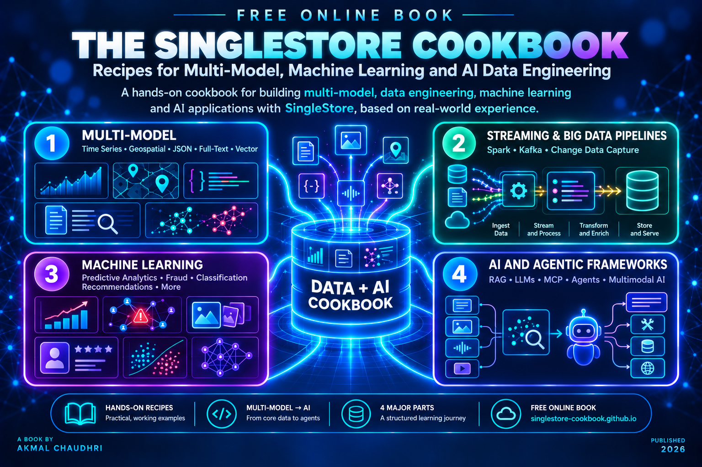
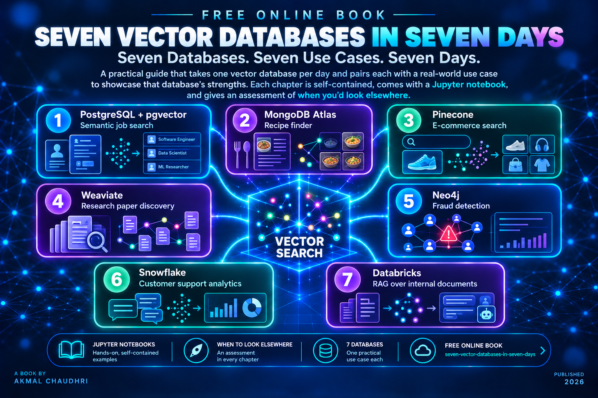
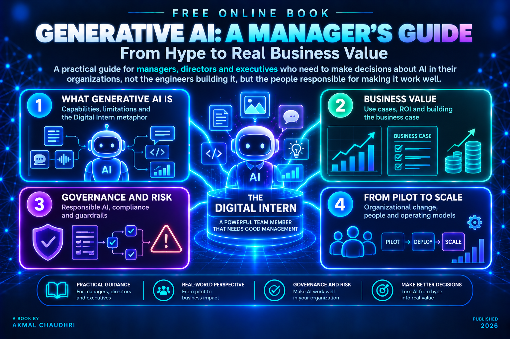
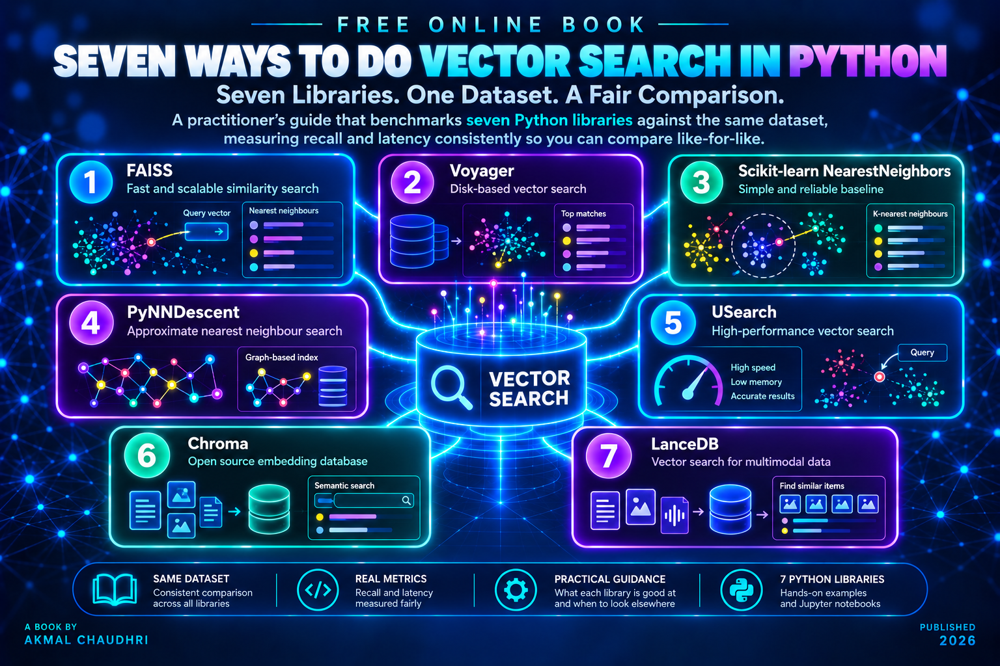
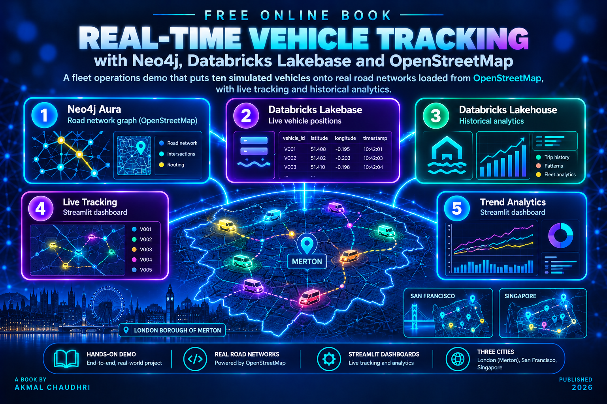
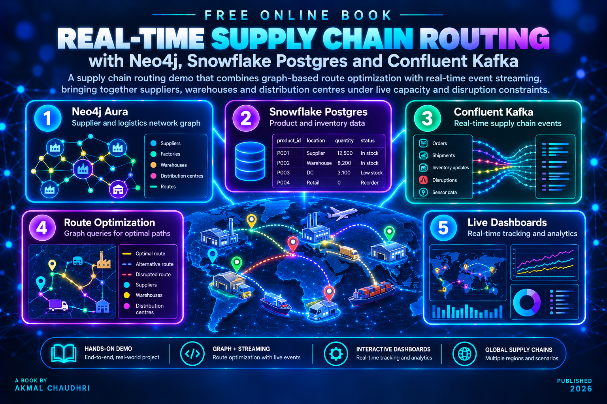
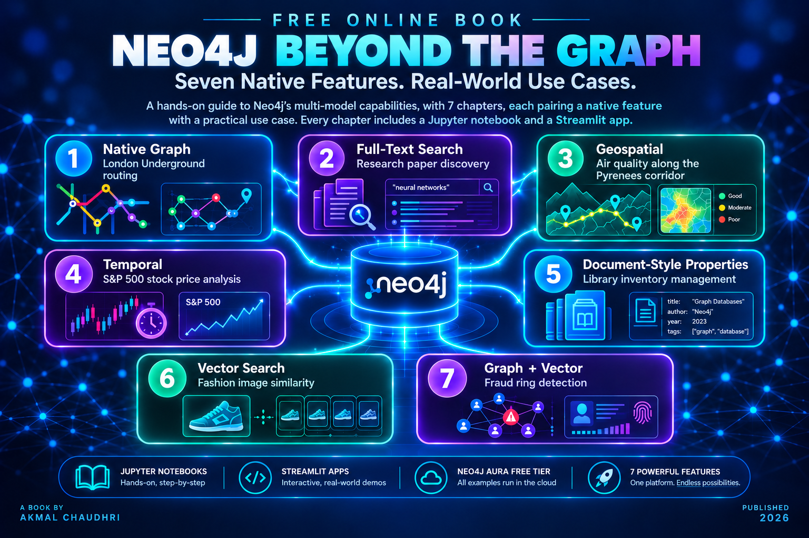
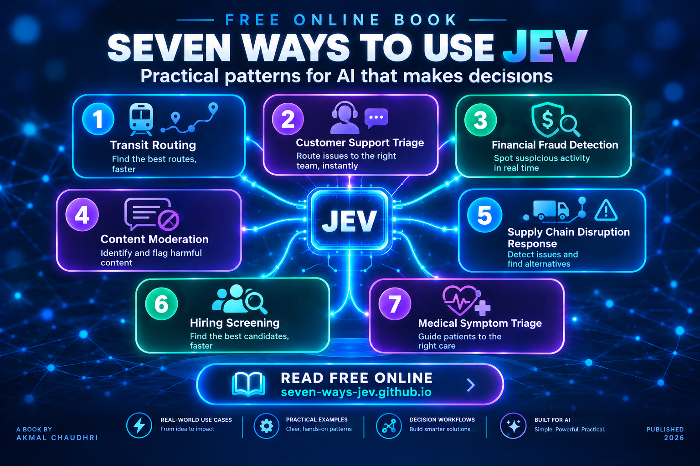

# Free Books

### The SingleStore Cookbook: Recipes for Multi-Model, Machine Learning and AI Data Engineering

[Read Online ↗](https://singlestore-cookbook.github.io)

A hands-on cookbook covering SingleStore's multi-model capabilities, from time series and geospatial data through vector search, machine learning pipelines and AI-powered applications. The recipes draw on first-hand experience building applications with the platform and are organized into four parts:

1. Multi-Model
2. Streaming and Big Data Pipelines
3. Machine Learning
4. AI and Agentic Frameworks

***

### Seven Vector Databases in Seven Days

[Read Online ↗](https://seven-vector-databases.github.io)

A practical guide that takes one vector database per day and pairs each with a use case chosen to showcase that database's strengths. Databases covered:

1. PostgreSQL and pgvector - Semantic job search
2. MongoDB Atlas - Recipe finder
3. Pinecone - E-commerce search
4. Weaviate - Research paper discovery
5. Neo4j - Fraud detection
6. Snowflake - Customer support analytics
7. Databricks - RAG over internal documents

Each chapter is self-contained, comes with a Jupyter notebook and gives an assessment of when you'd look elsewhere.

***

### Generative AI: A Manager's Guide

[Read Online ↗](https://gen-ai-managers-guide.github.io)

A practical guide for managers, directors and executives who need to make decisions about AI in their organizations, not the engineers building it, but the people responsible for making it work well. The book uses a single central metaphor, the Digital Intern, to frame what AI is genuinely good at, where it falls short and what managing it actually requires. It covers governance, risk, board-level accountability, business case building and the organizational change of moving from pilot to embedded capability.

***

### Seven Ways to Do Vector Search in Python

[Read Online ↗](https://seven-vector-search.github.io)

A practitioner's guide that benchmarks seven Python libraries against the same dataset, measuring recall and latency consistently so you can compare like-for-like. Libraries covered:

1. FAISS
2. Voyager
3. Scikit-learn NearestNeighbors
4. PyNNDescent
5. USearch
6. Chroma
7. LanceDB

Each chapter covers one library, explains what it's genuinely good at and when you'd reach for something else.

***

### Real-Time Vehicle Tracking with Neo4j, Databricks Lakebase and OpenStreetMap

[Read Online ↗](https://realtime-vehicle-tracking.github.io)

A fleet operations demo that puts ten simulated vehicles onto real road networks loaded from OpenStreetMap. The architecture:

- Neo4j Aura holds the road network graph
- Databricks Lakebase stores live vehicle positions
- Databricks Lakehouse handles historical analytics

Two Streamlit dashboards display live positions and trend data. The primary demo uses the London Borough of Merton, with additional configurations for San Francisco and Singapore.

***

### Real-Time Supply Chain Routing with Neo4j, Snowflake Postgres and Confluent Kafka

[Read Online ↗](https://realtime-supply-chain.github.io)

A supply chain routing demo that combines graph-based route optimization with real-time event streaming. The architecture:

- Neo4j Aura holds the supplier and logistics network graph
- Snowflake Postgres stores product and inventory data
- Confluent Kafka streams supply chain events in real time

Route queries traverse the graph to find optimal paths between suppliers, warehouses and distribution centres under live capacity and disruption constraints.

***

### Neo4j Beyond the Graph

[Read Online ↗](https://beyond-the-graph.github.io)

A hands-on guide to Neo4j's multi-model capabilities, going beyond graph traversal to explore seven native features of the platform. Each chapter pairs one capability with a use case chosen to showcase it:

1. Native Graph -- London Underground routing
2. Full-Text Search -- Research paper discovery
3. Geospatial -- Air quality along the Pyrenees corridor
4. Temporal -- S&P 500 stock price analysis
5. Document-Style Properties -- Library inventory management
6. Vector Search -- Fashion image similarity
7. Graph + Vector -- Fraud ring detection

Every chapter comes with a Jupyter notebook and a Streamlit application. All examples run on Neo4j Aura's free tier.

***

### Seven Ways to Use Jev

[Read Online ↗](https://seven-ways-jev.github.io)

A practical guide to TypeSafe AI's structured decision model, exploring seven domains where a single `Choice` call -- structured state in, typed decision out, calibrated confidence alongside -- replaces brittle rules-based logic. Each chapter pairs one domain with a hands-on Jupyter notebook and examines what the confidence score reveals about the decision:

1. Transit Routing -- Northern Line branch triage using a NetworkX graph
2. Customer Support Triage -- Ticket routing by team and priority
3. Financial Fraud Detection -- Flag or pass with a three-tier confidence response
4. Content Moderation -- Approve, flag or remove user-generated content
5. Supply Chain Disruption -- Alternative supplier selection under live constraints
6. Hiring Screening -- CV screening against a structured job description
7. Medical Symptom Triage -- Care pathway assignment with a conservative bias

A recurring theme across all seven chapters: the confidence score is more informative than the decision itself for uncertain cases and the threshold between automatic routing and human review is always a business decision, not a technical one.
