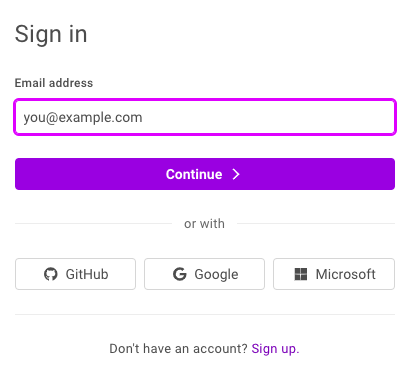
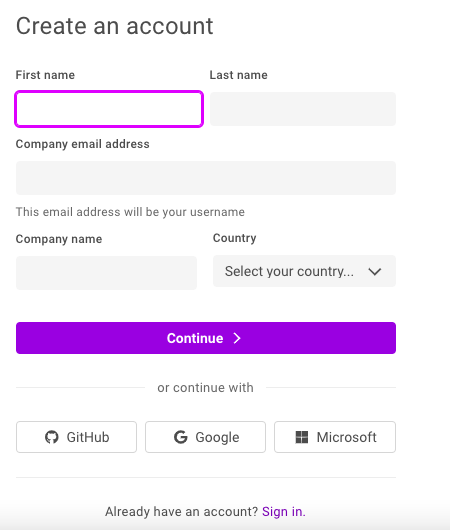
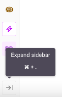
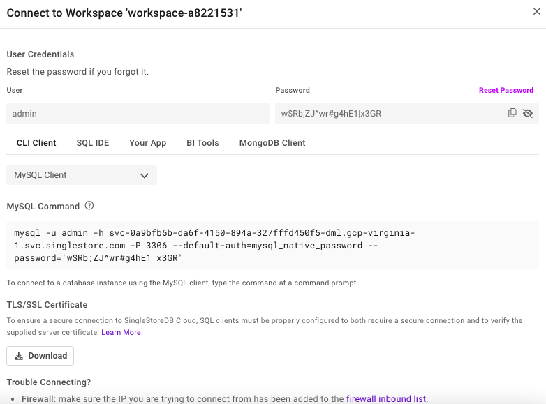
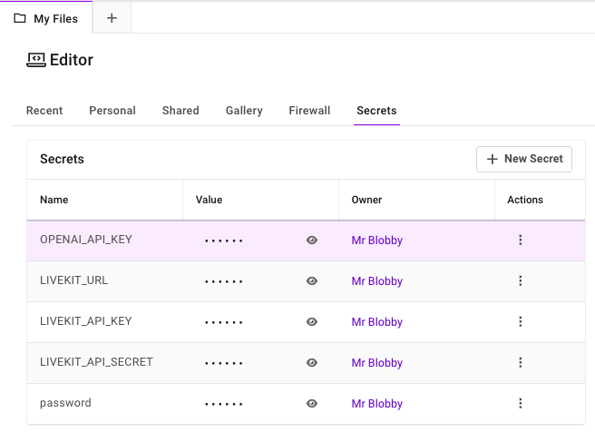

# Chapter 1: Getting Started with SingleStore

> **Note:** The code, instructions and screenshots in this book reflect the state of SingleStore and related tools and libraries as of July 2026. Cloud platforms and APIs change frequently, so if you encounter a discrepancy between what's described here and what you see in practice, check the relevant vendor's current documentation.

## Introduction

Over the last decade, the data infrastructure landscape has expanded into a patchwork of specialized systems, such as operational databases, analytical warehouses, time-series engines, document stores, vector databases, search engines and streaming platforms. Organizations increasingly find themselves stitching these systems together to support real-time applications, machine learning pipelines and AI agents. This architectural fragmentation introduces latency, complexity and operational cost.

SingleStore takes a fundamentally different approach. It provides a unified, distributed, cloud-native engine capable of handling transactional, analytical, time-series, vector and unstructured workloads within a single system. The value proposition is simple: instead of building and maintaining a variety of purpose-built data engines, SingleStore is designed to serve as the primary platform for modern, data-intensive applications.

## Evolution of the SingleStore Engine

### Rowstore for Low-Latency OLTP

SingleStore's earliest design goal was to support high-speed transactional workloads through an in-memory rowstore engine. This made it attractive for operational applications requiring sub-millisecond access patterns.

### Columnstore for Real-Time Analytics

As customers began developing hybrid workloads, SingleStore introduced a distributed columnstore engine designed for fast scans, aggregations and analytical queries. The key was not just performance, but the ability to run OLTP and OLAP on the same dataset without ETL.

### UDFs, Pipelines and Extensibility

To meet the needs of data engineering teams, SingleStore added User-Defined Functions (UDFs) and native pipelines that ingest data from Kafka or cloud storage directly into a database. This turned SingleStore into an ingestion engine as well as a query engine.

### Native JSON and Multi-Model Storage

Next, SingleStore introduced JSON data support. This allowed it to function as both a relational engine and a scalable document store, eliminating the need for MongoDB-like systems when semi-structured data was required.

### Vectors, Similarity Search and AI Workloads

With the rise of Large Language Models (LLMs) and embedding-based retrieval, SingleStore integrated native vector types, vector indexes and optimized similarity search. Unlike standalone vector databases, these features run alongside SQL, JSON, time-series and full-text search. The result is a truly multi-model architecture built for AI agents, Retrieval-Augmented Generation (RAG) systems and real-time decision systems.

## How SingleStore Differs from Other Database Systems

### Versus Other Relational Databases

Many Relational Systems today provide extensible general-purpose database capabilities but struggle with distributed workloads, columnstore analytics, high-volume ingestion and real-time vector search. SingleStore offers these capabilities natively and at scale.

### Versus Other Columnstores

Many Columnstores offer exceptional analytical performance but limited support for transactions, JSON operations, machine learning pipelines or AI/LLM workflows. SingleStore extends beyond analytics into full multi-model and operational workloads.

### Versus Data Warehouses

Data Warehouses excel at analytical processing but are not designed for operational workloads, low-latency queries, streaming ingestion, real-time pipelines or high-frequency vector search. SingleStore handles both operational and analytical workloads concurrently.

### Versus Document Databases

Document Stores provide flexibility for document data but lack strong SQL, large-scale analytics and a unified architecture for mixed workloads. SingleStore provides both document and relational capabilities in a single engine.

### Versus Standalone Vector Databases

These systems excel at similarity search but require external orchestration for SQL, metadata joins, time filtering or real-time pipelines. SingleStore co-locates vector search with structured data, enabling RAG, agents and multimodal retrieval without external systems.

## Multi-Model Architecture Without External Stitching

Where most architectures require three to eight systems to support the full lifecycle of an AI or data-driven application such as an RDBMS, analytics warehouse, caching layer, streaming engine, vector database, document store and full-text search, SingleStore integrates all of these capabilities into a distributed SQL engine.

This eliminates:

- ETL pipelines between engines.

- Inconsistent data representations.

- Operational overhead from managing multiple services.

- Latency introduced by cross-system communication.

SingleStore is architected from the ground up to support multiple data models with shared durability, storage and execution layers.

## Combining Real-Time Vector Search, SQL and Pipelines

SingleStore's unified feature set allows teams to build applications such as:

- Real-time recommendation engines.

- Hybrid search (keywords + vectors + metadata filters).

- Multi-agent systems requiring shared context.

- High-throughput time-series + AI inference pipelines.

- Operational ML and analytics in the same engine.

Pipeline ingestion brings data into the database continuously, vectors can be computed or refreshed in place and SQL queries can join operational data with embeddings, sentiment scores or time-series data.

For practitioners building modern AI-driven systems combining streaming ETL, multimodal retrieval, agentic workflows or real-time analytics, SingleStore simplifies the architecture and accelerates development.

## Prerequisites and Environment Setup

To ensure readers can run all examples in the book without friction, this section outlines the required tools, environments and configurations used. While many recipes can be run independently, having a consistent baseline environment significantly improves reproducibility.

### SingleStore Installation Options

SingleStore can be deployed in several different ways. For example:

- SingleStore Cloud

- Docker

- Native Linux installation

In this book, the recommended approach for readers is to use SingleStore Cloud. This provides a fully managed cluster with no local installation requirements. This is the simplest path for users who want to execute SQL, vector queries, pipelines and integrations quickly.

A notebook environment is also built into the SingleStore Cloud Portal and we'll use this environment to run the vast majority of code examples in this book. The GitHub repo for this book, [singlestore-cookbook.github.io](https://singlestore-cookbook.github.io), contains all the notebooks and support files.

### Create a Free SingleStore Cloud Account

We'll start by navigating to the SingleStore Cloud Portal:

```text
https://portal.singlestore.com/
```

This will show a web page requesting sign in, similar to Figure 1-1.



*Figure 1-1 Sign In.*

At the bottom of Figure 1-1, we can see the text "Don't have an account? Sign up."

Clicking on "Sign up" takes us to another web page, similar to Figure 1-2, where we can create a new account using an email address, GitHub, Google or Microsoft.



*Figure 1-2 Create an account.*

If using an email address, we'll be asked to create a password. A verification code will then be sent to the email address which we'll need to enter on another web page.

Once logged into the SingleStore Portal, we'll be asked for the type of workload we require. Choosing **Personal** will be fine.

On the next page, we'll be asked to select the top two data challenges we want to solve with SingleStore. From the options shown, we'll choose **New Application** and **Better System for AI/LLMs/Agents**.

On the next page, we'll be asked to describe our goals for using SingleStore. From the options shown, we'll select **Other** and enter **The SingleStore Cookbook** into the text box.

Finally, we'll be shown two options to either **Create Shared Workspace** or **Create Standard Workspace**. The **Standard Workspace** option provides a free trial worth US\$600 of credits and would be perfect for using with this book. No credit card is required.

Clicking **Create Standard Workspace** takes us to a **Create New Workspace** page. Here are the options we'll use:

- **Name:** Keep the system-generated workspace name.

- **Project:** Select **Standard Project** from the pull-down menu.

- **Group:** Leave unchanged.

- **Group Name:** Keep the system-generated group name.

- **Cloud Provider:** Select GCP.

- **Region:** US East 4 (N. Virginia).

- **Size:** S-00.

- **Settings:** Enable **Mongo Compatible Endpoint API**. Leave all other settings unchanged.

- **Advanced Settings:** Leave all settings unchanged.

- Click **Create Workspace** in the bottom right.

Workspace deployment may take several minutes.

In the SingleStore Portal, on the extreme left-hand side will be a sidebar (navigation pane) with a series of icons. It's helpful to see not just the icons, but the text equivalent. This can be enabled by clicking on the icon at the very bottom left. Hovering over it produces the text "Expand sidebar", as shown in Figure 1-3.



*Figure 1-3 Expand sidebar.*

Clicking on the icon will expand the sidebar.

### Connection Details

Once the sidebar has expanded, we'll select **Workspaces** and this will show us the workspace we previously provisioned. From the workspace, we'll select **Connect \> CLI Client**.

This will show the credentials and connection string, as shown in the example in Figure 1-4.



*Figure 1-4 Connect to Workspace.*

Looking at the MySQL Command in Figure 1-4, we see the following:

```text
mysql -u admin -h svc-0a9bfb5b-da6f-4150-894a-327fffd450f5-dml.gcp-virginia-1.svc.singlestore.com -P 3306 --default-auth=mysql_native_password --password='w$Rb;ZJ^wr#g4hE1|x3GR'
```

This shows us the **user**, **host**, **port** and **password**. Your values will be different from this example. Make a note of these details from your environment and keep them in a safe place.

### Secrets

Next from the sidebar, we'll select **Editor \> My Files \> Secrets** and add some secrets that we need in the book, as shown in Figure 1-5.



*Figure 1-5. Secrets.*

Several examples in this book will use **OpenAI**. We'll use very cost-effective OpenAI models and since our examples are small-scale, the overall cost will be quite small. We'll use the free **LiveKit** tier for our Audio example in the multimodal chapter and we'll see how to obtain the values shown in Figure 1-5 in that chapter. The **password** variable contains our password that we previously saved from Figure 1-4.

> **Note:** If you terminate a workspace and create a new one, ensure that you update the saved password in the secrets vault.

### Firewall

Next from the sidebar, we'll select **Editor \> My Files \> Firewall** and add the following domains to the existing list and save the new list.

```text
*.*.aws.confluent.cloud
*.eu-west-2.aws.confluent.cloud
*.host.livekit.cloud
*.livekit.cloud
*.turn.livekit.cloud
a.basemaps.cartocdn.com
api.openml.org
cas-server.xethub.hf.co
cloud.r-project.org
en.wikipedia.org
repo1.maven.org
repos.spark-packages.org
transfer.xethub.hf.co
us.aws.cdn.hf.co
www.ipcc.ch
```

Normally, the notebook environment will prompt if it needs access to an external site. The Kafka example in a later chapter is created using the free tier on the Confluent Cloud and the AWS address shown in the above list may be different, so adjust as required.

### Provision Compute

Just above the notebook menu bar (**Edit**, **View**, **Run**, **Kernel**) select **Small \> Start Session** if no compute resources have been provisioned. Once this is done, a pulldown will appear where the workspace and database (if available) can be selected.

### Notebooks and SQL Scripts

The notebooks and SQL scripts used in this book can be uploaded using **Editor \> My Files \> New \> Import From File**. Use the file browser to locate the file to upload. Once uploaded, ensure that you connect to the workspace from the pull-down just above the notebook or SQL file.

### Troubleshooting Common Errors

- **JWT token expired**. Run `db_connection = create_engine(connection_url)` in your notebook to refresh.

- **Incorrect password**. Ensure that you saved your password to the **Secrets Vault**, particularly if you terminated a workspace and created a new one.

- **Firewall issues**. Usually the firewall will prompt to add a new domain but, sometimes, you may have missed the prompt. Whilst the list shown above for the firewall is comprehensive, domains can change.

- **Python packages**. The environment for running notebooks in SingleStore Cloud may update and this may cause some packages in notebooks to stop working. Most packages in notebooks have been pinned but updates in the cloud environment could introduce incompatibilities. Please report any issues through GitHub.

With our environment set up, we're ready to start exploring SingleStore.

## What's Ahead

This book is organized into four parts, each building on the foundation we introduced in this chapter.

**Part 1: Multi-Model** covers the different data types SingleStore supports natively, including time series data, geospatial data, JSON data, full-text index and search and vector data.

**Part 2: Streaming and Big Data Pipelines** looks at how SingleStore integrates with Apache Spark and Apache Kafka and how change data capture can be used to keep data continuously in sync.

**Part 3: Machine Learning** works through a series of hands-on projects, including predictive analytics for loan approvals, fraud detection, image classification, a movie recommender system, agriculture analytics using R, crime analytics with SingleStore Kai, sentiment analysis running inside the database with WebAssembly and building a feature store with Feast.

**Part 4: AI and Agentic Frameworks** brings everything together, covering LangChain, LlamaIndex workflows, multimodal RAG across text, images and audio, running local LLMs with Ollama, using MCP for real-time data access and agentic patterns with SingleStore.

We'll close with some concluding thoughts on where multi-model, unified data platforms are headed.

## Summary

In this chapter, we introduced SingleStore as a unified, distributed engine capable of handling transactional, analytical, time-series, vector and unstructured workloads within a single system, tracing its evolution from an in-memory rowstore through columnstore analytics, pipelines, JSON support and native vector search. We compared SingleStore against relational databases, columnstores, data warehouses, document databases and standalone vector databases to highlight where a unified multi-model architecture removes the need for stitching together multiple specialized systems.

We then set up the environment we'll use throughout the book: creating a free SingleStore Cloud account, provisioning a Standard Workspace, saving our connection credentials, configuring secrets for OpenAI and LiveKit and updating the firewall to allow the external domains our examples will need. We covered how to upload notebooks and SQL scripts and reviewed some common errors readers might hit along the way, along with how to resolve them.

We're now set to start building and the next chapter moves into our first hands-on SingleStore examples, beginning with time series data.