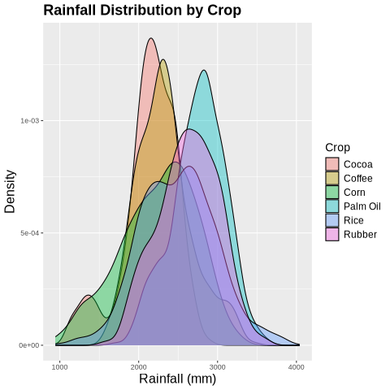
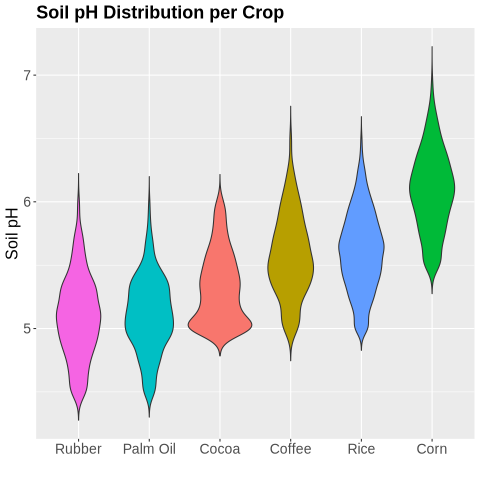
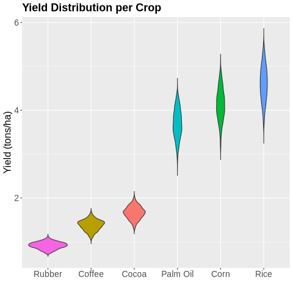
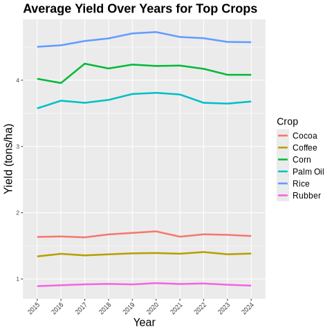
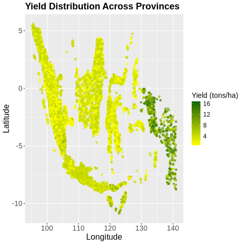
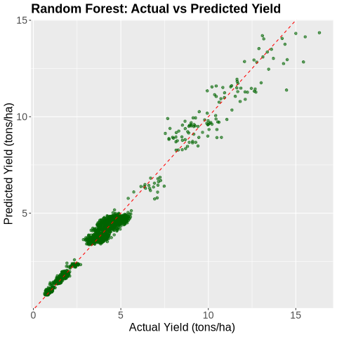
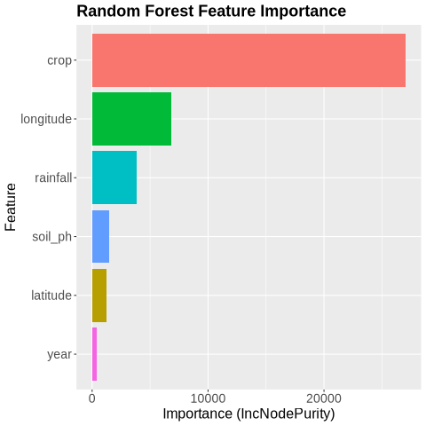
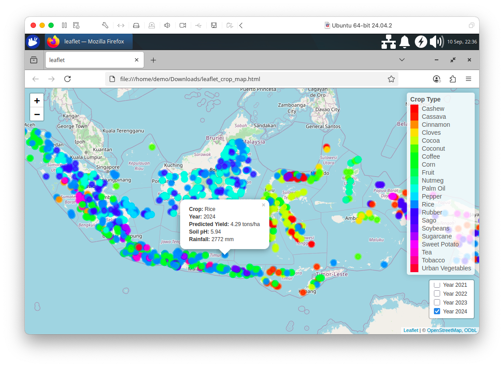

# Chapter 14: Agriculture Analytics Using R

## Introduction

Agriculture today is increasingly data-driven. From monitoring rainfall and soil quality to forecasting crop yields, the ability to analyze large, diverse datasets is central to improving productivity and ensuring food security. Modern farms and research institutions generate data at scale, such as sensor readings, weather records and yield observations. These require powerful tools to store, query and analyze efficiently.

R has long been a popular language for statistical computing and visualization, making it a natural choice for agricultural analytics. Its rich ecosystem of packages allows analysts to explore data, build predictive models and present results in an accessible way.

SingleStore complements R by providing a high-performance, distributed SQL database capable of handling large datasets and real-time analytics. By combining R and SingleStore, we can create a workflow where agricultural data are stored and queried efficiently in SingleStore, while advanced statistical analysis and visualization are performed in R.

In this chapter, we'll walk through a practical example of applying R for agriculture analytics with SingleStore. We'll begin by setting up the environment, then move on to querying agricultural data, performing statistical analysis and building visualizations that highlight meaningful insights.

For this chapter, we'll use a synthetic agricultural dataset that has been generated to resemble real-world farming data, modeled on Indonesia. Indonesia is one of the world's largest agricultural producers, with a diverse range of crops such as rice, maize and palm oil grown across its many islands. The dataset includes information such as major crop types, yield per hectare and rainfall levels. By basing our synthetic dataset on this context, we capture the complexity of working with multiple crops and varying environmental conditions, while keeping the data lightweight, reproducible and free from concerns around availability, privacy or licensing.

## Create the Database

In the SingleStore Portal, let's use the **SQL Editor** to create a new database. Call this `agriculture_db`, as follows:

```sql
CREATE DATABASE IF NOT EXISTS agriculture_db;
```

## Fill out the Notebook

We'll need to install R. We'll do this using Conda, as follows:

```shell
!conda install --quiet -c conda-forge \
    r-base \
    r-essentials \
    r-rjava \
    r-rjdbc \
    r-leaflet \
    rpy2 \
    -y
```

Using `rpy2`, we'll be to enable the `%%R` cell magic in Jupyter, allowing us to run R code directly in notebook cells alongside Python.

First, we'll read the dataset:

```r
agri_csv_url <- ...

agri_df <- read.csv(agri_csv_url, stringsAsFactors = FALSE)
kable(head(agri_df, 10))
```

Example output:

```text
|province           | latitude| longitude| rainfall| soil_ph|crop     | yield| year|
|:------------------|--------:|---------:|--------:|-------:|:--------|-----:|----:|
|West Kalimantan    |   0.7313|  112.3939|     3284|    5.05|Palm Oil |  3.55| 2023|
|Riau Islands       |  -0.1721|  104.6600|     2549|    6.51|Coconut  |  3.61| 2024|
|Southeast Sulawesi |  -3.7564|  122.4373|     2033|    5.33|Rice     |  4.88| 2022|
|Bali               |  -8.2479|  114.5624|     2412|    5.92|Coffee   |  1.20| 2021|
|East Nusa Tenggara |  -8.4012|  123.4993|     1226|    5.51|Rice     |  4.36| 2023|
|North Maluku       |   0.9559|  128.0133|     2707|    6.31|Coconut  |  3.86| 2016|
|North Sulawesi     |   1.5828|  124.9783|     2548|    5.73|Coconut  |  4.11| 2019|
|Aceh               |   4.5620|   96.3068|     2135|    5.73|Corn     |  3.35| 2022|
|Central Sulawesi   |  -1.4216|  120.4337|     2197|    5.74|Rice     |  4.59| 2017|
|Central Kalimantan |  -2.8499|  114.2137|     2798|    4.65|Rubber   |  0.79| 2024|
```

In the next step, we'll clean and prepare the dataset for analysis. The `year` column is first converted to an integer and then to an ordered factor, ensuring that visualizations display the years in ascending order rather than alphabetically. The `crop` column is converted to a factor so that crop names are treated as categorical values. Finally, we'll filter the dataset to focus on six major crops, creating a smaller dataset that is ready for plotting.

```r
agri_df$year <- as.integer(agri_df$year)

agri_df$year <- factor(agri_df$year, levels = sort(unique(agri_df$year)))

agri_df$crop <- as.factor(agri_df$crop)

major_crops <- c("Rice", "Corn", "Coffee", "Palm Oil", "Rubber", "Cocoa")
plot_df <- agri_df %>% filter(crop %in% major_crops)
```

Next, let's creates a density plot showing the distribution of rainfall for each major crop in the dataset.

```r
ggplot(plot_df, aes(x = rainfall, fill = crop)) +
    geom_density(alpha = 0.4) +
    theme(
        axis.title = element_text(size = 16),
        plot.title = element_text(size = 18, face = "bold"),
        legend.title = element_text(size = 14),
        legend.text = element_text(size = 12)
    ) +
    labs(
        title = "Rainfall Distribution by Crop",
        x = "Rainfall (mm)",
        y = "Density",
        fill = "Crop"
    )
```

Example output is shown in Figure 14-1.



*Figure 14-1. Rainfall by Crop.*

In the density plot, the y-axis represents the probability density of rainfall values. Taller parts of the curve indicate rainfall levels that are more common for a given crop, while the area under each curve sums to one, allowing easy comparison between crops.

Next, let's creates a violin plot showing the distribution of soil pH for each major crop.

```r
ggplot(plot_df, aes(x = reorder(crop, soil_ph, FUN = median), y = soil_ph, fill = crop)) +
    geom_violin(trim = FALSE, show.legend = FALSE) +
    theme(
        axis.title = element_text(size = 16),
        axis.text.y = element_text(size = 14),
        axis.text.x = element_text(size = 14),
        plot.title = element_text(size = 18, face = "bold")
    ) +
    labs(
        title = "Soil pH Distribution per Crop",
        x = "",
        y = "Soil pH"
    )
```

Example output is shown in Figure 14-2.



*Figure 14-2. Soil pH per Crop.*

Now, let's look at yield per crop.

```r
ggplot(plot_df, aes(x = reorder(crop, yield, FUN = median), y = yield, fill = crop)) +
    geom_violin(trim = FALSE, show.legend = FALSE) +
    theme(
        axis.title = element_text(size = 16),
        axis.text.y = element_text(size = 14),
        axis.text.x = element_text(size = 14),
        plot.title = element_text(size = 18, face = "bold")
    ) +
    labs(
        title = "Yield Distribution per Crop",
        x = "",
        y = "Yield (tons/ha)"
    )
```

Example output is shown in Figure 14-3.



*Figure 14-3. Yield per Crop.*

Next, let's look at the average yield for top crops.

```r
ggplot(plot_df, aes(x = year, y = yield, color = crop, group = crop)) +
    stat_summary(fun = mean, geom = "line", linewidth = 1.2) +
    theme(
        axis.text.x = element_text(angle = 45, hjust = 1),
        axis.title = element_text(size = 16),
        plot.title = element_text(size = 18, face = "bold"),
        legend.text = element_text(size = 12),
        legend.title = element_text(size = 14)
    ) +
    labs(
        title = "Average Yield Over Years for Top Crops",
        x = "Year",
        y = "Yield (tons/ha)",
        color = "Crop"
    )
```

Example output shown in Figure 14-4.



*Figure 14-4. Average Yield.*

Finally, let's look at yield across provinces.

```r
ggplot(agri_df, aes(x = longitude, y = latitude, color = yield)) +
    geom_point(alpha = 0.7) +
    scale_color_gradient(low = "yellow", high = "darkgreen") +
    theme(
        axis.text = element_text(size = 14),
        axis.title = element_text(size = 16),
        plot.title = element_text(size = 18, face = "bold"),
        legend.text = element_text(size = 12),
        legend.title = element_text(size = 14)
    ) +
    labs(title = "Yield Distribution Across Provinces",
        x = "Longitude",
        y = "Latitude",
        color = "Yield (tons/ha)"
    )
```

Example output is shown in Figure 14-5.



*Figure 14-5. Yields across Provinces.*

Next, let create a machine learning model. First, we'll create the train/test split:

```r
set.seed(42)

train_index <- sample(seq_len(nrow(agri_df)), size = 0.8 * nrow(agri_df))
train <- agri_df[train_index, ]
test <- agri_df[-train_index, ]
```

and then we'll use Random Forest because it is a robust, flexible machine learning algorithm for both classification and regression. It combines many decision trees to improve predictive accuracy, reduce overfitting and handle complex, non-linear relationships in the data, such as the interactions between crop yields, rainfall and soil properties.

```r
rf_model <- randomForest(
    yield ~ latitude + longitude + rainfall + soil_ph + crop + year,
    data = train,
    ntree = 250
)

print(rf_model)
```

The output shows that the model produces accurate predictions on the training data.

```text
Call:
 randomForest(formula = yield ~ latitude + longitude + rainfall + soil_ph + crop + year, data = train, ntree = 250) 
               Type of random forest: regression
                     Number of trees: 250
No. of variables tried at each split: 2

          Mean of squared residuals: 0.1213262
                    % Var explained: 97.87
```

Now, we'll predict and evaluate:

```r
pred <- predict(rf_model, newdata = test)

correlation <- cor(pred, test$yield)
cat("Correlation between predicted and actual yield:", round(correlation, 3), "\n")

rmse <- sqrt(mean((pred - test$yield)^2))
cat("Root Mean Squared Error (RMSE):", round(rmse, 3), "\n")

mae <- mean(abs(pred - test$yield))
cat("Mean Absolute Error (MAE):", round(mae, 3), "\n")
```

Example output:

```text
Correlation between predicted and actual yield: 0.989 
Root Mean Squared Error (RMSE): 0.358 
Mean Absolute Error (MAE): 0.245
```

These metrics show that the Random Forest model predicts crop yields very accurately. The predicted and actual yields are highly correlated and the low RMSE and MAE indicate that the predictions are close to the true values on average.

We can visualize actual versus predicted:

```r
ggplot(data.frame(actual = test$yield, predicted = pred), aes(x = actual, y = predicted)) +
    geom_point(alpha = 0.6, color = "darkgreen") +
    geom_abline(slope = 1, intercept = 0, linetype = "dashed", color = "red") +
    theme(
        axis.text = element_text(size = 14),
        axis.title = element_text(size = 16),
        plot.title = element_text(size = 18, face = "bold")
    ) +
    labs(
        title = "Random Forest: Actual vs Predicted Yield",
        x = "Actual Yield (tons/ha)",
        y = "Predicted Yield (tons/ha)"
    )
```

Example output is shown in Figure 14-6.



*Figure 14-6. Actual vs. Predicted.*

Let's look feature importance.

```r
importance_df <- as.data.frame(importance(rf_model))
importance_df$feature <- rownames(importance_df)
importance_df <- importance_df %>% arrange(desc(IncNodePurity))

ggplot(importance_df, aes(x = reorder(feature, IncNodePurity), y = IncNodePurity, fill = feature)) +
    geom_col(show.legend = FALSE) +
    coord_flip() +
    theme(
        axis.text = element_text(size = 14),
        axis.title = element_text(size = 16),
        plot.title = element_text(size = 18, face = "bold")
    ) +
    labs(
        title = "Random Forest Feature Importance",
        x = "Feature",
        y = "Importance (IncNodePurity)"
    )
```

Example output in is shown in Figure 14-7.



*Figure 14-7. Feature Importance.*

The plot shows the feature importance from the Random Forest model, measured by the increase in node purity (`IncNodePurity`). This measures how much a feature improves the homogeneity of the data when used to split nodes in the Random Forest trees. Higher values indicate that the feature contributes more to reducing prediction error, making it more important for the model's decisions. It reveals that crop type is by far the most important predictor of yield, followed by longitude and rainfall, indicating that both location and crop choice strongly influence yield outcomes.

We'll now predict on the full dataset.

```r
agri_df$predicted_yield <- predict(rf_model, newdata = agri_df)
```

and then create a leaflet map:

```r
agri_df <- agri_df %>%
    mutate(
        year = as.integer(as.character(year)),
        predicted_yield = as.numeric(predicted_yield)
    )

pal <- colorFactor(rainbow(length(unique(agri_df$crop))), domain = agri_df$crop)

m <- leaflet() %>% addTiles()

for (yr in sort(unique(agri_df$year))) {
    year_data <- filter(agri_df, year == yr)

    m <- m %>%
        addCircleMarkers(
            data = year_data,
            lng = ~longitude,
            lat = ~latitude,
            radius = 6,
            color = ~pal(crop),
            stroke = TRUE, fillOpacity = 0.9,
            popup = ~paste0(
                "<b>Crop:</b> ", crop, "<br/>",
                "<b>Year:</b> ", year, "<br/>",
                "<b>Predicted Yield:</b> ", round(predicted_yield, 2), " tons/ha<br/>",
                "<b>Soil pH:</b> ", round(soil_ph, 2), "<br/>",
                "<b>Rainfall:</b> ", rainfall, " mm"
            ),
            group = paste0("Year ", yr)
        )
}

m <- m %>%
    addLegend(
        pal = pal,
        values = agri_df$crop,
        title = "Crop Type",
        opacity = 1
    ) %>%
    addLayersControl(
        overlayGroups = paste0("Year ", sort(unique(agri_df$year))),
        options = layersControlOptions(collapsed = FALSE)
    )

crop_map <- "crop_map.html"
saveWidget(m, crop_map, selfcontained = TRUE)
```

The map is saved locally and we'll download it.

```python
crop_map = str(r["crop_map"][0])
mime_type, _ = mimetypes.guess_type(crop_map)

with open(crop_map, "rb") as f:
    data = f.read()
b64 = base64.b64encode(data).decode()
href = f'<a download="{crop_map}" href="data:{mime_type};base64,{b64}">Download {crop_map}</a>'
HTML(href)
```

Example output shown in Figure 14-8.



*Figure 14-8. Leaflet Map.*

We'll now save the DataFrame to SingleStore. First, we'll create a function to set up the JDBC driver and then a function to create the connection from R:

```r
setup_driver <- function() {
    driver_url <- "https://repo1.maven.org/maven2/com/singlestore/singlestore-jdbc-client/..."

    driver <- "com.singlestore.jdbc.Driver"

    local_dir <- "jars"
    dir.create(local_dir, showWarnings = FALSE, recursive = TRUE)

    driver_file <- file.path(local_dir, basename(driver_url))

    if (!file.exists(driver_file)) {
        download.file(driver_url, destfile = driver_file, mode = "wb", quiet = TRUE)
    }

    JDBC(driver, driver_file)
}

connect_db <- function(drv, host, port, database, user, password) {
    url <- paste0("jdbc:singlestore://", host, ":", port, "/", database)

    dbConnect(drv, url = url, user = user, password = password)
}
```

From Python, we'll create a connection to SingleStore, pick up environment variables and pass them to R:

```python
from sqlalchemy import *

db_connection = create_engine(connection_url)
url = db_connection.url

r.assign("host", url.host);
r.assign("port", int(url.port));
r.assign("database", url.database);
r.assign("user", "admin")
r.assign("password", get_secret("password"));
```

The value for password would be saved in Secrets after creating the workspace.

Now we'll use the two functions defined earlier and connect to SingleStore from R:

```r
drv <- setup_driver()
conn <- connect_db(drv, host, port, database, user, password)
```

and then write the DataFrame:

```r
dbWriteTable(conn, "agriculture", agri_df, overwrite = TRUE)
```

## Example Queries

Let's now run some SQL queries against the database.

First, let's find the overall yearly trends for average rainfall, soil pH, yield and predicted yield.

```sql
SELECT
    year,
    ROUND(AVG(rainfall), 2) AS avg_rainfall,
    ROUND(AVG(soil_ph), 2) AS avg_soil_ph,
    ROUND(AVG(yield), 2) AS avg_yield,
    ROUND(AVG(predicted_yield), 2) AS avg_predicted_yield
FROM agriculture
GROUP BY year
ORDER BY year;
```

Example output:

```text
+------+--------------+-------------+-----------+---------------------+
| year | avg_rainfall | avg_soil_ph | avg_yield | avg_predicted_yield |
+------+--------------+-------------+-----------+---------------------+
| 2015 |      2492.91 |        5.76 |      3.60 |                3.62 |
| 2016 |      2499.49 |        5.70 |      3.75 |                3.76 |
| 2017 |      2510.15 |        5.65 |      3.73 |                3.73 |
| 2018 |      2517.51 |        5.61 |      3.81 |                3.82 |
| 2019 |      2504.06 |        5.60 |      3.72 |                3.71 |
| 2020 |      2468.87 |        5.55 |      3.77 |                3.75 |
| 2021 |      2503.32 |        5.51 |      3.66 |                3.64 |
| 2022 |      2485.90 |        5.51 |      3.62 |                3.61 |
| 2023 |      2462.01 |        5.47 |      3.66 |                3.66 |
| 2024 |      2467.32 |        5.43 |      3.61 |                3.61 |
+------+--------------+-------------+-----------+---------------------+
```

We can see that average rainfall fluctuated slightly over while soil pH gradually decreased. Actual yields were very close to predicted yields, showing the model predicts well at a yearly aggregate level.

Next, let's look at the top crop per year.

```sql
SELECT
    year,
    crop,
    ROUND(avg_yield, 2) AS avg_yield,
    ROUND(avg_predicted_yield, 2) AS avg_predicted_yield,
    ROUND(yield_diff, 2) AS yield_diff
FROM (
    SELECT
        year,
        crop,
        AVG(yield) AS avg_yield,
        AVG(predicted_yield) AS avg_predicted_yield,
        AVG(predicted_yield) - AVG(yield) AS yield_diff,
        ROW_NUMBER() OVER (PARTITION BY year ORDER BY AVG(yield) DESC) AS rn
    FROM agriculture
    GROUP BY year, crop
) ranked
WHERE rn = 1
ORDER BY year;
```

Example output:

```text
+------+--------------+-----------+---------------------+------------+
| year | crop         | avg_yield | avg_predicted_yield | yield_diff |
+------+--------------+-----------+---------------------+------------+
| 2015 | Sweet Potato |     13.48 |               13.57 |       0.09 |
| 2016 | Sweet Potato |     13.39 |               13.31 |      -0.08 |
| 2017 | Sweet Potato |     13.56 |               13.27 |      -0.29 |
| 2018 | Sweet Potato |     14.55 |               14.03 |      -0.53 |
| 2019 | Sweet Potato |     14.22 |               13.84 |      -0.38 |
| 2020 | Sweet Potato |     14.11 |               13.72 |      -0.40 |
| 2021 | Sweet Potato |     14.08 |               13.50 |      -0.58 |
| 2022 | Sweet Potato |     13.63 |               13.06 |      -0.57 |
| 2023 | Sweet Potato |     14.55 |               14.07 |      -0.48 |
| 2024 | Sweet Potato |     14.08 |               13.83 |      -0.25 |
+------+--------------+-----------+---------------------+------------+
```

Sweet Potato consistently had the highest yield each year, with actual yields slightly above or below predicted values, indicating minor deviations between observed and predicted production.

Now, let's look at the top crop per province.

```sql
SELECT
    province,
    crop,
    ROUND(avg_yield, 2) AS avg_yield,
    ROUND(avg_predicted_yield, 2) AS avg_predicted_yield,
    ROUND(avg_rainfall, 2) AS avg_rainfall,
    ROUND(avg_soil_ph, 2) AS avg_soil_ph
FROM (
    SELECT
        province,
        crop,
        AVG(yield) AS avg_yield,
        AVG(predicted_yield) AS avg_predicted_yield,
        AVG(rainfall) AS avg_rainfall,
        AVG(soil_ph) AS avg_soil_ph,
        ROW_NUMBER() OVER (PARTITION BY province ORDER BY AVG(yield) DESC) AS rn
    FROM agriculture
    GROUP BY province, crop
) ranked
WHERE rn = 1
ORDER BY province;
```

Example output:

```text
+--------------------------------+------------------+-----------+---------------------+--------------+-------------+
| province                       | crop             | avg_yield | avg_predicted_yield | avg_rainfall | avg_soil_ph |
+--------------------------------+------------------+-----------+---------------------+--------------+-------------+
| Aceh                           | Rice             |      4.61 |                4.60 |      2509.73 |        5.53 |
| Bali                           | Rice             |      4.67 |                4.65 |      2095.34 |        5.73 |
| Bangka-Belitung Islands        | Rice             |      4.65 |                4.63 |      2075.95 |        5.58 |
| Banten                         | Rice             |      4.68 |                4.65 |      1997.59 |        5.53 |
| Bengkulu                       | Rice             |      4.54 |                4.55 |      2285.11 |        5.56 |
| Central Java                   | Sugarcane        |      6.76 |                6.57 |      2826.32 |        6.42 |
| Central Kalimantan             | Rice             |      4.61 |                4.64 |      2996.27 |        5.66 |
| Central Sulawesi               | Rice             |      4.52 |                4.51 |      2366.23 |        5.53 |
| East Java                      | Rice             |      4.60 |                4.58 |      2492.16 |        5.70 |
| East Kalimantan                | Rice             |      4.60 |                4.60 |      2819.53 |        5.67 |
| East Nusa Tenggara             | Cassava          |      9.05 |                8.93 |      1330.59 |        5.30 |
| Gorontalo                      | Rice             |      4.63 |                4.62 |      2310.28 |        5.55 |
| Jakarta Special Capital Region | Urban Vegetables |      4.56 |                4.55 |      1787.23 |        6.36 |
| Jambi                          | Rice             |      4.60 |                4.58 |      2379.79 |        5.48 |
| Lampung                        | Sugarcane        |      6.45 |                6.35 |      1994.26 |        6.32 |
| Maluku                         | Rice             |      4.55 |                4.50 |      3013.06 |        5.50 |
| North Kalimantan               | Rice             |      4.67 |                4.64 |      2651.99 |        5.67 |
| North Maluku                   | Rice             |      4.47 |                4.44 |      2881.55 |        5.60 |
| North Sulawesi                 | Rice             |      4.64 |                4.62 |      2543.71 |        5.55 |
| North Sumatra                  | Rice             |      4.61 |                4.58 |      2777.51 |        5.53 |
| Papua                          | Sweet Potato     |     13.85 |               13.52 |      3547.97 |        5.98 |
| Riau                           | Coconut          |      3.72 |                3.71 |      2581.79 |        6.30 |
| Riau Islands                   | Rice             |      4.52 |                4.51 |      2428.11 |        5.44 |
| South Kalimantan               | Rice             |      4.62 |                4.60 |      2916.79 |        5.72 |
| South Sulawesi                 | Rice             |      4.56 |                4.57 |      2131.88 |        5.45 |
| South Sumatra                  | Rice             |      4.57 |                4.56 |      2149.02 |        5.53 |
| Southeast Sulawesi             | Rice             |      4.62 |                4.61 |      2091.85 |        5.55 |
| Special Region of Yogyakarta   | Rice             |      4.67 |                4.66 |      2705.25 |        5.73 |
| West Java                      | Rice             |      4.61 |                4.59 |      3011.16 |        5.64 |
| West Kalimantan                | Rice             |      4.71 |                4.61 |      3178.23 |        5.66 |
| West Nusa Tenggara             | Rice             |      4.56 |                4.56 |      1826.01 |        5.57 |
| West Papua                     | Sweet Potato     |     14.08 |               13.76 |      3513.91 |        5.98 |
| West Sulawesi                  | Rice             |      4.53 |                4.54 |      2211.87 |        5.54 |
| West Sumatra                   | Rice             |      4.62 |                4.61 |      2687.43 |        5.57 |
+--------------------------------+------------------+-----------+---------------------+--------------+-------------+
```

Rice dominates most provinces in average yield, except for Sweet Potato in Papua and West Papua and a few other crops in certain provinces, reflecting regional crop specialization.

Now, let's look at the top five provinces by average yield.

```sql
SELECT
    province,
    ROUND(AVG(yield), 2) AS avg_yield,
    ROUND(AVG(predicted_yield), 2) AS avg_predicted_yield
FROM agriculture
GROUP BY province
ORDER BY avg_yield DESC
LIMIT 5;
```

Example output:

```text
+--------------------+-----------+---------------------+
| province           | avg_yield | avg_predicted_yield |
+--------------------+-----------+---------------------+
| Papua              |     10.06 |               10.03 |
| West Papua         |     10.04 |                9.98 |
| East Nusa Tenggara |      5.20 |                5.20 |
| Central Java       |      4.62 |                4.61 |
| Banten             |      4.35 |                4.33 |
+--------------------+-----------+---------------------+
```

Papua and West Papua lead in overall yield, followed by East Nusa Tenggara, Central Java and Banten, showing that these provinces are the most productive on average.

Next, we'll look at the bottom five provinces by average yield.

```sql
SELECT
    province,
    ROUND(AVG(yield), 2) AS avg_yield,
    ROUND(AVG(predicted_yield), 2) AS avg_predicted_yield
FROM agriculture
GROUP BY province
ORDER BY avg_yield ASC
LIMIT 5;
```

Example output:

```text
+-------------------------+-----------+---------------------+
| province                | avg_yield | avg_predicted_yield |
+-------------------------+-----------+---------------------+
| Bangka-Belitung Islands |      2.01 |                2.01 |
| Jambi                   |      2.17 |                2.17 |
| Southeast Sulawesi      |      2.31 |                2.31 |
| North Maluku            |      2.38 |                2.36 |
| Bengkulu                |      2.47 |                2.49 |
+-------------------------+-----------+---------------------+
```

Bangka-Belitung Islands, Jambi, Southeast Sulawesi, North Maluku and Bengkulu have the lowest average yields, suggesting lower productivity or less favorable conditions.

Now, let's see the top crop per year among selected major crops (Rice, Corn, Coffee, Palm Oil, Rubber, Cocoa).

```sql
SELECT
    year,
    crop,
    ROUND(avg_yield, 2) AS avg_yield,
    ROUND(avg_predicted_yield, 2) AS avg_predicted_yield,
    ROUND(yield_diff, 2) AS yield_diff
FROM (
    SELECT
        year,
        crop,
        AVG(yield) AS avg_yield,
        AVG(predicted_yield) AS avg_predicted_yield,
        AVG(predicted_yield) - AVG(yield) AS yield_diff,
        ROW_NUMBER() OVER (PARTITION BY year ORDER BY AVG(yield) DESC) AS rn
    FROM agriculture
    WHERE crop IN ('Rice', 'Corn', 'Coffee', 'Palm Oil', 'Rubber', 'Cocoa')
    GROUP BY year, crop
) ranked
WHERE rn = 1
ORDER BY year;
```

Example output:

```text
+------+------+-----------+---------------------+------------+
| year | crop | avg_yield | avg_predicted_yield | yield_diff |
+------+------+-----------+---------------------+------------+
| 2015 | Rice |      4.50 |                4.52 |       0.02 |
| 2016 | Rice |      4.53 |                4.52 |      -0.00 |
| 2017 | Rice |      4.59 |                4.59 |      -0.00 |
| 2018 | Rice |      4.63 |                4.64 |       0.01 |
| 2019 | Rice |      4.71 |                4.67 |      -0.03 |
| 2020 | Rice |      4.73 |                4.70 |      -0.03 |
| 2021 | Rice |      4.65 |                4.62 |      -0.03 |
| 2022 | Rice |      4.63 |                4.63 |      -0.00 |
| 2023 | Rice |      4.58 |                4.58 |      -0.00 |
| 2024 | Rice |      4.57 |                4.58 |       0.00 |
+------+------+-----------+---------------------+------------+
```

Rice consistently had the highest yield each year among major crops, with actual yields closely matching predictions, demonstrating stable production for this staple crop.

Finally, let's rank the top two crops per year among selected major crops.

```sql
WITH yearly_crop_stats AS (
    SELECT
        year,
        crop,
        ROUND(AVG(yield), 2) AS avg_yield,
        ROUND(AVG(predicted_yield), 2) AS avg_predicted_yield,
        ROUND(AVG(predicted_yield) - AVG(yield), 2) AS yield_diff
    FROM agriculture
    WHERE crop IN ('Rice', 'Corn', 'Coffee', 'Palm Oil', 'Rubber', 'Cocoa')
    GROUP BY year, crop
)
SELECT *
FROM (
    SELECT *,
            ROW_NUMBER() OVER (PARTITION BY year ORDER BY avg_yield DESC) AS rank_in_year
    FROM yearly_crop_stats
) ranked
WHERE rank_in_year <= 2
ORDER BY year ASC;
```

Example output:

```text
+------+------+-----------+---------------------+------------+--------------+
| year | crop | avg_yield | avg_predicted_yield | yield_diff | rank_in_year |
+------+------+-----------+---------------------+------------+--------------+
| 2015 | Rice |      4.50 |                4.52 |       0.02 |            1 |
| 2015 | Corn |      4.02 |                4.06 |       0.04 |            2 |
| 2016 | Rice |      4.53 |                4.52 |      -0.00 |            1 |
| 2016 | Corn |      3.96 |                4.03 |       0.07 |            2 |
| 2017 | Rice |      4.59 |                4.59 |      -0.00 |            1 |
| 2017 | Corn |      4.25 |                4.22 |      -0.03 |            2 |
| 2018 | Corn |      4.18 |                4.19 |       0.01 |            2 |
| 2018 | Rice |      4.63 |                4.64 |       0.01 |            1 |
| 2019 | Corn |      4.24 |                4.21 |      -0.03 |            2 |
| 2019 | Rice |      4.71 |                4.67 |      -0.03 |            1 |
| 2020 | Rice |      4.73 |                4.70 |      -0.03 |            1 |
| 2020 | Corn |      4.21 |                4.20 |      -0.01 |            2 |
| 2021 | Rice |      4.65 |                4.62 |      -0.03 |            1 |
| 2021 | Corn |      4.22 |                4.19 |      -0.03 |            2 |
| 2022 | Corn |      4.17 |                4.15 |      -0.02 |            2 |
| 2022 | Rice |      4.63 |                4.63 |      -0.00 |            1 |
| 2023 | Corn |      4.08 |                4.06 |      -0.02 |            2 |
| 2023 | Rice |      4.58 |                4.58 |      -0.00 |            1 |
| 2024 | Corn |      4.08 |                4.08 |      -0.01 |            2 |
| 2024 | Rice |      4.57 |                4.58 |       0.00 |            1 |
+------+------+-----------+---------------------+------------+--------------+
```

Rice consistently ranks first with Corn usually second and differences between actual and predicted yields are minor, highlighting a predictable ranking of these staple crops year over year.

## Summary

In this chapter, we walked through the complete process of building a data-driven crop yield prediction system using synthetic agricultural data. The goal was to understand the factors influencing crop yields across provinces and years, develop a machine learning model to predict future yields and analyze the results through visualizations and SQL-based exploration.

We began by loading and preparing the dataset, which contained historical records of crop yields, rainfall and soil pH across different provinces and years. We performed essential data cleaning and preprocessing, including encoding categorical variables such as crop types.

Next, we built and trained a machine learning model to predict crop yields based on the environmental and temporal features. We split the data into training and test sets, trained a regression model and then evaluated its performance using appropriate metrics such as R² and RMSE. This helped us assess how well the model generalized to unseen data.

After building the model, we generated predictions for future or unseen data and stored these predictions alongside the original dataset, enriching it with a new `predicted_yield` field. This made it possible to perform side-by-side analysis of actual versus predicted yields.

To interpret and communicate the results, we created interactive visualizations, including charts showing average yield and predicted yield per crop per year. These visual insights helped highlight trends, seasonal variations and discrepancies between real and predicted yields.

Finally, we demonstrated how to query the enriched dataset using SQL. We wrote queries to:

- Compare average actual vs. predicted yields per crop per year.

- Extract key geospatial and environmental fields (province, latitude, longitude, rainfall, soil pH) along with yield data for mapping and spatial analysis.

By the end of this chapter, we had a complete end-to-end workflow from raw agricultural data to a trained prediction model, visual analytics and SQL-powered insights, providing a strong foundation for data-driven decision-making in agriculture.
