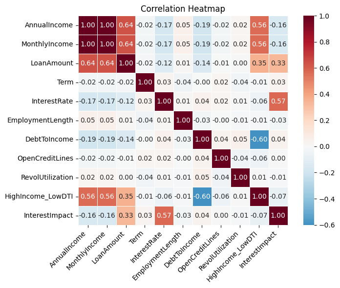
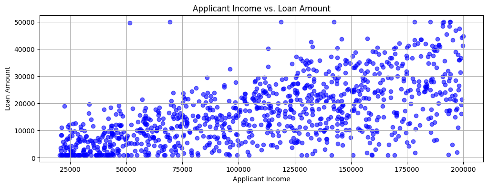
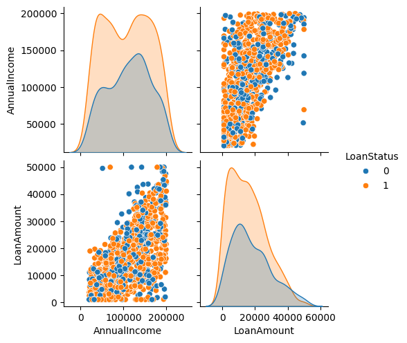
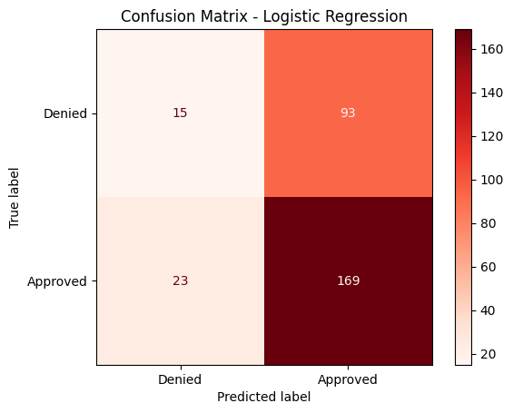
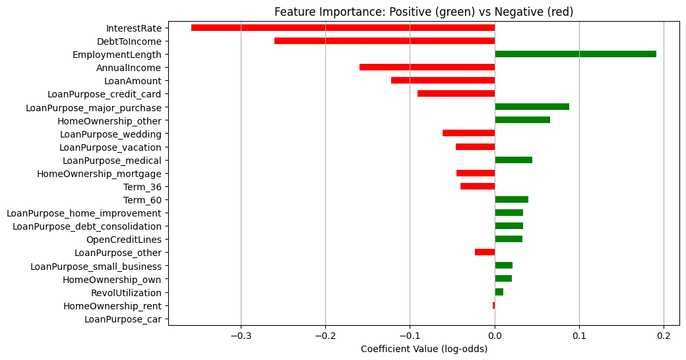
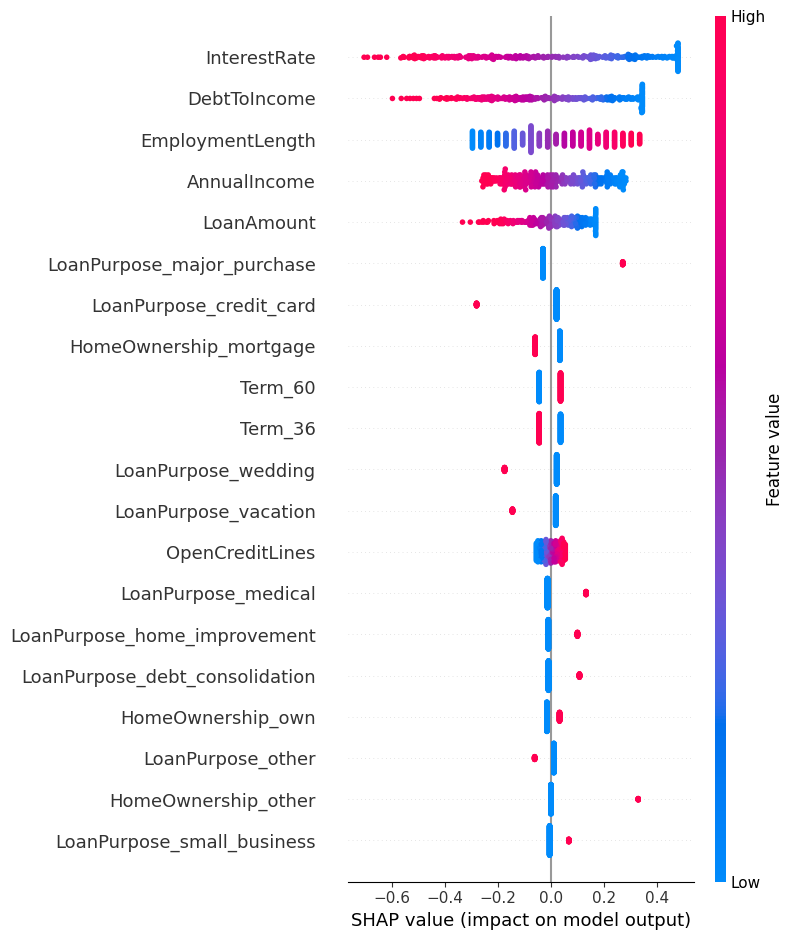
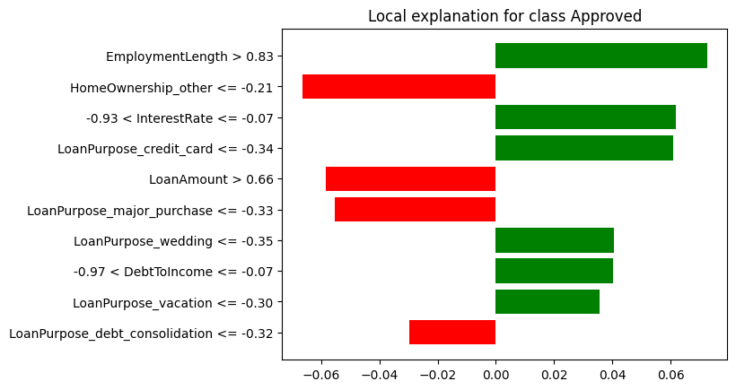

# Chapter 10: Building Predictive Analytics for Loan Approvals

## Introduction

In this chapter, we'll explore loan approvals using a variety of tools and techniques. We'll begin by analyzing loan data and applying Logistic Regression to predict loan outcomes. To interpret the predictions, we'll use the SHAP and LIME explanation frameworks, providing insights into feature importance and model behavior.

To keep our focus on the database features rather than on sourcing and cleaning real-world data, we'll work with a synthetically generated loans dataset.

Each record in this dataset includes:

- A unique identifier for each loan record.

- A randomized loan issue date between 2015 and 2023.

- Annual income that is a random integer between \$20,000 and \$200,000.

- Monthly income that is derived directly from annual income.

- Loan amount that is proportional to income, with noise and some intentional outliers.

- Loan term in months (36 or 60).

- Interest rate that is inversely related to income (higher income results in lower rate).

- Employment length as number of years employed (0 to 20).

- Home ownership that is categorical (rent, own, mortgage, other).

- Loan purpose, such as debt consolidation, credit card, car, medical, small business, etc.

- Debt-to-income (DTI) as a ratio with adjustments for income and added noise.

- Open credit lines is a count of open credit accounts.

- Revolving credit utilization (0% to 100%).

- High income -- low DTI is a binary indicator for strong financial health.

- Interest impact combines loan size, income and interest rate.

- Loan status contains the final loan approval outcome (0 = denied, 1 = approved), based on a computed risk score.

To make the dataset more realistic, several design choices were introduced during generation:

- Correlations were built in so that interest rates decrease with higher income, while loan amounts scale proportionally to income, reflecting typical lending practices.

- Random noise was added to features such as a DTI ratio and loan amounts to mimic the variability seen in real-world financial data and 5% of loans were deliberately altered to create extreme outliers, capturing atypical borrower scenarios.

- Temporal realism was achieved by spreading issue dates between 2015 and 2023 and introducing a normalized time-based risk factor to account for changing lending conditions.

- Loan approvals were not arbitrary but instead derived from a weighted risk score that incorporated DTI, loan size, employment history, temporal effects and overall interest burden, with a probabilistic element to avoid overly deterministic outcomes.

- Finally, categorical variables such as home ownership and loan purpose were assigned using weighted probabilities to reflect plausible population distributions and interaction features like "high income with low DTI" were created to capture the nuanced patterns often found in credit risk modeling.

## Create the Database

In the SingleStore Portal, let's use the **SQL Editor** to create a new database. Call this `loans_db`, as follows:

```sql
CREATE DATABASE IF NOT EXISTS loans_db;
```

## Fill out the Notebook

Let's now create a new Python notebook. We'll call it **loan_approvals**.

We'll create a new DataFrame, as follows:

```python
loans_csv_url = ...

loans_df = pd.read_csv(loans_csv_url)
```

This reads the CSV file and creates a DataFrame called `loans_df`. The CSV file contains 1,000 synthetically generated loans.

We'll do a quick check of how many loans were approved and denied:

```python
loans_df["LoanStatus"].map({0: "Denied", 1: "Approved"}).value_counts()
```

The output should be:

```text
LoanStatus
Approved    634
Denied      366
Name: count, dtype: int64
```

Next, we'll separate the features and the target variable

```python
X = loans_df.drop(columns = ["ID", "LoanStatus", "IssueDate"])
y = loans_df["LoanStatus"].astype(int)
```

Let's now create a correlation heatmap:

```python
corr_matrix = X.corr(numeric_only = True)

plt.figure(figsize = (8, 6))

sns.heatmap(
    corr_matrix,
    annot = True,
    fmt = ".2f",
    cmap = "RdBu_r",
    center = 0,
    square = True,
    cbar = True,
    linewidths = 0.5
)

plt.xticks(rotation = 45, ha = "right")
plt.yticks(rotation = 0)

plt.title("Correlation Heatmap")
plt.tight_layout()
plt.show()
```

Example output is shown in Figure 10-1.



*Figure 10-1. Correlation Heatmap.*

Let's now create a scatter plot of income against loan amount:

```python
plt.figure(figsize = (12, 4))
plt.title("Applicant Income vs. Loan Amount")

plt.grid(True)
plt.scatter(loans_df["AnnualIncome"], loans_df["LoanAmount"], c = "b", alpha = 0.6)
plt.xlabel("Applicant Income")
plt.ylabel("Loan Amount")

plt.show()
```

Example output is shown in Figure 10-2.



*Figure 10-2. Applicant Income vs. Loan Amount.*

Overall, reviewing Figure 10-1 and Figure 10-2, the synthetic loan data appears representative of real loan data.

We'll also render a pair plot:

```python
numerical_features = ["AnnualIncome", "LoanAmount"]

data_to_plot = pd.concat([loans_df[numerical_features], loans_df["LoanStatus"]], axis = 1)

sns.pairplot(data_to_plot, hue = "LoanStatus", diag_kind = "kde")
```

Example output is shown in Figure 10-3.



*Figure 10-3. Pair Plot.*

We'll now perform some feature engineering. We'll identify the categorical values and convert these to numerical values and also use one-hot encoding where required. We'll also remove any derived or engineered columns for a better model.

```python
categorical_cols = ["HomeOwnership", "LoanPurpose", "Term"]

X_cat = loans_df.copy()

X_cat = pd.get_dummies(X_cat, columns = categorical_cols, drop_first = False)

y = X_cat["LoanStatus"]
X_cat = X_cat.drop(columns = [
    "ID",
    "LoanStatus",
    "IssueDate",
    "MonthlyIncome",
    "InterestImpact",
    "HighIncome_LowDTI"
])
```

Now we'll spit the data intro training and testing sets:

```python
SEED = 42

X = X_cat.copy()

X_train, X_test, y_train, y_test = train_test_split(
    X, y, test_size = 0.3, random_state = SEED
)
```

We'll also scale the features to ensure that larger ranges don't dominate:

```python
scaler = StandardScaler()
X_train_scaled = scaler.fit_transform(X_train)
X_test_scaled = scaler.transform(X_test)
```

Then train a Logistic Regression model:

```python
model = LogisticRegression(max_iter = 1000, random_state = SEED)
model.fit(X_train_scaled, y_train)
```

and make predictions:

```python
y_pred = model.predict(X_test_scaled)
```

A confusion matrix will help us visualize the results:

```python
cm = confusion_matrix(y_test, y_pred)

labels = ["Denied", "Approved"]

disp = ConfusionMatrixDisplay(confusion_matrix = cm, display_labels = labels)
disp.plot(cmap = "Reds", values_format = "d")
plt.title("Confusion Matrix - Logistic Regression")
plt.show()
```

Example output is shown in Figure 10-4.



*Figure 10-4. Confusion Matrix.*

Let's get a more comprehensive analysis:

```python
accuracy = accuracy_score(y_test, y_pred)
precision = precision_score(y_test, y_pred, pos_label = 1)
recall = recall_score(y_test, y_pred, pos_label = 1)
f1 = f1_score(y_test, y_pred, pos_label = 1)

print(f"Accuracy: {accuracy:.2f}")
print(f"Precision: {precision:.2f}")
print(f"Recall: {recall:.2f}")
print(f"F1-score: {f1:.2f}")

class_report = classification_report(y_test, y_pred)
print("Classification Report:")
print(class_report)
```

Example output:

```python
Accuracy: 0.61
Precision: 0.65
Recall: 0.88
F1-score: 0.74
Classification Report:
              precision    recall  f1-score   support

           0       0.39      0.14      0.21       108
           1       0.65      0.88      0.74       192

    accuracy                           0.61       300
   macro avg       0.52      0.51      0.47       300
weighted avg       0.55      0.61      0.55       300
```

The model achieved an overall accuracy of 61%, meaning it correctly classified under two-thirds of the loan applications. Its recall for approved loans (class 1) is high, showing that the model is effective at identifying most cases where loans should be approved. However, this comes at the cost of lower performance on denied loans (class 0). Precision is higher for approvals than denials, reflecting a bias towards predicting approvals. The F1-score for approvals indicates solid performance in that class, but the F1-score for denials highlights weaknesses in correctly identifying applicants who should be denied. Overall, the model favors minimizing false negatives (approving loans that should be approved) but struggles with false positives (approving loans that should have been denied), which could pose financial risk for a lender.

Let's visualize the importance and direction of various features:

```python
coefs = pd.Series(model.coef_[0], index = X_train.columns)

coefs_sorted = coefs.reindex(coefs.abs().sort_values(ascending = False).index)

colors = coefs_sorted.apply(lambda x: "green" if x > 0 else "red")

coefs_sorted.iloc[::-1].plot(
    kind = "barh",
    color = colors.iloc[::-1],
    figsize = (10, 6)
)

plt.xlabel("Coefficient Value (log-odds)")
plt.title("Feature Importance: Positive (green) vs Negative (red)")
plt.grid(axis = "x")
plt.show()
```

Example output is shown in Figure 10-5.



*Figure 10-5. Feature Importance.*

We'll select a test sample to generate a loan application summary. In this case, we'll choose the first row in the DataFrame:

```python
sample_index = 0

sample_orig = X_test.iloc[sample_index]
```

and then create a loan report summary:

```python
sample_scaled = X_test_scaled[sample_index].reshape(1, -1)

predicted_status = model.predict(sample_scaled)[0]
predicted_proba = model.predict_proba(sample_scaled)[0, 1]

print("=== Loan Application Summary ===")
print(f"Annual Income       : ${sample_orig['AnnualIncome']:,.2f}")
print(f"Loan Amount         : ${sample_orig['LoanAmount']:,.2f}")

for col in sample_orig.index:
    if col.startswith("Term_") and sample_orig[col] == 1:
        term_value = col.replace("Term_", "")
        print(f"Term (months)       : {term_value}")
        break

print(f"Interest Rate       : {sample_orig['InterestRate']:.2f}%")
print(f"Employment Length   : {sample_orig['EmploymentLength']} years")
print(f"Debt-to-Income (DTI): {sample_orig['DebtToIncome']:.2f}")
print(f"Open Credit Lines   : {sample_orig['OpenCreditLines']}")
print(f"Revolving Util      : {sample_orig['RevolUtilization']:.2f}%\n")

home_mapping = {col: col.replace("HomeOwnership_", "") for col in sample_orig.index if col.startswith("HomeOwnership_")}
loan_purpose_mapping = {col: col.replace("LoanPurpose_", "") for col in sample_orig.index if col.startswith("LoanPurpose_")}

home_value = [home_mapping[col] for col in home_mapping if sample_orig[col] == 1]
loan_purpose_value = [loan_purpose_mapping[col] for col in loan_purpose_mapping if sample_orig[col] == 1]

print(f"Home Ownership      : {', '.join(home_value)}")
print(f"Loan Purpose        : {', '.join(loan_purpose_value)}\n")

status_label = "Approved" if predicted_status == 1 else "Not Approved"
print(f"Predicted Loan Status: {status_label}")
print(f"Probability of Approval: {predicted_proba:.2f}")
```

Example output:

```text
=== Loan Application Summary ===
Annual Income       : $126,357.00
Loan Amount         : $31,280.66
Term (months)       : 60
Interest Rate       : 8.29%
Employment Length   : 20 years
Debt-to-Income (DTI): 3.82
Open Credit Lines   : 9
Revolving Util      : 95.59%

Home Ownership      : own
Loan Purpose        : other

Predicted Loan Status: Approved
Probability of Approval: 0.79
```

The borrower has a high income (\$126k), a moderate loan amount (\$31k) and a long employment history (20 years). Debt-to-Income is very low (3.8%), meaning the borrower has little relative debt. Revolving utilization is high (95.6%), which could be a risk signal. Categorical features show they own a home and the loan purpose is "other". The model predicts Approved with a probability of 0.79, which aligns with the profile: high income, low DTI, long employment and moderate loan size outweigh the high revolving utilization.

Using SHAP, we'll also rank feature importance:

```python
shap_explainer = shap.Explainer(model, X_train_scaled)
shap_values = shap_explainer(X_test_scaled)

shap_vals_array = shap_values.values

mean_abs_shap = np.abs(shap_vals_array).mean(axis = 0)

shap_df = pd.DataFrame({
    "Feature": X_train.columns,
    "Mean SHAP Value": mean_abs_shap
})

shap_df = shap_df.sort_values(by = "Mean SHAP Value", ascending = False)

N = 10
top_features = shap_df.head(N)
print(top_features.to_string(index = False))
```

Example output:

```text
                   Feature  Mean SHAP Value
              InterestRate         0.310889
              DebtToIncome         0.215037
          EmploymentLength         0.162643
              AnnualIncome         0.135470
                LoanAmount         0.093052
LoanPurpose_major_purchase         0.052643
   LoanPurpose_credit_card         0.043681
    HomeOwnership_mortgage         0.043281
                   Term_60         0.040350
                   Term_36         0.040350
```

Top drivers of loan approval are:

- **InterestRate**: the strongest factor; lower rates likely increase approval probability.

- **DebtToIncome**: low DTI favors approval.

- **EmploymentLength**: longer employment history positively influences approval.

- **AnnualIncome**: higher income helps, but less than interest rate or DTI.

- **LoanAmount**: larger loans slightly reduce approval probability.

Categorical features also contribute, though less strongly:

- **LoanPurpose_major_purchase** and **LoanPurpose_credit_card** indicate certain purposes slightly affect approval.

- **HomeOwnership_mortgage** and **Term_36** / **Term_60** show that ownership status and term length have minor influence.

Overall, numeric financial features dominate model predictions, which aligns with how we simulated the data.

For interpretability, we'll also create a plot using the original unscaled features:

```python
shap_vals_float32 = shap_vals_array.astype("float32")

shap.summary_plot(shap_vals_float32, X_test, feature_names = X_train.columns)
```

Example output is shown in Figure 10-6.



*Figure 10-6. SHAP Summary Plot.*

We can also create a Force Plot that shows how each feature contributes to the prediction for a single sample:

```python
shap_vals_sample = shap_values.values[sample_index]
feature_values = X_test.iloc[sample_index]

shap.initjs()

shap.force_plot(
    base_value = shap_explainer.expected_value,
    shap_values = shap_vals_sample,
    features = feature_values,
    feature_names = X_test.columns
)
```

We'll also generate a LIME explanation for a single instance:

```python
feature_names = X_train.columns.tolist()

lime_explainer = LimeTabularExplainer(
    training_data = X_train_scaled,
    feature_names = feature_names,
    class_names = ["Rejected", "Approved"],
    mode = "classification"
)

prediction_index = 0
prediction_instance = X_test_scaled[prediction_index]

explanation = lime_explainer.explain_instance(
    data_row = prediction_instance,
    predict_fn = model.predict_proba,
    num_features = 10
)

fig = explanation.as_pyplot_figure()
```

Example output is shown in Figure 10-8.



*Figure 10-8. LIME Explanation.*

The LIME plot gives an intuitive visual explanation of why the model predicted "Approved" or "Rejected" for this particular loan application, showing both the strength and direction of each feature's influence.

Let's now write the original training and testing data to SingleStore. First, we'll create a connection:

```python
from sqlalchemy import *

db_connection = create_engine(connection_url)
```

Next, we'll delete the tables if they already exist:

```python
tables = ["train_data", "test_data"]

with db_connection.begin() as conn:
    for table in tables:
        conn.execute(text(f"DROP TABLE IF EXISTS {table};"))
```

Then we'll write the data, as follows:

```python
(X_train.join(y_train)).to_sql(
    "train_data",
    con = db_connection,
    if_exists = "replace",
    index = False,
    chunksize = 1000
)

(X_test.join(y_test)).to_sql(
    "test_data",
    con = db_connection,
    if_exists = "replace",
    index = False,
    chunksize = 1000
)
```

We've used the SingleStore notebook environment to perform data loading, data analysis and visualization, model building and interpretation of predictions using explainable AI techniques such as SHAP and LIME, but we can go further by running SQL queries.

## Example Queries

Now that the data are stored in SingleStore, let's run some SQL queries using the **SQL Editor**.

First, let's look at the loan status distribution for training data:

```sql
SELECT
    LoanStatus,
    COUNT(*) AS TotalLoans,
    ROUND((COUNT(*) * 100.0 / SUM(COUNT(*)) OVER ()), 2) AS Percentage
FROM train_data
GROUP BY LoanStatus;
```

Example output:

```text
+------------+------------+------------+
| LoanStatus | TotalLoans | Percentage |
+------------+------------+------------+
|          1 |        442 |      63.14 |
|          0 |        258 |      36.86 |
+------------+------------+------------+
```

About 63% of loans are approved and 37% rejected in the training set, showing a moderate class imbalance toward approvals.

The same for testing data:

```sql
SELECT
    LoanStatus,
    COUNT(*) AS TotalLoans,
    ROUND((COUNT(*) * 100.0 / SUM(COUNT(*)) OVER ()), 2) AS Percentage
FROM test_data
GROUP BY LoanStatus;
```

Example output:

```
+------------+------------+------------+
| LoanStatus | TotalLoans | Percentage |
+------------+------------+------------+
|          1 |        192 |      64.00 |
|          0 |        108 |      36.00 |
+------------+------------+------------+
```

The test set shows a nearly identical distribution, meaning the split preserved class balance.

Now, let's find the average loan by home ownership:

```sql
SELECT
    CASE
        WHEN HomeOwnership_mortgage = 1 THEN 'Mortgage'
        WHEN HomeOwnership_other = 1 THEN 'Other'
        WHEN HomeOwnership_own = 1 THEN 'Own'
        WHEN HomeOwnership_rent = 1 THEN 'Rent'
    END AS HomeOwnership,
    ROUND(AVG(LoanAmount), 2) AS AvgLoanAmount
FROM train_data
GROUP BY HomeOwnership
ORDER BY AvgLoanAmount DESC;
```

Example output:

```text
+---------------+---------------+
| HomeOwnership | AvgLoanAmount |
+---------------+---------------+
| Other         |      17085.32 |
| Mortgage      |      16837.96 |
| Rent          |      16516.73 |
| Own           |      15551.55 |
+---------------+---------------+
```

Borrowers with "Other" tend to take the largest loans, while those who fully own their homes borrow the least on average.

Next, let's look at the average interest rate by loan purpose:

```sql
SELECT
    CASE
        WHEN LoanPurpose_car = 1 THEN 'Car'
        WHEN LoanPurpose_credit_card = 1 THEN 'Credit Card'
        WHEN LoanPurpose_debt_consolidation = 1 THEN 'Debt Consolidation'
        WHEN LoanPurpose_home_improvement = 1 THEN 'Home Improvement'
        WHEN LoanPurpose_major_purchase = 1 THEN 'Major Purchase'
        WHEN LoanPurpose_medical = 1 THEN 'Medical'
        WHEN LoanPurpose_other = 1 THEN 'Other'
        WHEN LoanPurpose_small_business = 1 THEN 'Small Business'
        WHEN LoanPurpose_vacation = 1 THEN 'Vacation'
        WHEN LoanPurpose_wedding = 1 THEN 'Wedding'
    END AS LoanPurpose,
    ROUND(AVG(InterestRate), 2) AS AvgInterestRate
FROM train_data
GROUP BY LoanPurpose
ORDER BY AvgInterestRate DESC;
```

Example output:

```text
+--------------------+-----------------+
| LoanPurpose        | AvgInterestRate |
+--------------------+-----------------+
| Wedding            |           16.37 |
| Other              |           14.76 |
| Car                |           14.73 |
| Credit Card        |           14.45 |
| Medical            |           14.42 |
| Home Improvement   |           14.40 |
| Vacation           |           14.39 |
| Small Business     |           14.23 |
| Debt Consolidation |           13.83 |
| Major Purchase     |           12.73 |
+--------------------+-----------------+
```

Wedding loans carry the highest average interest rate, while major purchase loans have the lowest, showing lenders price perceived risk differently by purpose.

Let's now look at the loan distribution by loan purpose and term:

```sql
SELECT
    CASE
        WHEN LoanPurpose_car = 1 THEN 'Car'
        WHEN LoanPurpose_credit_card = 1 THEN 'Credit Card'
        WHEN LoanPurpose_debt_consolidation = 1 THEN 'Debt Consolidation'
        WHEN LoanPurpose_home_improvement = 1 THEN 'Home Improvement'
        WHEN LoanPurpose_major_purchase = 1 THEN 'Major Purchase'
        WHEN LoanPurpose_medical = 1 THEN 'Medical'
        WHEN LoanPurpose_other = 1 THEN 'Other'
        WHEN LoanPurpose_small_business = 1 THEN 'Small Business'
        WHEN LoanPurpose_vacation = 1 THEN 'Vacation'
        WHEN LoanPurpose_wedding = 1 THEN 'Wedding'
    END AS LoanPurpose,
    SUM(CASE WHEN Term_36 = 1 THEN 1 ELSE 0 END) AS Term_36_Months,
    SUM(CASE WHEN Term_60 = 1 THEN 1 ELSE 0 END) AS Term_60_Months
FROM train_data
GROUP BY LoanPurpose
ORDER BY LoanPurpose;
```

Example output:

```text
+--------------------+----------------+----------------+
| LoanPurpose        | Term_36_Months | Term_60_Months |
+--------------------+----------------+----------------+
| Car                |             30 |             37 |
| Credit Card        |             42 |             29 |
| Debt Consolidation |             32 |             32 |
| Home Improvement   |             38 |             37 |
| Major Purchase     |             37 |             30 |
| Medical            |             38 |             36 |
| Other              |             35 |             47 |
| Small Business     |             34 |             32 |
| Vacation           |             31 |             28 |
| Wedding            |             38 |             37 |
+--------------------+----------------+----------------+
```

Across all purposes, term lengths are generally evenly split, although some differences exist such as "Other" skewing toward 60 months.

We can also find the correlation between numerical features:

```sql
SELECT
    ROUND((
        AVG(AnnualIncome * LoanAmount) - AVG(AnnualIncome) * AVG(LoanAmount)
    ) / (
        STDDEV(AnnualIncome) * STDDEV(LoanAmount)
    ), 4) AS Correlation_Coefficient
FROM train_data;
```

Example output:

```text
+-------------------------+
| Correlation_Coefficient |
+-------------------------+
|                  0.6467 |
+-------------------------+
```

There's a moderately strong positive correlation, meaning higher incomes are generally associated with higher loan amounts.

Let's look at feature importance by loan status:

```sql
SELECT
    LoanStatus,
    ROUND(AVG(DebtToIncome), 2) AS AvgDebtToIncome
FROM train_data
GROUP BY LoanStatus;
```

Example output:

```text
+------------+-----------------+
| LoanStatus | AvgDebtToIncome |
+------------+-----------------+
|          1 |           14.00 |
|          0 |           16.69 |
+------------+-----------------+
```

Approved loans have a lower average debt-to-income ratio compared to rejected ones, suggesting lenders prefer borrowers with less relative debt.

Finally, for outlier detection, let's find loans where the amount is more than 50% of annual income:

```sql
SELECT
    AnnualIncome,
    LoanAmount,
    ROUND(LoanAmount / AnnualIncome, 4) AS LoanToIncomeRatio
FROM train_data
WHERE (LoanAmount / AnnualIncome) > 0.5
ORDER BY LoanToIncomeRatio DESC
LIMIT 10;
```

Example output:

```text
+--------------+------------+-------------------+
| AnnualIncome | LoanAmount | LoanToIncomeRatio |
+--------------+------------+-------------------+
|        22368 |    18959.8 |            0.8476 |
|        69377 |      50000 |            0.7207 |
|        33545 |      19675 |            0.5865 |
|        21252 |    11056.8 |            0.5203 |
+--------------+------------+-------------------+
```

Some borrowers are taking on loans as high as 85% of their annual income, which signals potential high-risk lending cases.

## Summary

In this chapter, we worked through an end-to-end example of analyzing and modeling loan approval data. We began by loading and preparing the training and test datasets, building a Linear Regression model and applying SHAP and LIME to explain the model's predictions. We then loaded the data into SingleStore and ran SQL queries to explore class balance, loan distributions, correlations and potential outliers. These analyses revealed the predominance of approved loans, the influence of home ownership and debt-to-income ratio on outcomes and differences in loan amounts, terms and interest rates by purpose. We also identified moderately strong correlations between income and loan size, along with high-risk cases where loans represented a large share of income.

By combining predictive modeling with other tools and exploratory SQL analysis, we gained both a deeper understanding of the dataset and a solid foundation for decision-making. This workflow highlights how SingleStore can act as both a high-performance data store and an analytical engine, seamlessly supporting tasks across descriptive analytics, machine learning and model interpretability.
