# Chapter 15: Crime Analytics with SingleStore Kai

## Introduction

Many great visualization techniques, such as kernel density mapping, can help us explore and analyze crime concentrations. However, sometimes, it can be more insightful to study how crimes cluster along a linear network, such as a bus route or Underground line. This kind of analysis can help law enforcement agencies target resources at specific hotspots along a route.

One way to do this is by identifying hot routes[^1]: sections of a transport line where crime is unusually concentrated. An excellent tutorial[^2] by Reka Solymosi demonstrates this technique in R for the Bakerloo Line on the London Underground.

In this chapter, we will follow the same workflow using Python and apply it to data stored in SingleStore via its MongoDB-compatible Kai API. We will not only visualize crime patterns along the Bakerloo Line using spatial queries and thematic mapping, but also build machine learning models to predict crime frequency (regression), likely crime types (classification) and discover emerging hotspots (clustering).

We'll follow the following four-step process:

- Prepare the network layer.

- Link crime events to line segments.

- Calculate a rate.

- Visualize the results.

For Bakerloo line data, we'll use some pre-prepared files:

- **bakerloo_stops.csv**: Contains Bakerloo Line station names and their latitude and longitude coordinates.

- **bakerloo_line.geojson**: Contains a LineString with latitude and longitude coordinates for the entire Bakerloo Line.

For the British Transport Police (BTP) crime data, we'll use a pre-prepared file for data from 2024-01 to 2025-01, originally generated from Data Downloads[^3]. The data contains public sector information licensed under the UK Open Government License v3.0.

## Data Loader for Hot Routes

Let's now create a new notebook. We'll call it **data_loader_for_hot_routes**.

In a new code cell, let's add the following code to read the Bakerloo stops CSV file:

``` python
bakerloo_stops_csv_url = ...

bakerloo_stops_df = pd.read_csv(bakerloo_stops_csv_url)
```

Next, we'll read the GeoJSON file:

``` python
bakerloo_line_geojson_url = ...

bakerloo_line = gpd.read_file(bakerloo_line_geojson_url).to_crs(epsg = 4326)
```

Finally, we'll read the BTP crimes CSV file:

``` python
btp_street_csv_url = ...

crimes_df = pd.read_csv(btp_street_csv_url)
```

Now, we'll create a connection to SingleStore Kai:

``` python
try:
    client = MongoClient(connection_url_kai)
    db = client["hot_routes_db"]
    client.drop_database(db)
    print("Connected to Kai successfully")
except Exception as e:
    print(f"Could not connect to Kai: '{e}'")
```

We'll ensure that we start with a clean environment by dropping the database if it already exists.

We'll now convert the Bakerloo stops data into a JSON format and insert it into a new collection:

``` python
bakerloo_stops = [
    {
        "station_name": r["stn_name"],
        "line": r["line"],
        "location": {
            "type": "Point",
            "coordinates": [r["stn_lon"], r["stn_lat"]]
        }
    }
    for r in bakerloo_stops_df.to_dict(orient = "records")
]

db["bakerloo_stops"].insert_many(bakerloo_stops)
print(f"Inserted {len(bakerloo_stops)} stations")
```

This will insert data for 25 stations. We are using a geospatial `Point` type and here is an example of a JSON document:

``` text
{'_id': ObjectId('68cb03cec2ca5ba1d2f3587a'),
 'station_name': "Regent's Park",
 'line': 'bakerloo',
 'location': {'type': 'Point', 'coordinates': [-0.146444, 51.523344]}}
```

We'll repeat the process for the line segments between stations:

``` python
def segments(curve):
    return list(map(LineString, zip(curve.coords[:-1], curve.coords[1:])))

bakerloo_sections = [
    {
        "geometry": {
            "type": "LineString",
            "coordinates": list(seg.coords)
        }
    }
    for curve in bakerloo_line.geometry
    for seg in segments(curve)
]

db["bakerloo_sections"].insert_many(bakerloo_sections)
print(f"Inserted {len(bakerloo_sections)} line segments")
```

This will insert data for 24 segments. We are using a geospatial `LineString` type and here is an example of a JSON document:

``` text
{'_id': ObjectId('68cb04d5c2ca5ba1d2f35892'),
 'geometry': {'type': 'LineString',
  'coordinates': [[-0.243006, 51.532556], [-0.22505, 51.530545]]}}
```

We'll repeat the process for the BTP crimes data:

``` python
crimes = [
    {
        "crime_id": row.get("Crime ID"),
        "month": row.get("Month"),
        "reported_by": row.get("Reported by"),
        "falls_within": row.get("Falls within"),
        "geometry": {
            "type": "Point",
            "coordinates": [row["Longitude"], row["Latitude"]]
        },
        "location": row.get("Location"),
        "lsoa_code": row.get("LSOA code"),
        "lsoa_name": row.get("LSOA name"),
        "crime_type": row.get("Crime type"),
        "last_outcome_category": row.get("Last outcome category"),
        "context": row.get("Context")
    }
    for _, row in crimes_df.iterrows()
]

db["crimes"].insert_many(crimes)
print(f"Inserted {len(crimes)} crimes")
```

This will insert data for thousands of reported crimes. These are for the entire United Kingdom. We are using a geospatial `Point` type and here is an example of a JSON document:

``` text
{'_id': ObjectId('68cb066cc2ca5ba1d2f358c7'),
 'crime_id': nan,
 'month': '2025-01',
 'reported_by': 'British Transport Police',
 'falls_within': 'British Transport Police',
 'geometry': {'type': 'Point', 'coordinates': [0.875301, 51.143228]},
 'location': 'On or near Ashford International (Station)',
 'lsoa_code': 'E01034986',
 'lsoa_name': 'Ashford 005G',
 'crime_type': 'Violence and sexual offences',
 'last_outcome_category': nan,
 'context': nan}
```

Finally, we'll store a `Polygon` which is a buffer around the Bakerloo line. This is a strip with a radius of 0.005 degrees around the line, stored as a list of polygons.

``` python
bakerloo_line_buffer = bakerloo_line.buffer(0.005)

bakerloo_line_buff = [
    {
        "geometry": mapping(poly)
    }
    for poly in bakerloo_line_buffer
]

db["bakerloo_line_buff"].insert_many(bakerloo_line_buff)
print(f"Inserted {len(bakerloo_line_buff)} line buffer polygons")
```

Here is a partial example document:

``` text
{'_id': ObjectId('68cb09aac2ca5ba1d2f3658e'),
 'geometry': {'type': 'Polygon',
  'coordinates': [[[-0.31443398617096996, 51.58610916857441],
    [-0.31400443053839167, 51.5858291632545],
    [-0.31360581092362083, 51.58550663663021],
    [-0.31324231954569604, 51.585144980662704],
    ...
    [-0.33281982682498623, 51.596764571748075],
    [-0.33238398617097, 51.59653916857441],
    [-0.31443398617096996, 51.58610916857441]]]}}
```

Note how the first and last coordinates are the same, which is required for polygons.

## Visualization

In our SingleStore database, we've stored various geospatial data. We'll use that data to create visualizations. We'll start by creating a new Python notebook. We'll call it **hot_routes**.

First, we'll set up the connection to SingleStore Kai:

``` python
try:
    client = MongoClient(connection_url_kai)
    db = client["hot_routes_db"]
    print("Connected to Kai successfully")
except Exception as e:
    print(f"Could not connect to Kai: '{e}'")
```

Let's now prepare the network layer. First, we'll read in the data from the `bakerloo_stops`:

``` python
cursor = db["bakerloo_stops"].find()

bakerloo_stops = gpd.GeoDataFrame(
    (
        {**doc, "geometry": Point(doc["location"]["coordinates"])}
        for doc in cursor
    ),
    crs = 4326
).drop(columns = ["_id", "location"])

bakerloo_stops.head()
```

and create a visualization of the stations:

``` python
fig, ax = plt.subplots(figsize = (10, 10))

bakerloo_stops.to_crs(3857).plot(
    ax = ax,
    color = "black",
    markersize = 15,
    zorder = 2
)

cx.add_basemap(
    ax,
    source = cx.providers.CartoDB.VoyagerNoLabels,
    attribution = "",
    zorder = 1
)

ax.set_axis_off()
```

Example output is shown in Figure 15-1.

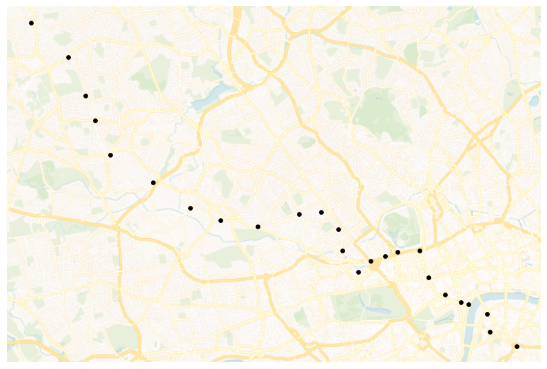

*Figure 15-1. bakerloo_stops.*

Now we'll load data from the `bakerloo_sections` collection:

``` python
cursor = db["bakerloo_sections"].find()

bakerloo_sections = gpd.GeoDataFrame(
    (
        {**doc, "geometry": shape(doc["geometry"])}
        for doc in cursor
    ),
    crs = 4326
).drop(columns = ["_id"])

bakerloo_sections.head()
```

and create a map of the line segments:

``` python
fig, ax = plt.subplots(figsize = (10, 10))

bakerloo_sections.to_crs(3857).plot(
    ax = ax,
    color = "#B36305",
    linewidth = 3,
    zorder = 2
)

cx.add_basemap(
    ax,
    source = cx.providers.CartoDB.VoyagerNoLabels,
    attribution = "",
    zorder = 1
)

ax.set_axis_off()
```

Example output is shown in Figure 15-2.

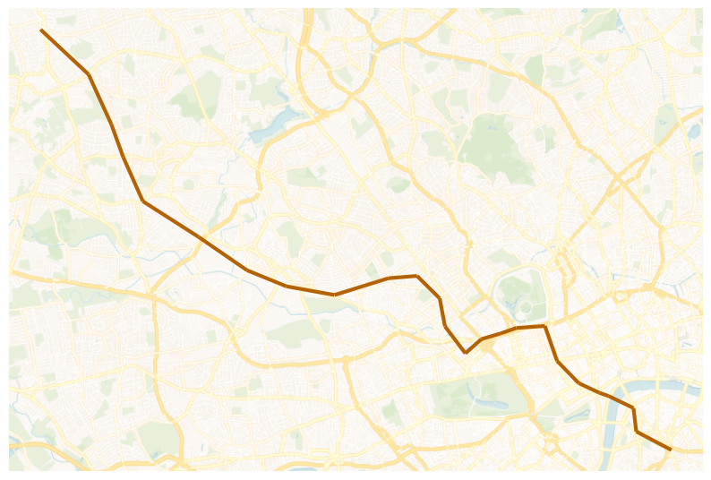

*Figure 15-2. bakerloo_sections.*

We can also combine both sets of data to produce a map of the Bakerloo Line:

``` python
fig, ax = plt.subplots(figsize = (10, 10))

bakerloo_sections.to_crs(3857).plot(
    ax = ax,
    color = "#B36305",
    linewidth = 3,
    zorder = 2
)

bakerloo_stops.to_crs(3857).plot(
    ax = ax,
    color = "black",
    markersize = 15,
    zorder = 3
)

cx.add_basemap(
    ax,
    source = cx.providers.CartoDB.VoyagerNoLabels,
    attribution = "",
    zorder = 1
)

ax.set_axis_off()
```

Example output is shown in Figure 15-3.

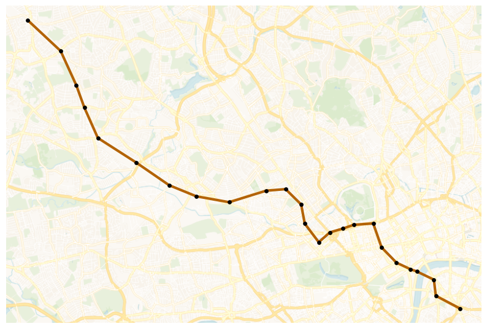

*Figure 15-3. Bakerloo Line Map.*

Next, let's link crime events to line segments. We'll start by reading in the crimes data for 2025-01.

``` python
cursor = db["crimes"].find({"month": "2025-01"})

crimes = gpd.GeoDataFrame(
    (
        {**doc, "geometry": shape(doc["geometry"])}
        for doc in cursor
    ),
    crs = 4326
).drop(columns = ["_id"])

crimes.head()
```

Then, we'll plot the data across the UK using Uber's H3 library.

``` python
h3_resolution = 5

hex_counts = {}
for point in crimes.geometry:
    cell = h3.latlng_to_cell(point.y, point.x, h3_resolution)
    hex_counts[cell] = hex_counts.get(cell, 0) + 1

hex_geoms = []
hex_values = []

for cell, count in hex_counts.items():
    boundary = h3.cell_to_boundary(cell)
    boundary = [(lng, lat) for lat, lng in boundary]
    hex_geoms.append(Polygon(boundary))
    hex_values.append(count)

hex_gdf = gpd.GeoDataFrame(
    {"count": hex_values, "geometry": hex_geoms},
    crs = 4326
)

ax = (hex_gdf.to_crs(3857).sort_values("count", ascending = True).plot(
        column = "count",
        cmap = "YlOrRd",
        edgecolor = "black",
        linewidth = 0.3,
        figsize = (10, 10),
        legend = True,
        legend_kwds = {
            "label" : "Number of crimes",
            "orientation" : "vertical"
        }
    )
)

cx.add_basemap(
    ax,
    source = cx.providers.CartoDB.VoyagerNoLabels,
    attribution = ""
)

bounds = hex_gdf.to_crs(3857).total_bounds

ax.set_xlim([bounds[0], bounds[2]])
ax.set_ylim([bounds[1], bounds[3]])

ax.set_axis_off()
```

Example output is shown in Figure 15-4.

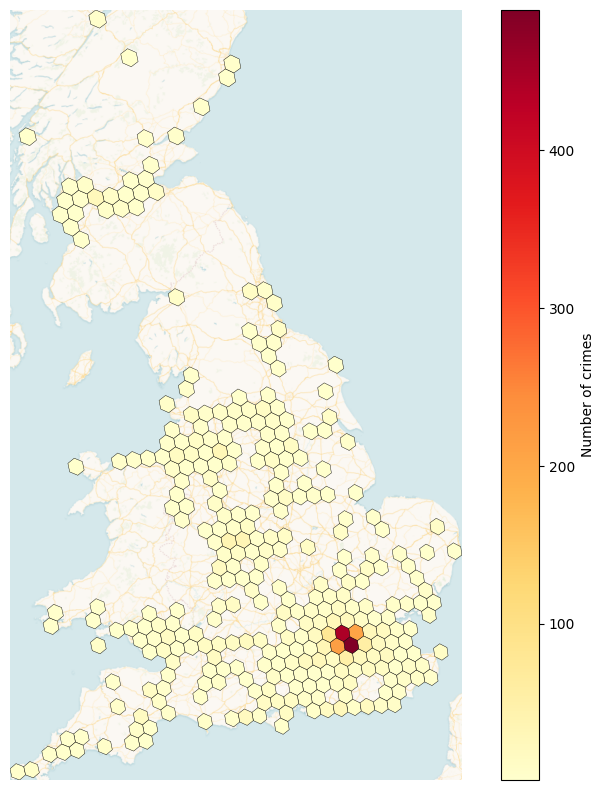

*Figure 15-4. h3_level = 5.*

We can see that London and the South East have higher crime numbers than other parts of the United Kingdom.

Next, we'll load in the buffer that we previously created.

``` python
cursor = db["bakerloo_line_buff"].find()

bakerloo_line_buff = gpd.GeoDataFrame(
    (
        {**doc, "geometry": shape(doc["geometry"])}
        for doc in cursor
    ),
    crs = 4326
).drop(columns = ["_id"])

bakerloo_line_buff.head()
```

and plot this on a map:

``` python
fig, ax = plt.subplots(figsize = (10, 10))

bakerloo_line_buff.to_crs(3857).plot(
    ax = ax,
    color = "lightgrey",
    edgecolor = "black",
    alpha = 0.5,
    zorder = 2
)

cx.add_basemap(
    ax,
    source = cx.providers.CartoDB.VoyagerNoLabels,
    attribution = "",
    zorder = 1
)

ax.set_axis_off()
```

Example output is shown in Figure 15-5.

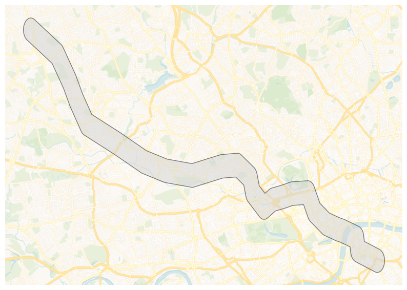

*Figure 15-5. bakerloo_line_buff.*

Now let's narrow the number of crimes to those that lie within `bakerloo_line_buff`:

``` python
crimes = gpd.sjoin(
    crimes,
    bakerloo_line_buff,
    how = "inner",
    predicate = "within"
).drop(columns = ["index_right"])
```

We'll now combine the datasets to produce a visualization:

``` python
fig, ax = plt.subplots(figsize = (10, 10))

bakerloo_line_buff.to_crs(3857).plot(
    ax = ax,
    color = "lightgrey",
    edgecolor = "black",
    alpha = 0.5,
    zorder = 2
)

bakerloo_sections.to_crs(3857).plot(
    ax = ax,
    color = "#B36305",
    linewidth = 3,
    zorder = 3
)

bakerloo_stops.to_crs(3857).plot(
    ax = ax,
    color = "black",
    markersize = 15,
    zorder = 4
)

crimes.to_crs(3857).plot(
    ax = ax,
    color = "red",
    markersize = 15,
    zorder = 5
)

cx.add_basemap(
    ax,
    source = cx.providers.CartoDB.VoyagerNoLabels,
    attribution = "",
    zorder = 1
)

ax.set_axis_off()
```

Example output is shown in Figure 15-6.

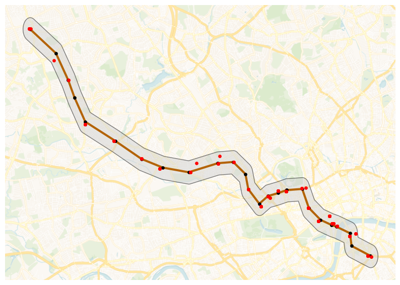

*Figure 15-6. Combined Datasets.*

We can see crimes plotted within the buffer area.

Next, we'll find which section of the Bakerloo Line a particular crime is nearest. First, we'll find the number of crimes:

``` python
bline_segments = gpd.sjoin_nearest(
    crimes,
    bakerloo_sections
).rename(columns = {"index_right": "segment"})
```

and then we'll sum them up for each section to provide the frequency:

``` python
sections_freq = bline_segments["segment"].value_counts().rename("freq")
```

Next, we'll get the geometry for each section by using a join and we'll fill any sections that have no crimes with a 0 (zero):

``` python
bakerloo_sections = bakerloo_sections.join(sections_freq, how = "left").fillna({"freq":0})
```

Now we'll create a plot:

``` python
fig, ax = plt.subplots(figsize = (10, 10))

bakerloo_line_buff.to_crs(3857).plot(
    ax = ax,
    color = "lightgrey",
    edgecolor = "black",
    alpha = 0.5,
    zorder = 2
)

bakerloo_sections.to_crs(3857).plot(
    ax = ax,
    column = "freq",
    linewidth = 3,
    cmap = "OrRd",
    zorder = 3
)

bakerloo_stops.to_crs(3857).plot(
    ax = ax,
    color = "black",
    markersize = 15,
    zorder = 4
)

cx.add_basemap(
    ax,
    source = cx.providers.CartoDB.VoyagerNoLabels,
    attribution = "",
    zorder = 1
)

ax.set_axis_off()
```

Example output is shown in Figure 15-7.

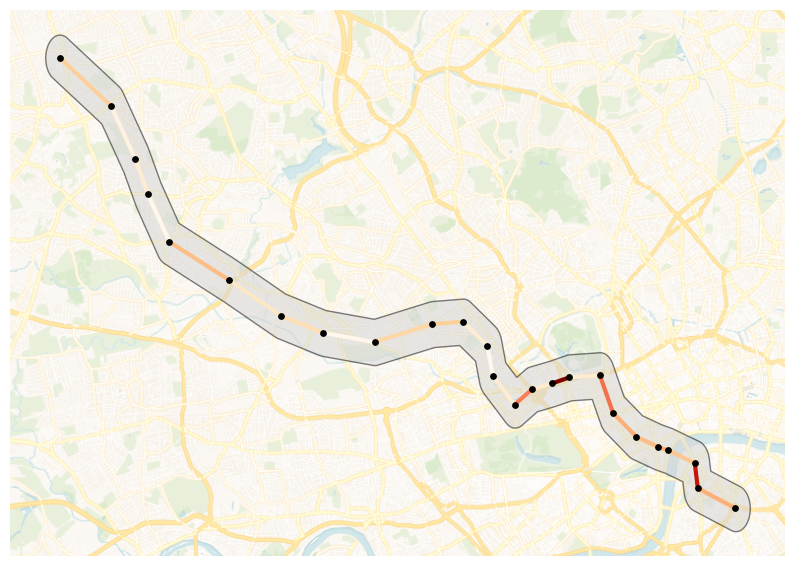

*Figure 15-7. Number of Crimes.*

So, the hot routes are starting to appear. Now, let's calculate a rate. We need to consider the length of each section of the Bakerloo Line and then calculate the number of crimes per meter. First, we'll switch the coordinate system to one that will enable us to determine the length of each section in meters and then create a new column to store the length:

``` python
bakerloo_sections["length"] = bakerloo_sections.to_crs(3310).geometry.length
```

and then calculate the crimes per meter:

``` python
bakerloo_sections["crime_per_m"] = bakerloo_sections["freq"] / bakerloo_sections["length"]
```

Finally, we can visualize the results to see the hot routes:

``` python
fig, ax = plt.subplots(figsize = (10, 10))

bakerloo_line_buff.to_crs(3857).plot(
    ax = ax,
    color = "lightgrey",
    edgecolor = "black",
    alpha = 0.5,
    zorder = 2
)

min_width, max_width = 3, 15
crime_min = bakerloo_sections.crime_per_m.min()
crime_max = bakerloo_sections.crime_per_m.max()

if crime_max != crime_min:
    linewidths = min_width + (bakerloo_sections.crime_per_m - crime_min) / (crime_max - crime_min) * (max_width - min_width)
else:
    linewidths = pd.Series(min_width, index=bakerloo_sections.index)

bakerloo_sections.to_crs(3857).plot(
    ax = ax,
    column = "crime_per_m",
    linewidth = linewidths,
    cmap = "OrRd",
    zorder = 3
)

bakerloo_stops.to_crs(3857).plot(
    ax = ax,
    color = "black",
    markersize = 15,
    zorder = 4
)

cx.add_basemap(
    ax,
    source = cx.providers.CartoDB.VoyagerNoLabels,
    attribution = "",
    zorder = 1
)

ax.set_axis_off()
```

Example output is shown in Figure 15-8.

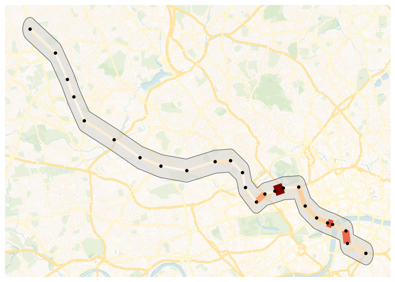

*Figure 15-8. Hot Routes.*

Bakerloo Line sections that are wider and darker in color contain more crimes per meter.

We can go a step further and use Folium to create a visualization:

``` python
London = [51.509865, -0.118092]

m = folium.Map(
    location = London,
    zoom_start = 14,
    control_scale = True
)

folium.GeoJson(
    bakerloo_line_buff.__geo_interface__,
    name = "Buffer",
).add_to(m)

HeatMap(
    data = list(zip(crimes.geometry.y, crimes.geometry.x)),
    name = "Crime Heat Map",
    radius = 10,
    blur = 15,
    max_zoom = 14
).add_to(m)

colormap = linear.OrRd_09.scale(
    bakerloo_sections.crime_per_m.min(),
    bakerloo_sections.crime_per_m.max()
)
colormap.caption = "Rate of crimes per metre"
colormap.add_to(m)

stations_cluster = MarkerCluster(name = "Stations").add_to(m)
for _, row in bakerloo_stops.iterrows():
    folium.Marker(
        location = [row.geometry.y, row.geometry.x],
        icon = folium.Icon(color = "red", icon = "train", prefix = "fa", icon_color = "white"),
        popup = row.station_name
    ).add_to(stations_cluster)

crimes_cluster = MarkerCluster(name = "Crimes").add_to(m)
for _, row in crimes.iterrows():
    folium.Marker(
        location = [row.geometry.y, row.geometry.x],
        icon = folium.Icon(icon = "info-sign"),
        popup = row.crime_type
    ).add_to(crimes_cluster)

min_width, max_width = 3, 15
crime_min, crime_max = bakerloo_sections.crime_per_m.min(), bakerloo_sections.crime_per_m.max()

def style_sections(feature):
    rate = feature["properties"]["crime_per_m"]
    if crime_max != crime_min:
        lw = min_width + (rate - crime_min) / (crime_max - crime_min) * (max_width - min_width)
    else:
        lw = min_width
    return {
        "color": colormap(rate),
        "weight": lw,
        "opacity": 0.9
    }

tooltip_fields = ["freq", "length", "crime_per_m"]
tooltip_aliases = ["Crimes", "Length (m)", "Rate per metre"]

folium.GeoJson(
    bakerloo_sections.__geo_interface__,
    name = "Sections",
    style_function = style_sections,
    tooltip = folium.GeoJsonTooltip(
        fields = tooltip_fields,
        aliases = tooltip_aliases,
        localize = True
    )
).add_to(m)

folium.LayerControl().add_to(m)
plugins.Fullscreen(
    position = "topright",
    title = "Fullscreen",
    title_cancel = "Exit",
    force_separate_button = True
).add_to(m)

hot_routes_map_html = "hot_routes_map.html"
m.save(hot_routes_map_html)
```

The map is saved locally and we’ll download it.

``` python
mime_type, _ = mimetypes.guess_type(hot_routes_map_html)

with open(hot_routes_map_html, "rb") as f:
    data = f.read()
b64 = base64.b64encode(data).decode()
href = f'<a download="{hot_routes_map_html}" href="data:{mime_type};base64,{b64}">Download {hot_routes_map_html}</a>'
HTML(href)
```

This produces a map, as shown in Figure 15-9.

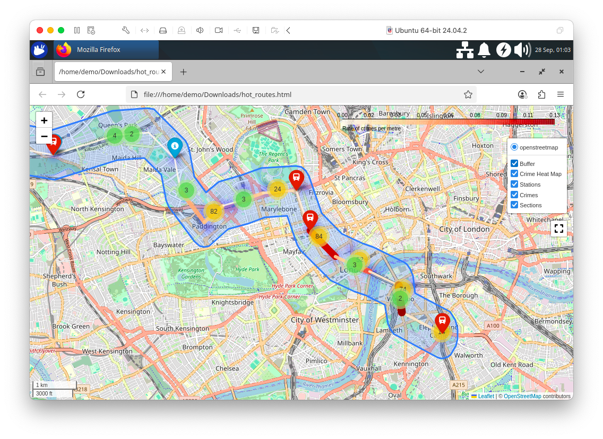

*Figure 15-9. Hot Routes using Folium.*

With our visualizations for Hot Routes now complete, let's focus our attention on creating some machine learning models.

First, we'll load the full crimes dataset:

``` python
SEED = 42

cursor = db["crimes"].find()
crimes = gpd.GeoDataFrame(
    (
        {**doc, "geometry": shape(doc["geometry"])}
        for doc in cursor
    ),
    crs = 4326
).drop(columns = ["_id"])

crimes = crimes.dropna(subset = ["crime_type", "geometry"])

if "longitude" not in crimes.columns or "latitude" not in crimes.columns:
    crimes["longitude"] = crimes.geometry.x
    crimes["latitude"] = crimes.geometry.y
```

Next, we'll build a regression model to predict how many crimes will occur at each Bakerloo Line station for a given month and crime type. We'll assign each recorded crime to its nearest station, then aggregate monthly crime counts per station and crime type. Next, we'll split the data by time, using January to November 2024 as training data, December 2024 as validation and January 2025 as the prediction target. Station names and crime types will be one-hot encoded as categorical features and we'll train a Random Forest Regressor to learn patterns in crime frequency. We'll evaluate the model's accuracy on the December data using R² and RMSE and then use the model to forecast January 2025 crime counts for each station–crime type pair.

``` python
crimes_nearest = gpd.sjoin_nearest(
    crimes,
    bakerloo_stops[["station_name", "geometry"]],
    distance_col = "dist_to_station"
)

agg = (
    crimes_nearest
    .groupby(["month", "station_name", "crime_type"])
    .size()
    .rename("crime_count")
    .reset_index()
)

train_months = [f"2024-{m:02d}" for m in range(1, 12)]
train = agg[agg["month"].isin(train_months)]
val = agg[agg["month"] == "2024-12"]
pred = agg[agg["month"] == "2025-01"]

encoder = OneHotEncoder(sparse_output = False, handle_unknown = "ignore")

X_train = encoder.fit_transform(train[["station_name", "crime_type"]])
y_train = train["crime_count"].values

X_val = encoder.transform(val[["station_name", "crime_type"]])
y_val = val["crime_count"].values

X_pred = encoder.transform(pred[["station_name", "crime_type"]])

rf = RandomForestRegressor(n_estimators = 200, random_state = SEED)
rf.fit(X_train, y_train)

y_val_pred = rf.predict(X_val)
rmse = np.sqrt(mean_squared_error(y_val, y_val_pred))
r2 = r2_score(y_val, y_val_pred)
print(f"Validation Dec 2024: R² = {r2:.4f}, RMSE = {rmse:.2f}")

pred["predicted_crime_count"] = rf.predict(X_pred)

pred.head()
```

Example output:

``` text
Validation Dec 2024: R² = 0.9858, RMSE = 4.60
```

The model is performing very well on the validation set, producing predictions that are very close to the actual December values, which suggests it has learned the historical crime patterns effectively.

Next, let's compare the model's predictions to the real observed values for Baker Street in January 2025, visualizing them side by side to see how accurate the predictions are.

``` python
baker_street = pred[pred["station_name"] == "Baker Street"].sort_values("predicted_crime_count")

x = np.arange(len(baker_street))
width = 0.35

fig, ax = plt.subplots(figsize=(12, 6))

ax.bar(
    x - width/2,
    baker_street["crime_count"],
    width,
    label = "Actual",
    color = "red",
    alpha = 0.5
)

ax.bar(
    x + width/2,
    baker_street["predicted_crime_count"],
    width,
    label = "Predicted",
    color = "blue",
    alpha = 0.5
)

ax.set_xticks(x)
ax.set_xticklabels(baker_street["crime_type"], rotation = 45, ha = "right")
ax.set_ylabel("Crime Count")
ax.set_xlabel("Crime Type")
ax.set_title("Actual vs Predicted Crime Counts at Baker Street - Jan 2025")
ax.legend()

plt.tight_layout()
plt.show()
```

Example output is shown in Figure 15-10.

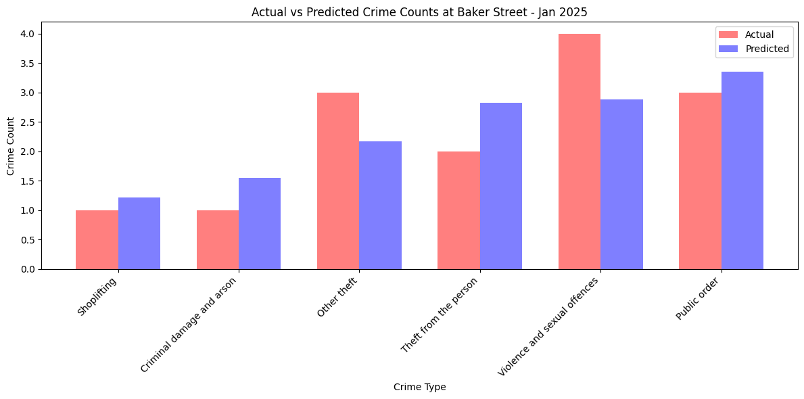

*Figure 15-10. Crime Counts at Baker Street.*

We can also extend this to the entire Bakerloo Line.

``` python
agg = pred.groupby("crime_type")[["crime_count", "predicted_crime_count"]].sum().reset_index()
agg = agg.sort_values("crime_count")

x = np.arange(len(agg))
bar_width = 0.35

fig, ax = plt.subplots(figsize=(12, 6))

ax.bar(
    x,
    agg["crime_count"],
    width = bar_width,
    label = "Actual",
    color = "red",
    alpha = 0.5
)

ax.bar(
    x + bar_width,
    agg["predicted_crime_count"],
    width = bar_width,
    label = "Predicted",
    color = "blue",
    alpha = 0.5
)

ax.set_xticks(x + bar_width/2)
ax.set_xticklabels(agg["crime_type"], rotation = 45, ha = "right")
ax.set_ylabel("Crime Count")
ax.set_xlabel("Crime Type")
ax.set_title("Predicted vs Actual Crime Counts - Jan 2025")
ax.legend()

plt.tight_layout()
plt.show()
```

Example output is shown in Figure 15-11.

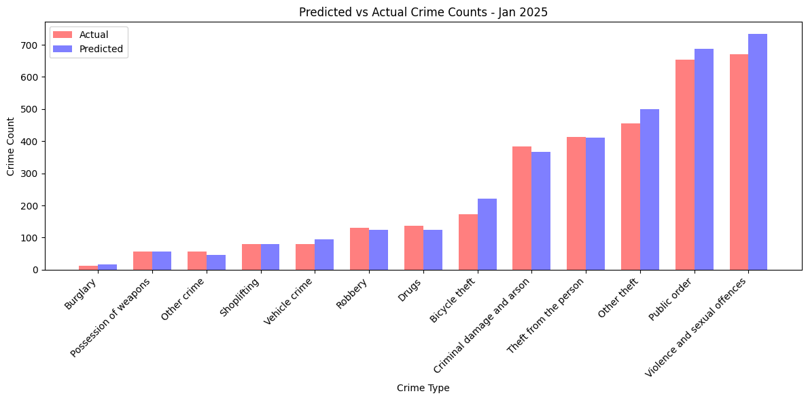

*Figure 15-11. Crime Counts for Bakerloo Line.*

This is an aggregate accuracy check by crime type.

Next, let's build a classification model to predict the type of crime likely to occur at a Bakerloo Line station, given only the station name and the month as input features. Let's see if the spatial (station) and temporal (month) patterns are strong enough to let the model predict the most likely crime type at a given station/month combination.

``` python
crimes_nearest = gpd.sjoin_nearest(
    crimes,
    bakerloo_stops[["station_name", "geometry"]],
    distance_col = "dist_to_station"
)

X = crimes_nearest[["station_name", "month"]]

encoder = OneHotEncoder(sparse_output = False, handle_unknown = "ignore")
X_encoded = encoder.fit_transform(X)

le = LabelEncoder()
y = le.fit_transform(crimes_nearest["crime_type"])

X_train, X_test, y_train, y_test = train_test_split(
    X_encoded, y, test_size = 0.3, random_state = SEED
)

clf = RandomForestClassifier(n_estimators = 200, random_state = SEED)
clf.fit(X_train, y_train)

y_pred = clf.predict(X_test)
accuracy = accuracy_score(y_test, y_pred)
print(f"Accuracy: {accuracy:.4f}")

print(classification_report(y_test, y_pred, target_names = le.classes_))
```

Example output:

``` text
Accuracy: 0.2000
                              precision    recall  f1-score   support

               Bicycle theft       0.00      0.00      0.00       876
                    Burglary       0.00      0.00      0.00        70
   Criminal damage and arson       0.14      0.00      0.01      1369
                       Drugs       0.00      0.00      0.00       461
                 Other crime       0.00      0.00      0.00       183
                 Other theft       0.11      0.02      0.04      1907
       Possession of weapons       0.00      0.00      0.00       228
                Public order       0.19      0.17      0.18      2687
                     Robbery       0.00      0.00      0.00       492
                 Shoplifting       0.00      0.00      0.00       315
       Theft from the person       0.18      0.16      0.17      1599
               Vehicle crime       0.00      0.00      0.00       385
Violence and sexual offences       0.21      0.68      0.32      2822

                    accuracy                           0.20     13394
                   macro avg       0.06      0.08      0.06     13394
                weighted avg       0.13      0.20      0.13     13394
```

The model's accuracy is very low and most classes have near-zero precision and recall, except for "Violence and sexual offences," which dominates the predictions but is also predicted incorrectly most of the time. This suggests the model is heavily biased toward the largest class because of class imbalance, while smaller classes are almost completely ignored. The poor performance is likely because the input features (`station_name` and `month`) are too weak to distinguish crime types and the large imbalance in class frequencies causes the model to mostly guess the majority category.

Finally, let's use KMeans clustering. We'll identify spatial clusters of crimes within the Bakerloo Line's surrounding buffer area. We'll merge all the buffer polygons into one shape and select only the crimes and stations that fall inside it. Then we'll run a KMeans clustering algorithm on the latitude/longitude coordinates of these crimes, grouping them into 10 clusters based purely on geographic proximity. We'll give each cluster a centroid point and calculate the size of each cluster (number of crimes). Finally, we'll plot the Bakerloo buffer, line and stations on a map and overlay the clusters as colored points sized by the number of crimes they contain. This helps visually reveal geographic hotspots of crime near the Bakerloo Line.

``` python
buffer_union = bakerloo_line_buff.unary_union

crimes_in_buffer = crimes[crimes["geometry"].apply(lambda g: g.within(buffer_union))].copy()

stations_in_buffer = bakerloo_stops[
    bakerloo_stops["geometry"].apply(lambda g: g.within(buffer_union))
].copy()

coords = crimes_in_buffer[["latitude", "longitude"]].to_numpy()
n_clusters = 10
kmeans = KMeans(n_clusters = n_clusters, random_state = SEED)
crimes_in_buffer["cluster"] = kmeans.fit_predict(coords)

cluster_counts = crimes_in_buffer.groupby("cluster").size().reset_index(name = "count")
centroids = kmeans.cluster_centers_

centroids_gdf = gpd.GeoDataFrame(
    {'cluster': range(n_clusters)},
    geometry = gpd.points_from_xy(centroids[:, 1], centroids[:, 0]),
    crs = 4326
)
centroids_gdf["count"] = cluster_counts["count"].values

fig, ax = plt.subplots(figsize = (12, 12))

gpd.GeoSeries([buffer_union], crs = 4326).to_crs(3857).plot(
    ax = ax,
    color = "lightgrey",
    alpha = 0.5,
    edgecolor = "black",
    zorder = 2
)

bakerloo_sections.to_crs(3857).plot(
    ax=ax,
    color = "#B36305",
    linewidth = 3,
    zorder = 3
)

stations_in_buffer.to_crs(3857).plot(
    ax = ax,
    color = "black",
    markersize = 15,
    zorder = 4
)

cmap = plt.get_cmap("tab10")
scatter_handles = []

centroids_sorted = centroids_gdf.sort_values("count", ascending = False).to_crs(3857)
for i, row in centroids_sorted.iterrows():
    color = cmap(row["cluster"] % 10)
    ax.scatter(row.geometry.x, row.geometry.y, s = row["count"]*5, color = color, alpha = 0.5, zorder = 5)
    scatter_handles.append(mpatches.Patch(color = color, label = f"Cluster {row['cluster']} ({row['count']})"))

ax.legend(
    handles=scatter_handles + [
        mpatches.Patch(color = "lightgrey", label = "Bakerloo Buffer"),
        mpatches.Patch(color = "#B36305", label = "Bakerloo Line"),
        mpatches.Patch(color = "black", label = "Station")
    ],
    loc = "upper right",
    fontsize = 10
)

cx.add_basemap(ax, source=cx.providers.CartoDB.VoyagerNoLabels, attribution = "", zorder = 1)

ax.set_axis_off()
ax.set_title("Crime Clusters within Bakerloo Buffer (Size ~ Number of Crimes)", fontsize = 14)
plt.show()
```

Example output is shown in Figure 15-12.

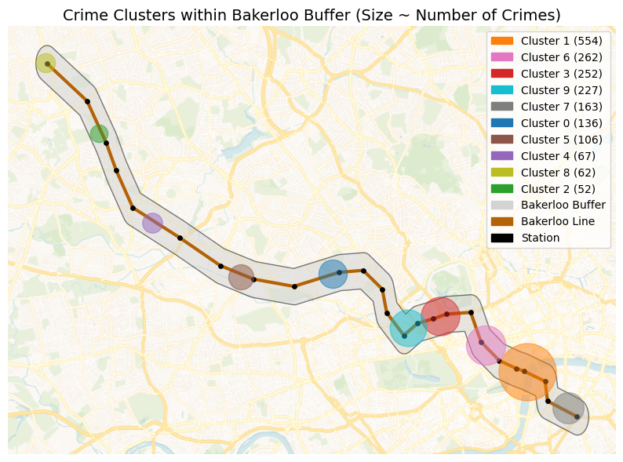

*Figure 15-12. Crime Clusters.*

The crime clustering analysis provides law enforcement agencies with a visual map of spatial hotspots along the Bakerloo Line. By aggregating all recorded crimes and identifying clusters using KMeans, agencies can quickly see where criminal activity tends to concentrate, independent of specific stations. The size of each cluster reflects the relative frequency of incidents, allowing planners to prioritize patrols, allocate resources and target interventions more effectively. The overlay of stations, line routes and buffer areas adds context, helping officers understand which parts of the transit network are most at risk. Over time, repeated analyses can reveal emerging trends or shifts in crime patterns, supporting strategic planning and proactive policing.

## Example Queries

Before running any queries, we'll first ensure that we load the Bakerloo Line buffer.

``` python
buffers = list(db["bakerloo_line_buff"].find({}))

def crime_in_buffers_filter():
    return {
        "$or": [
            {"geometry": {"$geoWithin": {"$geometry": buf["geometry"]}}}
            for buf in buffers
        ]
    }
```

Now, we'll run a query that aggregates all the crimes currently stored in the crimes collection that fall within the Bakerloo Line buffer and list the top 5 crimes.

``` python
pipeline = [
    {"$match": crime_in_buffers_filter()},
    {"$group": {"_id": "$crime_type", "count": {"$sum": 1}}},
    {"$sort": {"count": -1}},
    {"$limit": 5}
]

results = list(db.crimes.aggregate(pipeline))

if results:
    print("Crime counts by type in the Bakerloo buffer:")
    for r in results:
        print(f"{r['_id']}: {r['count']}")
else:
    print("No crimes found in the Bakerloo buffer.")
```

Example output:

``` text
Crime counts by type in the Bakerloo buffer:
Theft from the person: 373
Public order: 304
Violence and sexual offences: 292
Other theft: 267
Criminal damage and arson: 106
```

Next, let's run a query to aggregate crimes per month.

``` python
pipeline = [
    {"$match": crime_in_buffers_filter()},
    {"$group": {"_id": "$month", "count": {"$sum": 1}}},
    {"$sort": {"_id": 1}}  # chronological order
]

results = list(db.crimes.aggregate(pipeline))

if results:
    print("Crime counts per month in the Bakerloo buffer:")
    for r in results:
        print(f"{r['_id']}: {r['count']}")
else:
    print("No crimes found in the Bakerloo buffer.")
```

Example output:

``` text
Crime counts per month in the Bakerloo buffer:
2024-03: 151
2024-04: 143
2024-05: 155
2024-06: 131
2024-07: 148
2024-08: 155
2024-09: 135
2024-10: 134
2024-11: 149
2024-12: 152
2025-01: 150
```

The counts are fairly consistent, indicating relatively stable crime activity in this area over the observed months.

Next, let's run a query to calculate the number of distinct LSOAs (Lower Layer Super Output Areas) in which crimes occurred within the Bakerloo buffer. We'll filter out missing or invalid LSOA names, groups by `lsoa_name` to find unique areas and count them.

``` python
pipeline = [
    {"$match": {**crime_in_buffers_filter(), "lsoa_name": {"$nin": [None, "nan"]}}},
    {"$group": {"_id": "$lsoa_name"}},
    {"$count": "distinct_lsoas"}
]

results = list(db.crimes.aggregate(pipeline))

if results:
    print(f"Number of distinct LSOAs in the Bakerloo buffer: {results[0]['distinct_lsoas']}")
else:
    print("No LSOAs found in the Bakerloo buffer.")
```

Example output:

``` text
Number of distinct LSOAs in the Bakerloo buffer: 33
```

The result gives a sense of the geographic spread of crimes. Crimes are not all concentrated in a single neighborhood but spread across multiple areas.

Now, let's find the top 10 LSOAs by the number of crimes.

``` python
pipeline = [
    {"$match": {**crime_in_buffers_filter(), "lsoa_name": {"$nin": [None, "nan"]}}},
    {"$group": {"_id": "$lsoa_name", "count": {"$sum": 1}}},
    {"$sort": {"count": -1}},
    {"$limit": 10}
]

results = list(db.crimes.aggregate(pipeline))

if results:
    print("Top 10 LSOAs in the Bakerloo buffer:")
    for r in results:
        print(f"{r['_id']}: {r['count']}")
else:
    print("No crimes found in any LSOA in the Bakerloo buffer.")
```

Example output:

``` text
Top 10 LSOAs in the Bakerloo buffer:
Lambeth 036E: 180
Westminster 018A: 174
Westminster 018C: 132
Westminster 008D: 116
Westminster 013G: 110
Westminster 008A: 94
Westminster 020C: 80
Westminster 016B: 73
Southwark 034C: 71
Hammersmith and Fulham 001D: 56
```

The results highlight crime hotspots within the Bakerloo buffer, which could be important for policing strategies, resource allocation or targeted interventions.

Now, let's look for the top LSOAs for a specific crime type.

``` python
crime_type_to_check = "Bicycle theft"

pipeline_top = [
    {"$match": {**crime_in_buffers_filter(), "crime_type": crime_type_to_check, "lsoa_name": {"$nin": [None, "nan"]}}},
    {"$group": {"_id": "$lsoa_name", "count": {"$sum": 1}}},
    {"$sort": {"count": -1}},
    {"$limit": 5}
]

results = list(db.crimes.aggregate(pipeline_top))

if results:
    print(f"Top LSOAs for {crime_type_to_check} in the Bakerloo buffer:")
    for r in results:
        print(f"{r['_id']}: {r['count']}")
else:
    print("No LSOAs found for this crime type in the Bakerloo buffer.")
```

Example output:

``` text
Top LSOAs for Bicycle theft in the Bakerloo buffer:
Westminster 018A: 8
Harrow 013G: 6
Lambeth 036E: 3
Southwark 034C: 3
Hammersmith and Fulham 001D: 2
```

The results highlight localized hotspots for a specific crime type, which is valuable for targeted policing or prevention measures. For example, bike security campaigns in Westminster.

Now, we'll run a query that gives us the bottom LSOAs for a specific crime type.

``` python
crime_type_to_check = "Bicycle theft"

pipeline_bottom = [
    {"$match": {**crime_in_buffers_filter(), "crime_type": crime_type_to_check, "lsoa_name": {"$nin": [None, "nan"]}}},
    {"$group": {"_id": "$lsoa_name", "count": {"$sum": 1}}},
    {"$sort": {"count": 1}},
    {"$limit": 5}
]

results = list(db.crimes.aggregate(pipeline_bottom))

if results:
    print(f"Bottom LSOAs for {crime_type_to_check} in the Bakerloo buffer:")
    for r in results:
        print(f"{r['_id']}: {r['count']}")
else:
    print("No LSOAs found for this crime type in the Bakerloo buffer.")
```

Example output:

``` text
Bottom LSOAs for Bicycle theft in the Bakerloo buffer:
Westminster 016B: 1
Brent 032E: 1
Brent 008D: 1
Westminster 020C: 1
Brent 027G: 1
```

The results can be useful to identify areas with low incidence, which may either reflect safer neighborhoods or underreporting.

Next, let's find the top crimes per LSOA.

``` python
pipeline = [
    {"$match": {**crime_in_buffers_filter(), "lsoa_name": {"$nin": [None, "nan"]}, "crime_type": {"$ne": None}}},
    {"$group": {"_id": {"lsoa": "$lsoa_name", "crime": "$crime_type"}, "count": {"$sum": 1}}},
    {"$sort": {"count": -1}},
    {"$limit": 10}
]

results = list(db.crimes.aggregate(pipeline))

if results:
    print("Top crimes per LSOA in the Bakerloo buffer:")
    for r in results:
        print(f"{r['_id']['lsoa']} - {r['_id']['crime']}: {r['count']}")
else:
    print("No crimes found for any LSOA in the Bakerloo buffer.")
```

Example output:

``` text
Top crimes per LSOA in the Bakerloo buffer:
Westminster 018C - Theft from the person: 41
Westminster 018A - Violence and sexual offences: 36
Lambeth 036E - Theft from the person: 36
Westminster 018A - Public order: 33
Lambeth 036E - Other theft: 32
Westminster 018A - Other theft: 31
Lambeth 036E - Violence and sexual offences: 31
Lambeth 036E - Public order: 30
Westminster 018A - Theft from the person: 26
Westminster 018C - Other theft: 25
```

The results show a detailed view of crime concentration by type at a local level, useful for law enforcement to prioritize patrols, resource allocation or preventive measures.

We are using crime data from the British Transport Police (BTP), but can confirm this with the following query.

``` python
pipeline = [
    {"$match": {**crime_in_buffers_filter(), "reported_by": {"$nin": [None, ""]}}},
    {"$group": {"_id": "$reported_by", "count": {"$sum": 1}}},
    {"$sort": {"count": -1}}
]

results = list(db.crimes.aggregate(pipeline))

if results:
    print("Crime counts by reporting authority in the Bakerloo buffer:")
    for r in results:
        print(f"{r['_id']}: {r['count']}")
else:
    print("No crimes found for any reporting authority in the Bakerloo buffer.")
```

Example output:

``` text
Crime counts by reporting authority in the Bakerloo buffer:
British Transport Police: 1603
```

Next, let's write a query to identify the 10 crimes closest to the center near Elephant & Castle, all located within the Bakerloo line buffer.

``` python
def haversine(lon1, lat1, lon2, lat2):
    R = 6371.0
    dlon = radians(lon2 - lon1)
    dlat = radians(lat2 - lat1)
    a = sin(dlat/2)**2 + cos(radians(lat1)) * cos(radians(lat2)) * sin(dlon/2)**2
    c = 2 * atan2(sqrt(a), sqrt(1-a))
    return R * c

center_lon, center_lat = -0.1005, 51.4965

crimes_cursor = db.crimes.find(crime_in_buffers_filter())

crimes_with_dist = []
for c in crimes_cursor:
    geom = c.get("geometry")
    if geom and "coordinates" in geom:
        lon, lat = geom["coordinates"]
        dist = haversine(center_lon, center_lat, lon, lat)
        c["distance_km"] = dist
        crimes_with_dist.append(c)

top_crimes = sorted(crimes_with_dist, key = lambda x: x["distance_km"])[:10]

if top_crimes:
    crime_counts = Counter([c.get("crime_type", "Unknown") for c in top_crimes])


    print(f"Top 10 closest crimes to ({center_lat}, {center_lon}) inside the Bakerloo buffer:")
    for r in top_crimes:
        print(f"{r.get('crime_type', 'Unknown')} at {r.get('location', 'Unknown')} (Distance: {r['distance_km']:.3f} km)")

    print("\nCounts by crime type for these 10 closest crimes:")
    for crime, count in crime_counts.items():
        print(f"{crime}: {count}")
else:
    print(f"No crimes found inside the Bakerloo buffer near ({center_lat}, {center_lon}).")
```

Example output:

``` text
Top 10 closest crimes to (51.4965, -0.1005) inside the Bakerloo buffer:
Other theft at On or near Elephant And Castle (Lu Station) (Distance: 0.222 km)
Public order at On or near Elephant And Castle (Lu Station) (Distance: 0.222 km)
Other theft at On or near Elephant And Castle (Lu Station) (Distance: 0.222 km)
Theft from the person at On or near Elephant And Castle (Lu Station) (Distance: 0.222 km)
Criminal damage and arson at On or near Elephant And Castle (Lu Station) (Distance: 0.222 km)
Public order at On or near Elephant And Castle (Lu Station) (Distance: 0.222 km)
Theft from the person at On or near Elephant And Castle (Lu Station) (Distance: 0.222 km)
Violence and sexual offences at On or near Elephant And Castle (Lu Station) (Distance: 0.222 km)
Other theft at On or near Elephant And Castle (Lu Station) (Distance: 0.222 km)
Public order at On or near Elephant And Castle (Lu Station) (Distance: 0.222 km)

Counts by crime type for these 10 closest crimes:
Other theft: 3
Public order: 3
Theft from the person: 2
Criminal damage and arson: 1
Violence and sexual offences: 1
```

Even within a very small area, multiple types of crime occur, emphasizing the importance of micro-level spatial analysis in policing urban transit hubs.

Now let's try a bounding box query.

``` python
bbox = [[-0.1040, 51.4935], [-0.1000, 51.4975]]

results = db.crimes.find({
    **crime_in_buffers_filter(),
    "geometry": {"$geoWithin": {"$box": bbox}}
}).limit(10)

results_list = list(results)

if results_list:
    print(f"Crimes within bounding box {bbox} inside the Bakerloo buffer:")
    for r in results_list:
        print(f"{r.get('crime_type', 'Unknown')} at {r.get('location', 'Unknown')}")
else:
    print("No crimes found within this bounding box inside the Bakerloo buffer.")
```

Example output:

``` text
Crimes within bounding box [[-0.104, 51.4935], [-0.1, 51.4975]] inside the Bakerloo buffer:
Other theft at On or near Elephant And Castle (Lu Station)
Public order at On or near Elephant And Castle (Lu Station)
Other theft at On or near Elephant And Castle (Lu Station)
Theft from the person at On or near Elephant And Castle (Lu Station)
Criminal damage and arson at On or near Elephant And Castle (Lu Station)
Public order at On or near Elephant And Castle (Lu Station)
Theft from the person at On or near Elephant And Castle (Lu Station)
Violence and sexual offences at On or near Elephant And Castle (Lu Station)
Other theft at On or near Elephant And Castle (Lu Station)
Public order at On or near Elephant And Castle (Lu Station)
```

Each crime is reported with its type and location. Limiting to 10 keeps the output manageable while still showing the diversity of incidents.

Now, let's write a query to return up to 10 crimes that are strictly within the Bakerloo line buffer and also fall inside a defined polygon. The polygon roughly covers a small central area in London.

``` python
polygon = {
    "type": "Polygon",
    "coordinates": [[
        [-0.122 - 0.014, 51.507 - 0.009], # SW
        [-0.122 + 0.014, 51.507 - 0.009], # SE
        [-0.122 + 0.014, 51.507 + 0.009], # NE
        [-0.122 - 0.014, 51.507 + 0.009], # NW
        [-0.122 - 0.014, 51.507 - 0.009]  # back to SW
    ]]
}

combined_filter = {
    "$and": [
        {
            "$or": [
                {"geometry": {"$geoWithin": {"$geometry": buf["geometry"]}}} 
                for buf in buffers
            ]
        },
        {"geometry": {"$geoWithin": {"$geometry": polygon}}}
    ]
}

results = list(db.crimes.find(combined_filter).limit(10))

if results:
    print("Crimes strictly inside Bakerloo buffers that also intersect the polygon:")
    for r in results:
        print(f"{r.get('crime_type', 'Unknown')} at {r.get('location', 'Unknown')}")
else:
    print("No crimes found strictly inside Bakerloo buffers that intersect the polygon.")
```

Example output:

``` text
Crimes strictly inside Bakerloo buffers that also intersect the polygon:
Criminal damage and arson at On or near Waterloo (London) (Station)
Violence and sexual offences at On or near Embankment (Lu Station)
Public order at On or near Waterloo (London) (Station)
Criminal damage and arson at On or near Waterloo (London) (Station)
Theft from the person at On or near Waterloo (London) (Station)
Violence and sexual offences at On or near Waterloo (London) (Station)
Theft from the person at On or near Charing Cross (Lu Station)
Shoplifting at On or near Embankment (Lu Station)
Violence and sexual offences at On or near Waterloo (London) (Station)
Other theft at On or near Waterloo (London) (Station)
```

The results show a mix of serious and minor offenses, indicating that this area is a concentrated crime zone.

We can visualize the polygon on a map using the following code.

``` python
cursor = db["bakerloo_stops"].find()
bakerloo_stops = gpd.GeoDataFrame(
    ({**doc, "geometry": Point(doc["location"]["coordinates"])} for doc in cursor),
    crs = 4326
).drop(columns = ["_id", "location"])

cursor = db["bakerloo_sections"].find()
bakerloo_sections = gpd.GeoDataFrame(
    ({**doc, "geometry": shape(doc["geometry"])} for doc in cursor),
    crs = 4326
).drop(columns = ["_id"])

cursor = db["bakerloo_line_buff"].find()
bakerloo_line_buff = gpd.GeoDataFrame(
    ({**doc, "geometry": shape(doc["geometry"])} for doc in cursor),
    crs = 4326
).drop(columns = ["_id"])

polygon_coords = [
    [-0.136, 51.498],
    [-0.108, 51.498],
    [-0.108, 51.516],
    [-0.136, 51.516],
    [-0.136, 51.498]
]
polygon = Polygon(polygon_coords)
polygon_area = gpd.GeoDataFrame({"name": ["Area"]}, geometry = [polygon], crs = 4326)

fig, ax = plt.subplots(figsize = (10, 10))

bakerloo_line_buff.to_crs(3857).plot(
    ax = ax,
    color = "lightgrey",
    edgecolor = "black",
    alpha = 0.5,
    zorder = 2
)

bakerloo_sections.to_crs(3857).plot(
    ax = ax,
    color = "#B36305",
    linewidth = 3,
    zorder = 3
)

bakerloo_stops.to_crs(3857).plot(
    ax = ax,
    color = "black",
    markersize = 15,
    zorder = 4
)

polygon_area.to_crs(3857).plot(
    ax = ax,
    color = "red",
    edgecolor = "red",
    alpha = 0.3,
    linewidth = 2,
    zorder = 5
)

cx.add_basemap(ax, source = cx.providers.CartoDB.VoyagerNoLabels, attribution = "", zorder = 1)

ax.set_axis_off()
ax.set_title("Bakerloo Line, Stations, Buffer and Area of Interest", fontsize = 14)
plt.show()
```

Example output is shown in Figure 15-13.

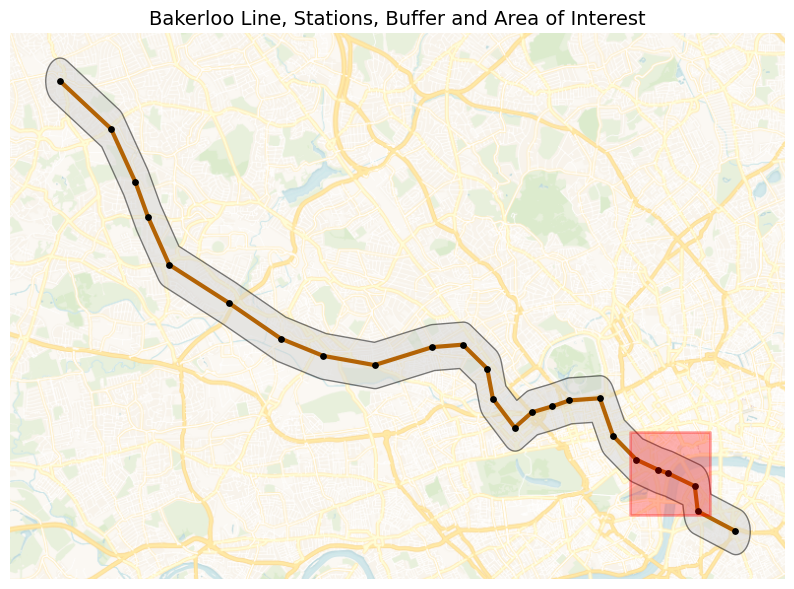

*Figure 15-13. Polygon of Interest.*

Finally, we'll find crimes within two disjoint polygons.

``` python
elephant_castle = [-0.1005, 51.4965]

harrow_wealdstone = [-0.337, 51.592]

def create_square_buffer(center, size_deg=0.0045 / 2):
    lon, lat = center
    return {
        "type": "Polygon",
        "coordinates": [[
            [lon - size_deg, lat - size_deg],
            [lon + size_deg, lat - size_deg],
            [lon + size_deg, lat + size_deg],
            [lon - size_deg, lat + size_deg],
            [lon - size_deg, lat - size_deg]
        ]]
    }

polygon1 = create_square_buffer(elephant_castle)
polygon2 = create_square_buffer(harrow_wealdstone)

pipeline = [
    {
        "$match": {
            "$or": [
                {"geometry": {"$geoWithin": {"$geometry": polygon1}}},
                {"geometry": {"$geoWithin": {"$geometry": polygon2}}}
            ]
        }
    },
    {
        "$group": {
            "_id": {
                "location": "$location",
                "crime_type": "$crime_type"
            },
            "count": {"$sum": 1}
        }
    },
    {
        "$group": {
            "_id": "$_id.location",
            "crimes": {
                "$push": {
                    "crime_type": "$_id.crime_type",
                    "count": "$count"
                }
            },
            "total": {"$sum": "$count"}
        }
    },
    {
        "$project": {
            "crimes": 1,
            # Convert total to integer
            "total": {"$toInt": "$total"}
        }
    },
    {"$limit": 10}
]

results = list(db.crimes.aggregate(pipeline))

if results:
    print("Counts by location and crime type:")
    for r in results:
        loc = r["_id"] or "Unknown"
        print(f"\n{loc} (Total: {r['total']}):")
        for c in r["crimes"]:
            print(f"  {c['crime_type']}: {c['count']}")
else:
    print("No crimes found in the specified polygons.")
```

Example output:

``` text
Counts by location and crime type:

On or near Elephant And Castle (Lu Station) (Total: 80):
  Other theft: 16
  Criminal damage and arson: 9
  Other crime: 1
  Theft from the person: 23
  Robbery: 1
  Violence and sexual offences: 11
  Bicycle theft: 3
  Possession of weapons: 1
  Public order: 15

On or near Harrow & Wealdstone (Lu Station) (Total: 61):
  Vehicle crime: 1
  Public order: 15
  Violence and sexual offences: 11
  Criminal damage and arson: 4
  Theft from the person: 11
  Bicycle theft: 6
  Other theft: 9
  Robbery: 4
```

Across the two locations, Elephant & Castle shows a higher overall crime volume, dominated by theft-related offences and some criminal damage and arson. In contrast, Harrow & Wealdstone recorded fewer total crimes but with a more mixed profile. This suggests that Elephant & Castle experiences more opportunistic crimes linked to busy, high-footfall environments, while Harrow & Wealdstone sees a broader range of offences including more confrontational crimes, despite overall lower crime numbers.

## Summary

In this chapter, we explored crime data along the Bakerloo Line to understand patterns, hotspots and trends through a combination of geospatial analysis, visualization and machine learning techniques. We began by constructing a hot routes visualization, mapping the Bakerloo Line and generating spatial buffers around each station to spatially constrain our analysis. This allowed us to focus specifically on crimes occurring in close proximity to the line, providing a clear geographic context for our insights.

Building on this foundation, we applied a series of geospatial queries to interrogate the dataset. We experimented with bounding boxes, polygons and disjoint area filters to precisely extract subsets of data and used Haversine-based distance calculations to identify the closest crimes to specific locations. We progressively enhanced these queries with the aggregation framework, allowing us to group, count and compare crime types across different spatial regions and scales, from single stations to entire corridors.

To uncover deeper patterns, we incorporated machine learning techniques, applying clustering algorithms to detect crime hotspots and exploring classification and predictive models to better understand relationships between location, crime type and frequency. These approaches revealed meaningful spatial clusters, highlighting key risk areas along the route.

Throughout this process, we combined visual and analytical methods to build a rich picture of how crime is distributed along the Bakerloo Line. The result is a multi-layered understanding of the crime landscape, from granular incidents near stations to overarching trends across the line, demonstrating how geospatial analytics and machine learning can be integrated to support data-driven decision-making and public safety insights.

[^1]:  https://www.ucl.ac.uk/jill-dando-institute/sites/jill_dando_institute/files/hot_routes_1-5_all.pdf

[^2]:  https://rekadata.net/blog/hot-routes-tutorial/

[^3]:  https://data.police.uk/data/
