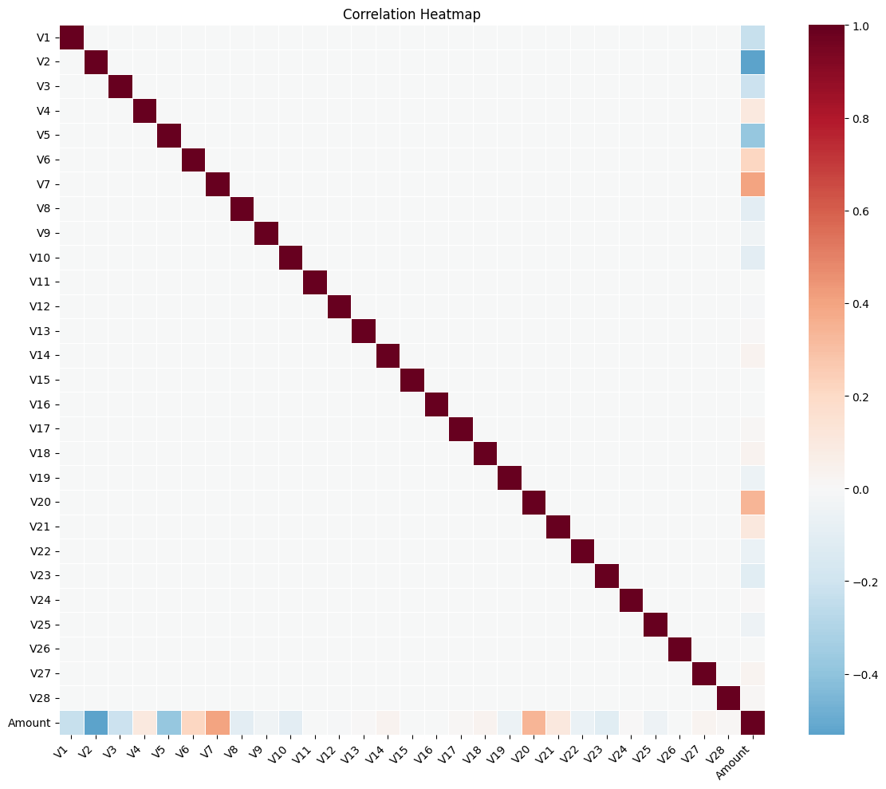
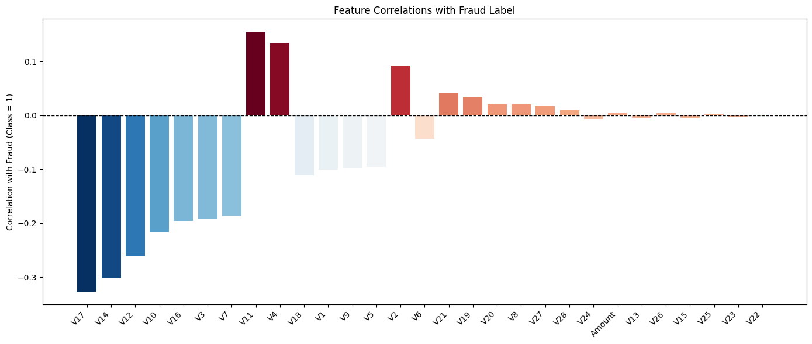
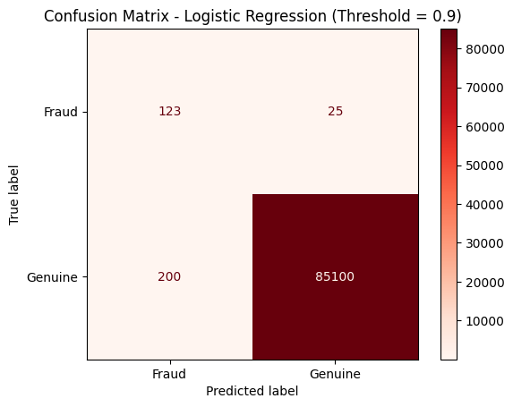
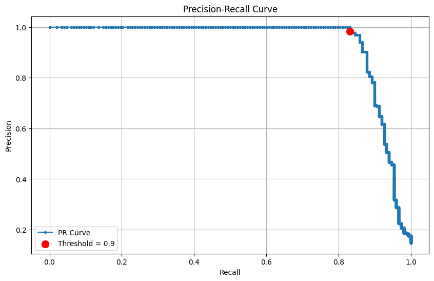
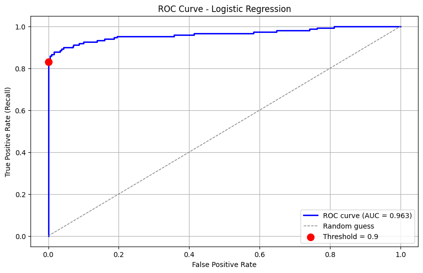

# Chapter 11: Fraud Detection

## Introduction

In an earlier chapter we looked at a dataset consisting of genuine and fraudulent transactions. We performed data loading, data analysis and modeling using Apache Spark. However, we didn't connect to a database to save our original dataset or the train and test data. We'll address these previous limitations in this chapter. We'll also undertake a more comprehensive analysis of the dataset and use `scikit-learn` to create a linear regression model, as well as consider some additional techniques to help us create a better model.

Since the original dataset is highly imbalanced and the number of fraudulent transactions is very small we'll, again, oversample the fraudulent transactions and take 1% of the genuine transactions.

## Create the Database

We'll begin by using the **SQL Editor** to create a new database, as follows:

``` sql
CREATE DATABASE IF NOT EXISTS creditcard_db;
```

## Fill out the Notebook

Now let's create a new notebook. Call it **fraud_detection_2**.

First, let's read in the full dataset:

``` python
creditcard_csv_url = ...

creditcard_df = pd.read_csv(creditcard_csv_url)
```

Next, let's count how many times each class appears:

``` python
creditcard_df["Class"].value_counts()
```

The output should be:

``` text
Class
0    284315
1       492
Name: count, dtype: int64
```

So, we have `284315` genuine transactions and `492` fraudulent transactions.

Let's save the full dataset to SingleStore for further analysis later. First, we'll create a connection:

``` python
from sqlalchemy import *

db_connection = create_engine(connection_url)
```

Next, we'll ensure that any existing data in the table are deleted:

``` python
with db_connection.begin() as conn:
    conn.execute(text(f"DROP TABLE IF EXISTS creditcard;"))
```

Then we'll write the DataFrame to SingleStore:

``` python
creditcard_df.to_sql(
    "creditcard",
    con = db_connection,
    if_exists = "replace",
    index = False,
    chunksize = 1000
)
```

We'll come back to the `creditcard` table later.

Now, let's do some plots. But, first, we'll ensure that we exclude the `Time` and `Class` columns:

``` python
X_numeric = creditcard_df[
    [c for c in creditcard_df.select_dtypes(include = "number").columns if c not in ["Time", "Class"]]
]
```

We'll now create a correlation matrix and render a heatmap:

``` python
corr_matrix = X_numeric.corr()

plt.figure(figsize = (12, 10))

sns.heatmap(
    corr_matrix,
    annot = False,
    fmt = ".2f",
    cmap = "RdBu_r",
    center = 0,
    square = False,
    cbar = True,
    linewidths = 0.5
)

plt.xticks(rotation = 45, ha = "right")
plt.yticks(rotation = 0)

plt.title("Correlation Heatmap")
plt.tight_layout()
plt.show()
```

Example output is shown in Figure 11-1.



*Figure 11-1. Correlation Heatmap.*

The correlation heatmap provides a visual overview of how the numerical features in the dataset relate to one another. Each cell in the grid represents the correlation between a pair of features, with red tones indicating positive relationships, blue tones showing negative relationships and lighter shades suggesting little or no linear relationship. While these anonymized PCA-derived `V` features cannot be directly interpreted, the heatmap is still valuable for identifying where two or more features move together and for revealing broader patterns within the data.

We can try another way and produce a correlation bar chart that shows how strongly each numerical feature in the credit card dataset is correlated with the fraud label (Class = 1), as follows:

``` python
feature_corr = (X_numeric
    .join(creditcard_df["Class"])
    .corr()["Class"]
    .drop("Class")
    .sort_values(key = abs, ascending = False)
)

cmap = sns.color_palette("RdBu_r", as_cmap = True)
normed = (feature_corr - feature_corr.min()) / (feature_corr.max() - feature_corr.min())
colors = [cmap(x) for x in normed]

plt.figure(figsize = (14, 6))
plt.bar(feature_corr.index, feature_corr.values, color = colors)
plt.axhline(0, color = "black", linewidth = 1, linestyle = "--")
plt.xticks(rotation = 45, ha = "right")

plt.ylabel("Correlation with Fraud (Class = 1)")
plt.title("Feature Correlations with Fraud Label")
plt.tight_layout()
plt.show()
```

Example output is shown in Figure 11-2.



*Figure 11-2. Feature Correlations with Fraud Label.*

The analysis highlights that certain features show the strongest positive correlations with fraudulent transactions. This suggests that higher values of these features are more likely to be associated with fraud. Although the `V` features are anonymized principal components, their statistical relationship to the fraud label makes them powerful signals for detection. Features with strong negative correlations are equally valuable as they help the model distinguish normal transactions from suspicious ones. Together, both sets of features provide complementary insights: positively correlated features point toward what fraud looks like, while negatively correlated features capture what typical, non-fraudulent behavior looks like.

We'll now create our reduced sampled dataset:

``` python
SEED = 42

sampled_df = pd.concat([
    creditcard_df[creditcard_df["Class"] == 1],
    creditcard_df[creditcard_df["Class"] == 0].sample(frac = 0.01, random_state = SEED)
]).sort_values("Time").reset_index(drop = True)
```

This produces a smaller, more manageable dataset containing all fraud cases plus 1% of non-fraud cases, ordered by transaction time. It preserves fraud signals while reducing the imbalance and dataset size, making it easier to analyze and model.

Let's take a look at the count:

``` python
sampled_df["Class"].value_counts()
```

Example output:

``` text
Class
0    2843
1     492
Name: count, dtype: int64
```

Now, let's prepare our train and test sets:

``` python
X = sampled_df.drop(columns = ["Time", "Class"])
y = sampled_df["Class"].astype(int)

X_train, X_test, y_train, y_test = train_test_split(
    X, y, test_size = 0.3, random_state = SEED, stratify = y
)
```

We'll scale the features:

``` python
scaler = StandardScaler()
X_train_scaled = scaler.fit_transform(X_train)
X_test_scaled = scaler.transform(X_test)
```

Scaling the features ensures that all variables in the dataset contribute fairly to the modeling process, regardless of their original ranges. Each feature is transformed to have a mean of `0` and a standard deviation of `1`. This step is particularly important in the credit card fraud dataset, where variables such as `Amount` can be on a very different scale compared to the PCA-derived `V` features. Without scaling, features with larger numeric ranges could dominate the learning process, leading to biased models and slower convergence during training. By standardizing the data, we create a level playing field across all features, allowing algorithms to detect meaningful patterns more effectively.

Now we'll train and fit a regression model:

``` python
model = LogisticRegression(
    max_iter = 1000,
    class_weight = "balanced",
    random_state = SEED
)
model.fit(X_train_scaled, y_train)
```

Let's try probability-based predictions with a threshold (which we can change):

``` python
y_proba = model.predict_proba(X_test_scaled)[:, 1]

threshold = 0.9
y_pred_threshold = (y_proba > threshold).astype(int)
```

We'll apply these sample weights for downsampling:

- Genuine transactions (Class = 0) are assigned a weight of 100, since only 1% are retained.

- Fraudulent transactions (Class = 1) are assigned a weight of 1, as all of them are kept.

``` python
sample_weights = y_test.apply(lambda x: 100 if x == 0 else 1)
```

Now, we'll print out our metrics:

``` python
accuracy = metrics.accuracy_score(y_test, y_pred_threshold, sample_weight = sample_weights)
precision = metrics.precision_score(y_test, y_pred_threshold, pos_label = 1, sample_weight = sample_weights)
recall = metrics.recall_score(y_test, y_pred_threshold, pos_label = 1, sample_weight = sample_weights)
f1 = metrics.f1_score(y_test, y_pred_threshold, pos_label = 1, sample_weight = sample_weights)

print(f"Weighted Accuracy: {accuracy:.4f}")
print(f"Weighted Precision: {precision:.4f}")
print(f"Weighted Recall: {recall:.4f}")
print(f"Weighted F1-score: {f1:.4f}")
```

Example output:

``` text
Weighted Accuracy: 0.9974
Weighted Precision: 0.3808
Weighted Recall: 0.8311
Weighted F1-score: 0.5223
```

The evaluation metrics reveal the strengths and limitations of the fraud detection model. At first glance, the weighted accuracy is extremely high, but this figure is deceptive due to the class imbalance, since most transactions are genuine. A more meaningful picture comes from precision and recall. The model achieves a high recall, meaning it successfully identifies the majority of fraudulent transactions. However, its precision is lower, indicating that many legitimate transactions are incorrectly flagged as fraud. The weighted F1-score, balances these two measures, reflecting the trade-off between catching fraud and avoiding false alarms. In practice, fraud detection systems often prioritize recall, since failing to detect fraudulent activity is far more costly than occasionally inconveniencing a customer with a false alert.

Now we'll print our unweighted and weighted classification reports:

``` python
print("Classification Report (Unweighted):")
print(metrics.classification_report(
    y_test,
    y_pred_threshold,
    target_names = ["Genuine", "Fraud"])
)

print("Classification Report (Weighted):")
print(metrics.classification_report(
    y_test,
    y_pred_threshold,
    target_names = ["Genuine", "Fraud"],
    sample_weight = sample_weights)
)
```

Example output:

``` text
Classification Report (Unweighted):
              precision    recall  f1-score   support

     Genuine       0.97      1.00      0.98       853
       Fraud       0.98      0.83      0.90       148

    accuracy                           0.97      1001
   macro avg       0.98      0.91      0.94      1001
weighted avg       0.97      0.97      0.97      1001

Classification Report (Weighted):
              precision    recall  f1-score   support

     Genuine       1.00      1.00      1.00   85300.0
       Fraud       0.38      0.83      0.52     148.0

    accuracy                           1.00   85448.0
   macro avg       0.69      0.91      0.76   85448.0
weighted avg       1.00      1.00      1.00   85448.0
```

The classification reports show how evaluation changes between a balanced sample and the full imbalanced dataset. On the sample, the model performs well for both classes, but when weighted for imbalance, precision for fraud drops while recall remains high. Overall accuracy appears near perfect, yet this hides the challenge of detecting the minority class, highlighting why class-specific metrics are important in fraud detection.

Let's see the weighted confusion matrix:

``` python
class_order = [1, 0]
cm = metrics.confusion_matrix(y_test, y_pred_threshold, labels = class_order, sample_weight = sample_weights)
display_labels = ["Fraud", "Genuine"]

disp = metrics.ConfusionMatrixDisplay(confusion_matrix = cm, display_labels = display_labels)
disp.plot(cmap = "Reds", values_format = ".0f")
plt.title(f"Confusion Matrix - Logistic Regression (Threshold = {threshold})")
plt.show()
```

Example output is shown in Figure 11-3.



*Figure 11-3. Confusion Matrix.*

We'll also plot the precision-recall curve:

``` python
precision_vals, recall_vals, thresholds = metrics.precision_recall_curve(y_test, y_proba)

plt.figure(figsize = (10, 6))
plt.plot(recall_vals, precision_vals, marker = ".", label = "PR Curve")

closest_idx = (np.abs(thresholds - threshold)).argmin()

plt.scatter(
    recall_vals[closest_idx],
    precision_vals[closest_idx],
    color = "red",
    s = 100,
    zorder = 5,
    label = f"Threshold = {threshold}"
)

plt.xlabel("Recall")
plt.ylabel("Precision")
plt.title("Precision-Recall Curve")
plt.legend()
plt.grid(True)
plt.show()
```

Example output is shown in Figure 11-4.



*Figure 11-4. Precision-Recall Curve.*

The precision-recall curve plots precision on the y-axis against recall on the x-axis. In this chart, precision stays at 1.0 for low recall values, meaning the model is perfectly accurate when it flags a few fraud cases. As the threshold decreases and recall increases toward 1.0, precision eventually drops, showing that capturing more fraud comes at the cost of including some false positives. The sharp drop near 0.9 illustrates the point where expanding detection begins to reduce precision.

Next, we plot the Receiver Operating Characteristic (ROC) curve and compute the Area Under the Curve (AUC):

``` python
fpr, tpr, roc_thresholds = metrics.roc_curve(y_test, y_proba)

auc_score = metrics.roc_auc_score(y_test, y_proba)

closest_idx = (np.abs(roc_thresholds - threshold)).argmin()

plt.figure(figsize = (10, 6))
plt.plot(fpr, tpr, color = "blue", lw = 2, label = f"ROC curve (AUC = {auc_score:.3f})")
plt.plot([0, 1], [0, 1], color = "gray", lw = 1, linestyle = "--", label = "Random guess")

plt.scatter(
    fpr[closest_idx],
    tpr[closest_idx],
    color = "red",
    s = 100,
    zorder = 5,
    label = f"Threshold = {threshold}"
)

plt.xlabel("False Positive Rate")
plt.ylabel("True Positive Rate (Recall)")
plt.title("ROC Curve - Logistic Regression")
plt.legend(loc="lower right")
plt.grid(True)
plt.show()
```

Example output is shown in Figure 11-5.



*Figure 11-5. ROC Curve.*

The ROC curve shows the trade-off between correctly identifying fraud (true positive rate) and mistakenly flagging genuine transactions (false positive rate). The curve rises sharply at the start, showing that the model captures most fraudulent transactions with few false alarms and then gradually flattens as it approaches the upper right, indicating that finding the remaining fraud comes with more false positives. The AUC summarizes this performance, with a higher value reflecting stronger overall discrimination between fraud and genuine transactions.

Next, we'll write the train and test data to SingleStore. First, we'll drop any existing tables:

``` python
tables = ["train_data", "test_data"]

with db_connection.begin() as conn:
    for table in tables:
        conn.execute(text(f"DROP TABLE IF EXISTS {table};"))
```

Then, we'll write the DataFrames to SingleStore:

``` python
(X_train.join(y_train)).to_sql(
    "train_data",
    con = db_connection,
    if_exists = "replace",
    index = False,
    chunksize = 1000
)

(X_test.join(y_test)).to_sql(
    "test_data",
    con = db_connection,
    if_exists = "replace",
    index = False,
    chunksize = 1000
)
```

## Example Queries

SQL offers a flexible and efficient way to explore and analyze structured data. By running targeted queries, we can quickly summarize key patterns, uncover trends and gain deeper insights from the stored dataset.

First, let's find the average amount for fraudulent vs. genuine transactions for train data:

``` sql
SELECT
    CASE
        WHEN Class = 1 THEN 'Fraud'
        WHEN Class = 0 THEN 'Genuine'
        ELSE 'Unknown'
    END AS TransactionType,
    ROUND(AVG(Amount), 2) AS AverageAmount,
    COUNT(*) AS NumberOfTransactions
FROM train_data
GROUP BY TransactionType
ORDER BY TransactionType;
```

Example output:

``` text
+-----------------+---------------+----------------------+
| TransactionType | AverageAmount | NumberOfTransactions |
+-----------------+---------------+----------------------+
| Fraud           |        116.04 |                  344 |
| Genuine         |         86.09 |                 1990 |
+-----------------+---------------+----------------------+
```

and let's repeat this for test data:

``` sql
SELECT
    CASE
        WHEN Class = 1 THEN 'Fraud'
        WHEN Class = 0 THEN 'Genuine'
        ELSE 'Unknown'
    END AS TransactionType,
    ROUND(AVG(Amount), 2) AS AverageAmount,
    COUNT(*) AS NumberOfTransactions
FROM test_data
GROUP BY TransactionType
ORDER BY TransactionType;
```

Example output:

``` text
+-----------------+---------------+----------------------+
| TransactionType | AverageAmount | NumberOfTransactions |
+-----------------+---------------+----------------------+
| Fraud           |        136.55 |                  148 |
| Genuine         |         85.92 |                  853 |
+-----------------+---------------+----------------------+
```

From these two sets of results, we can conclude that fraudulent transactions are, on average, higher in value than genuine ones, suggesting fraudsters tend to target larger amounts.

Next, let's look at fraud vs. genuine proportion in train data:

``` sql
SELECT
    CASE WHEN Class = 1 THEN 'Fraud' ELSE 'Genuine' END AS TransactionType,
    COUNT(*) AS Count,
    ROUND(COUNT(*) * 100.0 / SUM(COUNT(*)) OVER(), 2) AS Percentage
FROM train_data
GROUP BY TransactionType;
```

Example output:

``` text
+-----------------+-------+------------+
| TransactionType | Count | Percentage |
+-----------------+-------+------------+
| Genuine         |  1990 |      85.26 |
| Fraud           |   344 |      14.74 |
+-----------------+-------+------------+
```

and let's repeat this for test data:

``` sql
SELECT
    CASE WHEN Class = 1 THEN 'Fraud' ELSE 'Genuine' END AS TransactionType,
    COUNT(*) AS Count,
    ROUND(COUNT(*) * 100.0 / SUM(COUNT(*)) OVER(), 2) AS Percentage
FROM test_data
GROUP BY TransactionType;
```

Example output:

``` text
+-----------------+-------+------------+
| TransactionType | Count | Percentage |
+-----------------+-------+------------+
| Genuine         |   853 |      85.21 |
| Fraud           |   148 |      14.79 |
+-----------------+-------+------------+
```

Both train and test splits show consistent class distribution after sampling.

Next, let's find the maximum and minimum amounts for fraudulent transactions:

``` sql
SELECT
    MAX(Amount) AS MaxFraudAmount,
    MIN(Amount) AS MinFraudAmount
FROM train_data
WHERE Class = 1;
```

Example output:

``` text
+----------------+----------------+
| MaxFraudAmount | MinFraudAmount |
+----------------+----------------+
|        2125.87 |              0 |
+----------------+----------------+
```

This confirms that fraud can occur at any value but sometimes involves large amounts.

Now, let's see quartiles for fraud vs. genuine transactions:

``` sql
SELECT
    CASE WHEN Class = 1 THEN 'Fraud' ELSE 'Genuine' END AS TransactionType,
    PERCENTILE_CONT(0.25) WITHIN GROUP (ORDER BY Amount) AS Q1,
    PERCENTILE_CONT(0.50) WITHIN GROUP (ORDER BY Amount) AS Median,
    PERCENTILE_CONT(0.75) WITHIN GROUP (ORDER BY Amount) AS Q3
FROM train_data
GROUP BY TransactionType;
```

Example output:

``` text
+-----------------+------+--------------------+--------------------+
| TransactionType | Q1   | Median             | Q3                 |
+-----------------+------+--------------------+--------------------+
| Genuine         |    5 | 21.039999961853027 |  75.09499931335449 |
| Fraud           |    1 |   8.59000015258789 | 104.00749969482422 |
+-----------------+------+--------------------+--------------------+
```

Genuine transactions are concentrated in moderate amounts, while fraudulent transactions, though often small, exhibit a wider spread and can reach much higher values.

Let's count fraudulent transactions within specific amount ranges:

``` sql
SELECT
    CASE
        WHEN Amount < 50 THEN 'Low'
        WHEN Amount >= 50 AND Amount < 200 THEN 'Medium'
    ELSE 'High'
    END AS AmountRange,
    COUNT(*) AS FraudCount
FROM train_data
WHERE Class = 1
GROUP BY AmountRange
ORDER BY FraudCount DESC;
```

Example output:

``` text
+-------------+------------+
| AmountRange | FraudCount |
+-------------+------------+
| Low         |        216 |
| Medium      |         72 |
| High        |         56 |
+-------------+------------+
```

Most frauds occur in the "Low" range.

Now, let's look at the top 10 highest fraud amounts:

``` sql
SELECT Amount
FROM train_data
WHERE Class = 1
ORDER BY Amount DESC
LIMIT 10;
```

Example output:

``` text
+---------+
| Amount  |
+---------+
| 2125.87 |
| 1504.93 |
| 1389.56 |
| 1354.25 |
|    1335 |
| 1218.89 |
| 1096.99 |
|  925.31 |
|  824.83 |
|  727.91 |
+---------+
```

Fraud reaches high values, showing a tail of outliers.

Next, let's look at the fraud ratio across amount ranges:

``` sql
SELECT
    CASE
        WHEN Amount < 50 THEN 'Low'
        WHEN Amount >= 50 AND Amount < 200 THEN 'Medium'
        ELSE 'High'
    END AS AmountRange,
    COUNT(*) AS TotalTransactions,
    SUM(CASE WHEN Class = 1 THEN 1 ELSE 0 END) AS FraudCount,
    ROUND(SUM(CASE WHEN Class = 1 THEN 1 ELSE 0 END) * 100.0 / COUNT(*), 2) AS FraudPercentage
FROM train_data
GROUP BY AmountRange
ORDER BY FraudPercentage DESC;
```

Example output:

``` text
+-------------+-------------------+------------+-----------------+
| AmountRange | TotalTransactions | FraudCount | FraudPercentage |
+-------------+-------------------+------------+-----------------+
| High        |               251 |         56 |           22.31 |
| Low         |              1535 |        216 |           14.07 |
| Medium      |               548 |         72 |           13.14 |
+-------------+-------------------+------------+-----------------+
```

Fraud rates are highest in the "High" range, even though fewer transactions occur there, highlighting elevated risk at large values.

Now let's look at fraud likelihood by deciles of transaction amount:

``` sql
WITH deciles AS (
    SELECT
        Amount,
        Class,
        NTILE(10) OVER (ORDER BY Amount) AS Decile
    FROM train_data
)
SELECT
    Decile,
    COUNT(*) AS TotalTransactions,
    SUM(CASE WHEN Class = 1 THEN 1 ELSE 0 END) AS FraudCount,
    ROUND(SUM(CASE WHEN Class = 1 THEN 1 ELSE 0 END) * 100.0 / COUNT(*), 2) AS FraudPercentage
FROM deciles
GROUP BY Decile
ORDER BY Decile;
```

Example output:

``` text
+--------+-------------------+------------+-----------------+
| Decile | TotalTransactions | FraudCount | FraudPercentage |
+--------+-------------------+------------+-----------------+
|      1 |               234 |         80 |           34.19 |
|      2 |               234 |         59 |           25.21 |
|      3 |               234 |         20 |            8.55 |
|      4 |               234 |         22 |            9.40 |
|      5 |               233 |         14 |            6.01 |
|      6 |               233 |          9 |            3.86 |
|      7 |               233 |         20 |            8.58 |
|      8 |               233 |         33 |           14.16 |
|      9 |               233 |         33 |           14.16 |
|     10 |               233 |         54 |           23.18 |
+--------+-------------------+------------+-----------------+
```

Fraud is concentrated in the lowest deciles (small amounts) and the top decile (large amounts), with much lower rates in the middle.

Now we'll run some queries on the full dataset. First, let's see overall fraud prevalence:

``` sql
SELECT
    COUNT(*) AS TotalTransactions,
    SUM(CASE WHEN Class = 1 THEN 1 ELSE 0 END) AS FraudCount,
    ROUND(SUM(CASE WHEN Class = 1 THEN 1 ELSE 0 END) * 100.0 / COUNT(*), 4) AS FraudPercentage
FROM creditcard;
```

Example output:

``` text
+-------------------+------------+-----------------+
| TotalTransactions | FraudCount | FraudPercentage |
+-------------------+------------+-----------------+
|            284807 |        492 |          0.1727 |
+-------------------+------------+-----------------+
```

Fraud is rare overall at just 0.17% of all transactions, showing the severe class imbalance.

Now, let's look at fraud vs. genuine by amount ranges:

``` sql
SELECT
    CASE
        WHEN Amount < 50 THEN 'Low'
        WHEN Amount >= 50 AND Amount < 200 THEN 'Medium'
        ELSE 'High'
    END AS AmountRange,
    COUNT(*) AS TotalTransactions,
    SUM(CASE WHEN Class = 1 THEN 1 ELSE 0 END) AS FraudCount,
    ROUND(SUM(CASE WHEN Class = 1 THEN 1 ELSE 0 END) * 100.0 / COUNT(*), 4) AS FraudPercentage
FROM creditcard
GROUP BY AmountRange
ORDER BY FraudPercentage DESC;
```

Example output:

``` text
+-------------+-------------------+------------+-----------------+
| AmountRange | TotalTransactions | FraudCount | FraudPercentage |
+-------------+-------------------+------------+-----------------+
| High        |             29315 |         85 |          0.2900 |
| Low         |            189704 |        305 |          0.1608 |
| Medium      |             65788 |        102 |          0.1550 |
+-------------+-------------------+------------+-----------------+
```

High-value transactions have the greatest fraud percentage, although most frauds still occur in low-value transactions simply because they are far more frequent.

Now, let's look at fraud by deciles of transaction amount:

``` sql
WITH deciles AS (
    SELECT
        Amount,
        Class,
        NTILE(10) OVER (ORDER BY Amount) AS Decile
    FROM creditcard
)
SELECT
    Decile,
    COUNT(*) AS TotalTransactions,
    SUM(CASE WHEN Class = 1 THEN 1 ELSE 0 END) AS FraudCount,
    ROUND(SUM(CASE WHEN Class = 1 THEN 1 ELSE 0 END) * 100.0 / COUNT(*), 4) AS FraudPercentage
FROM deciles
GROUP BY Decile
ORDER BY Decile;
```

Example output:

``` text
+--------+-------------------+------------+-----------------+
| Decile | TotalTransactions | FraudCount | FraudPercentage |
+--------+-------------------+------------+-----------------+
|      1 |             28481 |        165 |          0.5793 |
|      2 |             28481 |         43 |          0.1510 |
|      3 |             28481 |         36 |          0.1264 |
|      4 |             28481 |         13 |          0.0456 |
|      5 |             28481 |         14 |          0.0492 |
|      6 |             28481 |         17 |          0.0597 |
|      7 |             28481 |         24 |          0.0843 |
|      8 |             28480 |         50 |          0.1756 |
|      9 |             28480 |         45 |          0.1580 |
|     10 |             28480 |         85 |          0.2985 |
+--------+-------------------+------------+-----------------+
```

Fraud clusters in the lowest decile and the highest decile, echoing the U-shaped risk seen in the sample.

We'll now look at extreme fraud amounts (90th, 95th, 99th percentiles):

``` sql
SELECT
    PERCENTILE_CONT(0.90) WITHIN GROUP (ORDER BY Amount) AS P90,
    PERCENTILE_CONT(0.95) WITHIN GROUP (ORDER BY Amount) AS P95,
    PERCENTILE_CONT(0.99) WITHIN GROUP (ORDER BY Amount) AS P99
FROM creditcard
WHERE Class = 1;
```

Example output:

``` text
+-------------------+-------------------+--------------------+
| P90               | P95               | P99                |
+-------------------+-------------------+--------------------+
| 346.7460021972656 | 640.9049865722657 | 1357.4279052734375 |
+-------------------+-------------------+--------------------+
```

The top 1% of fraud attempts involve large sums.

Now let's look at the top 10 highest fraud amounts:

``` sql
SELECT Amount
FROM creditcard
WHERE Class = 1
ORDER BY Amount DESC
LIMIT 10;
```

Example output:

``` text
+---------+
| Amount  |
+---------+
| 2125.87 |
| 1809.68 |
| 1504.93 |
| 1402.16 |
| 1389.56 |
| 1354.25 |
|    1335 |
| 1218.89 |
| 1096.99 |
|  996.27 |
+---------+
```

There are some high-value attacks.

Now, let's look at fraud vs. genuine counts by quartile of transaction amount:

``` sql
SELECT AmountQuartile, COUNT(*) AS TransactionCount
FROM (
    SELECT 
        CASE 
            WHEN Amount < 50 THEN 'Low'
            WHEN Amount BETWEEN 50 AND 200 THEN 'Medium'
            WHEN Amount BETWEEN 200 AND 500 THEN 'High'
            ELSE 'Very High'
        END AS AmountQuartile
    FROM creditcard
) t
GROUP BY AmountQuartile;
```

Example output:

``` text
+----------------+------------------+
| AmountQuartile | TransactionCount |
+----------------+------------------+
| Medium         |            66266 |
| Low            |           189704 |
| High           |            19695 |
| Very High      |             9142 |
+----------------+------------------+
```

Most transactions are in the "Low" range, but meaningful fraud also appears in higher quartiles.

Let's look at the distribution of fraud on a daily basis:

``` sql
SELECT
    FLOOR(Time/86400) AS DayNumber,
    COUNT(*) AS TotalTransactions,
    SUM(CASE WHEN Class = 1 THEN 1 ELSE 0 END) AS FraudCount,
    ROUND(SUM(CASE WHEN Class = 1 THEN 1 ELSE 0 END) * 100.0 / COUNT(*), 4) AS FraudPercentage
FROM creditcard
GROUP BY DayNumber
ORDER BY DayNumber;
```

Example output:

``` text
+-----------+-------------------+------------+-----------------+
| DayNumber | TotalTransactions | FraudCount | FraudPercentage |
+-----------+-------------------+------------+-----------------+
|         0 |            144786 |        281 |          0.1941 |
|         1 |            140021 |        211 |          0.1507 |
+-----------+-------------------+------------+-----------------+
```

Fraud prevalence is stable across days, showing no strong spikes.

Finally, let's look at the daily fraud distribution by amount range:

``` sql
SELECT
    FLOOR(Time/86400) AS DayNumber,
    CASE
        WHEN Amount < 50 THEN 'Low'
        WHEN Amount >= 50 AND Amount < 200 THEN 'Medium'
        ELSE 'High'
    END AS AmountRange,
    COUNT(*) AS TotalTransactions,
    SUM(CASE WHEN Class = 1 THEN 1 ELSE 0 END) AS FraudCount,
    ROUND(SUM(CASE WHEN Class = 1 THEN 1 ELSE 0 END) * 100.0 / COUNT(*), 4) AS FraudPercentage
FROM creditcard
GROUP BY DayNumber, AmountRange
ORDER BY DayNumber, AmountRange;
```

Example output:

``` text
+-----------+-------------+-------------------+------------+-----------------+
| DayNumber | AmountRange | TotalTransactions | FraudCount | FraudPercentage |
+-----------+-------------+-------------------+------------+-----------------+
|         0 | High        |             15321 |         49 |          0.3198 |
|         0 | Low         |             94918 |        168 |          0.1770 |
|         0 | Medium      |             34547 |         64 |          0.1853 |
|         1 | High        |             13994 |         36 |          0.2573 |
|         1 | Low         |             94786 |        137 |          0.1445 |
|         1 | Medium      |             31241 |         38 |          0.1216 |
+-----------+-------------+-------------------+------------+-----------------+
```

Fraud percentages are consistently higher for "High" amount transactions across both days, while "Low" and "Medium" transactions make up the majority of the total volume.

Overall, when examining fraud by transaction amount, a clear pattern emerges. Small purchases dominate the dataset, yet they rarely involve fraud. Medium-sized purchases show a modest increase in fraud, but it remains uncommon. The real signal comes from high-value transactions, where the fraud rate rises sharply. Across days, this pattern is consistent: fraud is concentrated in higher-value transactions and is distributed fairly evenly over time rather than clustering on specific days. This suggests that while most transactions are low-risk, focusing monitoring and controls on larger amounts could provide the greatest benefit in fraud detection.

## Summary

We began by bringing in the credit card transaction data and carefully preparing it for analysis. Splitting it into training and testing sets allowed us to explore patterns without biasing the results. Early statistics revealed a clear imbalance: genuine transactions vastly outnumbered fraudulent ones. Diving deeper, we examined transaction amounts and discovered a trend that most purchases were small and low-risk, while high-value transactions, though rare, carried a much higher likelihood of fraud. Looking at temporal patterns, we saw that fraudulent attempts were spread fairly evenly over time, without obvious spikes on particular days or hours. By combining statistical summaries with charts and visualizations, we were able to map the landscape of fraud clearly, showing where attention and monitoring would be most valuable. In conclusion, this journey from raw data to insight highlighted a simple but powerful message: while most transactions are low-risk, focusing controls on higher-value activity offers the greatest potential for preventing fraud.
