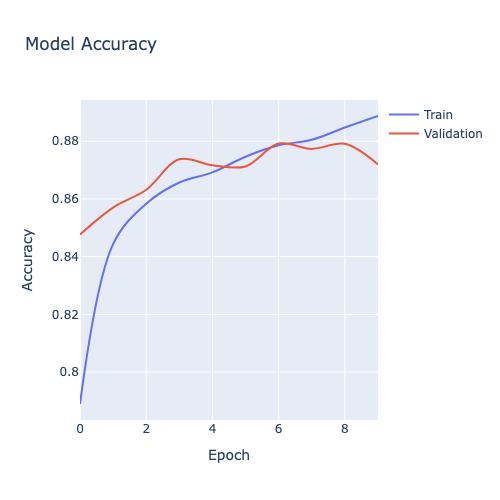
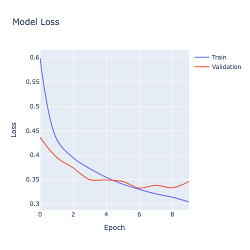
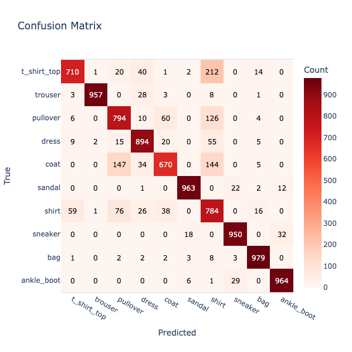
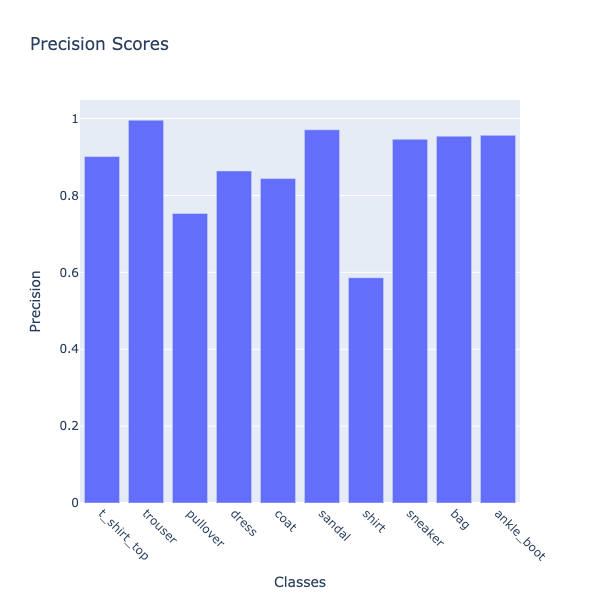
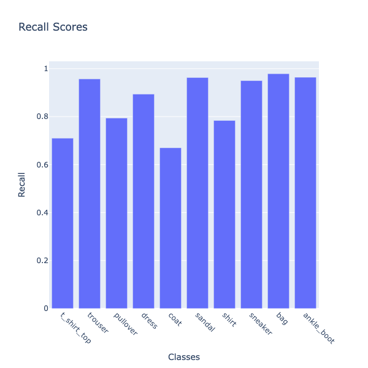
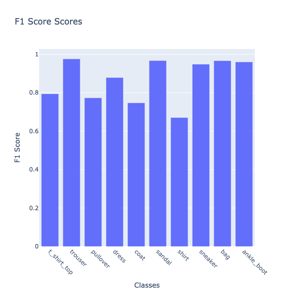
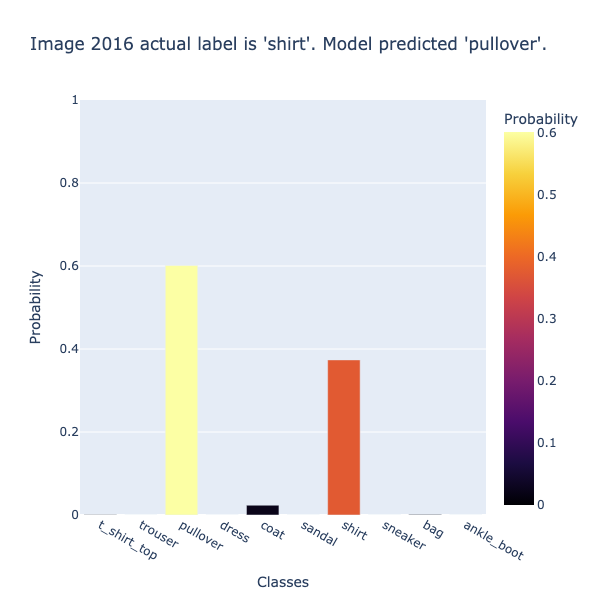

# Chapter 12: Image Classification

## Introduction

Image classification can have many practical, valuable and life-saving benefits. The "Hello World" of image classification is often considered MNIST and, more recently, Fashion MNIST. In this chapter, we'll use Fashion MNIST, build an image classification model using Keras and TensorFlow and store the prediction results in SingleStore.

## Create the Database and Table

In the SingleStore Portal, let's use the **SQL Editor** to create a new database. Call this `image_db`, as follows:

```sql
CREATE DATABASE IF NOT EXISTS image_db;
```

We'll also create a table to store the image classification model, as follows:

```sql
USE image_db;

DROP TABLE IF EXISTS predictions;
CREATE TABLE IF NOT EXISTS predictions (
    id INT PRIMARY KEY,
    label VARCHAR(20),
    t_shirt_top FLOAT,
    trouser FLOAT,
    pullover FLOAT,
    dress FLOAT,
    coat FLOAT,
    sandal FLOAT,
    shirt FLOAT,
    sneaker FLOAT,
    bag FLOAT,
    ankle_boot FLOAT
);
```

## Fill out the Notebook

Let's now create a new Python notebook. We'll call it **image_classification**.

First, we'll load the dataset:

```python
(train_images, train_labels), (test_images, test_labels) = fashion_mnist.load_data()
```

The train and test labels range from 0 to 9 and we can map them as follows:

```python
classes = [
    "t_shirt_top",
    "trouser",
    "pullover",
    "dress",
    "coat",
    "sandal",
    "shirt",
    "sneaker",
    "bag",
    "ankle_boot"
]
```

Since we have the full dataset, we can quickly create an image classification model using Keras.

First, we'll normalize the data, as follows:

```python
train_images = train_images.astype("float32") / 255.0
test_images = test_images.astype("float32") / 255.0
```

Next, we'll build a simple neural network that takes 28x28 pixel images as input, flattens them into a single list of numbers and processes them through one hidden layer with 128 neurons using ReLU activation. It then outputs probabilities for 10 possible classes using a softmax layer. The model is set up to learn using the Adam optimizer and measures its accuracy while training:

```python
model = keras.Sequential(layers = [
    keras.Input(shape = (28, 28)),
    keras.layers.Flatten(),
    keras.layers.Dense(128, activation = "relu"),
    keras.layers.Dropout(0.3),
    keras.layers.Dense(10, activation = "softmax")
])

model.compile(optimizer = "adam",
              loss = "sparse_categorical_crossentropy",
              metrics = ["accuracy"]
)

model.summary()
```

Now, we'll train the neural network on the training images and labels. We'll use batches of 60 images at a time and run through the entire dataset 10 times (epochs), keep aside 20% of the data to check how well the model is doing on unseen examples during training (validation):

```python
history = model.fit(
    train_images,
    train_labels,
    batch_size = 60,
    epochs = 10,
    validation_split = 0.2,
    shuffle = True,
    verbose = 2
)
```

Next, we'll create a function to help plot model accuracy and model loss, as follows:

```python
def plot_history(history, metric, title = None, width = 500, height = 500, smooth = True):

    line_type = "spline" if smooth else "linear"
    fig = go.Figure([
        go.Scatter(
            y = history.history[metric],
            name = "Train",
            mode = "lines",
            line_shape = line_type
        ),
        go.Scatter(
            y = history.history[f"val_{metric}"],
            name = "Validation",
            mode = "lines",
            line_shape = line_type
        )
    ])
    fig.update_layout(
        title = title or metric.capitalize(),
        xaxis_title = "Epoch",
        yaxis_title = metric.capitalize(),
        width = width,
        height = height
    )
    fig.show()
```

We'll check the model accuracy using the following code:

```python
plot_history(history, "accuracy", title = "Model Accuracy")
```

Model accuracy increases over time, as shown in Figure 12-1.



*Figure 12-1. Model Accuracy.*

Similarly, we can check the model loss with the following code:

```python
plot_history(history, "loss", title = "Model Loss")
```

Model loss decreases over time, as shown in Figure 12-2.



*Figure 12-2. Model Loss.*

We'll check the accuracy on the test data:

```python
(loss, accuracy) = model.evaluate(test_images, test_labels, verbose = 2)
```

and the results appear good:

```text
313/313 - 1s - 2ms/step - accuracy: 0.8665 - loss: 0.3681
```

We'll now create predictions and look at the one set of predictions:

```python
predictions = model.predict(test_images)

print(predictions[0])
```

Example output:

```text
313/313 ━━━━━━━━━━━━━━━━━━━━ 0s 1ms/step
[2.4978769e-07 1.2354002e-07 1.9421823e-07 3.9149125e-08 2.1874310e-07
 5.0949887e-03 1.4335438e-06 1.2482504e-02 8.1785151e-07 9.8241931e-01]
```

Visualizing the results as a Confusion Matrix could provide valuable insights so, first we'll prepare, as follows:

```python
predicted_labels = np.argmax(predictions, axis = 1)

cm = metrics.confusion_matrix(test_labels, predicted_labels)

precision_scores = metrics.precision_score(test_labels, predicted_labels, average = None)
recall_scores = metrics.recall_score(test_labels, predicted_labels, average = None)
```

and then we'll render it, as follows:

```python
data = go.Heatmap(
    z = cm,
    x = classes,
    y = classes,
    colorscale = "Reds",
    colorbar = dict(title = "Count")
)

annotations = []
thresh = cm.max() / 2

for i, row in enumerate(cm):
    for j, value in enumerate(row):
        annotations.append(
            {
                "x": classes[j],
                "y": classes[i],
                "font": {"color": "white" if value > thresh else "black"},
                "text": str(value),
                "xref": "x1",
                "yref": "y1",
                "showarrow": False,
            }
        )

layout = {
    "title": "Confusion Matrix",
    "xaxis": {"title": "Predicted"},
    "yaxis": {
        "title": "True",
        "autorange": "reversed"
    },
    "annotations": annotations,
    "width": 600,
    "height": 600,
    "margin": dict(l = 100, r = 100, t = 100, b = 100),
    "yaxis_scaleanchor": "x",
    "yaxis_scaleratio": 1
}

fig = go.Figure(data = data, layout = layout)
fig.show()
```

This outputs the result shown in Figure 12-3.



*Figure 12-3. Confusion Matrix.*

We can see that the model is less accurate for some fashion items. This is because items may appear quite similar, such as Shirts and T-Shirts.

Next, we'll create a plotting function that will help us render Precision, Recall and F1-Score:

```python
def plot_metric_scores(metric_fn, test_labels, predictions, classes, metric_name):

    if predictions.ndim > 1:
        predicted_labels = np.argmax(predictions, axis = 1)
    else:
        predicted_labels = predictions

    scores = metric_fn(test_labels, predicted_labels, average = None)

    fig = px.bar(
        x = classes,
        y = scores,
        labels = dict(x = "Classes", y = metric_name),
        title = f"{metric_name} Scores"
    )
    fig.update_xaxes(tickangle = 45)
    fig.update_layout(width = 600, height = 600, autosize = False)
    fig.show()
```

First, we'll plot Precision:

```python
plot_metric_scores(metrics.precision_score, test_labels, predictions, classes, "Precision")
```

This outputs the result shown in Figure 12-4.



*Figure 12-4. Precision.*

Precision measures how often the model's predictions for a given class are correct. Among the clothing categories, shirts stand out as the one the model most often misclassifies.

Next, we'll calculate the Recall for each class in the image classification task.

```python
plot_metric_scores(metrics.recall_score, test_labels, predictions, classes, "Recall")
```

This outputs the result shown in Figure 12-5.



*Figure 12-5. Recall.*

Recall measures how many actual items of a given class the model successfully identifies. Coat stands out as the clothing category the model most often fails to recognize correctly.

Finally, we'll plot the F1-Score.

```python
plot_metric_scores(metrics.f1_score, test_labels, predictions, classes, "F1 Score")
```

This outputs the result shown in Figure 12-6.



*Figure 12-6. F1-Score.*

The F1-score balances both precision and recall, giving a single measure of overall classification quality for each class. Shirts again emerge as the weakest category, showing that the model struggles not only with making correct predictions but also with capturing most of the actual shirt items.

We'll now take the model predictions and a create a DataFrame where each row is one test item, with:

- An ID.

- The true label.

- A set of predicted probabilities across all classes.

as follows:

```python
predictions_df = pd.DataFrame(
    predictions.astype(float),
    columns = classes
)

predictions_df.insert(0, "id", np.arange(len(test_labels)))
predictions_df["label"] = [classes[label] for label in test_labels]
```

We don't need to store the predicted class explicitly, since it can always be derived when required. Our DataFrame is ready to write to SingleStore, but just before we do that let's create a visualization.

We'll create a function that takes an image ID, looks up its actual label and the model's predicted probabilities and then displays the image along with a bar chart showing the probability assigned to each class. The chart's title indicates whether the model's prediction was correct or incorrect, making it easy to visually inspect both the image and the model's confidence.

```python
def show_prediction(selected_id):
    row = predictions_df[predictions_df["id"] == selected_id]

    if row.empty:
        print(f"No data found for id = {selected_id}")
        return

    prob_cols = [col for col in predictions_df.columns if col not in ["id", "label"]]
    probabilities = row[prob_cols].values.flatten()
    actual_label = row["label"].values[0]

    predicted_label = prob_cols[probabilities.argmax()]
    correct = (actual_label == predicted_label)

    title_msg = f"Image {selected_id} actual label is '{actual_label}'. "
    title_msg += "Prediction is correct." if correct else f"Model predicted '{predicted_label}'."

    fig = px.imshow(test_images[selected_id], color_continuous_scale = "gray_r")
    fig.update_xaxes(showticklabels = False).update_yaxes(showticklabels = False)
    fig.update_layout(
        width = 100,
        height = 100,
        margin = dict(l = 0, r = 0, t = 0, b = 0),
        coloraxis_showscale = False
    )
    fig.show()

    bar = px.bar(
        x = prob_cols,
        y = probabilities,
        color = probabilities,
        color_continuous_scale = "inferno",
        labels = {"x": "Classes", "y": "Probability"},
        title = title_msg
    )
    bar.update_layout(
        coloraxis_colorbar = dict(title = "Probability"),
        width = 600,
        height = 600,
        yaxis = dict(range = [0, 1])
    )
    bar.show()
```

The following code creates an interactive slider in the notebook that lets us pick an image ID between 0 and 9999. When we move the slider, it automatically calls the `show_prediction` function for the selected ID, so we can instantly see the image, its predicted probabilities and whether the model was correct.

```python
slider = widgets.IntSlider(value = 0, min = 0, max = 9999, step = 1, description = "ID:")
_ = widgets.interact(show_prediction, selected_id = slider)
```

Example output is shown in Figure 12-7.



*Figure 12-7. Example Predictions.*

Let's now save the predictions in SingleStore. First, we'll create a connection:

```python
from sqlalchemy import *

db_connection = create_engine(connection_url)
```

Then we'll ensure that the table is empty:

```python
with db_connection.begin() as conn:
    conn.execute(text("TRUNCATE TABLE predictions;"))
```

Finally, we'll write the DataFrame to the table:

```python
predictions_df.to_sql(
    "predictions",
    con = db_connection,
    if_exists = "append",
    index = False,
    chunksize = 1000
)
```

## Example Queries

Let's now run some queries on the Predictions table. We'll start by creating a View:

```sql
CREATE VIEW predictions_with_max AS
SELECT
    *,
    GREATEST(
        t_shirt_top, trouser, pullover, dress, coat,
        sandal, shirt, sneaker, bag, ankle_boot
    ) AS max_prob,
    CASE GREATEST(
        t_shirt_top, trouser, pullover, dress, coat,
        sandal, shirt, sneaker, bag, ankle_boot
    )
        WHEN t_shirt_top THEN 't_shirt_top'
        WHEN trouser THEN 'trouser'
        WHEN pullover THEN 'pullover'
        WHEN dress THEN 'dress'
        WHEN coat THEN 'coat'
        WHEN sandal THEN 'sandal'
        WHEN shirt THEN 'shirt'
        WHEN sneaker THEN 'sneaker'
        WHEN bag THEN 'bag'
        ELSE 'ankle_boot'
    END AS predicted_class
FROM predictions;
```

This makes it much easier to analyze predictions, such as computing accuracy, creating a confusion matrix and confidence levels, without recalculating `GREATEST` and `CASE` each time.

Let's start by showing a few predictions with the top-scoring class:

```sql
SELECT id, label, max_prob, predicted_class
FROM predictions_with_max
LIMIT 5;
```

Example output:

```text
+-----+------------+--------------------+-----------------+
| id  | label      | max_prob           | predicted_class |
+-----+------------+--------------------+-----------------+
|   0 | ankle_boot | 0.9824193120002747 | ankle_boot      |
|  43 | sneaker    | 0.8030625581741333 | sneaker         |
|  62 | bag        | 0.9999998211860657 | bag             |
|  74 | pullover   |  0.761057436466217 | pullover        |
| 108 | ankle_boot | 0.9990979433059692 | ankle_boot      |
+-----+------------+--------------------+-----------------+
```

We see that all top predictions are correct and with high confidence.

Next, let's count how many predictions were very confident (\> 0.9):

```sql
SELECT COUNT(*) AS very_confident
FROM predictions_with_max
WHERE max_prob > 0.9;
```

Example output:

```text
+----------------+
| very_confident |
+----------------+
|           6460 |
+----------------+
```

Out of 10,000 clothing items, the model is very confident on a large number of items.

Let's now find the most common predicted class:

```sql
SELECT predicted_class, COUNT(*) AS count
FROM predictions_with_max
GROUP BY predicted_class
ORDER BY count DESC;
```

Example output:

```text
+-----------------+-------+
| predicted_class | count |
+-----------------+-------+
| shirt           |  1338 |
| pullover        |  1054 |
| dress           |  1035 |
| bag             |  1026 |
| ankle_boot      |  1008 |
| sneaker         |  1004 |
| sandal          |   992 |
| trouser         |   961 |
| coat            |   794 |
| t_shirt_top     |   788 |
+-----------------+-------+
```

We see that **shirt** is predicted most often and **t_shirt_top** least, which shows some class imbalance or model bias.

Let's now look at the top most confident predictions for **sneakers**:

```sql
SELECT id, label, max_prob
FROM predictions_with_max
WHERE predicted_class = 'sneaker'
ORDER BY max_prob DESC
LIMIT 5;
```

Example output:

```text
+------+---------+--------------------+
| id   | label   | max_prob           |
+------+---------+--------------------+
| 3742 | sneaker | 0.9999889731407166 |
| 7918 | sneaker | 0.9999703764915466 |
| 3784 | sneaker | 0.9999698996543884 |
| 8942 | sneaker | 0.9999662041664124 |
| 9869 | sneaker | 0.9999658465385437 |
+------+---------+--------------------+
```

We see extremely confident predictions that are good for deployment.

Now, let's look at predictions with low confidence:

```sql
SELECT id, label, max_prob, predicted_class
FROM predictions_with_max
WHERE max_prob < 0.5
ORDER BY max_prob ASC
LIMIT 10;
```

Example output:

```text
+------+-------------+---------------------+-----------------+
| id   | label       | max_prob            | predicted_class |
+------+-------------+---------------------+-----------------+
|  531 | t_shirt_top |  0.2181243896484375 | sandal          |
| 7769 | dress       |  0.2204117327928543 | shirt           |
| 1207 | t_shirt_top | 0.23729507625102997 | dress           |
| 2817 | dress       |  0.2463635802268982 | shirt           |
| 8658 | shirt       | 0.24661092460155487 | t_shirt_top     |
| 3609 | t_shirt_top | 0.24724265933036804 | bag             |
| 1399 | t_shirt_top |  0.2492251694202423 | shirt           |
| 9366 | coat        |  0.2513481080532074 | coat            |
|  222 | pullover    | 0.25214266777038574 | pullover        |
| 8708 | dress       | 0.26301655173301697 | dress           |
+------+-------------+---------------------+-----------------+
```

There is some ambiguity, such as **t_shirt_top** predicted as **sandal**. The model struggles with confusing images.

Next, let's look at the distribution of max probabilities:

```sql
SELECT
    CASE
        WHEN max_prob < 0.2 THEN '0-0.2'
        WHEN max_prob < 0.4 THEN '0.2-0.4'
        WHEN max_prob < 0.6 THEN '0.4-0.6'
        WHEN max_prob < 0.8 THEN '0.6-0.8'
        WHEN max_prob < 0.9 THEN '0.8-0.9'
        ELSE '0.9-1.0'
    END AS prob_bin,
    COUNT(*) AS count
FROM predictions_with_max
GROUP BY prob_bin
ORDER BY prob_bin;
```

Example output:

```text
+----------+-------+
| prob_bin | count |
+----------+-------+
| 0.2-0.4  |   137 |
| 0.4-0.6  |  1210 |
| 0.6-0.8  |  1344 |
| 0.8-0.9  |   849 |
| 0.9-1.0  |  6460 |
+----------+-------+
```

Most predictions are greater than 0.9 and few are less than 0.6, which shows high overall confidence.

Next, let's find the most frequently misclassified true class:

```sql
SELECT label AS true_class, predicted_class, COUNT(*) AS count
FROM predictions_with_max
WHERE label <> predicted_class
GROUP BY label, predicted_class
ORDER BY count DESC
LIMIT 10;
```

Example output:

```text
+-------------+-----------------+-------+
| true_class  | predicted_class | count |
+-------------+-----------------+-------+
| t_shirt_top | shirt           |   212 |
| coat        | pullover        |   147 |
| coat        | shirt           |   144 |
| pullover    | shirt           |   126 |
| shirt       | pullover        |    76 |
| pullover    | coat            |    60 |
| shirt       | t_shirt_top     |    59 |
| dress       | shirt           |    55 |
| t_shirt_top | dress           |    40 |
| shirt       | coat            |    38 |
+-------------+-----------------+-------+
```

The model often confuses similar clothing.

We can also find the overall accuracy:

```sql
SELECT ROUND(SUM(CASE WHEN label = predicted_class THEN 1 ELSE 0 END) / COUNT(*), 4) AS accuracy
FROM predictions_with_max;
```

Example output:

```text
+----------+
| accuracy |
+----------+
|   0.8665 |
+----------+
```

This is a good result for a simple classifier.

Now, let's find the top predicted class per true class:

```sql
SELECT true_class, predicted_class, count
FROM (
    SELECT 
        label AS true_class,
        predicted_class,
        COUNT(*) AS count,
        ROW_NUMBER() OVER (PARTITION BY label ORDER BY COUNT(*) DESC) AS rn
    FROM predictions_with_max
    GROUP BY label, predicted_class
) t
WHERE rn = 1;
```

Example output:

```text
+-------------+-----------------+-------+
| true_class  | predicted_class | count |
+-------------+-----------------+-------+
| coat        | coat            |   670 |
| bag         | bag             |   979 |
| ankle_boot  | ankle_boot      |   964 |
| dress       | dress           |   894 |
| sneaker     | sneaker         |   950 |
| shirt       | shirt           |   784 |
| pullover    | pullover        |   794 |
| sandal      | sandal          |   963 |
| trouser     | trouser         |   957 |
| t_shirt_top | t_shirt_top     |   710 |
+-------------+-----------------+-------+
```

The quick summary of per-class mode confirms accuracy numbers.

Here, we'll find the average confidence per predicted class:

```sql
SELECT predicted_class, ROUND(AVG(max_prob), 3) AS avg_confidence
FROM predictions_with_max
GROUP BY predicted_class
ORDER BY avg_confidence DESC;
```

Example output:

```
+-----------------+----------------+
| predicted_class | avg_confidence |
+-----------------+----------------+
| trouser         |          0.985 |
| sandal          |          0.969 |
| ankle_boot      |          0.968 |
| bag             |          0.967 |
| sneaker         |          0.944 |
| dress           |          0.876 |
| t_shirt_top     |          0.798 |
| pullover        |          0.773 |
| coat            |          0.721 |
| shirt           |          0.718 |
+-----------------+----------------+
```

This confirms that some classes are harder to predict.

Finally, we can use SQL to output a confusion matrix:

```sql
WITH label_order AS (
    SELECT 't_shirt_top' AS label, 1 AS sort_order UNION ALL
    SELECT 'trouser', 2 UNION ALL
    SELECT 'pullover', 3 UNION ALL
    SELECT 'dress', 4 UNION ALL
    SELECT 'coat', 5 UNION ALL
    SELECT 'sandal', 6 UNION ALL
    SELECT 'shirt', 7 UNION ALL
    SELECT 'sneaker', 8 UNION ALL
    SELECT 'bag', 9 UNION ALL
    SELECT 'ankle_boot', 10
)
SELECT p.label AS true_class,
    SUM(CASE WHEN predicted_class='t_shirt_top' THEN 1 ELSE 0 END) AS t_shirt_top,
    SUM(CASE WHEN predicted_class='trouser' THEN 1 ELSE 0 END) AS trouser,
    SUM(CASE WHEN predicted_class='pullover' THEN 1 ELSE 0 END) AS pullover,
    SUM(CASE WHEN predicted_class='dress' THEN 1 ELSE 0 END) AS dress,
    SUM(CASE WHEN predicted_class='coat' THEN 1 ELSE 0 END) AS coat,
    SUM(CASE WHEN predicted_class='sandal' THEN 1 ELSE 0 END) AS sandal,
    SUM(CASE WHEN predicted_class='shirt' THEN 1 ELSE 0 END) AS shirt,
    SUM(CASE WHEN predicted_class='sneaker' THEN 1 ELSE 0 END) AS sneaker,
    SUM(CASE WHEN predicted_class='bag' THEN 1 ELSE 0 END) AS bag,
    SUM(CASE WHEN predicted_class='ankle_boot' THEN 1 ELSE 0 END) AS ankle_boot
FROM predictions_with_max p
JOIN label_order l ON p.label = l.label
GROUP BY p.label, l.sort_order
ORDER BY l.sort_order;
```

Example output:

```text
+-------------+-------------+---------+----------+-------+------+--------+-------+---------+------+------------+
| true_class  | t_shirt_top | trouser | pullover | dress | coat | sandal | shirt | sneaker | bag  | ankle_boot |
+-------------+-------------+---------+----------+-------+------+--------+-------+---------+------+------------+
| t_shirt_top |         710 |       1 |       20 |    40 |    1 |      2 |   212 |       0 |   14 |          0 |
| trouser     |           3 |     957 |        0 |    28 |    3 |      0 |     8 |       0 |    1 |          0 |
| pullover    |           6 |       0 |      794 |    10 |   60 |      0 |   126 |       0 |    4 |          0 |
| dress       |           9 |       2 |       15 |   894 |   20 |      0 |    55 |       0 |    5 |          0 |
| coat        |           0 |       0 |      147 |    34 |  670 |      0 |   144 |       0 |    5 |          0 |
| sandal      |           0 |       0 |        0 |     1 |    0 |    963 |     0 |      22 |    2 |         12 |
| shirt       |          59 |       1 |       76 |    26 |   38 |      0 |   784 |       0 |   16 |          0 |
| sneaker     |           0 |       0 |        0 |     0 |    0 |     18 |     0 |     950 |    0 |         32 |
| bag         |           1 |       0 |        2 |     2 |    2 |      3 |     8 |       3 |  979 |          0 |
| ankle_boot  |           0 |       0 |        0 |     0 |    0 |      6 |     1 |      29 |    0 |        964 |
+-------------+-------------+---------+----------+-------+------+--------+-------+---------+------+------------+
```

The results match the confusion matrix in the notebook.

## Summary

In this chapter, we built and evaluated a Fashion MNIST image classifier, visualizing performance through accuracy, loss, precision, recall, F1-score and a confusion matrix heatmap. We created an interactive notebook to explore individual predictions alongside their probabilities and we used SQL queries to analyze overall accuracy, confident predictions and patterns of class-level confusion. Together, these visualizations and analyses provided a clear view of the model's strengths, weaknesses and opportunities for improvement, demonstrating how to combine machine learning and data exploration for deeper insight.
