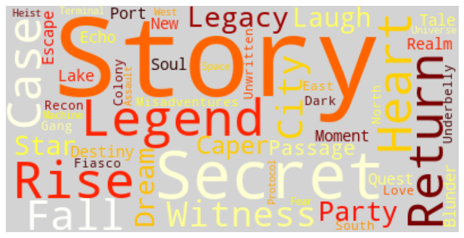
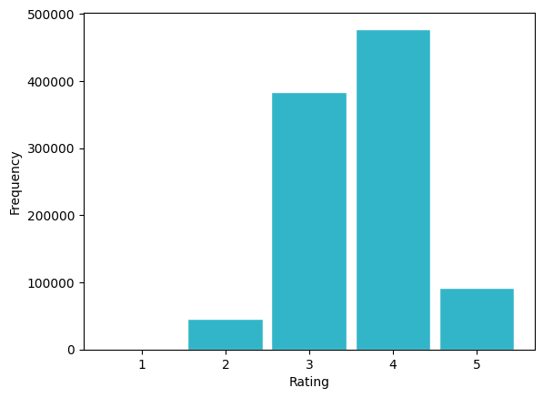
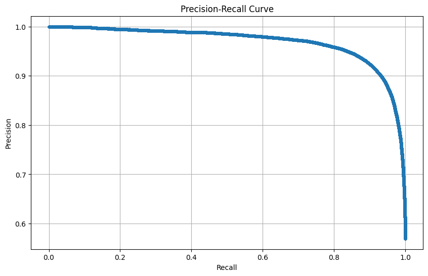
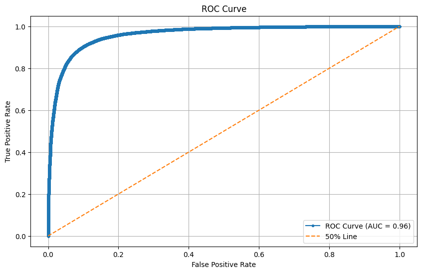
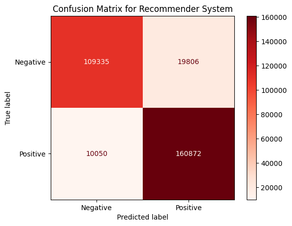

# Chapter 13: Movie Recommender System

## Introduction

In this chapter, we'll generate a synthetic movie recommendation dataset inspired by MovieLens. Instead of using the original MovieLens files, which come with licensing restrictions, we'll create our own dataset that preserves the structure, scale and statistical flavor of MovieLens 1M.

The dataset includes three main files:

- **Users**: Each user is assigned demographic attributes such as gender, age bucket, occupation and location. To mimic realism, we'll introduce random per-user rating biases and personalized genre preferences.

- **Movies**: Each movie is given a release year, one to three genres and a plausible-sounding title generated from genre-specific vocabularies. Genre popularity and historical release distributions are modeled to reproduce patterns such as long-tail distributions and recency effects.

- **Ratings**: Users provide ratings to movies on a 1-5 scale. Rating generation combines global tendencies (average score), user and movie biases, genre correlations and noise. We'll also simulate realistic phenomena such as long-tail popularity (a few movies being rated a lot), varied user activity levels and timestamps biased toward recent years.

Throughout, we'll include sanity checks (e.g., probability normalization, minimum ratings per user) to ensure internal consistency. Finally, the results are in the familiar `users.dat`, `movies.dat` and `ratings.dat` format.

This synthetic dataset serves as a drop-in replacement for MovieLens in our recommender system examples: large enough to feel realistic, rich with structure, yet free of licensing restrictions.

## Create the Database and Tables

In the SingleStore Portal, let's use the **SQL Editor** to create a new database. Call this `movies_db`, as follows:

```sql
CREATE DATABASE IF NOT EXISTS movies_db;
```

We'll also create three tables, as follows:

```sql
USE movies_db;

DROP TABLE IF EXISTS users;
CREATE TABLE users (
    id INT PRIMARY KEY,
    age INT,
    gender VARCHAR(5),
    occupation VARCHAR(255),
    zip_code VARCHAR(255),
    factors VECTOR(200)
);

DROP TABLE IF EXISTS movies;
CREATE TABLE movies (
    id INT PRIMARY KEY,
    title VARCHAR(255),
    genres VARCHAR(255),
    factors VECTOR(200)
);

DROP TABLE IF EXISTS ratings;
CREATE TABLE ratings (
    user_id INT,
    movie_id INT,
    rating FLOAT,
    timestamp INT
);
```

We'll use SingleStore's `VECTOR` data type in the **users** and **movies** tables.

## Fill out the Notebook

Let's now create a new Python notebook. We'll call it **movies**.

Let's start by creating the movies DataFrame:

```python
movies_csv_url = ...

movies_df = pd.read_csv(
    movies_csv_url,
    engine = "python",
    sep = "::",
    header = None,
    encoding = "latin1",
    names = ["id", "title", "genres"]
)
```

We'll create a WordCloud to see some of the popular movie names:

```python
movie_titles_list = movies_df["title"].tolist()
movie_titles_corpus = " ".join(movie_titles_list)

wordcloud = WordCloud(
    stopwords = STOPWORDS,
    background_color = "lightgrey",
    colormap = "hot",
    max_words = 50,
    # collocations = False
).generate(movie_titles_corpus)

plt.figure(figsize = (10, 8))
plt.imshow(wordcloud, interpolation = "bilinear")
plt.axis("off")
plt.show()
```

Example output is shown in Figure 13-1.



*Figure 13-1. WordCloud.*

Next, let's create the users DataFrame:

```python
users_csv_url = ...

users_df = pd.read_csv(
    users_csv_url,
    engine = "python",
    sep = "::",
    header = None,
    encoding = "latin1",
    names = ["id", "gender", "age", "occupation", "zip_code"]
)
```

Let's do a quick analysis of gender:

```python
result = (
    users_df.groupby("gender")
    .size()
    .reset_index(name = "count")
)

print(result.to_string(index = False))
```

Example output:

```text
gender  count
     F   1738
     M   4302
```

and a quick analysis of profession:

```python
result = (
    users_df.groupby("occupation")
    .size()
    .reset_index(name = "count")
    .sort_values(by = "count", ascending = False)
    .head(21)
)

print(result.to_string(index = False))
```

Example output:

```text
          occupation  count
college/grad student    732
executive/managerial    700
               other    689
 technician/engineer    514
   academic/educator    511
          programmer    405
              artist    278
     sales/marketing    276
              writer    264
       self-employed    242
  doctor/health care    227
      clerical/admin    195
        K-12 student    195
           scientist    156
             retired    144
              lawyer    136
    customer service    131
           homemaker    116
 tradesman/craftsman     60
          unemployed     53
              farmer     16
```

This is similar in distribution to MovieLens.

Finally, let's create the ratings DataFrame:

```python
ratings_csv_url = ...

ratings_df = pd.read_csv(
    ratings_csv_url,
    engine = "python",
    sep = "::",
    header = None,
    encoding = "latin1",
    names = ["user_id", "movie_id", "rating", "timestamp"]
)
```

Let's do a quick plot of the movie ratings:

```python
ratings_df["rating"].plot.hist(
    edgecolor = "white",
    color = "#32B5C9",
    rwidth = 0.9,
    bins = [0.5, 1.5, 2.5, 3.5, 4.5, 5.5]
)

plt.ylabel("Frequency")
plt.xlabel("Rating")
plt.show()
```

Example output is shown in Figure 13-2.



*Figure 13-2. Movie Ratings.*

We can see that most ratings are 3 and 4.

Next, we'll convert the synthetic ratings data into the Surprise library format, split the data for training/testing and set up the parameters for training a collaborative filtering model using SVD. In recommendation systems, SVD is used for matrix factorization, which helps in predicting missing entries in a user-item rating matrix.

```python
reader = Reader(rating_scale = (1, 5))
data = Dataset.load_from_df(
    ratings_df[["user_id", "movie_id", "rating"]],
    reader
)

train, test = train_test_split(
    data,
    test_size = 0.3,
    random_state = 42
)

best_params = {
    "n_factors": 100,
    "reg_all": 0.05,
    "n_epochs": 40
}
```

A set of default values for `best_params` are provided, but can be tuned.

Now, we'll initialize SVD, create the model and then fit the model on the training data. During training:

- It estimates biases (global, user, item).

- It learns latent vectors (hidden features) for each user and each movie.

- It minimizes the error between predicted and actual ratings, using gradient descent with regularization.

```python
model = SVD(
    n_factors = best_params["n_factors"],
    reg_all = best_params["reg_all"],
    n_epochs = best_params["n_epochs"],
    random_state = 0
)

model.fit(train)
```

We can then make prediction on the testing data:

```python
predictions = model.test(test)

predictions_df = pd.DataFrame(
    predictions,
    columns = ["user_id", "movie_id", "rating", "prediction", "details"]
)

predictions_df = predictions_df.drop(columns = ["details"])

predictions_df.head()
```

Example output:

```text
   user_id  movie_id  rating  prediction
0     2934      3594     3.0    3.184101
1     5706      1535     4.0    4.165922
2     5251      1283     4.0    3.390595
3     5683      3186     5.0    4.247155
4     1120      1012     5.0    4.188839
```

Let's look at some metrics:

```python
rmse = accuracy.rmse(predictions)
mae = accuracy.mae(predictions)
mse = accuracy.mse(predictions)
fcp = accuracy.fcp(predictions)
```

Example output:

```text
RMSE: 0.4085
MAE: 0.3207
MSE: 0.1669
FCP: 0.9411
```

The SVD model is performing really well. Predictions are close to the true ratings (low RMSE/MAE) and, more importantly, it's ranking movies in the right order for users (very high FCP).

Next, the following code takes the true and predicted ratings from the model's output and converts them into binary labels for classification-style evaluation. First, it extracts the actual ratings (`y_true`) and the model's predicted ratings (`y_pred`). Then, using a threshold of 3.5, it labels ratings as positive (1 = liked) if they are equal to or above the threshold and negative (0 = not liked) if they are below. This transformation allows us to evaluate the recommender not just on how close predictions are numerically, but also on how well it distinguishes between liked and disliked items.

```python
y_true = [true_r for (_, _, true_r, _, _) in predictions]
y_pred = [est for (_, _, _, est, _) in predictions]

threshold = 3.5
y_true_binary = [1 if rating >= threshold else 0 for rating in y_true]
y_pred_binary = [1 if rating >= threshold else 0 for rating in y_pred]
```

Let's plot a precision-recall curve:

```python
precision, recall, _ = metrics.precision_recall_curve(y_true_binary, y_pred)
plt.figure(figsize = (10, 6))
plt.plot(
    recall,
    precision,
    marker = "."
)

plt.title("Precision-Recall Curve")
plt.xlabel("Recall")
plt.ylabel("Precision")

plt.grid(True)
plt.show()
```

Example output shown in Figure 13-3.



*Figure 13-3. Precision-Recall.*

The plot visualizes how varying the decision threshold affects both precision and recall, providing insights into the model's capability to balance between correctly identifying positives and minimizing false positives. A good classifier strives to achieve high precision and recall simultaneously, as represented by a curve that hugs the upper-right corner of the plot.

The following code generates a Receiver Operating Characteristic (ROC) curve to evaluate the recommender system as a binary classifier. It computes the false positive rate (FPR) and true positive rate (TPR) from the binary labels and predicted scores, then plots them to visualize the trade-off between sensitivity and specificity. The Area Under the Curve (AUC) is also calculated, providing a single metric that summarizes how well the model separates liked from disliked movies. An AUC close to 1 indicates strong discriminatory power, while the dashed diagonal line represents random guessing at 50%.

```python
fpr, tpr, _ = metrics.roc_curve(y_true_binary, y_pred)
roc_auc = metrics.auc(fpr, tpr)
plt.figure(figsize = (10, 6))
plt.plot(
    fpr,
    tpr,
    marker = ".",
    label = f"ROC Curve (AUC = {roc_auc:.2f})"
)
plt.plot(
    [0, 1],
    [0, 1],
    linestyle = "--",
    label = "50% Line"
)

plt.title("ROC Curve")
plt.xlabel("False Positive Rate")
plt.ylabel("True Positive Rate")
plt.legend()

plt.grid(True)
plt.show()
```

Example output shown in Figure 13-4.



*Figure 13-4. ROC/AUC.*

Now let's plot a confusion matrix.

```python
cm = metrics.confusion_matrix(y_true_binary, y_pred_binary)

labels = ["Negative", "Positive"]

disp = metrics.ConfusionMatrixDisplay(confusion_matrix = cm, display_labels = labels)
disp.plot(cmap = "Reds", values_format = "d")
plt.title("Confusion Matrix for Recommender System")
plt.show()
```

Example output shown in Figure 13-5.



*Figure 13-5. Confusion Matrix.*

From these numbers, the model is performing very well at identifying liked movies (high true positives, relatively low false negatives), which is what we generally want in a recommender, since it is better to slightly "over-recommend" than to miss too many good options. The false positives are not negligible, but compared to the scale of true positives, the model's precision and recall are both likely quite strong.

We can output more detailed metrics:

```python
print("Accuracy :", metrics.accuracy_score(y_true_binary, y_pred_binary))
print("Precision:", metrics.precision_score(y_true_binary, y_pred_binary))
print("Recall   :", metrics.recall_score(y_true_binary, y_pred_binary))
print("F1-score :", metrics.f1_score(y_true_binary, y_pred_binary))

print("\nClassification Report:\n")
print(metrics.classification_report(y_true_binary, y_pred_binary))
```

Example output:

```text
Accuracy : 0.9005008948120895
Precision: 0.8903795702852588
Recall   : 0.9412012496928424
F1-score : 0.9150853242320819

Classification Report:

              precision    recall  f1-score   support

           0       0.92      0.85      0.88    129141
           1       0.89      0.94      0.92    170922

    accuracy                           0.90    300063
   macro avg       0.90      0.89      0.90    300063
weighted avg       0.90      0.90      0.90    300063
```

From these results, the recommender slightly favors recall over precision, which is often the right trade-off in recommendation systems. It errs on the side of recommending more, rather than risking missing good items.

Now let's look at user coverage and item diversity:

```python
unique_users = ratings_df["user_id"].nunique()
users_with_recommendations = len(set([uid for uid, _, _, _, _ in predictions]))
user_coverage = users_with_recommendations / unique_users
print(f"User Coverage: {user_coverage:.2%}")

recommended_items = set([iid for _, iid, _, _, _ in predictions])
total_items = movies_df["id"].nunique()
item_diversity = len(recommended_items) / total_items
print(f"Item Diversity: {item_diversity:.2%}")
```

Example output:

```text
User Coverage: 100.00%
Item Diversity: 7.57%
```

The recommender performs very well in terms of accuracy and recall and it ensures all users get recommendations. However, the relatively low item diversity suggests that it leans towards recommending a narrower part of the catalog, which might limit discovery.

Now, let's translate the model's internal numbering of users and movies back to the real IDs from our dataset, which is essential for producing readable recommendations:

```python
raw_user_id_mapping = {inner_id: train.to_raw_uid(inner_id) for inner_id in range(train.n_users)}
raw_item_id_mapping = {inner_id: train.to_raw_iid(inner_id) for inner_id in range(train.n_items)}
```

Now we'll take the SVD model's learned user embeddings (latent factors) and create a clean DataFrame that links each original user ID to their learned preferences:

```python
user_factors = model.pu

user_factors_df = pd.DataFrame({
    "id": [raw_user_id_mapping[idx] for idx in range(user_factors.shape[0])],
    "factors": [np.array(factor, dtype = np.float32) for factor in user_factors]
})

user_factors_df = user_factors_df.sort_values(by = "id")

user_factors_df.head()
```

and we'll repeat this for movies:

```python
item_factors = model.qi

item_factors_df = pd.DataFrame({
    "id": [raw_item_id_mapping[idx] for idx in range(item_factors.shape[0])],
    "factors": [np.array(factor, dtype = np.float32) for factor in item_factors]
})

item_factors_df = item_factors_df.sort_values(by="id")

item_factors_df.head()
```

Using these DataFrames, we'll merge the factors first for users:

```python
users_df = pd.merge(
    users_df,
    user_factors_df,
    on = "id",
    how = "left"
)

users_df = users_df.dropna(subset = ["factors"])

users_df.head()
```

and movies:

```python
movies_df = pd.merge(
    movies_df,
    item_factors_df,
    on = "id",
    how = "left"
)

movies_df = movies_df.dropna(subset = ["factors"])

movies_df.head()
```

The factors in both cases will be stored in the `VECTOR` columns in the respective tables.

Let's now connect to SingleStore:

```python
from sqlalchemy import *

db_connection = create_engine(connection_url)
```

First, we'll ensure that we start with empty tables:

```python
tables = ["users", "movies", "ratings"]

with db_connection.begin() as conn:
    for table in tables:
        conn.execute(text(f"TRUNCATE TABLE {table};"))
```

We'll also ensure that the `VECTOR` columns are of the appropriate length for the factors we want to store:

```python
n_factors = best_params["n_factors"]
tables = ["users", "movies"]

for table in tables:
    with db_connection.begin() as conn:
        conn.execute(text(f"ALTER TABLE {table} DROP COLUMN factors;"))
        conn.execute(text(f"ALTER TABLE {table} ADD COLUMN factors VECTOR({n_factors});"))
```

Then we'll write the DataFrames. First users:

```python
users_df.to_sql(
    "users",
    con = db_connection,
    if_exists = "append",
    index = False,
    chunksize = 1000
)
```

then movies:

```python
movies_df.to_sql(
    "movies",
    con = db_connection,
    if_exists = "append",
    index = False,
    chunksize = 1000
)
```

and finally, ratings:

```python
ratings_df.to_sql(
    "ratings",
    con = db_connection,
    if_exists = "append",
    index = False,
    chunksize = 1000
)
```

## Example Queries

Let's now run some queries on the database.

First, let's compute similarity between a user and a movie.

```sql
SELECT
    u.id AS user_id,
    m.title,
    (u.factors <*> m.factors) AS similarity_score
FROM users u, movies m
WHERE u.id = 1 AND m.id = 989;
```

Example output:

```text
+---------+-----------------------------------+----------------------+
| user_id | title                             | similarity_score     |
+---------+-----------------------------------+----------------------+
|       1 | Colony on the Stephen Fort (1978) | -0.11794045567512512 |
+---------+-----------------------------------+----------------------+
```

The similarity score between user and the movie is slightly negative, indicating the movie's latent features are not aligned with the user's preferences.

Next, let's find top movies for a user based on similarity.

```sql
SELECT
    m.title,
    m.genres,
    (u.factors <*> m.factors) AS similarity_score
FROM users u, movies m
WHERE u.id = 1
ORDER BY similarity_score DESC
LIMIT 10;
```

Example output:

```text
+-----------------------------------------+-------------------------+---------------------+
| title                                   | genres                  | similarity_score    |
+-----------------------------------------+-------------------------+---------------------+
| Misadventures: The Usually Story (1977) | Comedy                  |  0.5429962277412415 |
| Hear Scream (2002)                      | Horror                  | 0.34303292632102966 |
| The Last Curse (1970)                   | Horror|Film-Noir        |  0.3351995050907135 |
| The Around Robot (2000)                 | Children's|Sci-Fi       | 0.29692572355270386 |
| The Fiasco of the Operation (1999)      | Comedy                  |  0.2640172243118286 |
| Natural Player (2008)                   | Film-Noir               | 0.24245382845401764 |
| The Symphony of the Choose (1999)       | Musical|Mystery         | 0.23745118081569672 |
| Similar Owner (1990)                    | Drama|Documentary|Crime | 0.23657731711864471 |
| The Mansion of the Skill (1998)         | Mystery                 | 0.21089650690555573 |
| Financial People (1974)                 | Sci-Fi                  | 0.20892225205898285 |
+-----------------------------------------+-------------------------+---------------------+
```

For user 1, the top 10 movies by latent factor similarity include a mix of genres (Comedy, Horror, Sci-Fi), showing which movies are most aligned with their inferred tastes.

Now, let's calculate the similarity matrix between users and movies.

```sql
SELECT
    u.id AS user_id,
    m.title,
    (u.factors <*> m.factors) AS similarity_score
FROM users u, movies m
ORDER BY similarity_score DESC
LIMIT 10;
```

Example output:

```text
+---------+-------------------------------------+--------------------+
| user_id | title                               | similarity_score   |
+---------+-------------------------------------+--------------------+
|     977 | Star: The Difference Story (2006)   | 1.3437403440475464 |
|    5209 | The Legend of Trevor Hines (2023)   | 1.2662196159362793 |
|    1265 | Assault: The Meeting Story (1975)   | 1.2640817165374756 |
|    4589 | The Legend of Brian Morales (2008)  | 1.2541571855545044 |
|    2763 | A Singularity in Alberthaven (2008) | 1.2411115169525146 |
|    3776 | Measure Echo (1963)                 | 1.2297375202178955 |
|    2188 | The Colony of the Pull (1975)       | 1.2200380563735962 |
|    5519 | A Singularity in Alberthaven (2008) | 1.2074799537658691 |
|    1730 | The Fiasco of the Operation (1999)  | 1.2000336647033691 |
|    5531 | Guardian: The Child Story (2007)    | 1.1966848373413086 |
+---------+-------------------------------------+--------------------+
```

We can see that across all users, the highest similarity scores identify pairs where a user strongly matches a movie's latent factors.

Next, let's recommend top movies for each user.

```sql
SELECT
    u.id AS user_id,
    m.title,
    (u.factors <*> m.factors) AS similarity_score
FROM users u, movies m
ORDER BY u.id, similarity_score DESC
LIMIT 10;
```

Example output:

```text
+---------+-----------------------------------------+---------------------+
| user_id | title                                   | similarity_score    |
+---------+-----------------------------------------+---------------------+
|       1 | Misadventures: The Usually Story (1977) |  0.5429962277412415 |
|       1 | Hear Scream (2002)                      | 0.34303292632102966 |
|       1 | The Last Curse (1970)                   |  0.3351995050907135 |
|       1 | The Around Robot (2000)                 | 0.29692572355270386 |
|       1 | The Fiasco of the Operation (1999)      |  0.2640172243118286 |
|       1 | Natural Player (2008)                   | 0.24245382845401764 |
|       1 | The Symphony of the Choose (1999)       | 0.23745118081569672 |
|       1 | Similar Owner (1990)                    | 0.23657731711864471 |
|       1 | The Mansion of the Skill (1998)         | 0.21089650690555573 |
|       1 | Financial People (1974)                 | 0.20892225205898285 |
+---------+-----------------------------------------+---------------------+
```

This query ranks movies for each user individually by similarity.

Now, let's find the top-10 movies for a given user, excluding already-rated movies.

```sql
SELECT
    m.id,
    m.title,
    m.genres,
    (u.factors <*> m.factors) AS predicted_rating
FROM users u
JOIN movies m ON TRUE
WHERE u.id = 1
  AND m.id NOT IN (SELECT movie_id FROM ratings WHERE user_id = u.id)
ORDER BY predicted_rating DESC
LIMIT 10;
```

Example output:

```text
+------+-----------------------------------+------------------------------+---------------------+
| id   | title                             | genres                       | predicted_rating    |
+------+-----------------------------------+------------------------------+---------------------+
|  354 | The Last Curse (1970)             | Horror|Film-Noir             |  0.3351995050907135 |
| 2921 | The Around Robot (2000)           | Children's|Sci-Fi            | 0.29692572355270386 |
|  550 | Natural Player (2008)             | Film-Noir                    | 0.24245382845401764 |
|  424 | The Symphony of the Choose (1999) | Musical|Mystery              | 0.23745118081569672 |
| 3283 | Similar Owner (1990)              | Drama|Documentary|Crime      | 0.23657731711864471 |
|  352 | The Mansion of the Skill (1998)   | Mystery                      | 0.21089650690555573 |
| 1251 | Financial People (1974)           | Sci-Fi                       | 0.20892225205898285 |
| 1760 | A Protocol in Palmerville (2014)  | Thriller|Musical|Documentary | 0.19852496683597565 |
| 1453 | Ground Witness (2022)             | Mystery                      | 0.19429895281791687 |
|  554 | Tale on the James Station (1938)  | Fantasy                      | 0.19405868649482727 |
+------+-----------------------------------+------------------------------+---------------------+
```

The results show predicted top movies for user 1 that they haven't rated yet, allowing the recommender to suggest new content rather than items already seen.

Next, let's find the top movies predicted ratings.

```sql
SELECT
    m.title,
    m.genres,
    (m.factors <*> u.factors) AS predicted_rating
FROM movies m, users u
WHERE u.gender = 'F' AND u.age = 18
ORDER BY predicted_rating DESC
LIMIT 10;
```

Example output:

```text
+------------------------------------+-----------------------+--------------------+
| title                              | genres                | predicted_rating   |
+------------------------------------+-----------------------+--------------------+
| Guardian: The Child Story (2007)   | Fantasy               | 1.1966848373413086 |
| Witness on the Jack Row (1994)     | Mystery               | 1.0511256456375122 |
| The Recon of the Station (2012)    | Action|Sci-Fi|Fantasy | 0.9973692893981934 |
| The Candidate and the Force (1974) | Action                | 0.9807149171829224 |
| Guardian: The Child Story (2007)   | Fantasy               | 0.9801395535469055 |
| The Colony of the Pull (1975)      | Sci-Fi|Action         | 0.9595403671264648 |
| The Strike of the Prevent (1992)   | Action|Adventure      | 0.9424246549606323 |
| The Deep and the Caper (1970)      | Comedy|Adventure      | 0.9109749794006348 |
| Witness on the Jack Row (1994)     | Mystery               | 0.9075832366943359 |
| The Model and the Blunder (1997)   | Comedy                | 0.9016542434692383 |
+------------------------------------+-----------------------+--------------------+
```

For female users aged 18, the top predicted ratings highlight movies most likely to appeal to this demographic.

Next, let's find Movies Similar to Computer Whisper.

```sql
SELECT
    m.title,
    (m.factors <*> qv.factors) AS similarity_score
FROM movies m,
    (SELECT factors AS factors FROM movies WHERE id = 2) AS qv -- Computer Whisper
ORDER BY similarity_score DESC
LIMIT 10;
```

Example output:

```text
+---------------------------------+---------------------+
| title                           | similarity_score    |
+---------------------------------+---------------------+
| Computer Whisper (1999)         |  0.8242829442024231 |
| Official Appear (2002)          | 0.24847206473350525 |
| Recon: The Decide Story (1999)  | 0.24466082453727722 |
| Theory Star (1974)              | 0.22606335580348969 |
| The Public Honor (1989)         |  0.2253294289112091 |
| Measure Echo (1963)             |  0.2225538045167923 |
| The Asylum of the Which (1944)  | 0.22162827849388123 |
| Into Somebody (1989)            | 0.20337367057800293 |
| Summer: The System Story (2005) | 0.19393306970596313 |
| Reveal Echo (1975)              | 0.19028185307979584 |
+---------------------------------+---------------------+
```

The results show the 10 movies most similar to Computer Whisper based on latent factors, useful for movie similarity recommendations.

Next, let's find users similar to Computer Whisper.

```sql
SELECT
    u.gender,
    u.age,
    u.occupation,
    u.zip_code,
    (m.factors <*> u.factors) AS similarity_score
FROM movies m, users u
WHERE m.id = 2 -- Computer Whisper
ORDER BY similarity_score DESC
LIMIT 10;
```

Example output:

```text
+--------+------+----------------------+----------+---------------------+
| gender | age  | occupation           | zip_code | similarity_score    |
+--------+------+----------------------+----------+---------------------+
| F      |   56 | writer               | 56621    | 0.38576820492744446 |
| M      |   50 | clerical/admin       | 81935    | 0.34670817852020264 |
| M      |   18 | academic/educator    | 39898    |  0.3156816363334656 |
| M      |   25 | sales/marketing      | 42958    |  0.3128150999546051 |
| M      |   56 | college/grad student | 77355    |  0.3116776943206787 |
| M      |   45 | programmer           | 24678    |  0.3059542775154114 |
| M      |    1 | other                | 93494    | 0.30399641394615173 |
| M      |   35 | lawyer               | 8573     | 0.30269429087638855 |
| M      |   50 | scientist            | 60440    | 0.30082404613494873 |
| F      |   25 | clerical/admin       | 16843    |  0.2997968792915344 |
+--------+------+----------------------+----------+---------------------+
```

Here, we identify users whose preferences align with the movie Computer Whisper. This is helpful for collaborative filtering or target user analysis.

Now, let's find the most similar users to a given user.

```sql
SELECT
    u2.id AS other_user_id,
    (u1.factors <*> u2.factors) AS similarity_score
FROM users u1
JOIN users u2 ON u1.id <> u2.id
WHERE u1.id = 1
ORDER BY similarity_score DESC
LIMIT 10;
```

Example output:

```text
+---------------+--------------------+
| other_user_id | similarity_score   |
+---------------+--------------------+
|            12 | 0.6378978490829468 |
|          1119 | 0.6228543519973755 |
|          5903 | 0.6025550961494446 |
|          3949 | 0.5898808240890503 |
|          3230 | 0.5796329975128174 |
|          3224 | 0.5751187801361084 |
|          2458 | 0.5426428318023682 |
|          5703 | 0.5250847935676575 |
|          5635 | 0.5229214429855347 |
|          4364 | 0.5180311799049377 |
+---------------+--------------------+
```

Lists the 10 users most similar to user 1, based on latent factors, which can aid in social or collaborative recommendations.

Next, let's see a user activity overview.

```sql
SELECT
    u.gender,
    u.age,
    COUNT(r.rating) AS num_ratings,
    AVG(r.rating) AS avg_rating
FROM users u
LEFT JOIN ratings r ON u.id = r.user_id
GROUP BY u.gender, u.age
ORDER BY u.gender, u.age;
```

Example output:

```text
+--------+------+-------------+--------------------+
| gender | age  | num_ratings | avg_rating         |
+--------+------+-------------+--------------------+
| F      |    1 |       38749 |  3.624532245993445 |
| F      |   18 |       39556 | 3.6168722823339063 |
| F      |   25 |       40740 | 3.6332596956308296 |
| F      |   35 |       46039 |   3.61925758595973 |
| F      |   45 |       37791 | 3.6272128284512184 |
| F      |   50 |       44119 |  3.637820440173168 |
| F      |   56 |       39978 |    3.6664915703637 |
| M      |    1 |      101128 | 3.5906771616169606 |
| M      |   18 |       98524 | 3.6053753400186754 |
| M      |   25 |      104535 | 3.6049744104845267 |
| M      |   35 |       98053 |  3.602847439649985 |
| M      |   45 |      100718 | 3.5905399233503443 |
| M      |   50 |      107005 |  3.626578197280501 |
| M      |   56 |      103274 |  3.617870906520518 |
+--------+------+-------------+--------------------+
```

This aggregates rating behavior by gender and age, showing how many ratings each demographic gives on average and their typical rating score.

Now, let's find the most active users.

```sql
SELECT
    u.id,
    u.gender,
    u.age,
    COUNT(r.rating) AS num_ratings
FROM users u
LEFT JOIN ratings r ON u.id = r.user_id
GROUP BY u.id, u.gender, u.age
ORDER BY num_ratings DESC
LIMIT 10;
```

Example output:

```text
+------+--------+------+-------------+
| id   | gender | age  | num_ratings |
+------+--------+------+-------------+
| 4021 | M      |   35 |         411 |
|  277 | M      |   45 |         410 |
| 5251 | M      |    1 |         409 |
| 4693 | M      |   50 |         398 |
|  367 | M      |    1 |         395 |
| 1434 | F      |   56 |         392 |
| 3421 | M      |   35 |         385 |
| 5417 | M      |   50 |         377 |
| 4466 | M      |   50 |         372 |
| 4659 | F      |   45 |         365 |
+------+--------+------+-------------+
```

The query ranks users by the total number of ratings submitted, identifying highly engaged users in the dataset.

Now, let's look at the distribution of ratings.

```sql
SELECT
    rating,
    COUNT(*) AS count
FROM ratings
GROUP BY rating
ORDER BY rating;
```

Example output:

```text
+--------+--------+
| rating | count  |
+--------+--------+
|      1 |    663 |
|      2 |  46249 |
|      3 | 383952 |
|      4 | 477652 |
|      5 |  91693 |
+--------+--------+
```

The results show the frequency of each rating value. Most ratings are 3 or 4, indicating a tendency toward neutral-to-positive evaluations.

Now, let's look at average ratings over time.

```sql
SELECT
    YEAR(FROM_UNIXTIME(r.timestamp)) AS rating_year,
    AVG(r.rating) AS avg_rating
FROM ratings r
GROUP BY rating_year
ORDER BY rating_year;
```

Example output:

```text
+-------------+--------------------+
| rating_year | avg_rating         |
+-------------+--------------------+
|        2000 | 3.6923076923076925 |
|        2001 | 3.6232258064516127 |
|        2002 | 3.6179660366906017 |
|        2003 | 3.6130733966663406 |
+-------------+--------------------+
```

Tracks the average rating per year, showing a slight downward trend from 2000 to 2003.

Next, let's look at the top average ratings by genre.

```sql
SELECT
    genres,
    ROUND(AVG(rating), 2) AS avg_rating,
    COUNT(*) AS num_ratings
FROM movies m
JOIN ratings r ON m.id = r.movie_id
GROUP BY genres
ORDER BY avg_rating DESC
LIMIT 10;
```

Example output:

```text
+----------------------------+------------+-------------+
| genres                     | avg_rating | num_ratings |
+----------------------------+------------+-------------+
| Fantasy|Romance|Drama      |       5.00 |           5 |
| Documentary|War            |       4.77 |          13 |
| Sci-Fi|Action|Comedy       |       4.67 |           3 |
| Sci-Fi|Romance|Documentary |       4.50 |           4 |
| Documentary|Crime|Horror   |       4.35 |          17 |
| Horror|Children's          |       4.24 |          17 |
| Thriller|Musical           |       4.21 |          33 |
| Sci-Fi|Documentary         |       4.21 |          19 |
| Sci-Fi|Film-Noir           |       4.19 |         149 |
| War|Musical                |       4.18 |          40 |
+----------------------------+------------+-------------+
```

The query identifies genres with the highest average ratings. Niche combinations (e.g., Fantasy\|Romance\|Drama) often have very high ratings but few total ratings.

Now, let's find genre preferences by gender/age group.

```sql
SELECT
    u.gender,
    u.age,
    m.genres,
    ROUND(AVG(r.rating),2) AS avg_rating,
    COUNT(*) AS num_ratings
FROM users u
JOIN ratings r ON u.id = r.user_id
JOIN movies m ON m.id = r.movie_id
GROUP BY u.gender, u.age, m.genres
ORDER BY avg_rating DESC
LIMIT 10;
```

Example output:

```text
+--------+------+----------------------------+------------+-------------+
| gender | age  | genres                     | avg_rating | num_ratings |
+--------+------+----------------------------+------------+-------------+
| M      |   25 | Thriller|Musical           |       5.00 |           2 |
| M      |   50 | War|Musical                |       5.00 |           4 |
| M      |   50 | Romance|Drama|Horror       |       5.00 |           3 |
| M      |   25 | Documentary|War            |       5.00 |          10 |
| M      |    1 | Documentary|Crime|Horror   |       5.00 |           6 |
| M      |   35 | Sci-Fi|Romance|Documentary |       5.00 |           2 |
| M      |   25 | Sci-Fi|Documentary         |       5.00 |           4 |
| M      |    1 | Sci-Fi|Film-Noir           |       5.00 |           2 |
| F      |   45 | Sci-Fi|Film-Noir           |       5.00 |           2 |
| F      |   56 | Action|Mystery|Western     |       5.00 |           3 |
+--------+------+----------------------------+------------+-------------+
```

The query highlights the top-rated genres within specific gender and age groups, showing demographic-based taste patterns.

Next, let's find movies that are both highly rated and diverse (long-tail hits).

```sql
SELECT
    m.title,
    m.genres,
    COUNT(r.rating) AS num_ratings,
    AVG(r.rating) AS avg_rating
FROM movies m
JOIN ratings r ON m.id = r.movie_id
GROUP BY m.id, m.title, m.genres
HAVING COUNT(r.rating) BETWEEN 20 AND 100
ORDER BY avg_rating DESC
LIMIT 10;
```

Example output:

```text
+--------------------------------------+-------------------+-------------+--------------------+
| title                                | genres            | num_ratings | avg_rating         |
+--------------------------------------+-------------------+-------------+--------------------+
| The Care and the Conspiracy (1996)   | Thriller|Musical  |          33 |  4.212121212121212 |
| The West and the Victory (1930)      | War|Musical       |          40 |              4.175 |
| A Legacy in Cynthiafort (1970)       | Animation         |          43 |  4.093023255813954 |
| The Nor and the Passage (1999)       | Drama|Documentary |          86 |  4.069767441860465 |
| Recon: The Decide Story (1999)       | Action            |          29 |  4.068965517241379 |
| Promise on the Andersen Point (1973) | Romance           |          59 |  4.067796610169491 |
| Down Inside (1969)                   | Animation|Romance |          95 |  4.031578947368421 |
| The Guardian of the Real (1936)      | Fantasy|Crime     |          70 | 3.9571428571428573 |
| The Skill Fear (2018)                | Horror|Thriller   |          32 |            3.90625 |
| Into Somebody (1989)                 | Film-Noir|Comedy  |          45 |  3.888888888888889 |
+--------------------------------------+-------------------+-------------+--------------------+
```

The query shows us movies with moderate rating counts (20–100) that achieve high average ratings, useful for surfacing underrated or "long-tail" content.

Next, let's do a cold-start problem check (movies with few ratings).

```sql
SELECT
    m.title,
    COUNT(r.rating) AS num_ratings
FROM movies m
LEFT JOIN ratings r ON m.id = r.movie_id
GROUP BY m.id, m.title
HAVING COUNT(r.rating) < 5
ORDER BY num_ratings ASC
LIMIT 10;
```

Example output:

```text
+-------------------------------------------+-------------+
| title                                     | num_ratings |
+-------------------------------------------+-------------+
| The Secret of Tammy Stevens (2002)        |           1 |
| Piece Trail (1976)                        |           2 |
| The Fall of Jessica Allen (1978)          |           2 |
| Heart: The Environmental Story (1970)     |           3 |
| Federal Echo (1985)                       |           3 |
| A Spotlight in Port Zacharyborough (1985) |           3 |
| The Ground and the Fury (2004)            |           3 |
| Awakening: The Become Story (1991)        |           3 |
| Caper: The Class Story (1970)             |           3 |
| Shoulder Tales (1986)                     |           3 |
+-------------------------------------------+-------------+
```

The query identifies movies with very few ratings (\< 5), highlighting items for which the system has little data to make recommendations.

Finally, let's find the ratings density (how filled the user–movie matrix is).

```sql
SELECT
    COUNT(*) / (SELECT COUNT(*) FROM users) / (SELECT COUNT(*) FROM movies) AS density
FROM ratings;
```

Example output:

```text
+------------+
| density    |
+------------+
| 0.53246790 |
+------------+
```

This shows that approximately 53% of the possible user–movie ratings exist, indicating a moderately sparse matrix suitable for collaborative filtering.

## Summary

In this chapter, we developed a movie recommendation system using collaborative filtering and matrix factorization. We began by preparing a dataset of user–movie ratings and splitting it into training and test sets. Using the Surprise library, we trained an SVD model to learn latent factors that represent both user preferences and movie characteristics.

We evaluated the model's predictive performance on unseen data by calculating standard classification-style metrics such as accuracy, precision, recall and F1-score, as well as generating a classification report to understand per-class behavior. The model achieved strong performance, showing its ability to generalize to new ratings.

To assess recommendation quality beyond prediction accuracy, we also measured user coverage (the proportion of users who receive at least one recommendation) and item diversity (the proportion of unique recommended items across all users). Our system achieved full user coverage and reasonable item diversity, indicating that it can serve relevant recommendations to every user while offering variety.

We then extracted the learned user and item factor vectors from the trained model and mapped them back to their original IDs. These factor embeddings capture hidden patterns in the data and can be stored in a database for fast retrieval and future use. We created `VECTOR` columns in our SingleStore database to store these embeddings and demonstrated how SQL queries can use them to generate recommendations directly. These queries showed how recommendation logic can be executed efficiently at query time without needing to rerun the model.

By the end of this chapter, we built a fully working, end-to-end movie recommender pipeline, from data preparation and model training to evaluation, embedding extraction and database integration, laying the groundwork for scalable, real-world recommendation systems.
