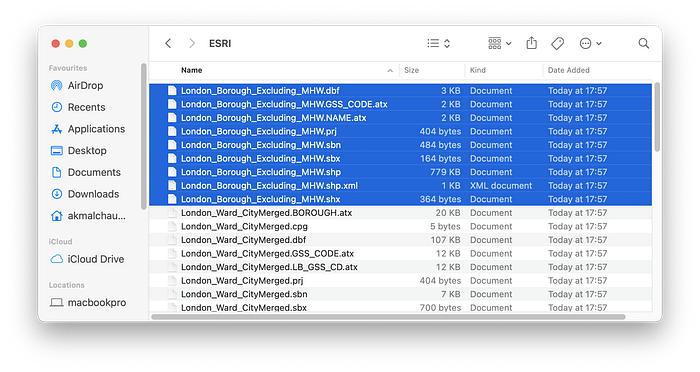
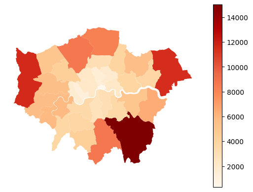
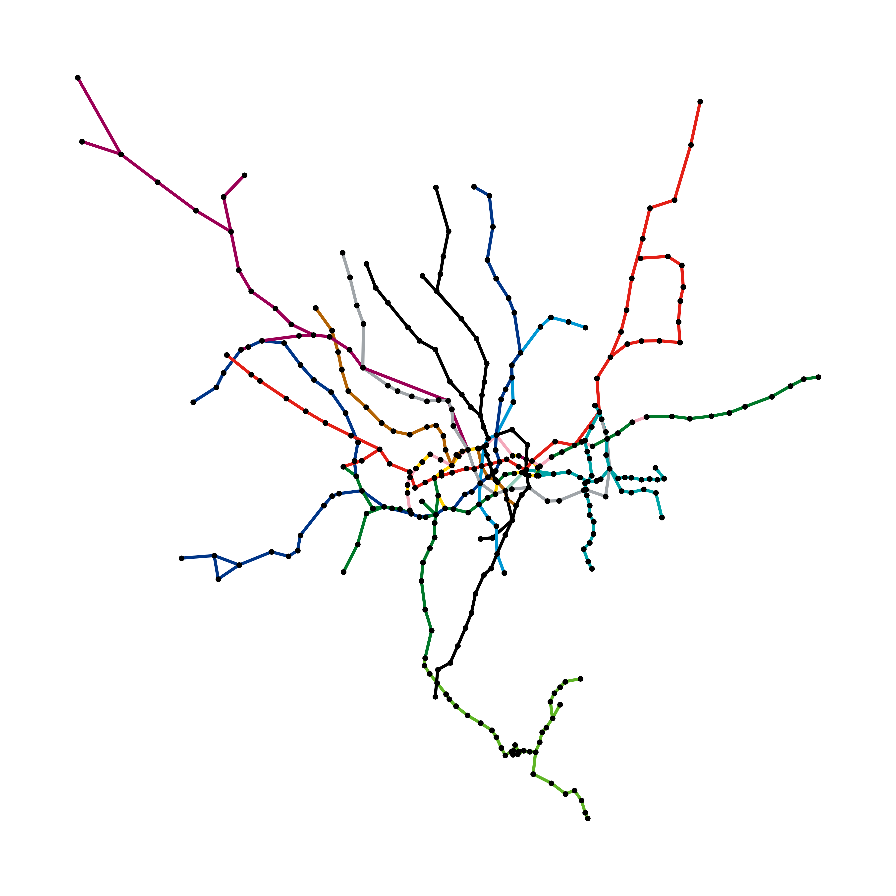
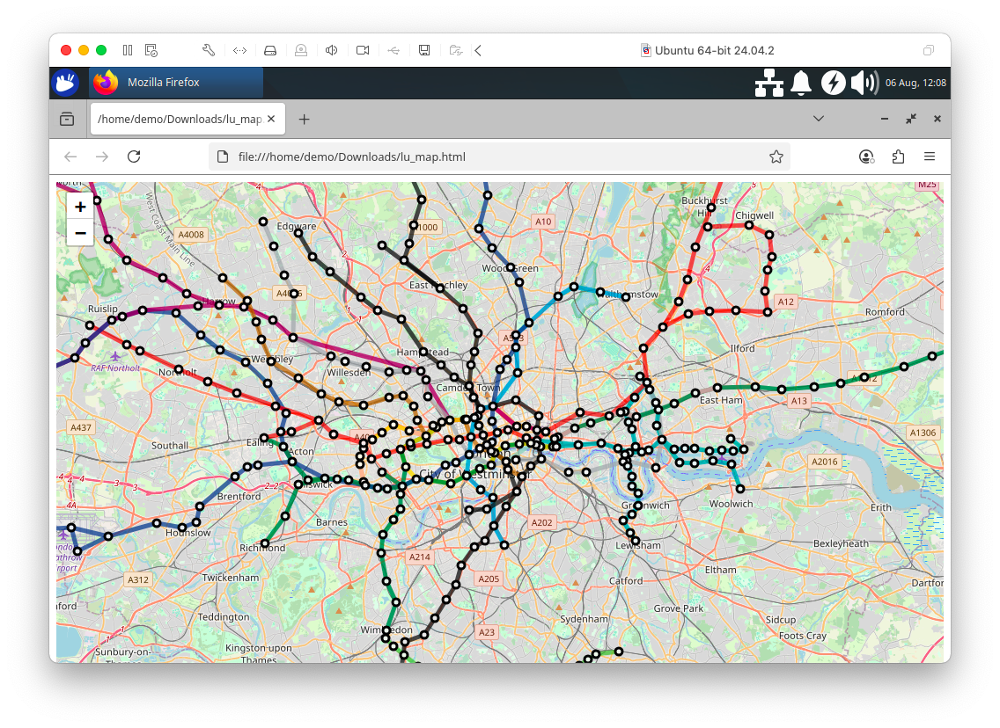
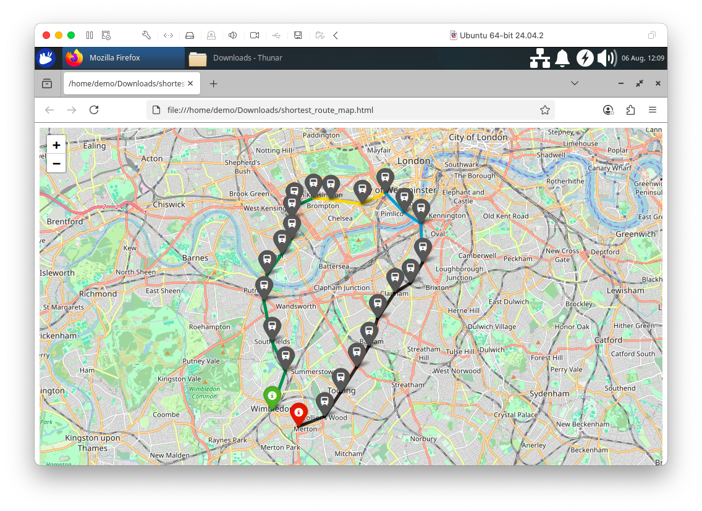
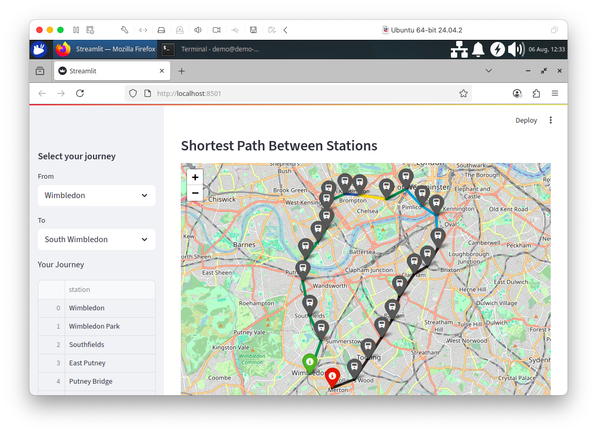

# Chapter 3: Geospatial Data

## Introduction

In this chapter, we'll explore how SingleStore can offer a unified approach to storing and querying alphanumeric and geospatial data. We'll use data for London Boroughs and data for the London Underground. We'll use these datasets to perform a series of geospatial queries to test SingleStore's ability to work with geospatial data. We'll also discuss an extended example using the London Underground data for a practical use case: finding the shortest path between two points in a network. Finally, we'll create London Underground visualizations using Folium and Streamlit.

The data for London Boroughs can be downloaded from the London Datastore[^1]. The file we'll use is `statistical-gis-boundaries-london.zip`. This file is approximately 30 MB in size. The data in this file have already been converted to a format that can be used with SingleStore.

The data for the London Underground was originally sourced from the Doogal[^2] website maintained by Chris Bell. Two CSV files are available for download for Station data and Train line data. Other data from the website may require licensing or attribution and should be checked in the Doogal website FAQ[^3].

To summarize, we'll use:

- London Boroughs data from the London Datastore.

- Station and Train data from Doogal.

## London Boroughs Data

### Convert London Boroughs Data

The zip file from the London Datastore contains two folders: ESRI and MapInfo. Inside the ESRI folder, we're interested in the files beginning with `London_Borough_Excluding_MHW`. There will be various file extensions, as shown in Figure 3-1.



*Figure 3-1. ESRI Folder.*

The data in these files have been converted to the Well-Known Text (WKT)[^4] format for SingleStore and saved in a file called `London_Borough_Excluding_MHW.csv`. Any rows containing `MULTIPOLYGON` data have also been converted to `POLYGON` data.

### Create the Database and London Boroughs Database Table

In the SingleStore Portal, we'll use the **SQL Editor** to create a new database. Call this `geo_db`, as follows:

```sql
CREATE DATABASE IF NOT EXISTS geo_db;
```

We'll also create a table, as follows:

```sql
USE geo_db;

DROP TABLE IF EXISTS london_boroughs;
CREATE ROWSTORE TABLE IF NOT EXISTS london_boroughs (
    name     VARCHAR(32),
    hectares FLOAT,
    geometry GEOGRAPHY,
    centroid GEOGRAPHYPOINT,
    INDEX(geometry)
);
```

SingleStore can store three main geospatial types: **Polygons**, **Paths** and **Points**. In the above code example, `GEOGRAPHY` can hold Polygon and Path data. `GEOGRAPHYPOINT` can hold Point data. In our example, the **geometry** column will contain the shape of each London Borough and **centroid** will contain the approximate central point of each borough. As shown above, we can store this geospatial data alongside other data types, such as `VARCHAR` and `FLOAT`.

### Data loader for London Boroughs

Let's now create a new notebook. We'll call it **data_loader_for_london_boroughs**.

In a new code cell, let's add the following code to read our CSV file:

```python
boroughs_csv_url = ...

boroughs_df = pd.read_csv(boroughs_csv_url)
```

We'll rename and drop some of the columns:

```python
boroughs_df["geometry"] = boroughs_df["WKT"].apply(wkt.loads)
boroughs_df = boroughs_df.rename(columns = {"NAME": "name", "HECTARES": "hectares"})
boroughs_df = boroughs_df.drop(
    columns = ["WKT", "GSS_CODE", "NONLD_AREA", "ONS_INNER", "SUB_2009", "SUB_2006"]
)
```

Next, we'll create a GeoDataFrame and set the appropriate Coordinate Reference System (CRS), as follows:

```python
boroughs_geo_df = gpd.GeoDataFrame(boroughs_df, geometry = "geometry")
boroughs_geo_df = boroughs_geo_df.set_crs(epsg = 4326, allow_override = True)
```

Now, we'll plot a map of the London Boroughs, as follows:

```python
map = boroughs_geo_df.plot(column = "hectares", cmap = "OrRd", legend = True)
map.set_axis_off()
```

This should render the image shown in Figure 3-2.



*Figure 3-2. London Boroughs.*

The darker the color, the greater the area of the borough.

At this point, since a map is being rendered, the following needs to be added:

> "Contains National Statistics data © Crown copyright and database right \[2015\]" and "Contains Ordnance Survey data © Crown copyright and database right \[2015\]"

We'll also add a new column that contains the centroid for each borough:

```python
boroughs_proj = boroughs_geo_df.to_crs(27700)
boroughs_proj["centroid"] = boroughs_proj.geometry.centroid
boroughs_geo_df["centroid"] = boroughs_proj["centroid"].to_crs(4326)
```

Now two columns (`geometry` and `centroid`) will contain geospatial data. These two columns need to be converted back to string using `wkt.dumps` so that we can write the data correctly into SingleStore:

```python
boroughs_geo_df["geometry_wkt"] = boroughs_geo_df["geometry"].apply(wkt.dumps)
boroughs_geo_df["centroid_wkt"] = boroughs_geo_df["centroid"].apply(wkt.dumps)

boroughs_geo_df = boroughs_geo_df.drop(columns = ["geometry", "centroid"])
boroughs_geo_df = boroughs_geo_df.rename(columns = {"geometry_wkt": "geometry", "centroid_wkt": "centroid"})
```

And now, we'll set up the connection to SingleStore:

```python
from sqlalchemy import *

db_connection = create_engine(connection_url)
```

Next, we'll ensure that the table is empty:

```python
with db_connection.begin() as conn:
    conn.execute(text("TRUNCATE TABLE london_boroughs;"))
```

Finally, we are ready to write the DataFrame to SingleStore:

```python
boroughs_geo_df.to_sql(
    "london_boroughs",
    con = db_connection,
    if_exists = "append",
    index = False,
    chunksize = 1000
)
```

This will write the DataFrame to the table called `london_boroughs` in the `geo_db` database.

## London Underground Data

### Create the London Underground Database Tables

Now we'll focus on the London Underground data. Let's use the **SQL Editor** to create several database tables, as follows:

```sql
USE geo_db;

DROP TABLE IF EXISTS london_connections;
CREATE TABLE IF NOT EXISTS london_connections (
    tube_line    VARCHAR(100),
    from_station VARCHAR(200),
    to_station   VARCHAR(200),
    PRIMARY KEY (tube_line, from_station, to_station)
);

DROP TABLE IF EXISTS london_lines;
CREATE TABLE IF NOT EXISTS london_lines (
    tube_line VARCHAR(100) PRIMARY KEY,
    color     CHAR(7)
);

DROP TABLE IF EXISTS london_stations;
CREATE ROWSTORE TABLE IF NOT EXISTS london_stations (
    station   VARCHAR(200) PRIMARY KEY,
    latitude  DOUBLE,
    longitude DOUBLE,
    zone      VARCHAR(20),
    geometry AS GEOGRAPHY_POINT(longitude, latitude) PERSISTED GEOGRAPHYPOINT,
    INDEX(geometry)
);

DROP TABLE IF EXISTS london_tube_edges;
CREATE TABLE IF NOT EXISTS london_tube_edges (
    tube_line VARCHAR(50) NOT NULL,
    from_station VARCHAR(100) NOT NULL,
    to_station VARCHAR(100) NOT NULL,
    color VARCHAR(7) NOT NULL,
    from_latitude DOUBLE NOT NULL,
    from_longitude DOUBLE NOT NULL,
    from_zone VARCHAR(20),
    to_latitude DOUBLE NOT NULL,
    to_longitude DOUBLE NOT NULL,
    to_zone VARCHAR(20),
    distance DOUBLE NOT NULL,
    PRIMARY KEY (tube_line, from_station, to_station)
);
```

We have four tables. The `london_connections` table contains pairs of stations that are connected by a particular line.

The `london_lines` table lists all 11 London Underground lines along with their associated map colors. It also includes entries for the Docklands Light Railway (DLR) and Tramlink and their map colors.

The `london_stations` table contains information about each station, such as its latitude and longitude. As we upload the data into this table, SingleStore will create and populate the `geometry` column for us. This is a geospatial point consisting of longitude and latitude. This will be very useful when we want to start asking geospatial queries. We'll make use of this feature later.

Finally, the `london_tube_edges` table stores the complete graph structure of the London Underground in a form that we can use for various queries, such as finding the shortest path between two stations.

### Data loader for London Underground

Since we already have the CSV files in the correct format for each of the three tables, loading the data into SingleStore is easy. Let's now create a new Python notebook. We'll call it **data_loader_for_london_underground**.

In a new code cell, let's add the following code:

```python
lines_csv_url = ...

lines_df = pd.read_csv(lines_csv_url)
```

This will load the lines data. We'll repeat this for connections:

```python
connections_csv_url = ...

connections_df = pd.read_csv(connections_csv_url)
```

We'll reduce the connections dataset so that we only keep data for lines that are mentioned in the lines data:

```python
connections_df = connections_df[
    connections_df["tube_line"].isin(lines_df["tube_line"])
]
```

Next, we'll read the stations data:

```python
stations_csv_url = ...

stations_df = pd.read_csv(stations_csv_url)
```

We'll drop several columns that we don't need:

```python
stations_df = stations_df.drop(columns = ["os_x", "os_y", "postcode"])
```

and only keep stations that are in the connections:

```python
valid_stations = set(connections_df["from_station"]).union(set(connections_df["to_station"]))

stations_df = stations_df[stations_df["station"].isin(valid_stations)]
```

And now, we'll set up the connection to SingleStore:

```python
from sqlalchemy import *

db_connection = create_engine(connection_url)
```

Next, we'll ensure that the tables for data loading in this notebook are empty:

```python
tables = ["london_lines", "london_connections", "london_stations"]

with db_connection.begin() as conn:
    for table in tables:
        conn.execute(text(f"TRUNCATE TABLE {table};"))
```

Finally, we are ready to write the DataFrames to SingleStore:

```python
connections_df.to_sql(
    "london_connections",
    con = db_connection,
    if_exists = "append",
    index = False,
    chunksize = 1000
)
```

This will write the DataFrame to the table called `london_connections` in the `geo_db` database. We'll repeat this for lines:

```python
lines_df.to_sql(
    "london_lines",
    con = db_connection,
    if_exists = "append",
    index = False,
    chunksize = 1000
)
```

and stations:

```python
stations_df.to_sql(
    "london_stations",
    con = db_connection,
    if_exists = "append",
    index = False,
    chunksize = 1000
)
```

## Example Queries

Now that we've built our system, we'll run some queries. SingleStore supports a range of very useful functions[^5] for working with geospatial data. We'll work through each of these functions with a quick example.

### Area

This measures the square meter area of a Polygon.

We'll find the area of a London Borough in square meters. In this case, we are using Merton:

```sql
SELECT ROUND(GEOGRAPHY_AREA(geometry), 0) AS sqm
FROM london_boroughs
WHERE name = "Merton";
```

The output should be:

```text
+----------+
| sqm      |
+----------+
| 37456562 |
+----------+
```

Since we also have hectares being stored for each borough, we can compare the result with the hectares and the numbers are close. It's not a perfect match since the Polygon data for the borough is storing a limited number of points, so the calculated area will be different. If we stored more data points, the accuracy would improve.

### Distance

This measures the shortest distance between two geospatial objects, in meters. The function uses the standard metric for distance on a sphere.

We'll find how far each London Borough is from a particular Borough. In this case, we are using Merton:

```sql
SELECT b.name AS neighbor, ROUND(GEOGRAPHY_DISTANCE(a.geometry, b.geometry), 0) AS distance_from_border
FROM london_boroughs a, london_boroughs b
WHERE a.name = "Merton"
ORDER BY distance_from_border
LIMIT 10;
```

The output should be:

```text
+------------------------+----------------------+
| neighbor               | distance_from_border |
+------------------------+----------------------+
| Kingston upon Thames   |                    0 |
| Lambeth                |                    0 |
| Croydon                |                    0 |
| Merton                 |                    0 |
| Wandsworth             |                    0 |
| Sutton                 |                    0 |
| Richmond upon Thames   |                  552 |
| Hammersmith and Fulham |                 2609 |
| Bromley                |                 3263 |
| Southwark              |                 3276 |
+------------------------+----------------------+
```

### Length

This measures the length of a path. The path could also be the total perimeter of a Polygon. Measurement is in meters.

Here we calculate the perimeter for London Boroughs and order the result by the longest first.

```sql
SELECT name, ROUND(GEOGRAPHY_LENGTH(geometry), 0) AS perimeter
FROM london_boroughs
ORDER BY perimeter DESC
LIMIT 5;
```

The output should be:

```text
+----------------------+-----------+
| name                 | perimeter |
+----------------------+-----------+
| Bromley              |     76001 |
| Richmond upon Thames |     65102 |
| Hillingdon           |     63756 |
| Havering             |     63412 |
| Hounslow             |     58861 |
+----------------------+-----------+
```

### Contains

This determines if one object is entirely within another object.

In this example, we are trying to find all the stations within Merton:

```sql
SELECT b.station
FROM london_boroughs a, london_stations b
WHERE GEOGRAPHY_CONTAINS(a.geometry, b.geometry) AND a.name = "Merton"
ORDER BY station;
```

The output should be:

```text
+------------------+
| station          |
+------------------+
| Belgrave Walk    |
| Colliers Wood    |
| Dundonald Road   |
| Merton Park      |
| Mitcham          |
| Mitcham Junction |
| Morden           |
| Morden Road      |
| Phipps Bridge    |
| South Wimbledon  |
| Wimbledon        |
| Wimbledon Park   |
+------------------+
```

### Intersects and Approx Intersects

This determines whether there is any overlap between two geospatial objects. A fast approximation is also available using `APPROX_GEOGRAPHY_INTERSECTS`.

In this example, we are trying to determine which London Borough intersects with Morden station:

```sql
SELECT a.name
FROM london_boroughs a, london_stations b
WHERE GEOGRAPHY_INTERSECTS(b.geometry, a.geometry) AND b.station = "Morden";
```

The output should be:

```text
+--------+
| name   |
+--------+
| Merton |
+--------+
```

### Within Distance

This determines whether two geospatial objects are within a certain distance of each other. Measurement is in meters.

In the following example, we try to find any London Underground stations within 150 meters of a centroid.

```sql
SELECT a.station
FROM london_stations a, london_boroughs b
WHERE GEOGRAPHY_WITHIN_DISTANCE(a.geometry, b.centroid, 150)
ORDER BY station;
```

The output should be:

```text
+------------------------+
| name                   |
+------------------------+
| High Street Kensington |
+------------------------+
```

## Visualization

### Map of the London Underground

In our SingleStore database, we've stored geospatial data. We'll use that data to create visualizations. To begin with, let's create a graph of the London Underground network.

We'll start by creating a new Python notebook. We'll call it **shortest_path**.

First, we'll set up the connection to SingleStore:

```python
from sqlalchemy import *

db_connection = create_engine(connection_url)
```

We'll read the data from the three London Underground tables into DataFrames:

```python
lines_df = pd.read_sql(
    "SELECT * FROM london_lines",
    con = db_connection
)

connections_df = pd.read_sql(
    "SELECT * FROM london_connections",
    con = db_connection
)

stations_df = pd.read_sql(
    "SELECT * FROM london_stations",
    con = db_connection
)
```

Next, let's do some data manipulation. Our goal is to produce a single table that contains all the information about the London Underground in one place.

First, we'll merge the lines and connections DataFrames, so that we store the line color with the connections.

```python
merged_df = connections_df.merge(
    lines_df,
    on = "tube_line",
    how = "left"
)
```

Next, we'll add the location and zone details for each "from station" by matching it with the station list. This helps us know where each station is on the map:

```python
df1 = merged_df.merge(
    stations_df[["station", "latitude", "longitude", "zone"]],
    left_on = "from_station",
    right_on = "station",
    how = "left",
    suffixes = ("", "_from")
)
```

Now we'll add the location and zone details for each "to station" by matching it with the station list. Now we have the map position for both ends of each connection:

```python
df2 = df1.merge(
    stations_df[["station", "latitude", "longitude", "zone"]],
    left_on = "to_station",
    right_on = "station",
    how = "left",
    suffixes = ("", "_to")
)
```

We'll drop redundant station columns:

```python
df2 = df2.drop(columns = ["station", "station_to"])
```

and rename the columns for clarity:

```python
final_df = df2.rename(columns = {
    "latitude": "from_latitude",
    "longitude": "from_longitude",
    "zone": "from_zone",
    "latitude_to": "to_latitude",
    "longitude_to": "to_longitude",
    "zone_to": "to_zone"
})
```

The next step calculates the distance (in kilometers) between each pair of connected stations using their latitude and longitude. This distance is stored in a new column. This distance measure is "as the crow flies" -- the shortest path over the earth's surface between two points. This is not the track length or travel time -- it's the straight-line distance, which is useful for graph weighting as we don't have track length or actual travel times available in this dataset.

```python
final_df["distance"] = final_df.apply(
    lambda row: geodesic(
        (row["from_latitude"], row["from_longitude"]),
        (row["to_latitude"], row["to_longitude"])
    ).km,
    axis = 1
)
```

Next, we'll ensure that the table is empty:

```python
with db_connection.begin() as conn:
    conn.execute(text("TRUNCATE TABLE london_tube_edges;"))
```

We'll now store the DataFrame into SingleStore for future use:

```python
final_df.to_sql(
    "london_tube_edges",
    con = db_connection,
    if_exists = "append",
    index = False,
    chunksize = 1000
)
```

With our data safely stored for later, let's now create a graph of the London Underground using NetworkX:

```python
graph = nx.from_pandas_edgelist(
    final_df,
    source = "from_station",
    target = "to_station",
    edge_attr = ["color", "distance", "tube_line"]
)
```

The following code creates a dictionary with station names as keys and their map positions as values, so we know where to place each station. It also makes a list of colors for each tube line to use when drawing the connections on the map:

```python
pos = {}

for _, row in final_df.iterrows():
    pos[row["from_station"]] = (row["from_longitude"], row["from_latitude"])
    pos[row["to_station"]] = (row["to_longitude"], row["to_latitude"])

edge_colors = [data["color"] for _, _, data in graph.edges(data = True)]
```

Now we'll create a plot, as follows:

```python
plt.figure(figsize = (12, 12))

nx.draw(
    graph,
    pos = pos,
    edge_color = edge_colors,
    node_size = 20,
    node_color = "black",
    width = 3
)

plt.title("Map of the London Underground", size = 20)
lu_map = "london_underground_map.png"
plt.savefig(lu_map, dpi = 300)
plt.show()
```

This produces the image shown in Figure 3-3.



*Figure 3-3. Map of the London Underground.*

We’ll download the map locally:

```python
mime_type, _ = mimetypes.guess_type(lu_map)

with open(lu_map, "rb") as f:
    data = f.read()
b64 = base64.b64encode(data).decode()
href = f'<a download="{lu_map}" href="data:{mime_type};base64,{b64}">Download {lu_map}</a>'
HTML(href)
```

We'll also visualize the map using Folium, as follows:

```python
m = folium.Map(location = [51.509865, -0.118092], zoom_start = 11)

for _, row in final_df.iterrows():
    coords = [
        (row["from_latitude"], row["from_longitude"]),
        (row["to_latitude"], row["to_longitude"])
    ]

    folium.PolyLine(
        coords,
        color = row["color"] if pd.notnull(row["color"]) else "#808080",
        weight = 5,
        opacity = 0.7
    ).add_to(m)

stations_seen = set()

for _, row in final_df.iterrows():
    if row["from_station"] not in stations_seen:
        folium.CircleMarker(
            location = (row["from_latitude"], row["from_longitude"]),
            radius = 4,
            color = "black",
            fill = True,
            fill_color = "white",
            fill_opacity = 0.9,
            popup = row["from_station"]
        ).add_to(m)
        stations_seen.add(row["from_station"])

    if row["to_station"] not in stations_seen:
        folium.CircleMarker(
            location = (row["to_latitude"], row["to_longitude"]),
            radius = 4,
            color = "black",
            fill = True,
            fill_color = "white",
            fill_opacity = 0.9,
            popup = row["to_station"]
        ).add_to(m)
        stations_seen.add(row["to_station"])

lu_map_html = "lu_map.html"
m.save(lu_map_html)
```

We'll download the map locally:

```python
mime_type, _ = mimetypes.guess_type(lu_map_html)

with open(lu_map_html, "rb") as f:
    data = f.read()
b64 = base64.b64encode(data).decode()
href = f'<a download="{lu_map_html}" href="data:{mime_type};base64,{b64}">Download {lu_map_html}</a>'
HTML(href)
```

This produces a map, as shown in Figure 3-4. We can scroll and zoom the map. When clicked, a marker will show the station name and the lines are colored according to the London Underground scheme.



*Figure 3-4. Map using Folium.*

## Shortest Path

We can also use the graph for more practical purposes. For example, by finding the shortest path between two stations.

We'll use a built-in feature of NetworkX called `shortest_path`. First, we'll create an empty graph and then add edges from the DataFrame:

```python
G = nx.Graph()

for _, row in final_df.iterrows():
    G.add_edge(
        row["from_station"],
        row["to_station"],
        weight = row["distance"]
    )
```

Here we are looking to travel from Wimbledon to South Wimbledon:

```python
source = "Wimbledon"
target = "South Wimbledon"

shortest_path = nx.shortest_path(
    G,
    source = source,
    target = target,
    weight = "weight"
)

print("Shortest Path:", shortest_path)
```

The output should be:

```text
Shortest Path: ['Wimbledon', 'Wimbledon Park', 'Southfields', 'East Putney', 'Putney Bridge', 'Parsons Green', 'Fulham Broadway', 'West Brompton', 'Earls Court', 'Gloucester Road', 'South Kensington', 'Sloane Square', 'Victoria', 'Pimlico', 'Vauxhall', 'Stockwell', 'Clapham North', 'Clapham Common', 'Clapham South', 'Balham', 'Tooting Bec', 'Tooting Broadway', 'Colliers Wood', 'South Wimbledon']
```

It would be quicker to walk!

We'll also create a map using Folium, as follows:

```python
m = folium.Map(location = [51.509865, -0.118092], zoom_start = 13)

station_coords = {}
for _, row in final_df.iterrows():
    station_coords[row["from_station"]] = (row["from_latitude"], row["from_longitude"])
    station_coords[row["to_station"]] = (row["to_latitude"], row["to_longitude"])

line_colors = final_df[["tube_line", "color"]].drop_duplicates().set_index("tube_line")["color"].to_dict()

for i in range(len(shortest_path) - 1):
    from_station = shortest_path[i]
    to_station = shortest_path[i + 1]

    from_coords = station_coords[from_station]
    to_coords = station_coords[to_station]

    line_match = final_df[
        ((final_df["from_station"] == from_station) & (final_df["to_station"] == to_station)) |
        ((final_df["from_station"] == to_station) & (final_df["to_station"] == from_station))
    ]

    if not line_match.empty:
        tube_line = line_match.iloc[0]["tube_line"]
        line_color = line_colors.get(tube_line, "blue")
    else:
        line_color = "blue"

    folium.PolyLine(
        [from_coords, to_coords],
        color = line_color,
        weight = 5,
        opacity = 0.8
    ).add_to(m)

for i, station in enumerate(shortest_path):
    coords = station_coords[station]

    if station == source:
        folium.Marker(
            location = coords,
            popup = f"Start: {station}",
            icon = folium.Icon(color = "green")
        ).add_to(m)
    elif station == target:
        folium.Marker(
            location = coords,
            popup = f"End: {station}",
            icon = folium.Icon(color = "red")
        ).add_to(m)
    else:
        folium.Marker(
            location = coords,
            popup = station,
            icon = folium.Icon(icon = "train", prefix = "fa", color = "gray")
        ).add_to(m)

shortest_route_map_html = "shortest_route_map.html"
m.save(shortest_route_map_html)
```

We'll download the map locally:

```python
mime_type, _ = mimetypes.guess_type(shortest_route_map_html)

with open(shortest_route_map_html, "rb") as f:
    data = f.read()
b64 = base64.b64encode(data).decode()
href = f'<a download="{shortest_route_map_html}" href="data:{mime_type};base64,{b64}">Download {shortest_route_map_html}</a>'
HTML(href)
```

This produces a map, as shown in Figure 3-5. We can scroll and zoom the map. When clicked, a marker will show the station name.



*Figure 3-5. Shortest Path using Folium.*

## Streamlit Visualization

We'll use Streamlit to create a small application that allows us to select start and end stations for a journey on the London Underground and the application will find the shortest path.

### Install the Required Software

We need to install the required Python packages before running the project. These are listed in the `requirements.txt` file included on GitHub. You can install them all at once with the following command:

```shell
pip install -r requirements.txt
```

> **Note:** This project has been tested with Python 3.12. Later Python versions may introduce compatibility issues with certain dependencies.

### Example Application

Here is the complete code listing for `streamlit_app.py`:

```python
import streamlit as st
import folium
import networkx as nx
import pandas as pd
from streamlit_folium import st_folium

conn = st.connection("singlestore", type = "sql")

query = "SELECT * FROM london_tube_edges"
edges_df = conn.query(query)

stations = sorted(set(edges_df["from_station"]) | set(edges_df["to_station"]))

st.sidebar.subheader("Select your journey")
from_station = st.sidebar.selectbox("From", stations)
to_station = st.sidebar.selectbox("To", stations)

st.subheader("Shortest Path Between Stations")

G = nx.Graph()
for _, row in edges_df.iterrows():
    G.add_edge(
        row["from_station"],
        row["to_station"],
        weight = row["distance"],
        tube_line = row["tube_line"],
        color = row["color"]
    )

station_coords = {}
for _, row in edges_df.iterrows():
    station_coords[row["from_station"]] = (row["from_latitude"], row["from_longitude"])
    station_coords[row["to_station"]] = (row["to_latitude"], row["to_longitude"])

try:
    shortest_path = nx.shortest_path(G, source = from_station, target = to_station, weight = "weight")
    
    path_coords = []
    for station in shortest_path:
        lat, lon = station_coords[station]
        path_coords.append({"station": station, "latitude": lat, "longitude": lon})
    path_df = pd.DataFrame(path_coords)

    m = folium.Map(location = station_coords[from_station], zoom_start = 13)

    sw = path_df[["latitude", "longitude"]].min().values.tolist()
    ne = path_df[["latitude", "longitude"]].max().values.tolist()
    m.fit_bounds([sw, ne])

    for i in range(len(shortest_path) - 1):
        s1 = shortest_path[i]
        s2 = shortest_path[i + 1]
        coord1 = station_coords[s1]
        coord2 = station_coords[s2]

        edge_data = G.get_edge_data(s1, s2)
        color = edge_data.get("color", "blue") if edge_data else "blue"

        folium.PolyLine(
            locations = [coord1, coord2],
            color = color,
            weight = 5,
            opacity = 0.8
        ).add_to(m)

    for i, row in path_df.iterrows():
        if row["station"] == from_station:
            folium.Marker(
                location = [row["latitude"], row["longitude"]],
                popup = f"Start: {row['station']}",
                icon = folium.Icon(color = "green")
            ).add_to(m)
        elif row["station"] == to_station:
            folium.Marker(
                location = [row["latitude"], row["longitude"]],
                popup = f"End: {row['station']}",
                icon = folium.Icon(color = "red")
            ).add_to(m)
        else:
            folium.Marker(
                location = [row["latitude"], row["longitude"]],
                popup = row["station"],
                icon = folium.Icon(icon = "train", prefix = "fa", color = "gray")
            ).add_to(m)

    st_folium(m, width = 725)

    st.sidebar.write("Your Journey", path_df["station"])

except nx.NetworkXNoPath:
    st.error("No path found between the selected stations.")
```

### Create a Secrets File

Our local Streamlit application will read secrets from a file called .`streamlit/secrets.toml` in our applications root directory. We need to create this file as follows:

```text
# .streamlit/secrets.toml

[connections.singlestore]
dialect = "mysql"
host = "<host>"
port = 3306
database = "geo_db"
username = "admin"
password = "<password>"
```

The `<host>` and `<password>` should be replaced with the values obtained from the SingleStore Portal.

### Run the Code

We'll run the Streamlit application as follows:

```shell
streamlit run streamlit_app.py
```

The output in a web browser should look like Figure 3-6.



*Figure 3-6. Shortest Path.*

Feel free to experiment with the code to suit your needs.

## Summary

In this chapter, we've seen a range of very powerful geospatial functions supported by SingleStore. Through examples, we've seen these functions working over our geospatial data. We've also seen how we can create graph structures and query those through various libraries. These libraries, combined with SingleStore, enable modeling and querying of graph structures with ease.

There are several improvements that we could make:

- Add additional connection information about the transport network. For example, some stations may not be directly connected but may be within a short walking distance, such as Wimbledon and South Wimbledon.

- Our rendering of the various London Underground lines could also be improved since any route served by multiple lines only shows one of the lines.

- It would be beneficial to extend our code to include real-time updates to the transport network to allow for delays and better route planning.

[^1]:  https://data.london.gov.uk/dataset/statistical-gis-boundary-files-london/

[^2]:  https://www.doogal.co.uk/london_stations

[^3]:  https://www.doogal.co.uk/PostcodeFAQ

[^4]:  https://en.wikipedia.org/wiki/Well-known_text_representation_of_geometry

[^5]:  https://docs.singlestore.com/cloud/developer-resources/functional-extensions/working-with-geospatial-features/
