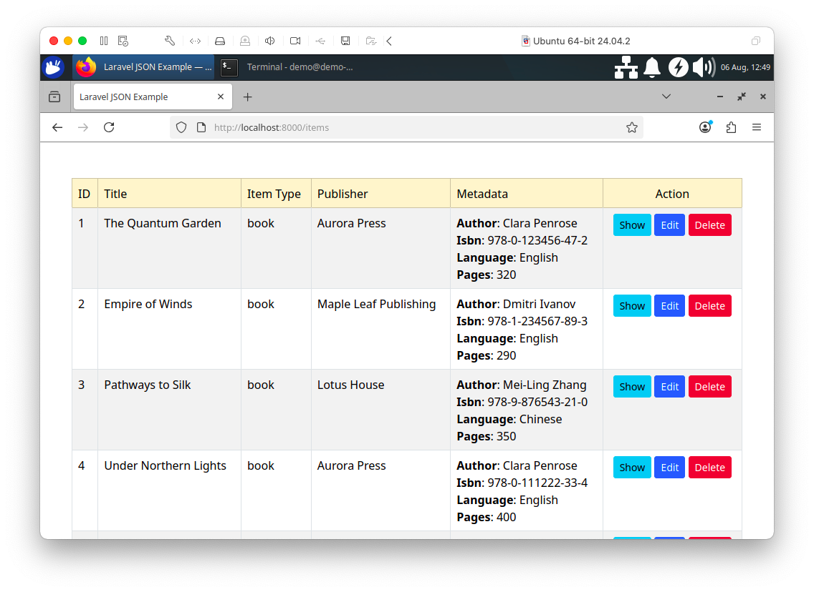
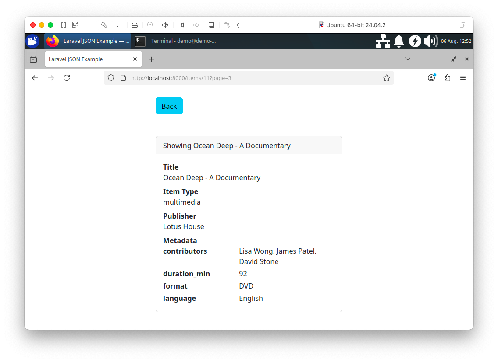
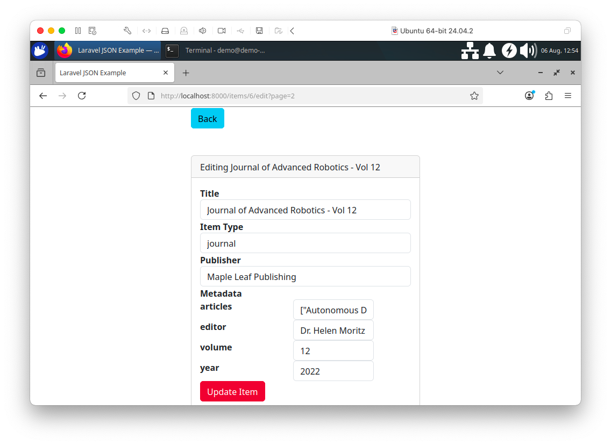
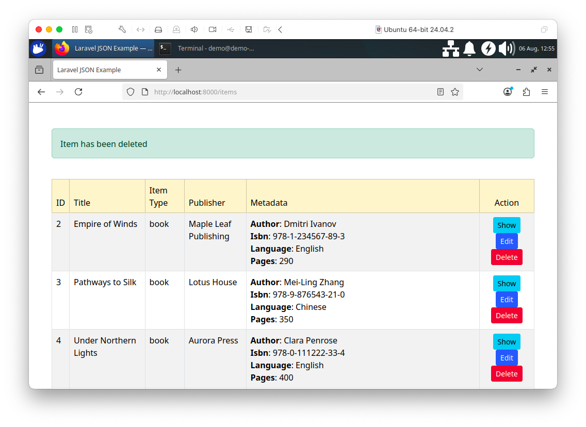

# Chapter 4: JSON Data

## Introduction

In this chapter, we'll discuss SingleStore's support for JavaScript Object Notation (JSON) data. JSON is a popular data format today and can be extremely useful for applications that need to capture information about objects that may vary in their attributes. JSON would be particularly useful for applications such as e-commerce or a library, where we may be storing a range of products that have quite different characteristics from each other. We'll look at some examples of this shortly.

We'll build a small inventory system to manage a library's collection of books, journals and multimedia materials. This example is inspired by an excellent tutorial by Noman Ur Rehman available on DigitalOcean[^1]. We'll see that it is effortless to store, retrieve and query JSON data using SingleStore. We'll also build a quick visual front-end to our inventory system using Laravel and PHP.

## Create the Database and Tables

In the SingleStore Portal, let's use the **SQL Editor** to create a new database. Call this `library_db`, as follows:

```sql
CREATE DATABASE IF NOT EXISTS library_db;
```

We'll also create several tables, as follows:

```sql
USE library_db;

DROP TABLE IF EXISTS authors;
CREATE TABLE IF NOT EXISTS authors (
    id INT PRIMARY KEY,
    name VARCHAR(100),
    nationality VARCHAR(50)
);

DROP TABLE IF EXISTS publishers;
CREATE TABLE IF NOT EXISTS publishers (
    id INT PRIMARY KEY,
    name VARCHAR(100),
    location VARCHAR(100)
);

DROP TABLE IF EXISTS items;
CREATE TABLE IF NOT EXISTS items (
    id INT PRIMARY KEY,
    title VARCHAR(200),
    item_type VARCHAR(50),
    publisher_id INT,
    metadata JSON NOT NULL
);
```

There is a one-to-many (1:m) relationship between `publishers` and `items`, where each publisher can produce multiple books, journals or multimedia content. The schema uses a flexible `metadata` column to store item-specific attributes in JSON format. By using `NOT NULL` on the column, SingleStore will raise an error if there is an attempt to store invalid JSON.

## Populate Database Tables

Let's now populate the tables. First, the `authors` table:

```sql
INSERT INTO authors (id, name, nationality) VALUES
(1, 'Clara Penrose', 'British'),
(2, 'Dmitri Ivanov', 'Russian'),
(3, 'Mei-Ling Zhang', 'Chinese');
```

Next, the `publishers` table:

```sql
INSERT INTO publishers (id, name, location) VALUES
(1, 'Aurora Press', 'London, UK'),
(2, 'Maple Leaf Publishing', 'Toronto, Canada'),
(3, 'Lotus House', 'Beijing, China');
```

Finally, the `items` table:

### Books

First, let's load the data for Books:

```sql
-- Books (flat JSON)
INSERT INTO items (id, title, item_type, publisher_id, metadata) VALUES
(1, 'The Quantum Garden', 'book', 1, '{"isbn": "978-0-123456-47-2", "pages": 320, "language": "English", "author_id": 1}'),
(2, 'Empire of Winds', 'book', 2, '{"isbn": "978-1-234567-89-3", "pages": 290, "language": "English", "author_id": 2}'),
(3, 'Pathways to Silk', 'book', 3, '{"isbn": "978-9-876543-21-0", "pages": 350, "language": "Chinese", "author_id": 3}'),
(4, 'Under Northern Lights', 'book', 1, '{"isbn": "978-0-111222-33-4", "pages": 400, "language": "English", "author_id": 1}'),
(5, 'Siberian Dreams', 'book', 2, '{"isbn": "978-8-765432-10-9", "pages": 275, "language": "Russian", "author_id": 2}');
```

We have no nested documents or arrays but a flat JSON structure. For example:

```json
{
  "isbn": "978-0-123456-47-2",
  "pages": 320,
  "language": "English",
  "author_id": 1
}
```

### Journals

Next, let's load the data for Journals:

```sql
-- Journals (JSON with array of article titles)
INSERT INTO items (id, title, item_type, publisher_id, metadata) VALUES
(6, 'Journal of Advanced Robotics - Vol 12', 'journal', 2,
 '{"volume": 12, "year": 2022, "editor": "Dr. Helen Moritz", "articles": [
     "Autonomous Drones in Urban Spaces",
     "Swarm Intelligence in Rescue Missions",
     "Adaptive Control in Humanoid Robots",
     "Robot Learning from Demonstration"
 ]}'),
(7, 'Neuroscience Frontier - Issue 8', 'journal', 1,
 '{"volume": 8, "year": 2023, "editor": "Prof. Alan Greene", "articles": [
     "Neural Plasticity in Adults"
 ]}'),
(8, 'Cultural History Review - Q3 Edition', 'journal', 3,
 '{"volume": 21, "year": 2023, "editor": "Dr. Olivia Chen", "articles": [
     "Myth & Memory in East Asia",
     "Oral Traditions and Digital Preservation",
     "Historical Narratives in Postcolonial Societies"
 ]}'),
(9, 'GreenTech Journal - April', 'journal', 2,
 '{"volume": 9, "year": 2022, "editor": "Samuel Takahashi", "articles": [
     "Vertical Farming Breakthroughs",
     "Sustainable Batteries for Grid Storage",
     "AI in Climate Modeling",
     "Smart Irrigation Systems",
     "Eco-Friendly Construction Materials"
 ]}'),
(10, 'Modern Linguistics Digest - Spring', 'journal', 1,
 '{"volume": 6, "year": 2023, "editor": "Dr. Sara König", "articles": [
     "Semantic Drift in Digital Age",
     "Code-Switching Patterns in Bilingual Youth"
 ]}');
```

We have an array structure for article titles. For example:

```json
{
  "volume": 12,
  "year": 2022,
  "editor": "Dr. Helen Moritz",
  "articles": [
    "Autonomous Drones in Urban Spaces",
    "Swarm Intelligence in Rescue Missions",
    "Adaptive Control in Humanoid Robots",
    "Robot Learning from Demonstration"
  ]
}
```

### Multimedia

Finally, let's load the data for Multimedia:

```sql
-- Multimedia (JSON with nested contributor)
INSERT INTO items (id, title, item_type, publisher_id, metadata) VALUES
(11, 'Ocean Deep - A Documentary', 'multimedia', 3,
 '{"format": "DVD", "duration_min": 92, "language": "English", 
   "contributors": {
      "narrator": "David Stone",
      "director": "Lisa Wong",
      "editor": "James Patel"
   }
 }'),
(12, 'Symphony No. 9 Performance', 'multimedia', 1,
 '{"format": "Blu-Ray", "duration_min": 78, "language": "German", 
   "contributors": {
      "conductor": "Klaus Berger",
      "violinist": "Maria Rossi"
   }
 }'),
(13, 'Machine Learning Explained', 'multimedia', 2,
 '{"format": "MP4", "duration_min": 60, "language": "English", 
   "contributors": {
      "presenter": "Anna Dupont",
      "animator": "John Kim",
      "scriptwriter": "Elena Grant"
   }
 }'),
(14, 'The Story of Silk Road', 'multimedia', 3,
 '{"format": "DVD", "duration_min": 85, "language": "Mandarin", 
   "contributors": {
      "host": "Ming Zhao",
      "director": "Yuki Nakamura",
      "translator": "Akira Tanaka",
      "composer": "Minji Park"
   }
 }'),
(15, 'Astrophysics Today', 'multimedia', 2,
 '{"format": "Blu-Ray", "duration_min": 70, "language": "English", 
   "contributors": {
      "presenter": "Neil Quinn",
      "editor": "Farah Idris",
      "consultant": "Liam Becker"
   }
 }');
```

We have nested contributors. For example:

```json
{
  "format": "DVD",
  "duration_min": 92,
  "language": "English",
  "contributors": {
    "narrator": "David Stone",
    "director": "Lisa Wong",
    "editor": "James Patel"
  }
}
```

From these examples, we can see that we may need to store our JSON data in various ways and the structure of the data may vary depending upon the attributes we wish to store. SingleStore can handle these different requirements and comes with a wide range of JSON functions[^2] that can help.

## Example Queries

Now that our data are safely inside SingleStore, let's look at ways to query that data.

First, let's see what SingleStore returns for the metadata column using `JSON_GET_TYPE`:

```sql
SELECT JSON_GET_TYPE(metadata)
FROM items;
```

The result should be:

```text
+-------------------------+
| JSON_GET_TYPE(metadata) |
+-------------------------+
| object                  |
| object                  |
| object                  |
| object                  |
| object                  |
| object                  |
| object                  |
| object                  |
| object                  |
| object                  |
| object                  |
| object                  |
| object                  |
| object                  |
| object                  |
+-------------------------+
```

All the rows are JSON objects.

Now let's select all books and extract the ISBN and language from metadata:

```sql
SELECT
    id,
    title,
    metadata::$isbn AS isbn,
    metadata::$language AS language
FROM items
WHERE item_type = 'book'
ORDER BY id;
```

Notice that we can use the double-colon (::) to specify a path to the specific attribute that we're interested in. Example output:

```text
+----+-----------------------+-------------------+----------+
| id | title                 | isbn              | language |
+----+-----------------------+-------------------+----------+
|  1 | The Quantum Garden    | 978-0-123456-47-2 | English  |
|  2 | Empire of Winds       | 978-1-234567-89-3 | English  |
|  3 | Pathways to Silk      | 978-9-876543-21-0 | Chinese  |
|  4 | Under Northern Lights | 978-0-111222-33-4 | English  |
|  5 | Siberian Dreams       | 978-8-765432-10-9 | Russian  |
+----+-----------------------+-------------------+----------+
```

Next, let's get all journals, showing the editor and the number of articles:

```sql
SELECT
    id,
    title,
    metadata::$editor AS editor,
    JSON_LENGTH(metadata::$articles) AS article_count
FROM items
WHERE item_type = 'journal';
```

Example output:

```text
+----+---------------------------------------+-------------------+---------------+
| id | title                                 | editor            | article_count |
+----+---------------------------------------+-------------------+---------------+
|  6 | Journal of Advanced Robotics - Vol 12 | Dr. Helen Moritz  |             4 |
|  9 | GreenTech Journal - April             | Samuel Takahashi  |             5 |
|  7 | Neuroscience Frontier - Issue 8       | Prof. Alan Greene |             1 |
|  8 | Cultural History Review - Q3 Edition  | Dr. Olivia Chen   |             3 |
| 10 | Modern Linguistics Digest - Spring    | Dr. Sara König    |             2 |
+----+---------------------------------------+-------------------+---------------+
```

Next, let's query multimedia items and get contributors as JSON objects. We'll limit the output to avoid word-wrap:

```sql
SELECT
    SUBSTRING(metadata::$contributors, 1, 60) AS contributors
FROM items
WHERE item_type = 'multimedia';
```

Example output:

```text
+--------------------------------------------------------------+
| contributors                                                 |
+--------------------------------------------------------------+
| {"consultant":"Liam Becker","editor":"Farah Idris","presente |
| {"conductor":"Klaus Berger","violinist":"Maria Rossi"}       |
| {"director":"Lisa Wong","editor":"James Patel","narrator":"D |
| {"composer":"Minji Park","director":"Yuki Nakamura","host":" |
| {"animator":"John Kim","presenter":"Anna Dupont","scriptwrit |
+--------------------------------------------------------------+
```

We'll now join books with authors by `author_id` extracted from the JSON metadata:

```sql
SELECT
    b.id,
    b.title,
    a.name AS author_name,
    a.nationality
FROM items b
JOIN authors a ON a.id = CAST(b.metadata::$author_id AS SIGNED)
WHERE b.item_type = 'book';
```

Example output:

```text
+----+-----------------------+----------------+-------------+
| id | title                 | author_name    | nationality |
+----+-----------------------+----------------+-------------+
|  3 | Pathways to Silk      | Mei-Ling Zhang | Chinese     |
|  1 | The Quantum Garden    | Clara Penrose  | British     |
|  5 | Siberian Dreams       | Dmitri Ivanov  | Russian     |
|  2 | Empire of Winds       | Dmitri Ivanov  | Russian     |
|  4 | Under Northern Lights | Clara Penrose  | British     |
+----+-----------------------+----------------+-------------+
```

Let's now search journals where any article title contains "AI":

```sql
SELECT
    i.id,
    i.title,
    i.metadata::$editor AS editor,
    a.table_col AS article
FROM items AS i
JOIN TABLE(JSON_TO_ARRAY(i.metadata::articles)) AS a
WHERE i.item_type = 'journal' AND a.table_col LIKE '%AI%';
```

Example output:

```text
+----+---------------------------+------------------+--------------------------+
| id | title                     | editor           | article                  |
+----+---------------------------+------------------+--------------------------+
|  9 | GreenTech Journal - April | Samuel Takahashi | "AI in Climate Modeling" |
+----+---------------------------+------------------+--------------------------+
```

Now, we'll add a new JSON field called `edition` to a book's metadata:

```sql
UPDATE items
SET metadata::$edition = 'Second'
WHERE id = 1 AND item_type = 'book';
```

To check that this was added correctly, we can run the following:

```sql
SELECT metadata::edition
FROM items
WHERE id = 1 AND item_type = 'book';
```

Example output:

```text
+-------------------+
| metadata::edition |
+-------------------+
| "Second"          |
+-------------------+
```

Finally, let's remove the `language` field from a book's metadata:

```sql
UPDATE items
SET metadata = JSON_DELETE_KEY(metadata, 'language')
WHERE id = 1 AND item_type = 'book';
```

To check that this was correctly removed, we can run the following:

```sql
SELECT metadata::language
FROM items
WHERE id = 1 AND item_type = 'book';
```

Example output:

```text
+--------------------+
| metadata::language |
+--------------------+
| NULL               |
+--------------------+
```

SingleStore supports an extensive set of functions[^3] that can be used with JSON data.

## Visualization using Laravel and PHP

Running the commands in the previous sections using the SQL Editor in our SingleStore Portal account is a great way to test our code and quickly view the results. However, we can go a step further and build a simple web interface that allows us to see the data and perform some data management operations. In this first application development iteration, we'll focus on Read, Update and Delete operations.

We'll delete the existing database and recreate it to have the original dataset.

### Install the Required Software

We'll build our web interface using Laravel and PHP. Before continuing, ensure that the following software is installed on your system:

- PHP 8.2 or later
- The PHP XML extension
- A MySQL-compatible PHP database driver
- Composer

> **Note:** This project has been tested with PHP 8.2 and Composer 2.x on Linux.

The installation process varies depending on your operating system. Linux users can typically install these packages using their distribution's package manager, as follows:

```shell
sudo apt update
sudo add-apt-repository ppa:ondrej/php
sudo apt update
sudo apt install php8.2-cli php8.2-xml php8.2-mysql
```

macOS and Windows users should follow the installation instructions provided by their preferred package management tools or installers.

Your environment may also need other packages.

To install Composer, we'll follow the instructions on the download page[^4]. On Linux, we'll move Composer to the `bin` directory:

```shell
sudo mv composer.phar /usr/local/bin/composer
```

Next, we'll create a project called `e-library`, as follows:

```shell
composer create-project laravel/laravel e-library
```

and then change to the project directory:

```shell
cd e-library
```

> **Note:** If you downloaded or cloned the completed project from the book's GitHub repository, extract the archive, open a terminal in the project directory and install the dependencies:
> - composer install
> - php artisan key:generate

We'll now edit the `.env` file in the e-library directory:

```text
DB_CONNECTION=mysql
DB_HOST=<host>
DB_PORT=3306
DB_DATABASE=library_db
DB_USERNAME="admin"
DB_PASSWORD="<password>"

SESSION_DRIVER=file
```

The `<host>` and `<password>` should be replaced with the values obtained from the SingleStore Portal when creating a cluster. Note also the use of double-quotes (") for `DB_USERNAME` and `DB_PASSWORD`. We'll also ensure that `SESSION_DRIVER` is set to `file`, as shown.

> **Note:** If you downloaded or cloned the completed project from the book's GitHub repository, the following files have already been created and you can skip this step.

### Create Files

The following commands are only required when starting from a clean Laravel installation:

```shell
php artisan make:model -a Author
php artisan make:model -a Publisher
php artisan make:model -a Item
```

For each of **Author**, **Publisher** and **Item**, we obtain:

- A migration in `database/migrations`

- A model in `app/Models`

- A controller in `app/Http/Controllers`

- A seeder in `database/seeders`

### Migrations (database/migrations)

We'll edit the **Author** migration file, so that we have the following:

```php
public function up(): void
{
    Schema::create('authors', function (Blueprint $table) {
        $table->id();
        $table->string('name');
        $table->string('nationality');
        $table->timestamps();
    });
}
```

the **Publisher** migration file, so that we have the following:

```php
public function up(): void
{
    Schema::create('publishers', function (Blueprint $table) {
        $table->id();
        $table->string('name');
        $table->string('location');
        $table->timestamps();
    });
}
```

and the **Product** migration file, so that we have the following:

```php
public function up(): void
{
    Schema::create('items', function (Blueprint $table) {
        $table->id();
        $table->string('title');
        $table->string('item_type');
        $table->unsignedInteger('publisher_id');
        $table->json('metadata');
        $table->timestamps();
    });
}
```

### Models (app/Models)

We'll edit the **Publisher** model file, so that we have the 1:m relationship with **Item**:

```php
class Publisher extends Model
{
    /** @use HasFactory<\Database\Factories\PublisherFactory> */
    use HasFactory;

    // A publisher has many items

    public function items()
    {
        return $this->hasMany('Item');
    }
}
```

and the **Item** model file so that we can access the JSON data by casting the attributes to an array and create the relationship with **Publisher**:

```php
class Item extends Model
{
    /** @use HasFactory<\Database\Factories\ItemFactory> */
    use HasFactory;

    public $timestamps = false;

    // Cast metadata JSON to array
    protected $casts = [
        'metadata' => 'array'
    ];

    // Each item has a publisher
    public function publisher()
    {
        return $this->belongsTo('Publisher');
    }

    protected $fillable = ['title', 'item_type', 'publisher_id', 'metadata'];
}
```

### Controllers (app/Http/Controllers)

For the the web application, let's focus on the `ItemController`. At the top of the file, we'll add the following:

```php
use App\Models\Author;
use App\Models\Publisher;
use App\Models\Item;
use Illuminate\Http\Request;
```

#### index()

We need to retrieve all the item data for the items index page and ensure that we have each item's publisher name. This will require joins across the respective tables. We'll also control the output by showing just five records per page using `simplePaginate()`.

```php
public function index()
{
    $items = Item::select('items.*', 'publishers.name as publisher_name')
        ->join('publishers', 'publishers.id', '=', 'items.publisher_id')
        ->orderBy('items.id')
        ->simplePaginate(5);

    return view('admin.index', compact('items'));
}
```

#### show()

To show a single item, we'll perform a query similar to the query for `index()` but we'll use `first()` to get an individual item record.

```php
public function show(Item $item)
{
    $one_item = Item::select('items.*', 'publishers.name as publisher_name')
        ->join('publishers', 'publishers.id', '=', 'items.publisher_id')
        ->where('items.id', $item->id)
        ->first();
 
    return view('admin.show', compact('one_item'));
}
```

#### edit()

To edit an existing item, we'll need to find the item to edit and we'll also need to get all the publishers to be offered in a drop-down menu if the user wishes to change this item attribute.

```php
public function edit($id)
{
    $item = Item::findOrFail($id);
    $publishers = Publisher::orderBy('id')->get();

    return view('admin.edit', compact('item', 'publishers'));
}
```

#### update()

We'll allow updates to the item name, publisher and the JSON attributes in this first application development iteration.

```php
public function update(Request $request, $id)
{
    $item = Item::findOrFail($id);

    $item->title = $request->input('title');
    $item->item_type = $request->input('item_type');
    $item->publisher_id = $request->input('publisher_id');

    $metadata = $request->input('metadata', []);
    foreach ($metadata as $key => &$value) {
        // Only decode if the value is a JSON string (array/dictionary format)
        if (is_string($value) && (str_starts_with($value, '{') || str_starts_with($value, '['))) {
            $decodedValue = json_decode($value, true);
            // Check if decoding was successful, else retain original string
            $value = json_last_error() === JSON_ERROR_NONE ? $decodedValue : $value;
        }
    }
    // Assign the processed attributes back to the item
    $item->metadata = $metadata;
    $item->save();

    return redirect()->route('items.index')->with('success', 'Item updated successfully');
}
```

####  destroy()

We can remove an item very easily by just using `delete()`.

```php
public function destroy($id)
{
    $item = Item::findOrFail($id);
    $item->delete();

    return redirect('/items')->with('success', 'Item has been deleted');
}
```

### Routes (routes/web.php)

In the `web.php` file in the `routes` directory, we'll add the following at the top:

```php
use App\Http\Controllers\AuthorController;
use App\Http\Controllers\PublisherController;
use App\Http\Controllers\ItemController;
```

and this code further down:

```php
Route::resource(
    'authors',
     AuthorController::class
);

Route::resource(
    'publishers',
    PublisherController::class
);

Route::resource(
    'items',
    ItemsController::class
);
```

### Views (resources/views/admin)

The three blade files for the **index** page, **show** page and **edit** page can be found on GitHub. In those files, there will be code for formatting the data using HTML, presentation and editing using PHP. Also, from the GitHub repo we'll copy the `index.blade.php` file to `resources/views`.

### Run the Code

We'll run the application from the e-library directory, as follows:

```shell
php artisan serve
```

In a web browser, we'll enter the following:

```text
http://localhost:8000/items
```

The output should be similar to Figure 4-1:



*Figure 4-1. Index Page.*

We can see the Items data correctly displayed for each item. The metadata is in JSON format. If we select **Show**, we can view the details about an item on a single page, as shown in Figure 4-2.



*Figure 4-2. Show Individual Item.*

From the index page, if we select **Edit**, we can edit an item, as shown in Figure 4-3.



*Figure 4-3. Edit Item.*

Many fields, including the JSON data, can be fully edited.

> **Note:** This example does not enforce strict data type validation for the JSON input. Additional client-side logic would be needed to ensure the integrity and correctness of the JSON structure.

Finally, if we select **Delete** from the index page, we can remove an item from the database. In Figure 4-4, an item has been deleted. We can confirm this by checking SingleStore using the **SQL Editor** in the Portal:

```sql
SELECT COUNT(*) FROM items;
```



*Figure 4-4. Delete Item.*

## Summary

In this chapter, we've seen that SingleStore can manage JSON data of varying complexity with ease. It supports a wide range of functions that can be used with JSON data and we have used a number of these functions in this chapter. Furthermore, we've seen that we can use SQL queries that combine operations on both Relational and JSON data. Finally, we've built a simple web interface to our database system using Laravel and PHP that enabled us to explore the data and make some modifications.

[^1]:  https://www.digitalocean.com/community/tutorials/working-with-json-in-mysql

[^2]:  https://docs.singlestore.com/cloud/reference/sql-reference/json-functions/

[^3]:  https://docs.singlestore.com/cloud/reference/sql-reference/json-functions/

[^4]:  https://getcomposer.org/download/
