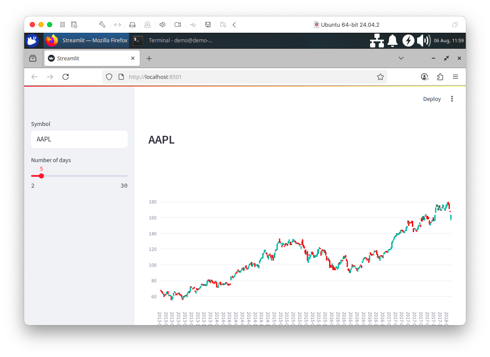

# Chapter 2: Time Series Data

## Introduction

Since the advent of Relational Database Technology, many new requirements to manage data have emerged. Luminaries, such as Martin Fowler, have proposed Polyglot Persistence[^1] as one solution for managing diverse data and data processing requirements.

However, Polyglot Persistence comes with costs and has attracted criticisms, such as[^2]:

> In an often-cited post on polyglot persistence, Martin Fowler sketches a web application for a hypothetical retailer that uses each of Riak, Neo4j, MongoDB, Cassandra, and an RDBMS for distinct data sets. It's not hard to imagine his retailer's DevOps engineers quitting in droves.
>
> *— Stephen Pimentel*

and also[^3]:

> What I've seen in the past has been is if you try to take on six of these \[technologies\], you need a staff of 18 people minimum just to operate the storage side - say, six storage technologies. That's not scalable and it's too expensive.
>
> *— Dave McCrory*

There have also been some proposals for using micro-services to implement a Polyglot Persistence architecture in recent years[^4]. However, SingleStore can provide a simpler solution by supporting diverse data types and processing requirements in a single multi-model database system. This offers many benefits, such as lower Total Cost of Ownership (TCO), less burden upon developers to learn multiple products, no integration pains and more. In this and the following chapters, we'll discuss SingleStore's multi-model capabilities in greater detail. We'll start with Time Series data.

We'll use historical S&P 500 stock data from Kaggle[^5] licensed under CC0 1.0, allowing unrestricted use, including for commercial purposes. We'll also build a quick dashboard to visualize candlestick charts using Streamlit.

The dataset consists of the following fields:

- **date:** Spans a five-year daily period from 8 February 2013 until 7 February 2018. No missing values.

- **open:** Opening price. 11 missing values.

- **high:** High price. 8 missing values.

- **low:** Low price. 8 missing values.

- **close:** Closing price. No missing values.

- **volume:** Total shares traded. No missing values.

- **Name:** Trading symbol. 505 unique values. No missing values.

For our initial exploration, we'll select **date**, **close** and **Name**.

## Create the Database and Table

In the SingleStore Portal, we'll use the **SQL Editor** to create a new database. Let's call this `timeseries_db`, as follows:

```sql
CREATE DATABASE IF NOT EXISTS timeseries_db;
```

We'll also create a table, as follows:

```sql
USE timeseries_db;

DROP TABLE IF EXISTS tick;
CREATE TABLE IF NOT EXISTS tick (
    ts     DATETIME SERIES TIMESTAMP,
    symbol VARCHAR(5),
    price  NUMERIC(18, 4),
    KEY(ts)
);
```

Each row has a time-valued attribute called `ts`. We'll use `DATETIME` rather than `DATETIME(6)`, since we are not working with fractional seconds in this example. `SERIES TIMESTAMP` specifies a table column as the default timestamp. We'll create a `KEY` on `ts` as this will allow us to efficiently filter on ranges of values.

## Fill out the Notebook

Let's now create a new Python notebook. We'll call it **data_loader_for_time_series**.

We'll create a new DataFrame, as follows:

```python
tick_csv_url = ...

tick_df = pd.read_csv(tick_csv_url)
```

This reads the CSV file and creates a DataFrame called `tick_df`.

In the next code cell, we'll remove incomplete rows:

```python
tick_df = tick_df.dropna()
```

Next, let's get the number of rows:

```python
tick_df.count()
```

Executing this will return the value `619029`.

We'll remove some of the columns based upon our earlier decision for the initial analysis, as follows:

```python
tick_df = tick_df.drop(columns = ["open", "high", "low", "volume"])
```

rename some columns:

```python
tick_df = tick_df.rename(columns = {"date": "ts", "close": "price", "Name": "symbol"})
```

and sort the data:

```python
tick_df = tick_df.sort_values(by = ["ts", "symbol"])
```

In the next code cell, we'll take a look at the structure of the DataFrame:

```python
tick_df.head()
```

The output should look like this:

```text
               ts    price symbol
71611  2013-02-08  45.0800      A
0      2013-02-08  14.7500    AAL
2518   2013-02-08  78.9000    AAP
1259   2013-02-08  67.8542   AAPL
3777   2013-02-08  36.2500   ABBV
```

We are now ready to write the DataFrame to SingleStore. First, we'll create a connection:

```python
from sqlalchemy import *

db_connection = create_engine(connection_url)
```

Next, we'll ensure that the table is empty:

```python
with db_connection.begin() as conn:
    conn.execute(text("TRUNCATE TABLE tick;"))
```

Finally, we'll write the DataFrame to SingleStore:

```python
tick_df.to_sql(
    "tick",
    con = db_connection,
    if_exists = "append",
    index = False,
    chunksize = 1000
)
```

This will write the DataFrame to the `tick` table in the `timeseries_db` database.

## Example Queries

Now that we've built our system, we'll run some queries. SingleStore supports a range of useful functions[^6] for working with Time Series data. Let's look at some examples.

### Average Aggregate

The following query illustrates how to compute a simple average aggregate over all time series values in the table:

```sql
SELECT symbol, AVG(price)
FROM tick
GROUP BY symbol
ORDER BY symbol
LIMIT 10;
```

The output should be:

```text
+--------+--------------+
| symbol | AVG(price)   |
+--------+--------------+
| A      |  49.20202542 |
| AAL    |  38.39325226 |
| AAP    | 132.43346307 |
| AAPL   | 109.06669849 |
| ABBV   |  60.86444003 |
| ABC    |  82.09297855 |
| ABT    |  42.94032566 |
| ACN    | 101.11907863 |
| ADBE   |  90.45815639 |
| ADI    |  60.93193209 |
+--------+--------------+
```

### Time Bucketing

Time bucketing can aggregate and group data for different time series by a fixed time interval. SingleStore supports several functions:

- **FIRST:** The value associated with the minimum timestamp.

- **LAST:** The value associated with the maximum timestamp.

- **TIME_BUCKET:** Normalizes time to the nearest bucket start time.

For instance, we can use `TIME_BUCKET` to find the average time series value grouped by five-day intervals, as follows:

```sql
SELECT symbol, TIME_BUCKET("5d", ts), AVG(price)
FROM tick
WHERE symbol = "AAPL"
GROUP BY 1, 2
ORDER BY 1, 2
LIMIT 10;
```

The output should be:

```text
+--------+----------------------------+-------------+
| symbol | TIME_BUCKET("5d", ts)      | AVG(price)  |
+--------+----------------------------+-------------+
| AAPL   | 2013-02-08 00:00:00.000000 | 67.75280000 |
| AAPL   | 2013-02-13 00:00:00.000000 | 66.36943333 |
| AAPL   | 2013-02-18 00:00:00.000000 | 64.48960000 |
| AAPL   | 2013-02-23 00:00:00.000000 | 63.63516667 |
| AAPL   | 2013-02-28 00:00:00.000000 | 61.51996667 |
| AAPL   | 2013-03-05 00:00:00.000000 | 61.39665000 |
| AAPL   | 2013-03-10 00:00:00.000000 | 61.68387500 |
| AAPL   | 2013-03-15 00:00:00.000000 | 64.46993333 |
| AAPL   | 2013-03-20 00:00:00.000000 | 65.08183333 |
| AAPL   | 2013-03-25 00:00:00.000000 | 64.98050000 |
+--------+----------------------------+-------------+
```

We can also combine these functions to create candlestick charts[^7] that show the **high**, **low**, **open** and **close** for a stock over time, bucketed by a five-day window, as follows:

```sql
SELECT TIME_BUCKET("5d") AS ts,
     symbol,
     MIN(price) AS low,
     MAX(price) AS high,
     FIRST(price) AS open,
     LAST(price) AS close
FROM tick
WHERE symbol = "AAPL"
GROUP BY 2, 1
ORDER BY 2, 1
LIMIT 10;
```

The output should be:

```text
+----------------------------+--------+---------+---------+---------+---------+
| ts                         | symbol | low     | high    | open    | close   |
+----------------------------+--------+---------+---------+---------+---------+
| 2013-02-08 00:00:00.000000 | AAPL   | 66.8428 | 68.5614 | 67.8542 | 66.8428 |
| 2013-02-13 00:00:00.000000 | AAPL   | 65.7371 | 66.7156 | 66.7156 | 65.7371 |
| 2013-02-18 00:00:00.000000 | AAPL   | 63.7228 | 65.7128 | 65.7128 | 64.4014 |
| 2013-02-23 00:00:00.000000 | AAPL   | 63.2571 | 64.1385 | 63.2571 | 63.5099 |
| 2013-02-28 00:00:00.000000 | AAPL   | 60.0071 | 63.0571 | 63.0571 | 60.0071 |
| 2013-03-05 00:00:00.000000 | AAPL   | 60.8088 | 61.6742 | 61.5919 | 61.6742 |
| 2013-03-10 00:00:00.000000 | AAPL   | 61.1928 | 62.5528 | 62.5528 | 61.7857 |
| 2013-03-15 00:00:00.000000 | AAPL   | 63.3799 | 65.1028 | 63.3799 | 64.9271 |
| 2013-03-20 00:00:00.000000 | AAPL   | 64.5828 | 65.9871 | 64.5828 | 65.9871 |
| 2013-03-25 00:00:00.000000 | AAPL   | 63.2371 | 66.2256 | 66.2256 | 63.2371 |
+----------------------------+--------+---------+---------+---------+---------+
```

### Smoothing

We can smooth time series data using `AVG` as a windowed aggregate. Here's an example where we're looking at the price and the moving average of price over the last three ticks:

```sql
SELECT symbol, ts, price, AVG(price)
OVER (ORDER BY ts ROWS BETWEEN 3 PRECEDING AND CURRENT ROW) AS smoothed_price
FROM tick
WHERE symbol = "AAPL"
LIMIT 10;
```

The output should be:

```text
+--------+---------------------+---------+----------------+
| symbol | ts                  | price   | smoothed_price |
+--------+---------------------+---------+----------------+
| AAPL   | 2013-02-08 00:00:00 | 67.8542 |    67.85420000 |
| AAPL   | 2013-02-11 00:00:00 | 68.5614 |    68.20780000 |
| AAPL   | 2013-02-12 00:00:00 | 66.8428 |    67.75280000 |
| AAPL   | 2013-02-13 00:00:00 | 66.7156 |    67.49350000 |
| AAPL   | 2013-02-14 00:00:00 | 66.6556 |    67.19385000 |
| AAPL   | 2013-02-15 00:00:00 | 65.7371 |    66.48777500 |
| AAPL   | 2013-02-19 00:00:00 | 65.7128 |    66.20527500 |
| AAPL   | 2013-02-20 00:00:00 | 64.1214 |    65.55672500 |
| AAPL   | 2013-02-21 00:00:00 | 63.7228 |    64.82352500 |
| AAPL   | 2013-02-22 00:00:00 | 64.4014 |    64.48960000 |
+--------+---------------------+---------+----------------+
```

### AS OF

Finding a table row that is current `AS OF` a point in time is also a common time series requirement. This can be easily achieved using `ORDER BY` and `LIMIT`. Here is an example:

```sql
SELECT *
FROM tick
WHERE ts <= "2024-10-11 00:00:00"
AND symbol = "AAPL"
ORDER BY ts DESC
LIMIT 1;
```

The output should be:

```text
+---------------------+--------+----------+
| ts                  | symbol | price    |
+---------------------+--------+----------+
| 2018-02-07 00:00:00 | AAPL   | 159.5400 |
+---------------------+--------+----------+
```

### Interpolation

Time series data may have gaps. We can interpolate missing points. The SingleStore documentation[^8] provides an example stored procedure that can be used for this purpose when working with tick data.

## Streamlit Visualization

Earlier, candlestick charts were mentioned and it would be great to see these in a graphic rather than tabular format. We can do this quite easily with Streamlit.

### Install the Required Software

We need to install the required Python packages before running the project. These are listed in the `requirements.txt` file included on GitHub. You can install them all at once with the following command:

```shell
pip install -r requirements.txt
```

> **Note:** This project has been tested with Python 3.12. Later Python versions may introduce compatibility issues with certain dependencies.

### Example Application

Here is the complete code listing for `streamlit_app.py`:

```python
# streamlit_app.py

import streamlit as st
import pandas as pd
import plotly.graph_objects as go
import sqlalchemy

# Initialize connection
conn = st.connection("singlestore", type = "sql")

symbol = st.sidebar.text_input("Symbol", value = "AAPL", max_chars = None)
num_days = st.sidebar.slider("Number of days", 2, 30, 5)

symbol = symbol.upper()
num_days_str = f'"{num_days}d"'

stmt = f"""
SELECT TIME_BUCKET({num_days_str}) AS day,
       symbol,
       MIN(price) AS low,
       MAX(price) AS high,
       FIRST(price) AS open,
       LAST(price) AS close
FROM tick
WHERE symbol = :symbol
GROUP BY symbol, day
ORDER BY symbol, day;
"""

data = conn.query(stmt, params = {"symbol": symbol})

if not data.empty:
    st.subheader(symbol)

    # Plot the candlestick chart using Plotly
    fig = go.Figure(data = [go.Candlestick(
        x = data["day"],
        open = data["open"],
        high = data["high"],
        low = data["low"],
        close = data["close"],
        name = symbol,
    )])

    fig.update_xaxes(type = "category")
    fig.update_layout(height = 700)

    st.plotly_chart(fig, use_container_width = True)
else:
    st.write("No data found for the symbol")

st.write(data)
```

### Create a Secrets File

Our local Streamlit application will read secrets from a file `.streamlit/secrets.toml` in our applications root directory. We need to create this file as follows:

```text
# .streamlit/secrets.toml

[connections.singlestore]
dialect = "mysql"
host = "<host>"
port = 3306
database = "timeseries_db"
username = "admin"
password = "<password>"
```

The `<host>` and `<password>` should be replaced with the values obtained from the SingleStore Portal.

### Run the Code

We can run the Streamlit application as follows:

```shell
streamlit run streamlit_app.py
```

The output in a web browser should look like Figure 2-1.



*Figure 2-1. Streamlit.*

On the web page, we can enter a new stock symbol in the text box and use the slider to change the number of days for `TIME_BUCKET`. Feel free to experiment with the code to suit your needs.

## Summary

This chapter showed that SingleStore is a capable solution for working with time series data. Using the power of SQL and built-in functions, we achieved a great deal. SingleStore has extended its support for time series with the addition of `FIRST`, `LAST` and `TIME_BUCKET`.

## Acknowledgements

I thank Dr John Pickford[^9] for advice and pointers to suitable time series datasets.

I am also grateful to Part Time Larry for his excellent video on Streamlit - Building Financial Dashboards with Python[^10] and the GitHub[^11] code for inspiring the Streamlit Visualization in this chapter.

[^1]:  https://martinfowler.com/bliki/PolyglotPersistence.html

[^2]:  https://www.odbms.org/wp-content/uploads/2014/04/Multiple-Data-Models.pdf

[^3]:  https://www.zdnet.com/article/the-nosql-database-glut-whats-the-real-price-of-the-current-boom/

[^4]:  https://www.techtarget.com/searchapparchitecture/tip/The-basics-of-polyglot-persistence-for-microservices-data

[^5]:  https://www.kaggle.com/datasets/camnugent/sandp500

[^6]:  https://docs.singlestore.com/cloud/developer-resources/functional-extensions/analyzing-time-series-data/

[^7]:  https://en.wikipedia.org/wiki/Candlestick_chart

[^8]:  https://docs.singlestore.com/cloud/developer-resources/functional-extensions/analyzing-time-series-data/

[^9]:  https://www.linkedin.com/in/john-pickford-50a9421/

[^10]:  https://www.youtube.com/watch?v=0ESc1bh3eIg

[^11]:  https://github.com/hackingthemarkets/streamlit-dashboards
