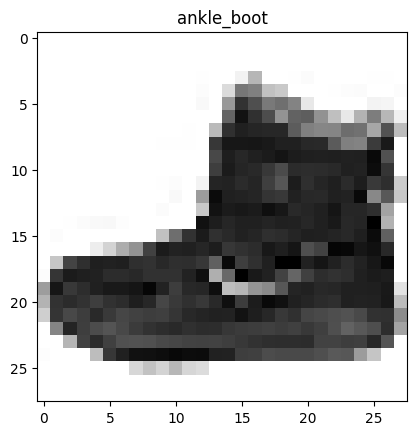
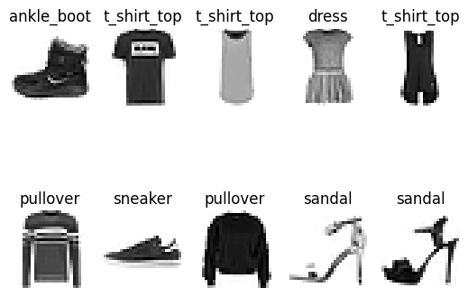
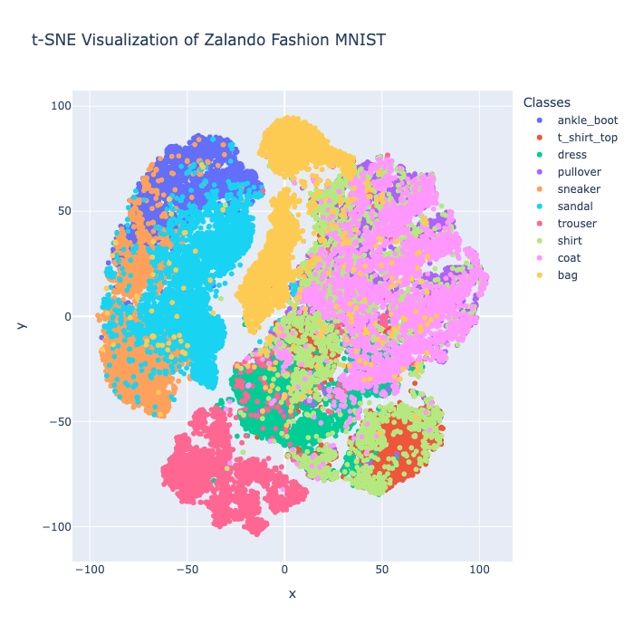

# Chapter 6: Vector Data

## Introduction

There are many forms of information that don't fit neatly into traditional rows and columns. For example, images, audio and video are all unstructured data forms that carry meaning, but can't be directly compared with integers or strings in a database table. Vector data is the bridge between the richness of the real-world and the precision of computational search and analysis.

In this chapter, we'll explore what vectors are, how they're created and why they're becoming one of the most important building blocks in modern data systems.

A vector is simply an ordered list of numbers but, in the context of machine learning and AI, those numbers represent a position in a high-dimensional space. For example, a 28 by 28 pixel grayscale image of a boot can be transformed (flattened) into a one-dimensional array of 784 pixel values. Similarly, a sentence can be converted into an embedding array that captures its meaning. Once in vector form, the similarity between two pieces of data can be measured using mathematical distances, such as the Euclidean distance.

As of the time of writing this chapter, SingleStore directly supported two functions to determine similarity: `DOT_PRODUCT` and `EUCLIDEAN_DISTANCE`. These can also be written using the shorthand operators `<*>` and `<->`, respectively.

### Dot Product

The dot product measures how much two vectors (arrows) point in the same direction. If they point exactly the same way, the dot product will be large and positive. If they point in completely opposite directions, it will be negative. If they are at a right angle (orthogonal), the dot product will be zero. In many similarity search applications, vectors are also normalized.

### Euclidean Distance

Euclidean distance measures the straight-line distance between two points, like using a ruler. If we have two points on a piece of paper, the Euclidean distance tells us exactly how far apart they are, as if we connected them with a straight line. In vector search, smaller distances indicate greater similarity. When vectors are normalized to unit length, this distance ranges from 0 for identical vectors to a maximum of 2 for vectors pointing in exactly opposite directions.

In this chapter, we'll:

- Learn how to transform images into vectors.

- Store vector data in SingleStore.

- Explore indexing methods like **Approximate Nearest Neighbor (ANN)** that make searches scale to millions of vectors.

- Visualize data to gain intuition.

By the end, we'll see how unstructured data can be represented, searched and analyzed just as easily as traditional tabular data, opening the door to AI-powered search.

In this chapter, we'll use the Fashion-MNIST[^1] dataset from Zalando. This dataset, released under the MIT License and available for commercial use, contains 70,000 labeled images of clothing items. It's perfect for an introduction to vector search, as each grayscale image can be represented as a vector, making it both realistic and computationally manageable. The vectors in this dataset are naturally occurring, meaning the numerical values are directly derived from the image pixels. In later chapters, we'll explore how to generate vectors from other types of data, such as text, enabling us to apply vector search more broadly.

## Create the Database and Tables

In the SingleStore Portal, let's use the **SQL Editor** to create a new database. Call this `vector_db`, as follows:

```sql
CREATE DATABASE IF NOT EXISTS vector_db;
```

We'll use `sklearn.datasets` to load the `fashion_mnist` dataset. This provides the dataset in **train** and **test** parts, so we'll create two tables to mirror this, as follows:

```sql
USE vector_db;

DROP TABLE IF EXISTS train_data;
CREATE TABLE IF NOT EXISTS train_data (
    id INT PRIMARY KEY,
    vector VECTOR(784),
    label VARCHAR(20)
);

DROP TABLE IF EXISTS test_data;
CREATE TABLE IF NOT EXISTS test_data (
    id INT PRIMARY KEY,
    vector VECTOR(784),
    label VARCHAR(20)
);
```

Note the use of the `VECTOR` data type. We set its value to 784 because each image is 28 by 28 pixels and flattening the image into a one-dimensional array results in 784 values. Historically, SingleStore supported storing vectors for many years, but these were stored using the `BLOB` data type. With SingleStore version 8.5, the new native `VECTOR` type was introduced along with vector indexing capabilities, offering more efficient and robust support for vector data.

## Fill out the Notebook

Let's now create a new Python notebook. We'll call it **data_loader_for_vector**.

First, we'll load the dataset:

```python
fashion = fetch_openml(name = "Fashion-MNIST", version = 1, as_frame = False)
X, y = fashion.data, fashion.target.astype(np.uint8)

train_images, test_images = X[:60000].reshape(-1, 28, 28), X[60000:].reshape(-1, 28, 28)
train_labels, test_labels = y[:60000], y[60000:]
```

If we check the data, as follows:

```python
print("train_images: " + str(train_images.shape))
print("train_labels: " + str(train_labels.shape))
print("test_images: " + str(test_images.shape))
print("test_labels: " + str(test_labels.shape))
```

we'll see that we have 60,000 train images and labels and 10,000 test images and labels:

```text
train_images: (60000, 28, 28)
train_labels: (60000,)
test_images: (10000, 28, 28)
test_labels: (10000,)
```

We'll print the first train image:

```python
print(train_images[0])
```

Example output:

```text
[[  0   0   0   0   0   0   0   0   0   0   0   0   0   0   0   0   0   0   0   0   0   0   0   0   0   0   0   0]
 [  0   0   0   0   0   0   0   0   0   0   0   0   0   0   0   0   0   0   0   0   0   0   0   0   0   0   0   0]
 [  0   0   0   0   0   0   0   0   0   0   0   0   0   0   0   0   0   0   0   0   0   0   0   0   0   0   0   0]
 [  0   0   0   0   0   0   0   0   0   0   0   0   1   0   0  13  73   0   0   1   4   0   0   0   0   1   1   0]
 [  0   0   0   0   0   0   0   0   0   0   0   0   3   0  36 136 127  62  54   0   0   0   1   3   4   0   0   3]
 [  0   0   0   0   0   0   0   0   0   0   0   0   6   0 102 204 176 134 144 123  23   0   0   0   0  12  10   0]
 [  0   0   0   0   0   0   0   0   0   0   0   0   0   0 155 236 207 178 107 156 161 109  64  23  77 130  72  15]
 [  0   0   0   0   0   0   0   0   0   0   0   1   0  69 207 223 218 216 216 163 127 121 122 146 141  88 172  66]
 [  0   0   0   0   0   0   0   0   0   1   1   1   0 200 232 232 233 229 223 223 215 213 164 127 123 196 229   0]
 [  0   0   0   0   0   0   0   0   0   0   0   0   0 183 225 216 223 228 235 227 224 222 224 221 223 245 173   0]
 [  0   0   0   0   0   0   0   0   0   0   0   0   0 193 228 218 213 198 180 212 210 211 213 223 220 243 202   0]
 [  0   0   0   0   0   0   0   0   0   1   3   0  12 219 220 212 218 192 169 227 208 218 224 212 226 197 209  52]
 [  0   0   0   0   0   0   0   0   0   0   6   0  99 244 222 220 218 203 198 221 215 213 222 220 245 119 167  56]
 [  0   0   0   0   0   0   0   0   0   4   0   0  55 236 228 230 228 240 232 213 218 223 234 217 217 209  92   0]
 [  0   0   1   4   6   7   2   0   0   0   0   0 237 226 217 223 222 219 222 221 216 223 229 215 218 255  77   0]
 [  0   3   0   0   0   0   0   0   0  62 145 204 228 207 213 221 218 208 211 218 224 223 219 215 224 244 159   0]
 [  0   0   0   0  18  44  82 107 189 228 220 222 217 226 200 205 211 230 224 234 176 188 250 248 233 238 215   0]
 [  0  57 187 208 224 221 224 208 204 214 208 209 200 159 245 193 206 223 255 255 221 234 221 211 220 232 246   0]
 [  3 202 228 224 221 211 211 214 205 205 205 220 240  80 150 255 229 221 188 154 191 210 204 209 222 228 225   0]
 [ 98 233 198 210 222 229 229 234 249 220 194 215 217 241  65  73 106 117 168 219 221 215 217 223 223 224 229  29]
 [ 75 204 212 204 193 205 211 225 216 185 197 206 198 213 240 195 227 245 239 223 218 212 209 222 220 221 230  67]
 [ 48 203 183 194 213 197 185 190 194 192 202 214 219 221 220 236 225 216 199 206 186 181 177 172 181 205 206 115]
 [  0 122 219 193 179 171 183 196 204 210 213 207 211 210 200 196 194 191 195 191 198 192 176 156 167 177 210  92]
 [  0   0  74 189 212 191 175 172 175 181 185 188 189 188 193 198 204 209 210 210 211 188 188 194 192 216 170   0]
 [  2   0   0   0  66 200 222 237 239 242 246 243 244 221 220 193 191 179 182 182 181 176 166 168  99  58   0   0]
 [  0   0   0   0   0   0   0  40  61  44  72  41  35   0   0   0   0   0   0   0   0   0   0   0   0   0   0   0]
 [  0   0   0   0   0   0   0   0   0   0   0   0   0   0   0   0   0   0   0   0   0   0   0   0   0   0   0   0]
 [  0   0   0   0   0   0   0   0   0   0   0   0   0   0   0   0   0   0   0   0   0   0   0   0   0   0   0   0]]
```

We can see the outline of an ankle boot.

If we print the corresponding label:

```python
print(train_labels[0])
```

It outputs the value `9`.

We'll map the numeric values to actual label values, using the following:

```python
classes = [
    "t_shirt_top",
    "trouser",
    "pullover",
    "dress",
    "coat",
    "sandal",
    "shirt",
    "sneaker",
    "bag",
    "ankle_boot"
]
```

Plotting the image, as follows:

```python
ax = plt.subplot(1, 1, 1)
plt.imshow(
    train_images[0],
    cmap = plt.cm.binary
)
ax.set_title(classes[train_labels[0]])
```

gives us the output shown in Figure 6-1.



*Figure 6-1. ankle_boot.*

Let's render some more images, using the following code:

```python
num_classes = len(classes)

for i in range(num_classes):
    ax = plt.subplot(2, 5, i + 1)
    plt.imshow(
        np.column_stack(train_images[i].reshape(1, 28, 28)),
        cmap = plt.cm.binary
    )
    plt.axis("off")
    ax.set_title(classes[train_labels[i]])
```

which gives us the output shown in Figure 6-2.



*Figure 6-2. 10 images.*

We'll now ensure the values are numeric for storing in SingleStore and normalize the pixel values between 0 and 1, as follows:

```python
train_images = train_images.astype("float32") / 255.0
test_images = test_images.astype("float32") / 255.0
```

and reduce the train and test images to one-dimensional arrays, as follows:

```python
train_images = train_images.reshape((train_images.shape[0], -1))
test_images = test_images.reshape((test_images.shape[0], -1))
```

Checking the train and test images:

```python
print("train_images: " + str(train_images.shape))
print("test_images: " + str(test_images.shape))
```

gives us the following output:

```python
train_images: (60000, 784)
test_images: (10000, 784)
```

Next, we'll creates two Pandas DataFrames called `train_df` and `test_df`, where each row contains a unique ID, the flattened image vector and the human-readable label (from `classes`) for each image in the training and test datasets:

```python
train_df = pd.DataFrame({
    "id": np.arange(len(train_images)),
    "vector": list(train_images),
    "label": [classes[label] for label in train_labels]
})

test_df = pd.DataFrame({
    "id": np.arange(len(test_images)),
    "vector": list(test_images),
    "label": [classes[label] for label in test_labels]
})
```

A quick check for `train_df`:

```python
train_df.head()
```

Example output:

```text
   id                                            vector        label
0  0  [0.0, 0.0, 0.0, 0.0, 0.0, 0.0, 0.0, 0.0, 0.0, ...   ankle_boot
1  1  [0.0, 0.0, 0.0, 0.0, 0.0, 0.003921569, 0.0, 0....  t_shirt_top
2  2  [0.0, 0.0, 0.0, 0.0, 0.0, 0.0, 0.0, 0.0, 0.0, ...  t_shirt_top
3  3  [0.0, 0.0, 0.0, 0.0, 0.0, 0.0, 0.0, 0.0, 0.129...        dress
4  4  [0.0, 0.0, 0.0, 0.0, 0.0, 0.0, 0.0, 0.0, 0.0, ...  t_shirt_top
```

Similarly for `test_df`:

```python
test_df.head()
```

Example output:

```
   id                                            vector        label
0  0  [0.0, 0.0, 0.0, 0.0, 0.0, 0.0, 0.0, 0.0, 0.0, ...   ankle_boot
1  1  [0.0, 0.0, 0.0, 0.0, 0.0, 0.0, 0.0, 0.0, 0.0, ...     pullover
2  2  [0.0, 0.0, 0.0, 0.0, 0.0, 0.0, 0.0, 0.0, 0.003...      trouser
3  3  [0.0, 0.0, 0.0, 0.0, 0.0, 0.0, 0.0, 0.0, 0.0, ...      trouser
4  4  [0.0, 0.0, 0.0, 0.007843138, 0.0, 0.003921569,...        shirt
```

We're now ready to write the data to SingleStore.

First, we'll set up the connection to SingleStore:

```python
from sqlalchemy import *

db_connection = create_engine(connection_url)
```

Next, we'll ensure that the tables are empty:

```python
tables = ["train_data", "test_data"]

with db_connection.begin() as conn:
    for table in tables:
        conn.execute(text(f"TRUNCATE TABLE {table};"))
```

Finally, we are ready to write the DataFrames to SingleStore:

```python
train_df.to_sql(
    "train_data",
    con = db_connection,
    if_exists = "append",
    index = False,
    chunksize = 1000
)

test_df.to_sql(
    "test_data",
    con = db_connection,
    if_exists = "append",
    index = False,
    chunksize = 1000
)
```

Now that our flattened and normalized image vectors are stored in SingleStore, let's take a quick look at how they cluster together in vector space. We'll use t-SNE to project all 60,000 train images into two dimensions, revealing how similar items group together. t-SNE is a dimensionality reduction technique that preserves the structure of the data by keeping similar points close together in a lower-dimensional space. It's useful for visualizing clusters or groups of similar data points.

First, we'll encode categorical labels as integers for model compatibility:

```python
label_encoder = LabelEncoder()
y_encoded = label_encoder.fit_transform(train_labels)
```

Next, we'll apply t-SNE to all 60,000 train images. This may take a few minutes to complete.

```python
print("Starting t-SNE, this may take a few minutes ...")
start_time = time()

tsne = TSNE(
    n_components = 2,
    random_state = 42,
    method = "barnes_hut",
    perplexity = 30,
    max_iter = 1000
)

X_tsne = tsne.fit_transform(train_images)

print(f"t-SNE completed in {time() - start_time:.2f} seconds.")
```

Finally, we'll render the image, as follows:

```python
tsne_df = pd.DataFrame(X_tsne, columns = ["x", "y"])
tsne_df["label"] = y_encoded
tsne_df["class_name"] = [classes[i] for i in y_encoded]

fig_fmnist_tsne = px.scatter(
    tsne_df,
    x = "x",
    y = "y",
    render_mode = "webgl",
    color = "class_name",
    labels = {"class_name": "Classes"},
    title = "t-SNE Visualization of Zalando Fashion MNIST"
)

fig_fmnist_tsne.update_layout(width = 700, height = 700)
fig_fmnist_tsne.show()
```

This will render the image shown in Figure 6-3.



*Figure 6-3. t-SNE Visualization of Zalando Fashion MNIST.*

The t-SNE visualization shows that many clothing categories form clearly separated clusters, demonstrating that the embeddings effectively capture distinguishing features between different types of clothing items. For example, items like trousers and sneakers are generally grouped in their own regions. However, we also see areas where clusters overlap or are less well-defined, such as between similar upper-body clothing items like shirts, pullovers and coats. This overlap suggests that the model's embeddings may sometimes struggle to perfectly differentiate between visually similar items, which could lead to misclassifications when performing similarity searches or tasks like image retrieval.

## Example Queries

Before running any queries, we'll create vector indexes on the two tables. The vector indexes enable efficient similarity searches on the vector columns.

```sql
ALTER TABLE train_data ADD VECTOR INDEX (vector)
    INDEX_OPTIONS '{
        "index_type": "HNSW_FLAT",
        "metric_type": "EUCLIDEAN_DISTANCE",
        "M": 16,
        "efConstruction": 200
    }';

ALTER TABLE test_data ADD VECTOR INDEX (vector)
    INDEX_OPTIONS '{
        "index_type": "HNSW_FLAT",
        "metric_type": "EUCLIDEAN_DISTANCE",
        "M": 16,
        "efConstruction": 200
    }';
```

`INDEX_OPTIONS` is a JSON string specifying how the vector index should be built and searched. These are the options used:

- "`index_type`": "`HNSW_FLAT`" specifies the index algorithm. `HNSW` (Hierarchical Navigable Small World) is a popular graph-based approximate nearest neighbor search method. The `FLAT` variant means it stores all vectors without compression, trading some memory for accuracy.

- "`metric_type`": "`EUCLIDEAN_DISTANCE`" is the distance metric used to compare vectors.

- "`M`": `16` is a parameter controlling the number of bi-directional links created for each node in the HNSW graph. Larger M increases recall and accuracy but also increases memory usage and index build time.

- "`efConstruction`": `200` controls the size of the dynamic candidate list during index construction. Higher values lead to better index quality but slower build time.

There are many other parameters and configuration options.

Now, let's try a few SQL queries.

First, a nearest neighbor search on the training data with index using `ORDER BY` and `LIMIT`:

```sql
SELECT label, vector <-> (
    SELECT vector FROM train_data WHERE id = 30000
) AS distance
FROM train_data
ORDER BY distance
LIMIT 5;
```

Example output:

```text
+-------+--------------------+
| label | distance           |
+-------+--------------------+
| dress |                  0 |
| dress | 2.2373813064889543 |
| dress | 2.4021264947177023 |
| dress | 2.5632904508333136 |
| dress |   2.60825593445559 |
+-------+--------------------+
```

The query returns the five clothing items in the training dataset whose images are most similar to the item with ID 30000 (a dress). The closest match is the item itself, with a distance of zero. The next four items are also dresses, with increasing distances indicating decreasing similarity. This shows that the vector search effectively groups similar clothing items together based on their image features.

Next, a nearest neighbor search on the testing data with index using `ORDER BY` and `LIMIT`:

```sql
SELECT label, vector <-> (
    SELECT vector FROM test_data WHERE id = 500
) AS distance
FROM test_data
ORDER BY distance
LIMIT 5;
```

Example output:

```text
+-------------+--------------------+
| label       | distance           |
+-------------+--------------------+
| pullover    |                  0 |
| pullover    | 5.0162904482136845 |
| shirt       |  5.489347371984442 |
| t_shirt_top | 5.5393541525605885 |
| pullover    |  5.565037523607559 |
+-------------+--------------------+
```

The query finds the five items in the test dataset most similar to the item with ID 500 (a pullover). The closest match is the item itself with a distance of zero. The next closest items include other pullovers, as well as related upper-body clothing like shirts and t-shirts, with gradually increasing distances. Three of the five items were correctly identified.

Next, we perform a cross-table similarity search:

```sql
SELECT label, vector <-> (
    SELECT vector FROM train_data WHERE id = 30000
) AS distance
FROM test_data
ORDER BY distance
LIMIT 5;
```

Example output:

```text
+-------+--------------------+
| label | distance           |
+-------+--------------------+
| dress | 2.5419237184041434 |
| dress |  2.931686655149546 |
| dress |  3.010232323586964 |
| dress |   3.06381446499747 |
| dress | 3.2260806853107016 |
+-------+--------------------+
```

The query searches the test data table for the five items most similar to the item with ID 30000 (a dress) in the train data table. All five closest matches are dresses. This shows the vector representations effectively generalize across datasets, identifying visually similar items even between separate training and testing sets.

Using `EXPLAIN` can show the query plan:

```sql
EXPLAIN
SELECT label, vector <-> (
    SELECT vector FROM train_data WHERE id = 30000
) AS distance
FROM train_data
ORDER BY distance
LIMIT 5;
```

Partial example output:

```text
"ColumnStoreFilter [INTERNAL_VECTOR_SEARCH(0, ( SELECT remote_1.vector AS `vector` FROM  ( SELECT train_data_1.vector AS `vector` FROM  `vector_db`.`train_data` as `train_data_1`  WHERE train_data_1.id = 30000 ) AS `remote_1` /*!90623 OPTION(NO_QUERY_REWRITE=1, INTERPRETER_MODE=INTERPRET_FIRST, CLIENT_FOUND_ROWS=1)*/ ), 5, '', 0) index]"
```

The `INTERNAL_VECTOR_SEARCH(...)` index shows that an internal vector index is being used for the nearest neighbor search. The vector being searched is the one selected by the subquery `(SELECT train_data_1.vector ... WHERE id=30000)`.

## Summary

In this chapter, we explored how vector embeddings and similarity search were used to analyze and retrieve visually related items in the Zalando Fashion-MNIST dataset. We started by preprocessing the image data into normalized, flattened vectors suitable for efficient indexing and querying in SingleStore. We then created vector indexes using the HNSW algorithm with Euclidean distance, which enabled fast approximate nearest neighbor searches.

To better understand the data distribution, we used t-SNE for dimensionality reduction and visualized the embedding clusters. This revealed distinct groupings for many clothing categories alongside some overlapping regions, indicating possible challenges in classification. Using vector similarity queries, we demonstrated nearest neighbor searches within both training and test datasets, confirming the model's ability to retrieve semantically related items with good accuracy. Finally, we performed cross-dataset similarity searches, showing that the vector representations generalized across different data partitions.

[^1]:  https://github.com/zalandoresearch/fashion-mnist
