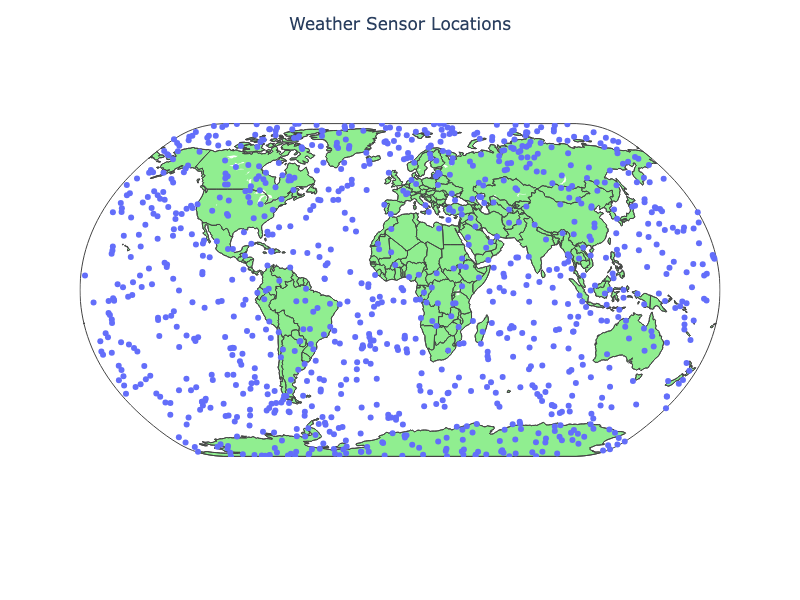
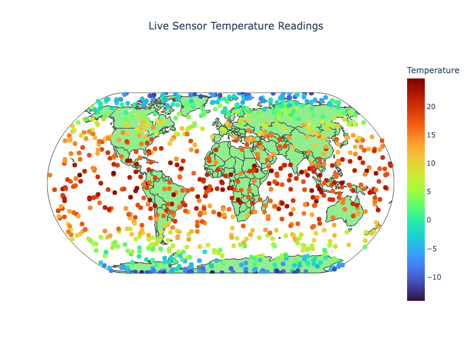

# Chapter 8: Apache Kafka

## Introduction

In this chapter, we'll explore a powerful feature of SingleStore called Pipelines. Pipelines allow vast quantities of data to be ingested in parallel into a SingleStore database. To illustrate this, we'll walk through an example that combines Pipelines with Apache Kafka.

Our first example focuses on managing streaming data from sensors, a common real-world use case. We'll simulate globally distributed temperature sensors that generate continuous readings. These readings will be ingested into SingleStore through Confluent Cloud, using a Python application that implements a Producer-Consumer model with SingleStore Pipelines.

In the second example, we'll reverse the direction of data flow and use SingleStore as a Producer. Here, simulated stock market tick data will be published from SingleStore to Confluent Cloud and consumed by a Python program. While this functionality is different from Pipelines, it demonstrates how SingleStore can also push outbound messages to a Kafka cluster, extending its role beyond ingestion into active data distribution.

We'll start by creating a free account on Confluent Cloud and provisioning a Kafka cluster using the Basic (Free) Tier on AWS. Once the cluster is ready, we'll record the address of the **bootstrap server**, then generate an **API key** and **secret** for authentication. Next, we'll create two topics:

- iot-temperatures
- tick-data

using the default settings. Finally, we'll add the bootstrap server address to the SingleStore firewall to allow communication between the two systems.

## Real-Time IoT Sensor Consumer

### Create the Database and Tables

In the SingleStore Portal, we'll use the **SQL Editor** to create a new database. Let's call this `sensor_readings_db`, as follows:

```sql
CREATE DATABASE IF NOT EXISTS sensor_readings_db;
```

We'll also create two tables, as follows:

```sql
USE sensor_readings_db;

DROP TABLE IF EXISTS sensors;
CREATE TABLE IF NOT EXISTS sensors (
    id INT PRIMARY KEY,
    name VARCHAR (50),
    latitude DOUBLE,
    longitude DOUBLE
);

DROP TABLE IF EXISTS temperatures;
CREATE TABLE IF NOT EXISTS temperatures (
    id INT,
    temperature DOUBLE,
    timestamp BIGINT,
    PRIMARY KEY(id, timestamp)
);
```

We'll upload data for 1,000 sensors into the `sensors` table. The sensors are globally distributed and our dataset contains four columns consisting of a unique **id**, a **name**, **latitude** and **longitude**.

We'll stream data into the `temperatures` table. This table contains three columns consisting of a unique **id**, a **temperature** reading and a **timestamp**.

### Fill out the Notebook

Let's now create a new Python notebook. We'll call it **data_loader_for_kafka**.

We'll create a new DataFrame, as follows:

```python
sensor_csv_url = ...

sensor_df = pd.read_csv(sensor_csv_url)
```

This reads the sensor CSV file and creates a DataFrame called `sensor_df`.

A quick plot shows the global random sensor distribution:

```python
fig = px.scatter_geo(
    sensor_df,
    lat = "latitude",
    lon = "longitude",
    hover_name = "id",
    width = 800,
    height = 600
)

fig.update_layout(
    title = "Weather Sensor Locations",
    title_x = 0.5,
    geo = dict(
        showland = True,
        landcolor = "LightGreen",
        showcountries = True,
        projection_type = "natural earth"
    )
)

fig.show()
```

This will produce the image shown in Figure 8-1.



*Figure 8-1. Weather Sensor Locations.*

We are now ready to write the DataFrame to SingleStore. First, we'll create a connection:

```python
from sqlalchemy import *

db_connection = create_engine(connection_url)
```

Next, we'll ensure that the table is empty:

```python
with db_connection.begin() as conn:
    conn.execute(text("TRUNCATE TABLE sensors;"))
```

Finally, we'll write the DataFrame to SingleStore:

```python
sensor_df.to_sql(
    "sensors",
    con = db_connection,
    if_exists = "append",
    index = False,
    chunksize = 1000
)
```

This will write the DataFrame to the `sensors` table in the sensor_readings`_db` database.

### Create Kafka Producer

Now let's create a new notebook called **kafka_producer**.

First, we'll create a Kafka configuration, as follows:

```python
conf = {
    "bootstrap.servers": "<bootstrap_server>",
    "security.protocol": "SASL_SSL",
    "sasl.mechanisms": "PLAIN",
    "sasl.username": "<api_key>",
    "sasl.password": "<api_secret>",
    "log_level": 0
}

topic = "iot-temperatures"
```

We'll replace `<bootstrap_server>`, `<api_key>` and `<api_secret>` with the values we previously saved.

Next, we'll create a connection to SingleStore:

```python
from sqlalchemy import *

db_connection = create_engine(connection_url)
```

Now we'll query the database to find the range of unique sensor identifiers, so we can select one randomly from this range to generate a temperature reading:

```python
counter = 0
print_every = 10

query = "SELECT MIN(id) AS min_id, MAX(id) AS max_id FROM sensors;"
min_id, max_id = pd.read_sql(query, db_connection).iloc[0]
```

To provide some realism for the temperature reading returned by a sensor, we'll use a helper function that will generate a temperature reading based upon the latitude of a sensor:

```python
def generate_temperature(latitude: float) -> float:
    """
    Generate a temperature based on latitude:
    - Equator (lat ~ 0)    -> hottest
    - Poles (lat ~ +/- 90) -> coldest
    Adds some random fluctuation.
    """
    base_temp = 30 * cos(radians(latitude)) - 10
    temp = base_temp + random.uniform(-5, 5)
    return round(temp, 2)
```

We should also check if a message was correctly delivered:

```python
def delivery_report(err, msg):
    if err:
        print(f"Delivery failed: {err}")
    else:
        print(f"Delivered to {msg.topic()} [{msg.partition()}] @ offset {msg.offset()}")
```

Now, we'll select a random sensor, create a record with the sensor identifier, a temperature reading and a timestamp and wrap it up in a JSON format:

```python
def _produce_single_event():
    global counter
    sensor_id = random.randint(min_id, max_id)

    query = f"SELECT id, latitude FROM sensors WHERE id = {sensor_id};"
    sensor = pd.read_sql(query, db_connection).iloc[0]
    
    record = {
        "id": int(sensor["id"]),
        "temperature": generate_temperature(sensor["latitude"]),
        "timestamp": int(datetime.utcnow().timestamp() * 1000)
    }

    producer.produce(
        topic = topic,
        key = str(record["id"]),
        value = json.dumps(record),
        callback = delivery_report
    )

    producer.poll(0)

    counter += 1
    if counter % print_every == 0 or counter == 1:
        clear_output(wait = True)
        print(f"Produced {counter} records, latest: {record}")
```

By default, we'll generate 20 messages. However, we can also create an endless loop by passing the following helper function the value `-1`:

```python
def produce_events(num_messages = 20, interval = 0.2):
    try:
        if num_messages == -1:
            print("Producing events endlessly ...")
            while True:
                _produce_single_event()
                time.sleep(interval)
        else:
            for _ in range(num_messages):
                _produce_single_event()
                time.sleep(interval)
    except KeyboardInterrupt:
        print("Producer stopped by user.")
    finally:
        producer.flush(timeout = 10)
        print(f"Finished producing events (total {counter})")
```

Finally, we'll generate some messages continuously, until interrupted:

```python
producer = Producer(conf)
produce_events(num_messages = -1)
```

Example output:

```text
Produced 2740 records, latest: {'id': 480, 'temperature': 13.49, 'timestamp': 1756309773989}
Delivered to iot-temperatures [5] @ offset 496
Delivered to iot-temperatures [5] @ offset 497
Delivered to iot-temperatures [1] @ offset 499
Delivered to iot-temperatures [2] @ offset 492
Delivered to iot-temperatures [3] @ offset 411
Delivered to iot-temperatures [1] @ offset 500
Delivered to iot-temperatures [1] @ offset 501
Delivered to iot-temperatures [5] @ offset 498
Producer stopped by user.
Delivered to iot-temperatures [2] @ offset 493
Finished producing events (total 2748)
```

### Create Kafka Consumer

Our messages are being streamed to Confluent Cloud and we'll now create a way to consume them in SingleStore. This is easily achieved using Pipelines. Using the SQL Editor, we'll first drop the Pipeline if it already exists:

```sql
DROP PIPELINE IF EXISTS kafka_confluent_cloud;
```

and then create the Pipeline, as follows:

```sql
CREATE PIPELINE kafka_confluent_cloud AS
LOAD DATA KAFKA '<bootstrap_server>/iot-temperatures'
CONFIG '{
    "security.protocol" : "SASL_SSL",
    "sasl.mechanism" : "PLAIN",
    "sasl.username" : "<api_key>"
}'
CREDENTIALS '{
    "sasl.password" : "<api_secret>"
}'
SKIP DUPLICATE KEY ERRORS
INTO TABLE temperatures
FORMAT JSON
( id <- id, temperature <- temperature, timestamp <- timestamp );
```

We'll replace `<bootstrap_server>`, `<api_key>` and `<api_secret>` with the values we previously saved. Since we are using JSON to produce the messages, we need to provide the mapping of the JSON fields to the fields in the `temperatures` table.

Before starting the Pipeline, we'll test it:

```sql
TEST PIPELINE kafka_confluent_cloud LIMIT 1;
```

Example output:

```text
+------+-------------+---------------+
| id   | temperature | timestamp     |
+------+-------------+---------------+
|  821 |       21.82 | 1756309088240 |
+------+-------------+---------------+
```

Then we'll start the Pipeline to ingest the messages:

```sql
START PIPELINE kafka_confluent_cloud;
```

After a short time, we'll run the following command to check if the data are being correctly streamed into the table:

```sql
SELECT COUNT(*) FROM temperatures;
```

### Create a Dashboard

We'll create a simple dashboard that shows the sensors on a map, similar to Figure 8-1, but with the sensors and dashboard updated every few seconds.

Let's create a new notebook called **kafka_dashboard**.

First, we'll create a connection to SingleStore:

```python
from sqlalchemy import *

db_connection = create_engine(connection_url)
```

Next, we'll set the refresh rate and that we are working with 1,000 sensors:

```python
refresh_interval = 5
num_records = 1000
```

We'll create a helper function to get the latest sensor data:

```python
def get_latest_sensor_data():
    """
    Query latest temperature for each sensor and return as a DataFrame
    with timestamp converted to pandas datetime.
    """
    df = pd.read_sql("""
        SELECT t.id, t.temperature, t.timestamp, s.latitude, s.longitude
        FROM sensors s
        JOIN temperatures t
            ON t.id = s.id
            AND t.timestamp = (
                SELECT MAX(timestamp)
                FROM temperatures
                WHERE id = s.id
            );
    """, db_connection)

    df["timestamp"] = pd.to_datetime(df["timestamp"], unit = "ms")
    return df
```

and then prime the dashboard with initial data:

```python
df = get_latest_sensor_data()

fig = go.FigureWidget(
    go.Scattergeo(
        lat = df["latitude"],
        lon = df["longitude"],
        mode = "markers",
        marker = dict(
            size = 8,
            color = df["temperature"],
            colorscale = "Turbo",
            cmin = df["temperature"].min(),
            cmax = df["temperature"].max(),
            colorbar = dict(title = "Temperature")
        ),
        text = df["id"]
    )
)

fig.update_layout(
    title = "Live Sensor Temperature Readings",
    title_x = 0.5,
    geo = dict(
        showland = True,
        landcolor = "LightGreen",
        showcountries = True,
        projection_type = "natural earth"
    ),
    width = 800,
    height = 600
)

display(fig)
```

and then use a loop to update the data continuously:

```python
try:
    while True:
        df = get_latest_sensor_data()

        # Update the figure data in place
        fig.data[0].text = df["id"]
        fig.data[0].lat = df["latitude"]
        fig.data[0].lon = df["longitude"]
        fig.data[0].marker.color = df["temperature"]
        
        time.sleep(refresh_interval)

except KeyboardInterrupt:
    print("Stopped by user.")
```

Example output is shown in Figure 8-2.



*Figure 8-2. Live Sensor Temperature Readings.*

## Stock Market Data Producer

### Create the Database and Table

In the SingleStore Portal, we'll use the **SQL Editor** to create a new database. Let's call this `timeseries_db`, as follows:

```sql
CREATE DATABASE IF NOT EXISTS timeseries_db;
```

We'll also create a table, as follows:

```sql
USE timeseries_db;

DROP TABLE IF EXISTS tick;
CREATE TABLE IF NOT EXISTS tick (
    ts     DATETIME SERIES TIMESTAMP,
    symbol VARCHAR(10),
    price  NUMERIC(18, 4),
    KEY(ts)
);
```

We'll create some fictitious stock symbols and tick data just for testing, as follows:

```sql
INSERT INTO tick (ts, symbol, price) VALUES
('2025-08-10 09:15:32', 'TEST14-FX', 134.27),
('2025-08-10 10:45:19', 'TEST03-FX', 89.54),
('2025-08-11 11:03:47', 'TEST19-FX', 215.76),
('2025-08-12 14:22:08', 'TEST07-FX', 52.13),
('2025-08-12 15:41:56', 'TEST11-FX', 301.45),
('2025-08-13 09:05:11', 'TEST01-FX', 177.88),
('2025-08-13 13:27:33', 'TEST16-FX', 64.92),
('2025-08-14 16:12:49', 'TEST09-FX', 240.67),
('2025-08-14 10:34:25', 'TEST20-FX', 118.39),
('2025-08-15 09:48:59', 'TEST05-FX', 78.56),
('2025-08-15 11:26:41', 'TEST12-FX', 412.09),
('2025-08-16 14:55:20', 'TEST04-FX', 33.48),
('2025-08-16 15:43:12', 'TEST17-FX', 265.31),
('2025-08-17 10:07:03', 'TEST08-FX', 190.75),
('2025-08-17 13:59:44', 'TEST15-FX', 142.63),
('2025-08-18 09:14:18', 'TEST02-FX', 523.22),
('2025-08-18 11:36:02', 'TEST18-FX', 74.85),
('2025-08-19 15:11:27', 'TEST10-FX', 96.40),
('2025-08-19 16:22:38', 'TEST06-FX', 381.77),
('2025-08-20 09:49:55', 'TEST13-FX', 120.18);
```

We'll now send the tick data to Confluent Cloud, as follows:

```sql
SELECT TO_JSON(tick.*)
FROM tick
INTO KAFKA '<bootstrap_server>/tick-data'
CONFIG '{
    "security.protocol" : "SASL_SSL",
    "sasl.mechanism" : "PLAIN",
    "sasl.username" : "<api_key>",
    "ssl.ca.location" : "/etc/pki/ca-trust/extracted/pem/tls-ca-bundle.pem"}'
CREDENTIALS '{
    "sasl.password" : "<api_secret>"}';
```

We'll replace `<bootstrap_server>`, `<api_key>` and `<api_secret>` with the values we previously saved. The data will be sent in a JSON format.

### Fill out the Notebook

Let's now create a new Python notebook. We'll call it **kafka_consumer**.

First, we'll create a Kafka configuration, as follows:

```python
conf = {
    "bootstrap.servers": "<bootstrap_server>",
    "security.protocol": "SASL_SSL",
    "sasl.mechanism": "PLAIN",
    "sasl.username": "<api_key>",
    "sasl.password": "<api_secret>",
    "group.id": "jupyter-tick-consumer",
    "auto.offset.reset": "earliest",
    "log_level": 0
}

topic = "tick-data"
```

We'll replace `<bootstrap_server>`, `<api_key>` and `<api_secret>` with the values we previously saved.

Next, we'll create a function to consume messages:

```python
def consume_events(consumer, num_messages = -1, max_records_to_show = 20, poll_timeout = 1.0):
    """
    Consume messages from Kafka and display in Jupyter.
    
    consumer            : a configured confluent_kafka.Consumer
    num_messages        : number of messages to consume (-1 for infinite)
    max_records_to_show : max rows to display in notebook
    poll_timeout        : time (sec) to wait for messages per poll
    """
    records = []
    counter = 0

    try:
        while True:
            msg = consumer.poll(timeout=poll_timeout)

            if msg is None:
                if num_messages != -1:
                    break
                else:
                    continue

            if msg.error():
                raise KafkaException(msg.error())

            record = json.loads(msg.value().decode("utf-8"))
            records.append(record)
            counter += 1

            if len(records) > max_records_to_show:
                records = records[-max_records_to_show:]

            clear_output(wait = True)
            df = pd.DataFrame(records)
            display(df)

            if num_messages != -1 and counter >= num_messages:
                break

    except KeyboardInterrupt:
        print("Consumer stopped by user.")
    finally:
        consumer.close()
        print(f"Consumer closed. Total messages consumed: {counter}")
```

Finally, we'll output messages, until interrupted:

```python
consumer = Consumer(conf)
consumer.subscribe([topic])
consume_events(consumer, num_messages = -1)
```

Example output:

```text
     price     symbol                   ts
 0  142.63  TEST15-FX  2025-08-17 13:59:44
 1   96.40  TEST10-FX  2025-08-19 15:11:27
 2   64.92  TEST16-FX  2025-08-13 13:27:33
 3  215.76  TEST19-FX  2025-08-11 11:03:47
 4   89.54  TEST03-FX  2025-08-10 10:45:19
 5   52.13  TEST07-FX  2025-08-12 14:22:08
 6   74.85  TEST18-FX  2025-08-18 11:36:02
 7  381.77  TEST06-FX  2025-08-19 16:22:38
 8   33.48  TEST04-FX  2025-08-16 14:55:20
 9  118.39  TEST20-FX  2025-08-14 10:34:25
10  190.75  TEST08-FX  2025-08-17 10:07:03
11  120.18  TEST13-FX  2025-08-20 09:49:55
12   78.56  TEST05-FX  2025-08-15 09:48:59
13  134.27  TEST14-FX  2025-08-10 09:15:32
14  177.88  TEST01-FX  2025-08-13 09:05:11
15  412.09  TEST12-FX  2025-08-15 11:26:41
16  240.67  TEST09-FX  2025-08-14 16:12:49
17  265.31  TEST17-FX  2025-08-16 15:43:12
18  523.22  TEST02-FX  2025-08-18 09:14:18
19  301.45  TEST11-FX  2025-08-12 15:41:56

Consumer stopped by user.
Consumer closed. Total messages consumed: 20
```

## Summary

In this chapter, we explored how SingleStore Pipelines offer a powerful way to ingest data using only a few lines of SQL. Even with our small application, the advantages of a streamlined architecture became clear. Key benefits of Pipelines include:

- Rapid parallel loading of data into a database.

- Live de-duplication for real-time data cleansing.

- Simplified architecture that eliminates the need for additional middleware.

- Extensible plugin framework that allows customizations.

- Exactly once semantics, critical for enterprise data.

We also demonstrated SingleStore's ability to act as a Kafka Producer. This feature underscores the platform's versatility, allowing developers to not only consume data streams but also push enriched or transformed data back into Kafka.
