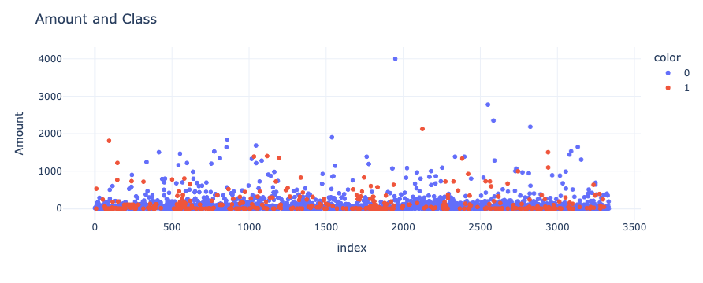
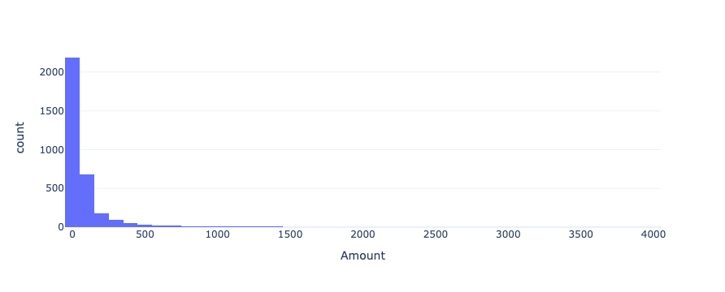
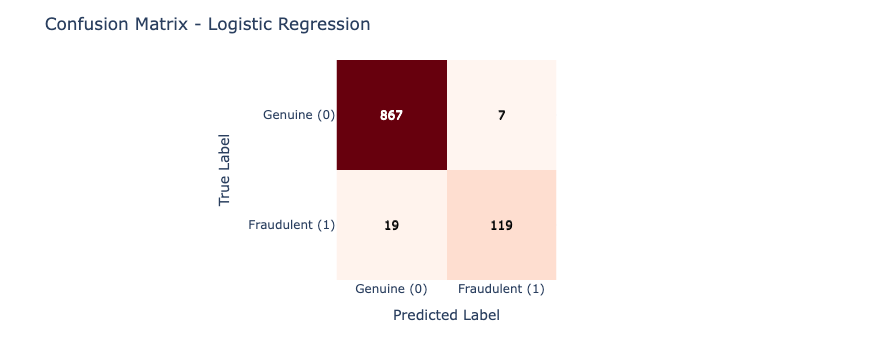
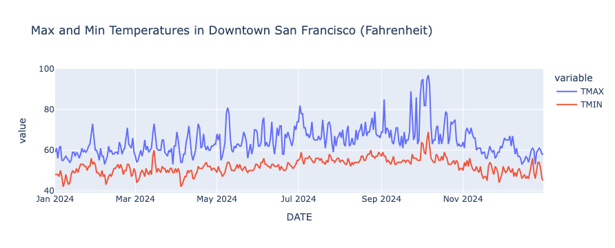
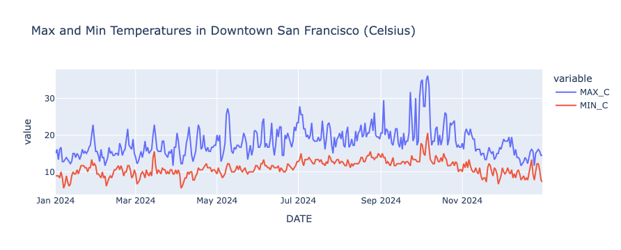

# Chapter 7: Apache Spark

## Introduction

SingleStore integrates seamlessly with a variety of big data tools and services, including Apache Spark. In this chapter, we'll explore how easy it is to work with Spark in the SingleStore Cloud environment. Through examples, we'll walk through installing and using Spark, then demonstrate how to read from and write to a SingleStore database using the SingleStore Spark Connector. All the examples are standalone and can, therefore, be run independent of each other.

## Simple Spark Example

Let's start with a very simple example where we just install Spark and create a small DataFrame with several values. We'll create a new notebook called **spark_demo**.

First, we'll create a SparkSession:

```python
spark = (
    SparkSession.builder
    .appName("Spark Demo")
    .master("local[*]")
    .getOrCreate()
)
```

Next, we'll create a new DataFrame with 3 rows and 2 columns:

```python
data = [("Peter", 27), ("Paul", 28), ("Mary", 29)]
df = spark.createDataFrame(data, ["Name", "Age"])
```

and we'll check the DataFrame:

```python
df.show()
```

Example output:

```text
+-----+---+
| Name|Age|
+-----+---+
|Peter| 27|
| Paul| 28|
| Mary| 29|
+-----+---+
```

Finally, we'll stop Spark:

```python
spark.stop()
```

From this simple example, we see that it is very easy to install the necessary tools and libraries and to configure and run a small Spark instance in the SingleStore Cloud.

## Fraud Detection Example

Let's now build a machine learning model for credit card fraud detection using Apache Spark. The data come from the Credit Card Fraud Detection dataset created by the Machine Learning Group (MLG) at Universit&eacute; Libre de Bruxelles (ULB). The dataset is distributed under the Open Database License (ODbL) v1.0 and the Database Contents License (DbCL) v1.0. A copy of the dataset is included in the companion GitHub repository and the original distribution is available from Kaggle[^1].

The data are anonymized credit card transactions containing genuine and fraudulent cases.

The transactions occurred over two days during September 2013 and the dataset includes a total of 284,807 transactions, of which 492 are fraudulent representing just 0.173% of the total.

This dataset, therefore, presents some challenges for analysis as it is highly unbalanced.

The dataset consists of the following fields:

- **Time**: The number of seconds elapsed between a transaction and the first transaction in the dataset.

- **V1 to V28**: Details not available due to confidentiality reasons.

- **Amount**: The monetary value of the transaction.

- **Class**: The response variable (0 = no fraud, 1 = fraud).

One method to prepare the data for analysis is to keep all the fraudulent transactions and randomly sample 1% of the non-fraudulent transactions without replacement. The data would be sorted on the `Time` column. We'll use this approach in this example. However, many other approaches are also possible.

We'll collect and report on the following metrics:

|                       | Predicted Genuine (0) | Predicted Fraudulent (1) |
|-----------------------|-----------------------|--------------------------|
| Actual Genuine (0)    | True Negative (TN)    | False Positive (FP)      |
| Actual Fraudulent (1) | False Negative (FN)   | True Positive (TP)       |

- Accuracy = (TP + TN) / (TP + TN + FP + FN)

- Precision = TP / (TP + FP)

- Recall = TP / (TP + FN)

- F1 Score = 2 \* (Precision \* Recall) / (Precision + Recall)

Where,

- **Accuracy**: The proportion of all instances that were classified correctly.

- **Precision**: Of all transactions predicted as fraudulent, how many were actually fraudulent?

- **Recall**: Of all truly fraudulent transactions, how many did the model detect?

- **F1 Score**: The harmonic mean of precision and recall, providing a single measure that balances both.

We'll create a new notebook called **fraud_detection**.

First, we'll read the dataset:

```python
creditcard_csv_url = ...

creditcard_df = pd.read_csv(creditcard_csv_url)
```

If we check the shape:

```python
creditcard_df.shape[0]
```

we'll see that it is `284807`.

Checking the DataFrame:

```python
creditcard_df.groupby("Class").size()
```

gives us:

```text
Class
0    284315
1       492
dtype: int64
```

So, we have 284315 genuine transactions and 492 fraudulent transactions in the dataset.

We'll now reduce the dataset, as follows:

```python
SEED = 42

sampled_df = pd.concat([
    creditcard_df[creditcard_df["Class"] == 1],
    creditcard_df[creditcard_df["Class"] == 0].sample(frac = 0.01, random_state = SEED)
]).sort_values("Time").reset_index(drop = True)
```

Checking the DataFrame:

```python
sampled_df["Class"].value_counts()
```

gives us:

```text
Class
0    2843
1     492
Name: count, dtype: int64
```

Let's render a quick plot using the `Amount` column:

```python
fig = px.scatter(
    sampled_df,
    y = "Amount",
    color = sampled_df["Class"].astype(str),
    hover_data = ["Amount"]
)

fig.update_layout(
    # yaxis_type = "log",
    title = "Amount and Class"
)

fig.show()
```

This produces the chart shown in Figure 7-1.



*Figure 7-1. Amount and Class.*

Another way we can look at the data in Figure 7-1 is as a histogram:

```python
fig = px.histogram(
    sampled_df,
    x = "Amount",
    nbins = 50
)

fig.show()
```

This produces the chart shown in Figure 7-2.



*Figure 7-2. Histogram.*

Figures 7-1 and 7-2 show that the vast majority of transactions were small in value.

Next, let's create a SparkSession:

```python
spark = (
    SparkSession.builder
    .appName("Fraud Detection")
    .master("local[*]")
    .getOrCreate()
)

spark.sparkContext.setLogLevel("ERROR")
```

The following code prepares the fraud detection dataset for machine learning in PySpark by converting it into a Spark DataFrame and assembling the relevant features into a vector. It then splits the data into training and testing sets (70% train, 30% test), trains a logistic regression model on the training data and makes predictions on the test data. Finally, it evaluates the model's performance specifically for the fraud class (label = 1) by calculating accuracy, precision, recall and the F1 score:

```python
spark_df = spark.createDataFrame(sampled_df)

features = spark_df.columns[1:30]
labels = "Class"

assembler = VectorAssembler(
    inputCols = features,
    outputCol = "features"
)

spark_df = assembler.transform(spark_df).select("features", labels)

train, test = spark_df.cache().randomSplit([0.7, 0.3], seed = 42)

lr = LogisticRegression(
    maxIter = 1000,
    featuresCol = "features",
    labelCol = labels
)

train_model = lr.fit(train)

predictions = train_model.transform(test)

evaluator = MulticlassClassificationEvaluator(
    labelCol = labels,
    predictionCol = "prediction"
)

accuracy = evaluator.evaluate(
    predictions,
    {evaluator.metricName: "accuracy", evaluator.metricLabel: 1.0}
)

precision = evaluator.evaluate(
    predictions,
    {evaluator.metricName: "precisionByLabel", evaluator.metricLabel: 1.0}
)

recall = evaluator.evaluate(
    predictions,
    {evaluator.metricName: "recallByLabel", evaluator.metricLabel: 1.0}
)

f1 = evaluator.evaluate(
    predictions,
    {evaluator.metricName: "fMeasureByLabel", evaluator.metricLabel: 1.0}
)
```

Once this code completes, we'll print out the values for the metrics of interest:

```python
print("Accuracy: %.4f" % accuracy)
print("Precision: %.4f" % precision)
print("Recall: %.4f" % recall)
print("F1: %.4f" % f1)
```

Example output:

```text
Accuracy: 0.9743
Precision: 0.9444
Recall: 0.8623
F1: 0.9015
```

The results show that the model is highly accurate overall and, for the fraud class specifically, it strikes a good balance between detecting most fraud cases (high recall) and not flagging too many legitimate transactions mistakenly (high precision). We'll also create a confusion matrix:

```python
cm = predictions.select("Class", "prediction").groupBy("Class", "prediction").count().toPandas()

cm = cm.pivot(index = "Class", columns = "prediction", values = "count").fillna(0).astype(int)

labels = ["Genuine (0)", "Fraudulent (1)"]

cm = cm.reindex(index = [0,1], columns = [0,1], fill_value = 0)

fig = px.imshow(
    cm,
    x = labels,
    y = labels,
    color_continuous_scale = "Reds",
    labels = dict(x = "Predicted Label", y = "True Label"),
    text_auto = True
)

max_count = cm.values.max()
for i in range(cm.shape[0]):
    for j in range(cm.shape[1]):
        fig.add_annotation(
            x = j,
            y = i,
            text = str(cm.iloc[i, j]),
            font=dict(color = "white" if cm.iloc[i, j] > max_count / 2 else "black"),
            showarrow = False
        )

fig.update_layout(
    title_text = "Confusion Matrix - Logistic Regression",
    coloraxis_showscale = False
)

fig.show()
```

This produces the example output shown in Figure 7-3.



*Figure 7-3. Confusion Matrix.*

The output shows good initial results. We'll revisit this example dataset in a later chapter and undertake further analysis in addition to storing the dataset in SingleStore.

Finally, we'll stop Spark:

```python
spark.stop()
```

Overall, the model has made some good predictions on the sampled dataset without too many errors.

## SingleStore Spark Connector Example

In this section, we'll use a simple example to demonstrate how we can write a Spark DataFrame to SingleStore and read the data back from SingleStore into a new Spark DataFrame, using the SingleStore Spark Connector.

We'll create a new notebook called **spark_connector**.

We'll need to save our SingleStore password in the secrets vault. Spark will need this password to connect to SingleStore. We'll access this password using `get_secret`.

First, we'll provide the details of the JAR files we need and create the SparkSession, as follows:

```python
jar_packages = [
    "com.singlestore:singlestore-spark-connector...",
    "com.singlestore:singlestore-jdbc-client...",
    "org.apache.commons:commons-dbcp2...",
    "org.apache.commons:commons-pool2...",
    "io.spray:spray-json_2..."
]

spark = (
    SparkSession.builder
    .appName("Spark Connector")
    .master("local[*]")
    .config("spark.jars.packages", ",".join(jar_packages))
    .getOrCreate()
)

spark.sparkContext.setLogLevel("ERROR")
```

The JAR files include the SingleStore Spark Connector and the SingleStore JDBC Client as well as several other standard files.

As with our first example, we'll create a simple DataFrame:

```python
data = [("Peter", 27), ("Paul", 28), ("Mary", 29)]
df = spark.createDataFrame(data, ["Name", "Age"])
```

and check the contents:

```python
df.show()
```

Example output:

```text
+-----+---+
| Name|Age|
+-----+---+
|Peter| 27|
| Paul| 28|
| Mary| 29|
+-----+---+
```

Using a SQL code cell in the notebook, we'll create a database:

```sql
CREATE DATABASE IF NOT EXISTS spark_demo_db;
```

Now we'll connect to the database:

```python
from sqlalchemy import *

db_connection = create_engine(connection_url)
url = db_connection.url
```

and configure the variables we need for Spark to correctly connect to SingleStore:

```python
password = get_secret("password")
database = url.database
host = url.host
port = url.port
cluster = host + ":" + str(port)
```

Note the use of `get_secret` to retrieve the SingleStore password from the secrets vault.

We'll configure Spark, as follows:

```python
spark.conf.set("spark.datasource.singlestore.ddlEndpoint", cluster)
spark.conf.set("spark.datasource.singlestore.user", "admin")
spark.conf.set("spark.datasource.singlestore.password", password)
spark.conf.set("spark.datasource.singlestore.disablePushdown", "false")
```

The following code will write the DataFrame to the `demo` table in the database. Any existing data will be overwritten in the table. If the table does not exist, it will be created. Compression is being used but is not required in this small dataset. However, it is provided as an example and it is just one of many configuration options available[^2].

```python
(df.write
    .format("singlestore")
    .option("loadDataCompression", "LZ4")
    .mode("overwrite")
    .save(f"{database}.demo")
)
```

Now, we'll read the data back from SingleStore and create a new DataFrame:

```python
new_df = (spark.read
    .format("singlestore")
    .load(f"{database}.demo")
)
```

and output the contents:

```python
new_df.show()
```

Example output:

```text
+-----+---+
| Name|Age|
+-----+---+
| Paul| 28|
| Mary| 29|
|Peter| 27|
+-----+---+
```

Finally, we'll stop Spark:

```python
spark.stop()
```

From this simple example, we see that configuring the SingleStore Spark Connector is straightforward. We successfully used the connector to write data to a SingleStore database and then read the data back. This process can easily be scaled to larger datasets.

## Spark Connector Query Pushdown

The SingleStore Spark Connector supports the rewriting of Spark query execution plans into SingleStore queries, for both SQL and DataFrame operations. Computation is pushed into the SingleStore system automatically. In this section, we'll look at an example of query pushdown.

For our dataset, we'll use weather data for San Francisco from 1 January 2024 until 31 December 2024. The data downloaded originally from NOAA[^3] and kept simple with just the maximum and minimum daily temperatures.

We'll create a new notebook called **spark_pushdown**.

We'll need to save our SingleStore password in the secrets vault. Spark will need this password to connect to SingleStore. We'll access this password using `get_secret`.

First, we'll load the CSV file of weather data, drop any rows where temperature readings are missing and convert the date to a datetime format:

```python
weather_csv_url = ...

df = pd.read_csv(weather_csv_url)

df = df.dropna(subset = ["TMAX", "TMIN"])
df["DATE"] = pd.to_datetime(df["DATE"])
```

Next, we'll provide the details of the JAR files we need and create the SparkSession, as follows:

```python
jar_packages = [
    "com.singlestore:singlestore-spark-connector_2...",
    "com.singlestore:singlestore-jdbc-client...",
    "org.apache.commons:commons-dbcp2...",
    "org.apache.commons:commons-pool2...",
    "io.spray:spray-json_2..."
]

spark = (
    SparkSession.builder
    .appName("Spark Pushdown")
    .master("local[*]")
    .config("spark.jars.packages", ",".join(jar_packages))
    .getOrCreate()
)

spark.sparkContext.setLogLevel("ERROR")
```

We'll be specific about the schema for the Spark DataFrame:

```python
schema = StructType([
    StructField("STATION", StringType(), True),
    StructField("NAME", StringType(), True),
    StructField("DATE", DateType(), True),
    StructField("TMAX", FloatType(), True),
    StructField("TMIN", FloatType(), True)
])
```

and then convert the Pandas DataFrame to a Spark DataFrame:

```python
spark_df = spark.createDataFrame(df, schema)
```

Now we'll plot the temperature readings, in Fahrenheit, from a specific weather station located in Downtown San Francisco:

```python
def plot_data(df, x_col, y_cols, title):
    fig = px.line(
        df.toPandas(),
        x = x_col,
        y = y_cols, 
        title = title
    )
    fig.show()

plot_data(
    spark_df.filter(spark_df["STATION"] == "USW00023272").orderBy("DATE"),
    "DATE",
    ["TMAX", "TMIN"],
    "Max and Min Temperatures in Downtown San Francisco (Fahrenheit)"
)
```

This produces the chart shown in Figure 7-4.



*Figure 7-4. Max and Min in Fahrenheit for San Francisco.*

Using a SQL code cell in the notebook, we'll create a database:

```sql
CREATE DATABASE IF NOT EXISTS spark_demo_db;
```

Now we'll connect to the database:

```python
from sqlalchemy import *

db_connection = create_engine(connection_url)
url = db_connection.url
```

and configure the variables we need for Spark to correctly connect to SingleStore:

```python
password = get_secret("password")
database = url.database
host = url.host
port = url.port
cluster = host + ":" + str(port)
```

We'll configure Spark, as follows:

```python
spark.conf.set("spark.datasource.singlestore.ddlEndpoint", cluster)
spark.conf.set("spark.datasource.singlestore.user", "admin")
spark.conf.set("spark.datasource.singlestore.password", password)
spark.conf.set("spark.datasource.singlestore.disablePushdown", "false")
```

The following code will write the DataFrame to the `weather` table in the database. Any existing data will be overwritten in the table. If the table does not exist, it will be created.

```python
(spark_df.write
    .format("singlestore")
    .option("loadDataCompression", "LZ4")
    .mode("overwrite")
    .save(f"{database}.weather")
)
```

Now, we'll read the data back from SingleStore and create a new DataFrame:

```python
new_df = (spark.read
    .format("singlestore")
    .load(f"{database}.weather")
)
```

From this, we'll create a temporary table from the DataFrame, so that we can treat the DataFrame as an SQL table:

```python
new_df.createOrReplaceTempView("temperatures")
```

Now we'll create and register a Spark UDF that converts Fahrenheit to Celsius:

```python
def convert_to_c(f):
    if f is None:
        return None
    return float((f - 32) * 5 / 9)

spark.udf.register("convert_to_c", convert_to_c, FloatType())
```

Finally, we'll run a query that uses the temporary table and the Spark UDF:

```python
temp_df = spark.sql("""
    SELECT DATE, convert_to_c(TMAX) as MAX_C, convert_to_c(TMIN) as MIN_C
    FROM temperatures
    WHERE STATION = 'USW00023272'
    ORDER BY DATE
""")
```

We'll check the query plan:

```python
temp_df.explain()
```

Example output:

```text
== Physical Plan ==
AdaptiveSparkPlan isFinalPlan=false
+- Sort [DATE#28 ASC NULLS FIRST], true, 0
   +- Exchange rangepartitioning(DATE#28 ASC NULLS FIRST, 200), ENSURE_REQUIREMENTS, [plan_id=68]
      +- Project [DATE#28, pythonUDF0#35 AS MAX_C#31, pythonUDF1#36 AS MIN_C#32]
         +- BatchEvalPython [convert_to_c(TMAX#29)#33, convert_to_c(TMIN#30)#34], [pythonUDF0#35, pythonUDF1#36]
            +- Scan 
---------------
SingleStore Query
Variables: (USW00023272)
SQL:
SELECT `DATE#1` , `TMAX#4` , `TMIN#5` 
FROM (
  
  SELECT `DATE#1` , `TMAX#4` , `TMIN#5` 
  FROM (
    
    SELECT * 
    FROM (
      SELECT ( `STATION` ) AS `STATION#8` , ( `NAME` ) AS `NAME#9` , ( `DATE` ) AS `DATE#1` , ( `TMAX` ) AS `TMAX#4` , ( `TMIN` ) AS `TMIN#5` 
      FROM (
        SELECT * FROM `spark_demo_db`.`weather`
      ) AS `a2`
    ) AS `a3` 
    WHERE ( ( `STATION#8` = ? ) AND ( `STATION#8` ) IS NOT NULL )
  ) AS `a4`
) AS `a5`

EXPLAIN:
Gather partitions:all alias:remote_0 parallelism_level:segment
Project [a5.DATE AS `DATE#1`, a5.TMAX AS `TMAX#4`, a5.TMIN AS `TMIN#5`]
ColumnStoreFilter [a5.STATION = 'USW00023272' AND a5.STATION IS NOT NULL]
ColumnStoreScan spark_demo_db.weather AS a5, SORT KEY STATION (STATION) table_type:sharded_columnstore
---------------
       [DATE#28,TMAX#29,TMIN#30] PushedFilters: [], ReadSchema: struct<DATE:date,TMAX:float,TMIN:float>
```

Careful analysis shows the following:

- Query pushdown is used as the filter `STATION = 'USW00023272'` and is executed in SingleStore.

- The `convert_to_c` UDF for Celsius is not pushed down as it runs in Spark.

- Only `DATE`, `TMAX` and `TMIN` are pulled from SingleStore, thanks to column projection pushdown.

If we render the results of the query:

```python
plot_data(
    temp_df,
    "DATE",
    ["MAX_C", "MIN_C"],
    "Max and Min Temperatures in Downtown San Francisco (Celsius)"
)
```

it produces the chart shown in Figure 7-5.



*Figure 7-5. Max and Min in Celsius for San Francisco.*

Finally, we'll stop Spark:

```python
spark.stop()
```

Using the SingleStore Spark Connector's query pushdown, filters, column selections and aggregations are executed in SingleStore rather than in Spark, reducing data transfer, improving performance and lowering memory usage. Spark UDFs can then be applied on the retrieved data, enabling custom transformations, like converting temperatures, without affecting database operations. This combination of pushdown and Spark-side computation provides a simple, efficient and scalable way to build analytics and ETL pipelines while keeping developer code clean and concise.

## Spark Structured Streaming

Continuing our discussion on using Apache Spark with SingleStore, we'll now look at a simple example of how to read data in a set of local text files, create vector embeddings and save the file data and embeddings in SingleStore using Spark's Structured Streaming.

In many real-world applications, data may arrive intermittently or as a continuous stream. Depending on the use case, the data might be written to persistent storage or exist only in memory but, in either case, it often needs to be processed and analyzed in near real-time. In this section, we'll simulate text files arriving from an external source and being saved to a directory. We'll then generate vector embeddings for the text using an external service and store both the raw text and its embeddings in SingleStore through Spark's Structured Streaming.

Let's create a new notebook called **spark_streaming**.

We'll need to save our SingleStore password and OpenAI API Key in the secrets vault. Spark will need the password to connect to SingleStore. We'll need the OpenAI API Key for generating vector embeddings. We'll access the password and OpenAI API Key using `get_secret`.

First, we'll retrieve the OpenAI API Key and ensure that the environment variable is set, as follows:

```python
os.environ["OPENAI_API_KEY"] = get_secret("OPENAI_API_KEY")
openai.api_key = os.environ.get("OPENAI_API_KEY")
```

Next, we'll need the Natural Language Toolkit to help us generate some text files:

```python
nltk.download("punkt_tab")
nltk.download("wordnet")
```

and then we'll create a directory to store the text files:

```python
DATA_DIR = Path("data")
DATA_DIR.mkdir(exist_ok = True)
```

Next, we'll provide the details of the JAR files we need and create the SparkSession, as follows:

```python
jar_packages = [
    "com.singlestore:singlestore-spark-connector_2...",
    "com.singlestore:singlestore-jdbc-client...",
    "org.apache.commons:commons-dbcp2...",
    "org.apache.commons:commons-pool2...",
    "io.spray:spray-json_2..."
]

spark = (
    SparkSession.builder
    .appName("Spark Streaming")
    .master("local[*]")
    .config("spark.executorEnv.OPENAI_API_KEY", openai.api_key)
    .config("spark.driverEnv.OPENAI_API_KEY", openai.api_key)
    .config("spark.jars.packages", ",".join(jar_packages))
    .getOrCreate()
)

spark.sparkContext.setLogLevel("ERROR")
```

This is similar to the previous examples with the exception of the `OPENAI_API_KEY` that is being passed as an environment variable.

Using a SQL code cell in the notebook, we'll create a database:

```sql
CREATE DATABASE IF NOT EXISTS spark_demo_db;
```

and also, a table:

```sql
USE spark_demo_db;

DROP TABLE IF EXISTS streaming;
CREATE TABLE IF NOT EXISTS streaming (
     value TEXT,
     file_name TEXT,
     embedding VECTOR(1536) NOT NULL
);
```

The `VECTOR` type is set to `1536` to match the OpenAI embedding model that we'll use.

Now we'll connect to the database:

```python
from sqlalchemy import *

db_connection = create_engine(connection_url)
url = db_connection.url
```

and configure the variables we need for Spark to correctly connect to SingleStore:

```python
password = get_secret("password")
host = url.host
port = url.port
cluster = host + ":" + str(port)
```

We'll configure Spark, as follows:

```python
spark.conf.set("spark.datasource.singlestore.ddlEndpoint", cluster)
spark.conf.set("spark.datasource.singlestore.user", "admin")
spark.conf.set("spark.datasource.singlestore.password", password)
spark.conf.set("spark.datasource.singlestore.disablePushdown", "false")
```

Next, we'll create a file producer to simulate files arriving into a directory:

```python
def generate_sentence():
    synset = random.choice(list(wn.all_synsets()))
    definition = synset.definition()
    tokens = word_tokenize(definition)
    if tokens:
        tokens[0] = tokens[0].capitalize()
        if not tokens[-1].endswith("."):
            tokens[-1] += "."
    return " ".join(tokens) if tokens else "Placeholder sentence."

def file_producer(dir_path: Path, num_files: int = 20, min_delay = 0, max_delay = 0):
    for i in range(1, num_files + 1):
        time.sleep(random.uniform(min_delay, max_delay))
        fp = dir_path / f"live_file_{i}.txt"
        with fp.open("w") as f:
            f.write(generate_sentence() + "\n")
        print(f"New file created: {fp}")

producer_thread = threading.Thread(target = file_producer, args = (DATA_DIR,), daemon = True)
producer_thread.start()
producer_thread.join()
print("All files created, ready to start Spark streaming")
```

The code can be modified to change the number of files generated, as well as a period of delay between the creation of one file and another. The code defaults to 20 files and no delay. In this code version, it is also blocking because of `producer_thread.join()`, so the main program won't continue until all files have been created and the producer thread exits.

Next, we'll create a UDF, as follows:

```python
@pandas_udf(ArrayType(FloatType()))
def generate_embeddings_batch(texts: pd.Series) -> pd.Series:
    """
    Batch embedding generation for streaming using OpenAI.
    Returns a list of floats (float32) suitable for SingleStore VECTOR.
    """
    client = OpenAI(api_key = os.environ["OPENAI_API_KEY"])
    inputs = texts.fillna("").astype(str).tolist()
    resp = client.embeddings.create(
        model = "text-embedding-3-small",
        input = inputs
    )
    return pd.Series([
        np.array(item.embedding, dtype=np.float32).tolist()
        for item in resp.data
    ])
```

This uses an OpenAI model to return vector embeddings for text input.

Finally, we'll use a simple workflow to read the text data, transform it and write it to SingleStore:

```python
df = (
    spark.readStream
    .format("text")
    .option("path", DATA_DIR)
    .load()
    .withColumn("file_name", input_file_name())
)

df_with_embeddings = df.withColumn("embedding", generate_embeddings_batch("value"))

df_with_embeddings_json = df_with_embeddings.withColumn(
    "embedding_json",
    to_json(col("embedding"))
)

def write_to_singlestore(batch_df, batch_id):
    (
        batch_df.select("value", "file_name", "embedding_json")
        .withColumnRenamed("embedding_json", "embedding")
        .write
        .format("singlestore")
        .option("loadDataCompression", "LZ4")
        .option("dbtable", "spark_demo_db.streaming")
        .mode("append")
        .save()
    )
    print(f"Batch {batch_id} written to SingleStore (rows: {batch_df.count()})")

query = (
    df_with_embeddings_json.writeStream
    .foreachBatch(write_to_singlestore)
    .trigger(once = True)
    .start()
)

# Wait for the query to finish processing
while query.isActive:
    time.sleep(1)
```

The streaming will stop when there are no more files to process and we'll check the database to confirm the data were correctly written:

```sql
USE spark_demo_db;

SELECT
    SUBSTR(value, 1, 30) AS value,
    SUBSTR(file_name, LENGTH(file_name) - 9) AS file_name,
    SUBSTR((embedding :> JSON), 1, 30) AS embedding
FROM streaming
LIMIT 5;
```

Example output:

```text
+--------------------------------+------------+--------------------------------+
| value                          | file_name  | embedding                      |
+--------------------------------+------------+--------------------------------+
| Money collected under a tariff | ile_17.txt | [0.018457273,0.000477828726,0. |
| Bring two objects , ideas , or | ile_13.txt | [0.00344158011,-0.0484731719,- |
| Given to uttering bromides.    | file_3.txt | [0.0482562408,-0.00314102089,0 |
| Without any others being inclu | ile_14.txt | [-0.0029251019,-0.0184946209,0 |
| Foil made of gold.             | ile_15.txt | [0.00832593441,0.000971470261, |
+--------------------------------+------------+--------------------------------+
```

Finally, we'll stop Spark:

```python
spark.stop()
```

This simple example could be extended to a non-blocking version where Spark Streaming would read the files as they arrived and also continue to wait for new data files when all the files within a directory had been read.

## Graph Analytics with GraphFrames

In this chapter, we'll see how to use the Apache Spark GraphFrames package with SingleStore by using data about the London Underground network. We'll store the data as stations (vertices) and line connections (edges) in SingleStore and then load the data into a notebook environment and perform some queries on the data using GraphFrames. Using GraphFrames provides an alternative to the approach we used previously used in the Geospatial Data chapter.

Let's use the **SQL Editor** to create several database tables, as follows:

```sql
CREATE DATABASE IF NOT EXISTS spark_demo_db;

USE spark_demo_db;

DROP TABLE IF EXISTS london_connections;
CREATE TABLE IF NOT EXISTS london_connections (
    tube_line VARCHAR(100),
    src       VARCHAR(200),
    dst       VARCHAR(200),
    PRIMARY KEY (tube_line, src, dst)
);

DROP TABLE IF EXISTS london_stations;
CREATE TABLE IF NOT EXISTS london_stations (
    id        VARCHAR(200) PRIMARY KEY,
    latitude  DOUBLE,
    longitude DOUBLE,
    zone      VARCHAR(20)
);
```

Now let's create a new notebook called **data_loader_for_spark_graphframes**.

We'll use the same CSV data that we used in the Geospatial Data chapter and the first few cleanup steps will be the same.

We'll start by loading the London Underground data into SingleStore. In a new code cell, let's add the following code:

```python
lines_csv_url = ...

lines_df = pd.read_csv(lines_csv_url)
```

This will load the lines data. We'll repeat this for connections:

```python
connections_csv_url = ...

connections_df = pd.read_csv(connections_csv_url)
```

We'll reduce the connections dataset so that we only keep data for lines that are mentioned in the lines data:

```python
connections_df = connections_df[
    connections_df["tube_line"].isin(lines_df["tube_line"])
]
```

Next, we'll read the stations data:

```python
stations_csv_url = ...

stations_df = pd.read_csv(stations_csv_url)
```

We'll drop several columns that we don't need:

```python
stations_df = stations_df.drop(columns = ["os_x", "os_y", "postcode"])
```

and only keep stations that are in the connections:

```python
valid_stations = set(connections_df["from_station"]).union(set(connections_df["to_station"]))
stations_df = stations_df[stations_df["station"].isin(valid_stations)]
```

For GraphFrames, we need to rename columns to include “src” and “dst” in the connections, as follows:

```python
connections_df = connections_df.rename(
    columns = {"from_station": "src", "to_station": "dst"}
)
```

and rename a column to “id” in the stations, as follows:

```python
stations_df = stations_df.rename(
    columns = {"station": "id"}
)
```

And now, we'll set up the connection to SingleStore:

```python
from sqlalchemy import *

db_connection = create_engine(connection_url)
```

Next, we'll ensure that the tables for data loading in this notebook are empty:

```python
tables = ["london_connections", "london_stations"]

with db_connection.begin() as conn:
    for table in tables:
        conn.execute(text(f"TRUNCATE TABLE {table};"))
```

Finally, we are ready to write the DataFrames to SingleStore:

```python
connections_df.to_sql(
    "london_connections",
    con = db_connection,
    if_exists = "append",
    index = False,
    chunksize = 1000
)

stations_df.to_sql(
    "london_stations",
    con = db_connection,
    if_exists = "append",
    index = False,
    chunksize = 1000
)
```

Now let's create a new notebook called **spark_graphframes**.

Next, we'll provide the details of the JAR files we need and create the SparkSession, as follows:

```python
jar_packages = [
    "com.singlestore:singlestore-spark-connector_2...",
    "com.singlestore:singlestore-jdbc-client...",
    "org.apache.commons:commons-dbcp2...",
    "org.apache.commons:commons-pool2...",
    "io.spray:spray-json_2...",
    "io.graphframes:graphframes-spark4_2..."
]

spark = (
    SparkSession.builder
    .appName("Spark GraphFrames")
    .master("local[*]")
    .config("spark.jars.packages", ",".join(jar_packages))
    .getOrCreate()
)

spark.sparkContext.setLogLevel("ERROR")
```

This is similar to the code we've previously used, but we've added GraphFrames.

Now we'll connect to the database:

```python
from sqlalchemy import *

db_connection = create_engine(connection_url)
url = db_connection.url
```

and configure the variables we need for Spark to correctly connect to SingleStore:

```python
password = get_secret("password")
database = url.database
host = url.host
port = url.port
cluster = host + ":" + str(port)
```

We'll configure Spark, as follows:

```python
spark.conf.set("spark.datasource.singlestore.ddlEndpoint", cluster)
spark.conf.set("spark.datasource.singlestore.user", "admin")
spark.conf.set("spark.datasource.singlestore.password", password)
spark.conf.set("spark.datasource.singlestore.disablePushdown", "false")
```

Next, we'll read the connections data:

```python
connections = (spark.read
    .format("singlestore")
    .load(f"{database}.london_connections")
)
```

and the stations data:

```python
stations = (spark.read
    .format("singlestore")
    .load(f"{database}.london_stations")
)
```

Finally, we'll create the network using GraphFrames:

```python
underground = GraphFrame(stations, connections)
```

### Example Queries

Let's check the vertices:

```python
(underground
    .vertices
    .show(5, truncate = False)
)
```

Example output:

```text
+---------------------------------------------------+------------------+-------------------+-------+
|id                                                 |latitude          |longitude          |zone   |
+---------------------------------------------------+------------------+-------------------+-------+
|Wood Green                                         |51.59745355165763 |-0.1095265887761309|3      |
|Lloyd Park                                         |51.36427540535568 |-0.0807462726980878|3,4,5,6|
|Putney Bridge                                      |51.46786499705636 |-0.2093654143019544|2      |
|London Bridge                                      |51.50467420930433 |-0.0860055977481396|1      |
|Edgware Road (Circle/District/Hammersmith and City)|51.519997771093394|-0.1676682526511785|1      |
+---------------------------------------------------+------------------+-------------------+-------+
```

The edges:

```python
(underground
    .edges
    .show(5)
)
```

Example output:

```text
+---------+-------------+--------------------+
|tube_line|          src|                 dst|
+---------+-------------+--------------------+
| District|Cannon Street|       Mansion House|
| Northern|Woodside Park|Totteridge and Wh...|
| Tramlink|  Merton Park|         Morden Road|
|  Central|   West Acton|     Ealing Broadway|
| District|Parsons Green|       Putney Bridge|
+---------+-------------+--------------------+
```

Let's count how many stations are in each zone:

```python
(underground
    .vertices
    .groupBy("zone")
    .count()
    .orderBy("count", ascending = False)
    .show()
)
```

Example output:

```text
+-------+-----+
|   zone|count|
+-------+-----+
|      2|   75|
|      1|   62|
|      3|   55|
|      4|   49|
|3,4,5,6|   32|
|      5|   24|
|      6|   19|
|    2,3|   14|
|    3,4|    6|
|    1,2|    4|
|      7|    4|
|      9|    2|
|    5,6|    1|
|      8|    1|
|    6,7|    1|
+-------+-----+
```

Now let's find the number of stations by the line name:

```python
(underground
    .edges
    .filter("tube_line = 'District'")
    .count()
)
```

which will output `59`.

We'll find all the stations on a specific line:

```python
(underground
    .edges
    .filter("tube_line = 'Circle'")
    .select("src")
    .union(
        underground
            .edges
            .filter("tube_line = 'Circle'")
            .select("dst")
        )
     .distinct()
     .show(100, truncate = False)
)
```

Example output:

```text
+---------------------------------------------------+
|src                                                |
+---------------------------------------------------+
|Gloucester Road                                    |
|Blackfriars                                        |
|Wood Lane                                          |
|Ladbroke Grove                                     |
|Sloane Square                                      |
|Temple                                             |
|Tower Hill                                         |
|Latimer Road                                       |
|Royal Oak                                          |
|Great Portland Street                              |
|Westminster                                        |
|Westbourne Park                                    |
|Notting Hill Gate                                  |
|Farringdon                                         |
|Bayswater                                          |
|Goldhawk Road                                      |
|Monument                                           |
|Aldgate                                            |
|Kings Cross St. Pancras                            |
|Edgware Road (Circle/District/Hammersmith and City)|
|Mansion House                                      |
|Barbican                                           |
|Victoria                                           |
|Paddington                                         |
|Liverpool Street                                   |
|St. James's Park                                   |
|High Street Kensington                             |
|Cannon Street                                      |
|Baker Street                                       |
|Moorgate                                           |
|Shepherds Bush Market                              |
|South Kensington                                   |
|Embankment                                         |
|Hammersmith (Met.)                                 |
|Euston Square                                      |
+---------------------------------------------------+
```

We'll find all the lines passing through a given station:

```python
(underground
    .edges
    .filter("src = 'Paddington' OR dst = 'Paddington'")
    .select("tube_line")
    .distinct()
    .show()
)
```

Example output:

```text
+--------------------+
|           tube_line|
+--------------------+
|              Circle|
|            District|
|            Bakerloo|
|Hammersmith and City|
+--------------------+
```

Finally, let's find the top 5 stations with the most connections:

```python
(underground
    .edges
    .groupBy("src")
    .count()
    .orderBy(F.desc("count"))
    .show(5, truncate = False)
)
```

Example output:

```text
+-----------------------+-----+
|src                    |count|
+-----------------------+-----+
|Kings Cross St. Pancras|6    |
|Earls Court            |5    |
|Baker Street           |5    |
|Embankment             |4    |
|West Ham               |4    |
+-----------------------+-----+
```

Finally, we'll stop Spark:

```python
spark.stop()
```

In this section, we've seen the ease with which we can store graph data in SingleStore and how we can use GraphFrames to perform various queries on the data.

## Summary

In this chapter, we explored how to get started with Apache Spark in the SingleStore Portal. Step-by-step, we installed and configured Spark, connected it to SingleStore and demonstrated how to read and write data using the Spark Connector. We also highlighted the benefits of query pushdown and worked through examples with Spark Streaming and GraphFrames to show how Spark can power real-time and graph-based analytics on SingleStore.

[^1]:  https://www.kaggle.com/datasets/mlg-ulb/creditcardfraud

[^2]:  https://github.com/memsql/singlestore-spark-connector

[^3]:  https://www.ncei.noaa.gov/cdo-web/
